<!-- GENERATED by tools/snes-rom-map.py; do not edit. -->

```mermaid
%%{init: {'treemap': {'padding': 6, 'diagramPadding': 8, 'showValues': false}}}%%
treemap-beta
"8 Mbit (1 MiB) LoROM · $00-$1F · 954,050 B gallery · 0 B padding":::root
  "Q0 · $00-$07 · 256 KiB · 7 occupied + system · 228,650 B gallery":::quadrant
    "$00-$01 · 64 KiB · system pair":::cell
      "$00 SYSTEM · CODE / RODATA / HEADER": 32768:::system
      "$01 THISTLES + THE KISS · 32,714 used · 54 free": 32768:::tight
    "$02-$03 · 64 KiB · 65,514 B gallery":::cell
      "$02 STARRY NIGHT + DRAGON · 32,760 used · 8 free": 32768:::critical
      "$03 SELF PORTRAIT + LOUVRE RAIN · 32,754 used · 14 free": 32768:::critical
    "$04-$05 · 64 KiB · 65,376 B gallery":::cell
      "$04 THE WILLOWS + ICE SKATERS · 32,764 used · 4 free": 32768:::critical
      "$05 EARTHLY DELIGHTS + SUNSET WOODS · 32,612 used · 156 free": 32768:::tight
    "$06-$07 · 64 KiB · 65,046 B gallery":::cell
      "$06 THAI ELEPHANT DUEL + MOUNTAIN WATERFALL · 32,340 used · 428 free": 32768:::packed
      "$07 SUNFLOWERS + THAI RAVAN PALACE · 32,706 used · 62 free": 32768:::tight
  "Q1 · $08-$0F · 256 KiB · 8 occupied · 260,701 B gallery":::quadrant
    "$08-$09 · 64 KiB · 65,004 B gallery":::cell
      "$08 PANTHEON INTERIOR + STACK WHEAT + 2 pal · 32,562 used · 206 free": 32768:::tight
      "$09 THAI BUDDHA DESCENDING + THAI HANUMAN LONGKA + 2 pal · 32,442 used · 326 free": 32768:::packed
    "$0A-$0B · 64 KiB · 65,474 B gallery":::cell
      "$0A THAI HANUMAN + HOME HERON + 3 pal · 32,723 used · 45 free": 32768:::tight
      "$0B MORTLAKE TERRACE + SCHOLAR LANDSCAPE + 4 pal · 32,751 used · 17 free": 32768:::critical
    "$0C-$0D · 64 KiB · 65,287 B gallery":::cell
      "$0C GREAT WAVE + TABLEAU VII + 4 pal · 32,693 used · 75 free": 32768:::tight
      "$0D TORNADO FOREST + THE SCREAM + 4 pal · 32,594 used · 174 free": 32768:::tight
    "$0E-$0F · 64 KiB · 64,936 B gallery":::cell
      "$0E BASKET APPLES + PARIS STREET + 4 pal · 32,510 used · 258 free": 32768:::packed
      "$0F THAI RAVANA WAR + HOUSES PARLIAMENT + 4 pal · 32,426 used · 342 free": 32768:::packed
  "Q2 · $10-$17 · 256 KiB · 8 occupied · 253,976 B gallery":::quadrant
    "$10-$11 · 64 KiB · 65,085 B gallery":::cell
      "$10 WIDE RIVER + WATER LILIES + 5 pal · 32,655 used · 113 free": 32768:::tight
      "$11 MARLY LE ROI + GRANDE JATTE + 5 pal · 32,430 used · 338 free": 32768:::packed
    "$12-$13 · 64 KiB · 65,292 B gallery":::cell
      "$12 POPPY FIELD + THIRD OF MAY + 6 pal · 32,672 used · 96 free": 32768:::tight
      "$13 WOODED MERRYMAKERS + WIJK WINDMILL + 7 pal · 32,620 used · 148 free": 32768:::tight
    "$14-$15 · 64 KiB · 64,947 B gallery":::cell
      "$14 STORMY SUNSET + MOUNT AKIHA + 7 pal · 32,338 used · 430 free": 32768:::packed
      "$15 FUJISAWA SHUKU + APPROACH VENICE · 32,609 used · 159 free": 32768:::tight
    "$16-$17 · 64 KiB · 58,652 B gallery":::cell
      "$16 VOYAGE YOUTH + FOG MOUNT DESERT + 5 pal · 30,746 used · 2,022 free": 32768:::used
      "$17 THAI SURASA HANUMAN + THAI TEMPLE PAINTING · 27,906 used · 4,862 free": 32768:::used
  "Q3 · $18-$1F · 256 KiB · 8 occupied · 210,723 B gallery":::quadrant
    "$18-$19 · 64 KiB · 55,170 B gallery":::cell
      "$18 FLOWER STILL LIFE + WIVENHOE PARK · 27,719 used · 5,049 free": 32768:::used
      "$19 HARVEST MOON + ST ODULPHUS · 27,451 used · 5,317 free": 32768:::used
    "$1A-$1B · 64 KiB · 53,713 B gallery":::cell
      "$1A RIVER MOONLIGHT + SHIPS CALM · 26,964 used · 5,804 free": 32768:::used
      "$1B KEELMEN MOONLIGHT + VOYAGE MANHOOD · 26,749 used · 6,019 free": 32768:::used
    "$1C-$1D · 64 KiB · 52,054 B gallery":::cell
      "$1C SAILING VESSELS + BUFFALO STORM · 26,316 used · 6,452 free": 32768:::used
      "$1D VOYAGE CHILDHOOD + VOYAGE OLD AGE · 25,738 used · 7,030 free": 32768:::used
    "$1E-$1F · 64 KiB · 49,786 B gallery":::cell
      "$1E GRAND CANAL MOLO + NIAGARA · 24,994 used · 7,774 free": 32768:::used
      "$1F MOUNT CORCORAN + VIEW OF DELFT · 24,792 used · 7,976 free": 32768:::used
classDef root fill:#111827,stroke:#91b4d8,color:#f4f8ff,stroke-width:3px;
classDef quadrant fill:#202b3d,stroke:#6784a0,color:#e8f1fa,stroke-width:2px;
classDef cell fill:#17202c,stroke:#46596d,color:#bdcad6,stroke-width:1px;
classDef system fill:#263967,stroke:#7092e6,color:#ffffff,stroke-width:2px;
classDef critical fill:#5c202d,stroke:#ff647d,color:#ffffff,stroke-width:2px;
classDef tight fill:#623c20,stroke:#f49a4a,color:#ffffff,stroke-width:2px;
classDef packed fill:#554d1c,stroke:#dbcb54,color:#ffffff;
classDef used fill:#193f38,stroke:#4dcaa9,color:#ffffff;
classDef empty fill:#161c25,stroke:#303a48,color:#788796;
```

**Occupancy:** critical <32 B free · tight <256 B · packed <1,024 B · green = occupied · blue = system · gray = padding

| Bank | Contents | Stream | Palette | Used | Free |
|---:|---|---:|---:|---:|---:|
| `$01` | Thistles stream — 17,077 The Kiss (Lovers) stream — 15,637 | 32,714 | 0 | 32,714 | 54 |
| `$02` | The Starry Night stream — 16,986 Dragon stream — 15,774 | 32,760 | 0 | 32,760 | 8 |
| `$03` | Self-Portrait stream — 16,939 The Louvre, Afternoon, Rainy Weather stream — 15,815 | 32,754 | 0 | 32,754 | 14 |
| `$04` | The Willows stream — 16,663 Winter Landscape with Ice Skaters stream — 16,101 | 32,764 | 0 | 32,764 | 4 |
| `$05` | The Garden of Earthly Delights stream — 16,488 Sunset in the Woods stream — 16,124 | 32,612 | 0 | 32,612 | 156 |
| `$06` | Naresuan of Ayutthaya's Elephant Duel with Mingyi Swa of Toungoo stream — 16,393 Mountainous Landscape with Waterfall stream — 15,947 | 32,340 | 0 | 32,340 | 428 |
| `$07` | Sunflowers stream — 15,852 Ravan in His Palace in Lanka stream — 15,830 8x8 font — 1,024 | 31,682 | 0 | 32,706 | 62 |
| `$08` | Interior of the Pantheon, Rome stream — 15,798 Stack of Wheat stream — 15,740 Under the Wave off Kanagawa palette — 512 A Sunday on La Grande Jatte — 1884 palette — 512 | 31,538 | 1,024 | 32,562 | 206 |
| `$09` | The Buddha Descending from Trayastrimsa Heaven at Sankissa stream — 15,715 Hanuman Destroys the Golden City of Longka stream — 15,703 Water Lilies palette — 512 The Basket of Apples palette — 512 | 31,418 | 1,024 | 32,442 | 326 |
| `$0A` | Hanuman — Ramakien stream — 15,599 The Home of the Heron stream — 15,588 Stack of Wheat palette — 512 Self-Portrait palette — 512 Paris Street; Rainy Day palette — 512 | 31,187 | 1,536 | 32,723 | 45 |
| `$0B` | Mortlake Terrace stream — 15,359 Scholar in Landscape stream — 15,344 Poppy Field (Giverny) palette — 512 The Garden of Earthly Delights palette — 512 The Scream palette — 512 The Third of May 1808 palette — 512 | 30,703 | 2,048 | 32,751 | 17 |
| `$0C` | Under the Wave off Kanagawa stream — 15,330 Tableau No. VII stream — 15,315 The Kiss (Lovers) palette — 512 View of Delft palette — 512 The Windmill at Wijk bij Duurstede palette — 512 Flower Still Life palette — 512 | 30,645 | 2,048 | 32,693 | 75 |
| `$0D` | Tornado in an American Forest stream — 15,286 The Scream stream — 15,260 Sunflowers palette — 512 Tableau No. VII palette — 512 Winter Landscape with Ice Skaters palette — 512 The Home of the Heron palette — 512 | 30,546 | 2,048 | 32,594 | 174 |
| `$0E` | The Basket of Apples stream — 15,240 Paris Street; Rainy Day stream — 15,222 Dragon palette — 512 Scholar in Landscape palette — 512 Houses of Parliament, London palette — 512 Thistles palette — 512 | 30,462 | 2,048 | 32,510 | 258 |
| `$0F` | Ravana Prepares for War with Rama stream — 15,191 Houses of Parliament, London stream — 15,187 The Starry Night palette — 512 River View by Moonlight palette — 512 Mountainous Landscape with Waterfall palette — 512 Wooded Landscape with Merrymakers in a Cart palette — 512 | 30,378 | 2,048 | 32,426 | 342 |
| `$10` | Panoramic View of a Wide River stream — 15,068 Water Lilies stream — 15,027 Panoramic View of a Wide River palette — 512 Sailing Vessels on an Inland Body of Water palette — 512 Ships near the Coast during a Calm palette — 512 Interior of the Sint-Odulphuskerk in Assendelft palette — 512 The Voyage of Life: Childhood palette — 512 | 30,095 | 2,560 | 32,655 | 113 |
| `$11` | Marly-le-Roi stream — 14,959 A Sunday on La Grande Jatte — 1884 stream — 14,911 The Voyage of Life: Youth palette — 512 The Voyage of Life: Manhood palette — 512 The Voyage of Life: Old Age palette — 512 Tornado in an American Forest palette — 512 Niagara palette — 512 | 29,870 | 2,560 | 32,430 | 338 |
| `$12` | Poppy Field (Giverny) stream — 14,884 The Third of May 1808 stream — 14,716 Fog off Mount Desert palette — 512 Buffalo Trail: The Impending Storm palette — 512 Mount Corcoran palette — 512 Sunset in the Woods palette — 512 Harvest Moon palette — 512 Wivenhoe Park, Essex palette — 512 | 29,600 | 3,072 | 32,672 | 96 |
| `$13` | Wooded Landscape with Merrymakers in a Cart stream — 14,603 The Windmill at Wijk bij Duurstede stream — 14,433 Cloud Study: Stormy Sunset palette — 512 Keelmen Heaving in Coals by Moonlight palette — 512 Approach to Venice palette — 512 Mortlake Terrace palette — 512 Interior of the Pantheon, Rome palette — 512 Entrance to the Grand Canal from the Molo, Venice palette — 512 The Louvre, Afternoon, Rainy Weather palette — 512 | 29,036 | 3,584 | 32,620 | 148 |
| `$14` | Cloud Study: Stormy Sunset stream — 14,380 Distant View of Mount Akiha, Kakegawa stream — 14,374 Marly-le-Roi palette — 512 The Willows palette — 512 Distant View of Mount Akiha, Kakegawa palette — 512 Fujisawa-shuku palette — 512 Buddhist Temple Painting palette — 512 The Buddha Descending from Trayastrimsa Heaven at Sankissa palette — 512 Naresuan of Ayutthaya's Elephant Duel with Mingyi Swa of Toungoo palette — 512 | 28,754 | 3,584 | 32,338 | 430 |
| `$15` | Fujisawa-shuku stream — 14,369 Approach to Venice stream — 14,144 Waldo 16x16 font — 4,096 | 28,513 | 0 | 32,609 | 159 |
| `$16` | The Voyage of Life: Youth stream — 14,133 Fog off Mount Desert stream — 14,053 Ravan in His Palace in Lanka palette — 512 Surasa Challenges Hanuman palette — 512 Hanuman — Ramakien palette — 512 Hanuman Destroys the Golden City of Longka palette — 512 Ravana Prepares for War with Rama palette — 512 | 28,186 | 2,560 | 30,746 | 2,022 |
| `$17` | Surasa Challenges Hanuman stream — 14,005 Buddhist Temple Painting stream — 13,901 | 27,906 | 0 | 27,906 | 4,862 |
| `$18` | Flower Still Life stream — 13,882 Wivenhoe Park, Essex stream — 13,837 | 27,719 | 0 | 27,719 | 5,049 |
| `$19` | Harvest Moon stream — 13,777 Interior of the Sint-Odulphuskerk in Assendelft stream — 13,674 | 27,451 | 0 | 27,451 | 5,317 |
| `$1A` | River View by Moonlight stream — 13,529 Ships near the Coast during a Calm stream — 13,435 | 26,964 | 0 | 26,964 | 5,804 |
| `$1B` | Keelmen Heaving in Coals by Moonlight stream — 13,384 The Voyage of Life: Manhood stream — 13,365 | 26,749 | 0 | 26,749 | 6,019 |
| `$1C` | Sailing Vessels on an Inland Body of Water stream — 13,186 Buffalo Trail: The Impending Storm stream — 13,130 | 26,316 | 0 | 26,316 | 6,452 |
| `$1D` | The Voyage of Life: Childhood stream — 13,098 The Voyage of Life: Old Age stream — 12,640 | 25,738 | 0 | 25,738 | 7,030 |
| `$1E` | Entrance to the Grand Canal from the Molo, Venice stream — 12,539 Niagara stream — 12,455 | 24,994 | 0 | 24,994 | 7,774 |
| `$1F` | Mount Corcoran stream — 12,449 View of Delft stream — 12,343 | 24,792 | 0 | 24,792 | 7,976 |
| `$20-$1F` | Explicit power-of-two padding | 0 | 0 | 0 each | 32,768 each |
