<!-- GENERATED by tools/snes-rom-map.py; do not edit. -->

```mermaid
%%{init: {'treemap': {'padding': 6, 'diagramPadding': 8, 'showValues': false}}}%%
treemap-beta
"8 Mbit (1 MiB) LoROM · $00-$1F · 952,656 B gallery · 0 B padding":::root
  "Q0 · $00-$07 · 256 KiB · 7 occupied + system · 228,474 B gallery":::quadrant
    "$00-$01 · 64 KiB · system pair":::cell
      "$00 SYSTEM · CODE / RODATA / HEADER": 32768:::system
      "$01 THISTLES + THAI HANUMAN LONGKA · 32,759 used · 9 free": 32768:::critical
    "$02-$03 · 64 KiB · 65,503 B gallery":::cell
      "$02 STARRY NIGHT + LOUVRE RAIN · 32,749 used · 19 free": 32768:::critical
      "$03 SELF PORTRAIT + SUNFLOWERS · 32,754 used · 14 free": 32768:::critical
    "$04-$05 · 64 KiB · 65,314 B gallery":::cell
      "$04 THE WILLOWS + SUNSET WOODS · 32,757 used · 11 free": 32768:::critical
      "$05 EARTHLY DELIGHTS + ICE SKATERS · 32,557 used · 211 free": 32768:::tight
    "$06-$07 · 64 KiB · 64,898 B gallery":::cell
      "$06 THAI ELEPHANT DUEL + MOUNTAIN WATERFALL · 32,302 used · 466 free": 32768:::packed
      "$07 THAI RAVAN PALACE + DRAGON · 32,596 used · 172 free": 32768:::tight
  "Q1 · $08-$0F · 256 KiB · 8 occupied · 260,328 B gallery":::quadrant
    "$08-$09 · 64 KiB · 64,873 B gallery":::cell
      "$08 PANTHEON INTERIOR + THAI BUDDHA DESCENDING + 2 pal · 32,508 used · 260 free": 32768:::packed
      "$09 STACK WHEAT + THE KISS + 2 pal · 32,365 used · 403 free": 32768:::packed
    "$0A-$0B · 64 KiB · 65,371 B gallery":::cell
      "$0A HOME HERON + THAI HANUMAN + 3 pal · 32,665 used · 103 free": 32768:::tight
      "$0B MORTLAKE TERRACE + SCHOLAR LANDSCAPE + 4 pal · 32,706 used · 62 free": 32768:::tight
    "$0C-$0D · 64 KiB · 65,223 B gallery":::cell
      "$0C TABLEAU VII + GREAT WAVE + 4 pal · 32,659 used · 109 free": 32768:::tight
      "$0D TORNADO FOREST + THE SCREAM + 4 pal · 32,564 used · 204 free": 32768:::tight
    "$0E-$0F · 64 KiB · 64,861 B gallery":::cell
      "$0E BASKET APPLES + PARIS STREET + 4 pal · 32,482 used · 286 free": 32768:::packed
      "$0F THAI RAVANA WAR + HOUSES PARLIAMENT + 4 pal · 32,379 used · 389 free": 32768:::packed
  "Q2 · $10-$17 · 256 KiB · 8 occupied · 253,539 B gallery":::quadrant
    "$10-$11 · 64 KiB · 64,963 B gallery":::cell
      "$10 WIDE RIVER + WATER LILIES + 5 pal · 32,592 used · 176 free": 32768:::tight
      "$11 MARLY LE ROI + GRANDE JATTE + 5 pal · 32,371 used · 397 free": 32768:::packed
    "$12-$13 · 64 KiB · 65,189 B gallery":::cell
      "$12 POPPY FIELD + THIRD OF MAY + 6 pal · 32,630 used · 138 free": 32768:::tight
      "$13 WOODED MERRYMAKERS + WIJK WINDMILL + 7 pal · 32,559 used · 209 free": 32768:::tight
    "$14-$15 · 64 KiB · 64,846 B gallery":::cell
      "$14 STORMY SUNSET + FUJISAWA SHUKU + 7 pal · 32,293 used · 475 free": 32768:::packed
      "$15 MOUNT AKIHA + APPROACH VENICE · 32,553 used · 215 free": 32768:::tight
    "$16-$17 · 64 KiB · 58,541 B gallery":::cell
      "$16 VOYAGE YOUTH + FOG MOUNT DESERT + 5 pal · 30,674 used · 2,094 free": 32768:::used
      "$17 THAI SURASA HANUMAN + THAI TEMPLE PAINTING · 27,867 used · 4,901 free": 32768:::used
  "Q3 · $18-$1F · 256 KiB · 8 occupied · 210,315 B gallery":::quadrant
    "$18-$19 · 64 KiB · 55,062 B gallery":::cell
      "$18 FLOWER STILL LIFE + WIVENHOE PARK · 27,687 used · 5,081 free": 32768:::used
      "$19 HARVEST MOON + ST ODULPHUS · 27,375 used · 5,393 free": 32768:::used
    "$1A-$1B · 64 KiB · 53,586 B gallery":::cell
      "$1A RIVER MOONLIGHT + SHIPS CALM · 26,892 used · 5,876 free": 32768:::used
      "$1B KEELMEN MOONLIGHT + VOYAGE MANHOOD · 26,694 used · 6,074 free": 32768:::used
    "$1C-$1D · 64 KiB · 51,976 B gallery":::cell
      "$1C SAILING VESSELS + BUFFALO STORM · 26,276 used · 6,492 free": 32768:::used
      "$1D VOYAGE CHILDHOOD + VOYAGE OLD AGE · 25,700 used · 7,068 free": 32768:::used
    "$1E-$1F · 64 KiB · 49,691 B gallery":::cell
      "$1E GRAND CANAL MOLO + MOUNT CORCORAN · 24,964 used · 7,804 free": 32768:::used
      "$1F NIAGARA + VIEW OF DELFT · 24,727 used · 8,041 free": 32768:::used
classDef root fill:#111827,stroke:#91b4d8,color:#f4f8ff,stroke-width:3px;
classDef quadrant fill:#202b3d,stroke:#6784a0,color:#e8f1fa,stroke-width:2px;
classDef cell fill:#17202c,stroke:#46596d,color:#bdcad6,stroke-width:1px;
classDef system fill:#263967,stroke:#7092e6,color:#ffffff,stroke-width:2px;
classDef critical fill:#5c202d,stroke:#ff647d,color:#ffffff,stroke-width:2px;
classDef tight fill:#623c20,stroke:#f49a4a,color:#ffffff,stroke-width:2px;
classDef packed fill:#554d1c,stroke:#dbcb54,color:#ffffff;
classDef used fill:#193f38,stroke:#4dcaa9,color:#ffffff;
classDef empty fill:#161c25,stroke:#303a48,color:#788796;
```

**Occupancy:** critical <32 B free · tight <256 B · packed <1,024 B · green = occupied · blue = system · gray = padding

| Bank | Contents | Stream | Palette | Used | Free |
|---:|---|---:|---:|---:|---:|
| `$01` | Thistles stream — 17,075 Hanuman Destroys the Golden City of Longka stream — 15,684 | 32,759 | 0 | 32,759 | 9 |
| `$02` | The Starry Night stream — 16,971 The Louvre, Afternoon, Rainy Weather stream — 15,778 | 32,749 | 0 | 32,749 | 19 |
| `$03` | Self-Portrait stream — 16,932 Sunflowers stream — 15,822 | 32,754 | 0 | 32,754 | 14 |
| `$04` | The Willows stream — 16,650 Sunset in the Woods stream — 16,107 | 32,757 | 0 | 32,757 | 11 |
| `$05` | The Garden of Earthly Delights stream — 16,473 Winter Landscape with Ice Skaters stream — 16,084 | 32,557 | 0 | 32,557 | 211 |
| `$06` | Naresuan of Ayutthaya's Elephant Duel with Mingyi Swa of Toungoo stream — 16,380 Mountainous Landscape with Waterfall stream — 15,922 | 32,302 | 0 | 32,302 | 466 |
| `$07` | Ravan in His Palace in Lanka stream — 15,800 Dragon stream — 15,772 8x8 font — 1,024 | 31,572 | 0 | 32,596 | 172 |
| `$08` | Interior of the Pantheon, Rome stream — 15,771 The Buddha Descending from Trayastrimsa Heaven at Sankissa stream — 15,713 Under the Wave off Kanagawa palette — 512 A Sunday on La Grande Jatte — 1884 palette — 512 | 31,484 | 1,024 | 32,508 | 260 |
| `$09` | Stack of Wheat stream — 15,709 The Kiss (Lovers) stream — 15,632 Water Lilies palette — 512 The Basket of Apples palette — 512 | 31,341 | 1,024 | 32,365 | 403 |
| `$0A` | The Home of the Heron stream — 15,566 Hanuman — Ramakien stream — 15,563 Stack of Wheat palette — 512 Self-Portrait palette — 512 Paris Street; Rainy Day palette — 512 | 31,129 | 1,536 | 32,665 | 103 |
| `$0B` | Mortlake Terrace stream — 15,344 Scholar in Landscape stream — 15,314 Poppy Field (Giverny) palette — 512 The Garden of Earthly Delights palette — 512 The Scream palette — 512 The Third of May 1808 palette — 512 | 30,658 | 2,048 | 32,706 | 62 |
| `$0C` | Tableau No. VII stream — 15,306 Under the Wave off Kanagawa stream — 15,305 The Kiss (Lovers) palette — 512 View of Delft palette — 512 The Windmill at Wijk bij Duurstede palette — 512 Flower Still Life palette — 512 | 30,611 | 2,048 | 32,659 | 109 |
| `$0D` | Tornado in an American Forest stream — 15,261 The Scream stream — 15,255 Sunflowers palette — 512 Tableau No. VII palette — 512 Winter Landscape with Ice Skaters palette — 512 The Home of the Heron palette — 512 | 30,516 | 2,048 | 32,564 | 204 |
| `$0E` | The Basket of Apples stream — 15,234 Paris Street; Rainy Day stream — 15,200 Dragon palette — 512 Scholar in Landscape palette — 512 Houses of Parliament, London palette — 512 Thistles palette — 512 | 30,434 | 2,048 | 32,482 | 286 |
| `$0F` | Ravana Prepares for War with Rama stream — 15,171 Houses of Parliament, London stream — 15,160 The Starry Night palette — 512 River View by Moonlight palette — 512 Mountainous Landscape with Waterfall palette — 512 Wooded Landscape with Merrymakers in a Cart palette — 512 | 30,331 | 2,048 | 32,379 | 389 |
| `$10` | Panoramic View of a Wide River stream — 15,046 Water Lilies stream — 14,986 Panoramic View of a Wide River palette — 512 Sailing Vessels on an Inland Body of Water palette — 512 Ships near the Coast during a Calm palette — 512 Interior of the Sint-Odulphuskerk in Assendelft palette — 512 The Voyage of Life: Childhood palette — 512 | 30,032 | 2,560 | 32,592 | 176 |
| `$11` | Marly-le-Roi stream — 14,932 A Sunday on La Grande Jatte — 1884 stream — 14,879 The Voyage of Life: Youth palette — 512 The Voyage of Life: Manhood palette — 512 The Voyage of Life: Old Age palette — 512 Tornado in an American Forest palette — 512 Niagara palette — 512 | 29,811 | 2,560 | 32,371 | 397 |
| `$12` | Poppy Field (Giverny) stream — 14,861 The Third of May 1808 stream — 14,697 Fog off Mount Desert palette — 512 Buffalo Trail: The Impending Storm palette — 512 Mount Corcoran palette — 512 Sunset in the Woods palette — 512 Harvest Moon palette — 512 Wivenhoe Park, Essex palette — 512 | 29,558 | 3,072 | 32,630 | 138 |
| `$13` | Wooded Landscape with Merrymakers in a Cart stream — 14,585 The Windmill at Wijk bij Duurstede stream — 14,390 Cloud Study: Stormy Sunset palette — 512 Keelmen Heaving in Coals by Moonlight palette — 512 Approach to Venice palette — 512 Mortlake Terrace palette — 512 Interior of the Pantheon, Rome palette — 512 Entrance to the Grand Canal from the Molo, Venice palette — 512 The Louvre, Afternoon, Rainy Weather palette — 512 | 28,975 | 3,584 | 32,559 | 209 |
| `$14` | Cloud Study: Stormy Sunset stream — 14,367 Fujisawa-shuku stream — 14,342 Marly-le-Roi palette — 512 The Willows palette — 512 Distant View of Mount Akiha, Kakegawa palette — 512 Fujisawa-shuku palette — 512 Buddhist Temple Painting palette — 512 The Buddha Descending from Trayastrimsa Heaven at Sankissa palette — 512 Naresuan of Ayutthaya's Elephant Duel with Mingyi Swa of Toungoo palette — 512 | 28,709 | 3,584 | 32,293 | 475 |
| `$15` | Distant View of Mount Akiha, Kakegawa stream — 14,335 Approach to Venice stream — 14,122 Waldo 16x16 font — 4,096 | 28,457 | 0 | 32,553 | 215 |
| `$16` | The Voyage of Life: Youth stream — 14,093 Fog off Mount Desert stream — 14,021 Ravan in His Palace in Lanka palette — 512 Surasa Challenges Hanuman palette — 512 Hanuman — Ramakien palette — 512 Hanuman Destroys the Golden City of Longka palette — 512 Ravana Prepares for War with Rama palette — 512 | 28,114 | 2,560 | 30,674 | 2,094 |
| `$17` | Surasa Challenges Hanuman stream — 13,966 Buddhist Temple Painting stream — 13,901 | 27,867 | 0 | 27,867 | 4,901 |
| `$18` | Flower Still Life stream — 13,881 Wivenhoe Park, Essex stream — 13,806 | 27,687 | 0 | 27,687 | 5,081 |
| `$19` | Harvest Moon stream — 13,735 Interior of the Sint-Odulphuskerk in Assendelft stream — 13,640 | 27,375 | 0 | 27,375 | 5,393 |
| `$1A` | River View by Moonlight stream — 13,495 Ships near the Coast during a Calm stream — 13,397 | 26,892 | 0 | 26,892 | 5,876 |
| `$1B` | Keelmen Heaving in Coals by Moonlight stream — 13,360 The Voyage of Life: Manhood stream — 13,334 | 26,694 | 0 | 26,694 | 6,074 |
| `$1C` | Sailing Vessels on an Inland Body of Water stream — 13,177 Buffalo Trail: The Impending Storm stream — 13,099 | 26,276 | 0 | 26,276 | 6,492 |
| `$1D` | The Voyage of Life: Childhood stream — 13,081 The Voyage of Life: Old Age stream — 12,619 | 25,700 | 0 | 25,700 | 7,068 |
| `$1E` | Entrance to the Grand Canal from the Molo, Venice stream — 12,528 Mount Corcoran stream — 12,436 | 24,964 | 0 | 24,964 | 7,804 |
| `$1F` | Niagara stream — 12,405 View of Delft stream — 12,322 | 24,727 | 0 | 24,727 | 8,041 |
| `$20-$1F` | Explicit power-of-two padding | 0 | 0 | 0 each | 32,768 each |
