<!-- GENERATED by tools/snes-rom-map.py; do not edit. -->

```mermaid
%%{init: {'treemap': {'padding': 6, 'diagramPadding': 8, 'showValues': false}}}%%
treemap-beta
"1 MiB LoROM · $00-$1F · 914,827 B gallery · 32,768 B padding":::root
  "Q0 · $00-$07 · 256 KiB · 7 occupied + system · 228,533 B gallery":::quadrant
    "$00-$01 · 64 KiB · system pair":::cell
      "$00 SYSTEM · CODE / RODATA / HEADER": 32768:::system
      "$01 STACK WHEAT + THISTLES · 32,752 used · 16 free": 32768:::critical
    "$02-$03 · 64 KiB · 65,503 B gallery":::cell
      "$02 SUNFLOWERS + STARRY NIGHT · 32,745 used · 23 free": 32768:::critical
      "$03 BEDROOM + SELF PORTRAIT · 32,758 used · 10 free": 32768:::critical
    "$04-$05 · 64 KiB · 65,263 B gallery":::cell
      "$04 SUNSET WOODS + THE WILLOWS · 32,749 used · 19 free": 32768:::critical
      "$05 TWO SISTERS + EARTHLY DELIGHTS · 32,514 used · 254 free": 32768:::tight
    "$06-$07 · 64 KiB · 65,015 B gallery":::cell
      "$06 ICE SKATERS + MOUNTAIN WATERFALL + 1 pal · 32,461 used · 307 free": 32768:::packed
      "$07 DRAGON + LOUVRE RAIN + 2 pal · 32,554 used · 214 free": 32768:::tight
  "Q1 · $08-$0F · 256 KiB · 8 occupied · 260,226 B gallery":::quadrant
    "$08-$09 · 64 KiB · 65,079 B gallery":::cell
      "$08 THE KISS + PANTHEON INTERIOR + 2 pal · 32,409 used · 359 free": 32768:::packed
      "$09 HOME HERON + DE HEEM FLOWERS + 3 pal · 32,670 used · 98 free": 32768:::tight
    "$0A-$0B · 64 KiB · 65,284 B gallery":::cell
      "$0A TABLEAU VII + MORTLAKE TERRACE + 4 pal · 32,674 used · 94 free": 32768:::tight
      "$0B SCHOLAR LANDSCAPE + TORNADO FOREST + 4 pal · 32,610 used · 158 free": 32768:::tight
    "$0C-$0D · 64 KiB · 64,964 B gallery":::cell
      "$0C GREAT WAVE + THE SCREAM + 4 pal · 32,545 used · 223 free": 32768:::tight
      "$0D BASKET APPLES + PARIS STREET + 4 pal · 32,419 used · 349 free": 32768:::packed
    "$0E-$0F · 64 KiB · 64,899 B gallery":::cell
      "$0E HOUSES PARLIAMENT + LINEN CUPBOARD + 4 pal · 32,284 used · 484 free": 32768:::packed
      "$0F WIDE RIVER + RUYSCH FLOWERS + 5 pal · 32,615 used · 153 free": 32768:::tight
  "Q2 · $10-$17 · 256 KiB · 8 occupied · 243,864 B gallery":::quadrant
    "$10-$11 · 64 KiB · 65,169 B gallery":::cell
      "$10 WATER LILIES + MARLY LE ROI + 5 pal · 32,436 used · 332 free": 32768:::packed
      "$11 GRANDE JATTE + POPPY FIELD + 6 pal · 32,733 used · 35 free": 32768:::tight
    "$12-$13 · 64 KiB · 64,550 B gallery":::cell
      "$12 THIRD OF MAY + WOODED MERRYMAKERS + 6 pal · 32,270 used · 498 free": 32768:::packed
      "$13 WIJK WINDMILL + STORMY SUNSET + 7 pal · 32,280 used · 488 free": 32768:::packed
    "$14-$15 · 64 KiB · 58,445 B gallery":::cell
      "$14 MOUNT AKIHA + FUJISAWA SHUKU + 3 pal · 30,179 used · 2,589 free": 32768:::used
      "$15 VOYAGE YOUTH + EAST HAMPTON BEACH · 28,266 used · 4,502 free": 32768:::used
    "$16-$17 · 64 KiB · 55,700 B gallery":::cell
      "$16 FOG MOUNT DESERT + APPROACH VENICE · 28,051 used · 4,717 free": 32768:::used
      "$17 FLOWER STILL LIFE + WIVENHOE PARK · 27,649 used · 5,119 free": 32768:::used
  "Q3 · $18-$1F · 256 KiB · 7 occupied · 182,204 B gallery":::quadrant
    "$18-$19 · 64 KiB · 54,159 B gallery":::cell
      "$18 ST ODULPHUS + HARVEST MOON · 27,309 used · 5,459 free": 32768:::used
      "$19 RIVER MOONLIGHT + SHIPS CALM · 26,850 used · 5,918 free": 32768:::used
    "$1A-$1B · 64 KiB · 52,848 B gallery":::cell
      "$1A VOYAGE MANHOOD + KEELMEN MOONLIGHT · 26,628 used · 6,140 free": 32768:::used
      "$1B SAILING VESSELS + BUFFALO STORM · 26,220 used · 6,548 free": 32768:::used
    "$1C-$1D · 64 KiB · 50,534 B gallery":::cell
      "$1C VOYAGE CHILDHOOD + VOYAGE OLD AGE · 25,620 used · 7,148 free": 32768:::used
      "$1D MOUNT CORCORAN + GRAND CANAL MOLO · 24,914 used · 7,854 free": 32768:::used
    "$1E-$1F · 64 KiB · 24,663 B gallery":::cell
      "$1E VIEW OF DELFT + NIAGARA · 24,663 used · 8,105 free": 32768:::used
      "$1F EMPTY · 32,768 B padding": 32768:::empty
classDef root fill:#111827,stroke:#91b4d8,color:#f4f8ff,stroke-width:3px;
classDef quadrant fill:#202b3d,stroke:#6784a0,color:#e8f1fa,stroke-width:2px;
classDef cell fill:#17202c,stroke:#46596d,color:#bdcad6,stroke-width:1px;
classDef system fill:#263967,stroke:#7092e6,color:#ffffff,stroke-width:2px;
classDef critical fill:#5c202d,stroke:#ff647d,color:#ffffff,stroke-width:2px;
classDef tight fill:#623c20,stroke:#f49a4a,color:#ffffff,stroke-width:2px;
classDef packed fill:#554d1c,stroke:#dbcb54,color:#ffffff;
classDef used fill:#193f38,stroke:#4dcaa9,color:#ffffff;
classDef empty fill:#161c25,stroke:#303a48,color:#788796;
```

**Occupancy:** critical <32 B free · tight <256 B · packed <1,024 B · green = occupied · blue = system · gray = padding

| Bank | Contents | Stream | Palette | Used | Free |
|---:|---|---:|---:|---:|---:|
| `$01` | Stack of Wheat stream — 15,699 Thistles stream — 17,053 | 32,752 | 0 | 32,752 | 16 |
| `$02` | Sunflowers stream — 15,795 The Starry Night stream — 16,950 | 32,745 | 0 | 32,745 | 23 |
| `$03` | The Bedroom stream — 15,836 Self-Portrait stream — 16,922 | 32,758 | 0 | 32,758 | 10 |
| `$04` | Sunset in the Woods stream — 16,107 The Willows stream — 16,642 | 32,749 | 0 | 32,749 | 19 |
| `$05` | Two Sisters (On the Terrace) stream — 16,055 The Garden of Earthly Delights stream — 16,459 | 32,514 | 0 | 32,514 | 254 |
| `$06` | Winter Landscape with Ice Skaters stream — 16,046 Mountainous Landscape with Waterfall stream — 15,903 Under the Wave off Kanagawa palette — 512 | 31,949 | 512 | 32,461 | 307 |
| `$07` | Dragon stream — 15,765 The Louvre, Afternoon, Rainy Weather stream — 15,765 The Bedroom palette — 512 A Sunday on La Grande Jatte — 1884 palette — 512 | 31,530 | 1,024 | 32,554 | 214 |
| `$08` | The Kiss (Lovers) stream — 15,625 Interior of the Pantheon, Rome stream — 15,760 Two Sisters (On the Terrace) palette — 512 Water Lilies palette — 512 | 31,385 | 1,024 | 32,409 | 359 |
| `$09` | The Home of the Heron stream — 15,533 Still Life with Flowers in a Glass Vase stream — 15,601 The Basket of Apples palette — 512 Stack of Wheat palette — 512 Self-Portrait palette — 512 | 31,134 | 1,536 | 32,670 | 98 |
| `$0A` | Tableau No. VII stream — 15,304 Mortlake Terrace stream — 15,322 Paris Street; Rainy Day palette — 512 Poppy Field (Giverny) palette — 512 The Garden of Earthly Delights palette — 512 The Scream palette — 512 | 30,626 | 2,048 | 32,674 | 94 |
| `$0B` | Scholar in Landscape stream — 15,288 Tornado in an American Forest stream — 15,274 The Third of May 1808 palette — 512 The Kiss (Lovers) palette — 512 View of Delft palette — 512 The Windmill at Wijk bij Duurstede palette — 512 | 30,562 | 2,048 | 32,610 | 158 |
| `$0C` | Under the Wave off Kanagawa stream — 15,259 The Scream stream — 15,238 Flower Still Life palette — 512 Sunflowers palette — 512 Tableau No. VII palette — 512 Winter Landscape with Ice Skaters palette — 512 | 30,497 | 2,048 | 32,545 | 223 |
| `$0D` | The Basket of Apples stream — 15,200 Paris Street; Rainy Day stream — 15,171 The Home of the Heron palette — 512 Dragon palette — 512 Scholar in Landscape palette — 512 Houses of Parliament, London palette — 512 | 30,371 | 2,048 | 32,419 | 349 |
| `$0E` | Houses of Parliament, London stream — 15,127 Interior with Women beside a Linen Cupboard stream — 15,109 Thistles palette — 512 The Starry Night palette — 512 River View by Moonlight palette — 512 Mountainous Landscape with Waterfall palette — 512 | 30,236 | 2,048 | 32,284 | 484 |
| `$0F` | Panoramic View of a Wide River stream — 15,021 Still Life with Flowers on a Marble Tabletop stream — 15,034 Wooded Landscape with Merrymakers in a Cart palette — 512 Panoramic View of a Wide River palette — 512 Sailing Vessels on an Inland Body of Water palette — 512 Ships near the Coast during a Calm palette — 512 Interior with Women beside a Linen Cupboard palette — 512 | 30,055 | 2,560 | 32,615 | 153 |
| `$10` | Water Lilies stream — 14,958 Marly-le-Roi stream — 14,918 Interior of the Sint-Odulphuskerk in Assendelft palette — 512 Still Life with Flowers on a Marble Tabletop palette — 512 Still Life with Flowers in a Glass Vase palette — 512 The Voyage of Life: Childhood palette — 512 The Voyage of Life: Youth palette — 512 | 29,876 | 2,560 | 32,436 | 332 |
| `$11` | A Sunday on La Grande Jatte — 1884 stream — 14,846 Poppy Field (Giverny) stream — 14,815 The Voyage of Life: Manhood palette — 512 The Voyage of Life: Old Age palette — 512 Tornado in an American Forest palette — 512 Niagara palette — 512 Fog off Mount Desert palette — 512 Buffalo Trail: The Impending Storm palette — 512 | 29,661 | 3,072 | 32,733 | 35 |
| `$12` | The Third of May 1808 stream — 14,654 Wooded Landscape with Merrymakers in a Cart stream — 14,544 Mount Corcoran palette — 512 Sunset in the Woods palette — 512 Harvest Moon palette — 512 East Hampton Beach, Long Island palette — 512 Wivenhoe Park, Essex palette — 512 Cloud Study: Stormy Sunset palette — 512 | 29,198 | 3,072 | 32,270 | 498 |
| `$13` | The Windmill at Wijk bij Duurstede stream — 14,366 Cloud Study: Stormy Sunset stream — 14,330 Keelmen Heaving in Coals by Moonlight palette — 512 Approach to Venice palette — 512 Mortlake Terrace palette — 512 Interior of the Pantheon, Rome palette — 512 Entrance to the Grand Canal from the Molo, Venice palette — 512 The Louvre, Afternoon, Rainy Weather palette — 512 Marly-le-Roi palette — 512 | 28,696 | 3,584 | 32,280 | 488 |
| `$14` | Distant View of Mount Akiha, Kakegawa stream — 14,324 Fujisawa-shuku stream — 14,319 The Willows palette — 512 Distant View of Mount Akiha, Kakegawa palette — 512 Fujisawa-shuku palette — 512 | 28,643 | 1,536 | 30,179 | 2,589 |
| `$15` | The Voyage of Life: Youth stream — 14,088 East Hampton Beach, Long Island stream — 14,178 | 28,266 | 0 | 28,266 | 4,502 |
| `$16` | Fog off Mount Desert stream — 14,006 Approach to Venice stream — 14,045 | 28,051 | 0 | 28,051 | 4,717 |
| `$17` | Flower Still Life stream — 13,881 Wivenhoe Park, Essex stream — 13,768 | 27,649 | 0 | 27,649 | 5,119 |
| `$18` | Interior of the Sint-Odulphuskerk in Assendelft stream — 13,620 Harvest Moon stream — 13,689 | 27,309 | 0 | 27,309 | 5,459 |
| `$19` | River View by Moonlight stream — 13,478 Ships near the Coast during a Calm stream — 13,372 | 26,850 | 0 | 26,850 | 5,918 |
| `$1A` | The Voyage of Life: Manhood stream — 13,285 Keelmen Heaving in Coals by Moonlight stream — 13,343 | 26,628 | 0 | 26,628 | 6,140 |
| `$1B` | Sailing Vessels on an Inland Body of Water stream — 13,127 Buffalo Trail: The Impending Storm stream — 13,093 | 26,220 | 0 | 26,220 | 6,548 |
| `$1C` | The Voyage of Life: Childhood stream — 13,048 The Voyage of Life: Old Age stream — 12,572 | 25,620 | 0 | 25,620 | 7,148 |
| `$1D` | Mount Corcoran stream — 12,416 Entrance to the Grand Canal from the Molo, Venice stream — 12,498 | 24,914 | 0 | 24,914 | 7,854 |
| `$1E` | View of Delft stream — 12,297 Niagara stream — 12,366 | 24,663 | 0 | 24,663 | 8,105 |
| `$1F-$1F` | Explicit power-of-two padding | 0 | 0 | 0 each | 32,768 each |
