<!-- GENERATED by tools/snes-rom-map.py; do not edit. -->

```mermaid
flowchart LR
  B00["$00<br/>CODE / RODATA / HEADER"]
  B01["$01<br/>STACK WHEAT LZ + THISTLES LZ<br/>32,752 B"]
  B02["$02<br/>SUNFLOWERS LZ + STARRY NIGHT LZ<br/>32,745 B"]
  B03["$03<br/>BEDROOM LZ + SELF PORTRAIT LZ<br/>32,758 B"]
  B04["$04<br/>TWO SISTERS LZ + EARTHLY DELIGHTS LZ<br/>32,514 B"]
  B05["$05<br/>ICE SKATERS LZ + DRAGON LZ + GREAT WAVE PAL<br/>32,323 B"]
  B06["$06<br/>THE KISS LZ + HOME HERON LZ + BEDROOM PAL + GRANDE JATTE PAL + TWO SISTERS PAL<br/>32,694 B"]
  B07["$07<br/>TABLEAU VII LZ + SCHOLAR LANDSCAPE LZ + WATER LILIES PAL + BASKET APPLES PAL + STACK WHEAT PAL + SELF PORTRAIT PAL<br/>32,640 B"]
  B08["$08<br/>GREAT WAVE LZ + THE SCREAM LZ + PARIS STREET PAL + POPPY FIELD PAL + EARTHLY DELIGHTS PAL + THE SCREAM PAL<br/>32,545 B"]
  B09["$09<br/>BASKET APPLES LZ + PARIS STREET LZ + THIRD OF MAY PAL + THE KISS PAL + VIEW OF DELFT PAL + WIJK WINDMILL PAL<br/>32,419 B"]
  B0A["$0A<br/>WATER LILIES LZ + HOUSES PARLIAMENT LZ + FLOWER STILL LIFE PAL + SUNFLOWERS PAL + TABLEAU VII PAL + ICE SKATERS PAL + HOME HERON PAL<br/>32,645 B"]
  B0B["$0B<br/>GRANDE JATTE LZ + POPPY FIELD LZ + DRAGON PAL + SCHOLAR LANDSCAPE PAL + HOUSES PARLIAMENT PAL + THISTLES PAL + STARRY NIGHT PAL<br/>32,221 B"]
  B0C["$0C<br/>THIRD OF MAY LZ + WIJK WINDMILL LZ<br/>29,020 B"]
  B0D["$0D<br/>VIEW OF DELFT LZ + FLOWER STILL LIFE LZ<br/>26,178 B"]
  PAD["$0E-$1F<br/>18 EMPTY PADDING BANKS<br/>589,824 B"]
  B00 --> B01 --> B02 --> B03 --> B04 --> B05 --> B06 --> B07 --> B08 --> B09 --> B0A --> B0B --> B0C --> B0D --> PAD
```

| Bank | Contents | Stream | Palette | Used | Free |
|---:|---|---:|---:|---:|---:|
| `$01` | Stack of Wheat stream — 15,699 Thistles stream — 17,053 | 32,752 | 0 | 32,752 | 16 |
| `$02` | Sunflowers stream — 15,795 The Starry Night stream — 16,950 | 32,745 | 0 | 32,745 | 23 |
| `$03` | The Bedroom stream — 15,836 Self-Portrait stream — 16,922 | 32,758 | 0 | 32,758 | 10 |
| `$04` | Two Sisters (On the Terrace) stream — 16,055 The Garden of Earthly Delights stream — 16,459 | 32,514 | 0 | 32,514 | 254 |
| `$05` | Winter Landscape with Ice Skaters stream — 16,046 Dragon stream — 15,765 Under the Wave off Kanagawa palette — 512 | 31,811 | 512 | 32,323 | 445 |
| `$06` | The Kiss (Lovers) stream — 15,625 The Home of the Heron stream — 15,533 The Bedroom palette — 512 A Sunday on La Grande Jatte — 1884 palette — 512 Two Sisters (On the Terrace) palette — 512 | 31,158 | 1,536 | 32,694 | 74 |
| `$07` | Tableau No. VII stream — 15,304 Scholar in Landscape stream — 15,288 Water Lilies palette — 512 The Basket of Apples palette — 512 Stack of Wheat palette — 512 Self-Portrait palette — 512 | 30,592 | 2,048 | 32,640 | 128 |
| `$08` | Under the Wave off Kanagawa stream — 15,259 The Scream stream — 15,238 Paris Street; Rainy Day palette — 512 Poppy Field (Giverny) palette — 512 The Garden of Earthly Delights palette — 512 The Scream palette — 512 | 30,497 | 2,048 | 32,545 | 223 |
| `$09` | The Basket of Apples stream — 15,200 Paris Street; Rainy Day stream — 15,171 The Third of May 1808 palette — 512 The Kiss (Lovers) palette — 512 View of Delft palette — 512 The Windmill at Wijk bij Duurstede palette — 512 | 30,371 | 2,048 | 32,419 | 349 |
| `$0A` | Water Lilies stream — 14,958 Houses of Parliament, London stream — 15,127 Flower Still Life palette — 512 Sunflowers palette — 512 Tableau No. VII palette — 512 Winter Landscape with Ice Skaters palette — 512 The Home of the Heron palette — 512 | 30,085 | 2,560 | 32,645 | 123 |
| `$0B` | A Sunday on La Grande Jatte — 1884 stream — 14,846 Poppy Field (Giverny) stream — 14,815 Dragon palette — 512 Scholar in Landscape palette — 512 Houses of Parliament, London palette — 512 Thistles palette — 512 The Starry Night palette — 512 | 29,661 | 2,560 | 32,221 | 547 |
| `$0C` | The Third of May 1808 stream — 14,654 The Windmill at Wijk bij Duurstede stream — 14,366 | 29,020 | 0 | 29,020 | 3,748 |
| `$0D` | View of Delft stream — 12,297 Flower Still Life stream — 13,881 | 26,178 | 0 | 26,178 | 6,590 |
| `$0E-$1F` | Explicit power-of-two padding | 0 | 0 | 0 each | 32,768 each |
