<!-- GENERATED by tools/snes-rom-map.py; do not edit. -->

```mermaid
flowchart LR
  B00["$00<br/>CODE / RODATA / HEADER"]
  B01["$01<br/>BEDROOM LZ + SELF PORTRAIT LZ<br/>32,758 B"]
  B02["$02<br/>TWO SISTERS LZ + EARTHLY DELIGHTS LZ<br/>32,514 B"]
  B03["$03<br/>SUNFLOWERS LZ + ICE SKATERS LZ + GREAT WAVE PAL<br/>32,353 B"]
  B04["$04<br/>STACK WHEAT LZ + THE KISS LZ + BEDROOM PAL + GRANDE JATTE PAL<br/>32,348 B"]
  B05["$05<br/>GREAT WAVE LZ + TABLEAU VII LZ + TWO SISTERS PAL + WATER LILIES PAL + BASKET APPLES PAL + STACK WHEAT PAL<br/>32,611 B"]
  B06["$06<br/>BASKET APPLES LZ + THE SCREAM LZ + SELF PORTRAIT PAL + PARIS STREET PAL + POPPY FIELD PAL + EARTHLY DELIGHTS PAL<br/>32,486 B"]
  B07["$07<br/>WATER LILIES LZ + PARIS STREET LZ + THE SCREAM PAL + THIRD OF MAY PAL + THE KISS PAL + VIEW OF DELFT PAL + WIJK WINDMILL PAL<br/>32,689 B"]
  B08["$08<br/>GRANDE JATTE LZ + POPPY FIELD LZ + FLOWER STILL LIFE PAL + SUNFLOWERS PAL + TABLEAU VII PAL + ICE SKATERS PAL<br/>31,709 B"]
  B09["$09<br/>THIRD OF MAY LZ + WIJK WINDMILL LZ<br/>29,020 B"]
  B0A["$0A<br/>VIEW OF DELFT LZ + FLOWER STILL LIFE LZ<br/>26,178 B"]
  PAD["$0B-$1F<br/>21 EMPTY PADDING BANKS<br/>688,128 B"]
  B00 --> B01 --> B02 --> B03 --> B04 --> B05 --> B06 --> B07 --> B08 --> B09 --> B0A --> PAD
```

| Bank | Contents | Stream | Palette | Used | Free |
|---:|---|---:|---:|---:|---:|
| `$01` | The Bedroom stream — 15,836 Self-Portrait stream — 16,922 | 32,758 | 0 | 32,758 | 10 |
| `$02` | Two Sisters (On the Terrace) stream — 16,055 The Garden of Earthly Delights stream — 16,459 | 32,514 | 0 | 32,514 | 254 |
| `$03` | Sunflowers stream — 15,795 Winter Landscape with Ice Skaters stream — 16,046 Under the Wave off Kanagawa palette — 512 | 31,841 | 512 | 32,353 | 415 |
| `$04` | Stack of Wheat stream — 15,699 The Kiss (Lovers) stream — 15,625 The Bedroom palette — 512 A Sunday on La Grande Jatte — 1884 palette — 512 | 31,324 | 1,024 | 32,348 | 420 |
| `$05` | Under the Wave off Kanagawa stream — 15,259 Tableau No. VII stream — 15,304 Two Sisters (On the Terrace) palette — 512 Water Lilies palette — 512 The Basket of Apples palette — 512 Stack of Wheat palette — 512 | 30,563 | 2,048 | 32,611 | 157 |
| `$06` | The Basket of Apples stream — 15,200 The Scream stream — 15,238 Self-Portrait palette — 512 Paris Street; Rainy Day palette — 512 Poppy Field (Giverny) palette — 512 The Garden of Earthly Delights palette — 512 | 30,438 | 2,048 | 32,486 | 282 |
| `$07` | Water Lilies stream — 14,958 Paris Street; Rainy Day stream — 15,171 The Scream palette — 512 The Third of May 1808 palette — 512 The Kiss (Lovers) palette — 512 View of Delft palette — 512 The Windmill at Wijk bij Duurstede palette — 512 | 30,129 | 2,560 | 32,689 | 79 |
| `$08` | A Sunday on La Grande Jatte — 1884 stream — 14,846 Poppy Field (Giverny) stream — 14,815 Flower Still Life palette — 512 Sunflowers palette — 512 Tableau No. VII palette — 512 Winter Landscape with Ice Skaters palette — 512 | 29,661 | 2,048 | 31,709 | 1,059 |
| `$09` | The Third of May 1808 stream — 14,654 The Windmill at Wijk bij Duurstede stream — 14,366 | 29,020 | 0 | 29,020 | 3,748 |
| `$0A` | View of Delft stream — 12,297 Flower Still Life stream — 13,881 | 26,178 | 0 | 26,178 | 6,590 |
| `$0B-$1F` | Explicit power-of-two padding | 0 | 0 | 0 each | 32,768 each |
