<!-- GENERATED by tools/snes-rom-map.py; do not edit. -->

```mermaid
%%{init: {'treemap': {'padding': 6, 'diagramPadding': 8, 'showValues': false}}}%%
treemap-beta
"1 MiB LoROM · $00-$1F · 563,383 B gallery · 425,984 B padding":::root
  "Q0 · $00-$07 · 256 KiB · 7 occupied + system · 228,314 B gallery":::quadrant
    "$00-$01 · 64 KiB · system pair":::cell
      "$00 SYSTEM · CODE / RODATA / HEADER": 32768:::system
      "$01 STACK WHEAT + THISTLES · 32,752 used · 16 free": 32768:::critical
    "$02-$03 · 64 KiB · 65,503 B gallery":::cell
      "$02 SUNFLOWERS + STARRY NIGHT · 32,745 used · 23 free": 32768:::critical
      "$03 BEDROOM + SELF PORTRAIT · 32,758 used · 10 free": 32768:::critical
    "$04-$05 · 64 KiB · 64,975 B gallery":::cell
      "$04 TWO SISTERS + EARTHLY DELIGHTS · 32,514 used · 254 free": 32768:::tight
      "$05 ICE SKATERS + MOUNTAIN WATERFALL + 1 pal · 32,461 used · 307 free": 32768:::packed
    "$06-$07 · 64 KiB · 65,084 B gallery":::cell
      "$06 THE KISS + DRAGON + 2 pal · 32,414 used · 354 free": 32768:::packed
      "$07 HOME HERON + DE HEEM FLOWERS + 3 pal · 32,670 used · 98 free": 32768:::tight
  "Q1 · $08-$0F · 256 KiB · 8 occupied · 255,294 B gallery":::quadrant
    "$08-$09 · 64 KiB · 65,185 B gallery":::cell
      "$08 TABLEAU VII + SCHOLAR LANDSCAPE + 4 pal · 32,640 used · 128 free": 32768:::tight
      "$09 GREAT WAVE + THE SCREAM + 4 pal · 32,545 used · 223 free": 32768:::tight
    "$0A-$0B · 64 KiB · 64,703 B gallery":::cell
      "$0A BASKET APPLES + PARIS STREET + 4 pal · 32,419 used · 349 free": 32768:::packed
      "$0B HOUSES PARLIAMENT + LINEN CUPBOARD + 4 pal · 32,284 used · 484 free": 32768:::packed
    "$0C-$0D · 64 KiB · 64,979 B gallery":::cell
      "$0C WIDE RIVER + RUYSCH FLOWERS + 5 pal · 32,615 used · 153 free": 32768:::tight
      "$0D GRANDE JATTE + WATER LILIES + 5 pal · 32,364 used · 404 free": 32768:::packed
    "$0E-$0F · 64 KiB · 60,427 B gallery":::cell
      "$0E POPPY FIELD + THIRD OF MAY + 4 pal · 31,517 used · 1,251 free": 32768:::used
      "$0F WIJK WINDMILL + WOODED MERRYMAKERS · 28,910 used · 3,858 free": 32768:::used
  "Q2 · $10-$17 · 256 KiB · 3 occupied · 79,775 B gallery":::quadrant
    "$10-$11 · 64 KiB · 54,351 B gallery":::cell
      "$10 FLOWER STILL LIFE + ST ODULPHUS · 27,501 used · 5,267 free": 32768:::used
      "$11 RIVER MOONLIGHT + SHIPS CALM · 26,850 used · 5,918 free": 32768:::used
    "$12-$13 · 64 KiB · 25,424 B gallery":::cell
      "$12 VIEW OF DELFT + SAILING VESSELS · 25,424 used · 7,344 free": 32768:::used
      "$13 EMPTY · 32,768 B padding": 32768:::empty
    "$14-$15 · 64 KiB · empty":::cell
      "$14 EMPTY · 32,768 B padding": 32768:::empty
      "$15 EMPTY · 32,768 B padding": 32768:::empty
    "$16-$17 · 64 KiB · empty":::cell
      "$16 EMPTY · 32,768 B padding": 32768:::empty
      "$17 EMPTY · 32,768 B padding": 32768:::empty
  "Q3 · $18-$1F · 256 KiB · 0 occupied · 0 B gallery":::quadrant
    "$18-$19 · 64 KiB · empty":::cell
      "$18 EMPTY · 32,768 B padding": 32768:::empty
      "$19 EMPTY · 32,768 B padding": 32768:::empty
    "$1A-$1B · 64 KiB · empty":::cell
      "$1A EMPTY · 32,768 B padding": 32768:::empty
      "$1B EMPTY · 32,768 B padding": 32768:::empty
    "$1C-$1D · 64 KiB · empty":::cell
      "$1C EMPTY · 32,768 B padding": 32768:::empty
      "$1D EMPTY · 32,768 B padding": 32768:::empty
    "$1E-$1F · 64 KiB · empty":::cell
      "$1E EMPTY · 32,768 B padding": 32768:::empty
      "$1F EMPTY · 32,768 B padding": 32768:::empty
classDef root fill:#111827,stroke:#91b4d8,color:#f4f8ff,stroke-width:3px;
classDef quadrant fill:#202b3d,stroke:#6784a0,color:#e8f1fa,stroke-width:2px;
classDef cell fill:#17202c,stroke:#46596d,color:#bdcad6,stroke-width:1px;
classDef system fill:#263967,stroke:#7092e6,color:#ffffff,stroke-width:2px;
classDef critical fill:#5c202d,stroke:#ff647d,color:#ffffff,stroke-width:2px;
classDef tight fill:#623c20,stroke:#f49a4a,color:#ffffff,stroke-width:2px;
classDef packed fill:#554d1c,stroke:#dbcb54,color:#ffffff;
classDef used fill:#193f38,stroke:#4dcaa9,color:#ffffff;
classDef empty fill:#161c25,stroke:#303a48,color:#788796;
```

**Occupancy:** critical <32 B free · tight <256 B · packed <1,024 B · green = occupied · blue = system · gray = padding

| Bank | Contents | Stream | Palette | Used | Free |
|---:|---|---:|---:|---:|---:|
| `$01` | Stack of Wheat stream — 15,699 Thistles stream — 17,053 | 32,752 | 0 | 32,752 | 16 |
| `$02` | Sunflowers stream — 15,795 The Starry Night stream — 16,950 | 32,745 | 0 | 32,745 | 23 |
| `$03` | The Bedroom stream — 15,836 Self-Portrait stream — 16,922 | 32,758 | 0 | 32,758 | 10 |
| `$04` | Two Sisters (On the Terrace) stream — 16,055 The Garden of Earthly Delights stream — 16,459 | 32,514 | 0 | 32,514 | 254 |
| `$05` | Winter Landscape with Ice Skaters stream — 16,046 Mountainous Landscape with Waterfall stream — 15,903 Under the Wave off Kanagawa palette — 512 | 31,949 | 512 | 32,461 | 307 |
| `$06` | The Kiss (Lovers) stream — 15,625 Dragon stream — 15,765 The Bedroom palette — 512 A Sunday on La Grande Jatte — 1884 palette — 512 | 31,390 | 1,024 | 32,414 | 354 |
| `$07` | The Home of the Heron stream — 15,533 Still Life with Flowers in a Glass Vase stream — 15,601 Two Sisters (On the Terrace) palette — 512 Water Lilies palette — 512 The Basket of Apples palette — 512 | 31,134 | 1,536 | 32,670 | 98 |
| `$08` | Tableau No. VII stream — 15,304 Scholar in Landscape stream — 15,288 Stack of Wheat palette — 512 Self-Portrait palette — 512 Paris Street; Rainy Day palette — 512 Poppy Field (Giverny) palette — 512 | 30,592 | 2,048 | 32,640 | 128 |
| `$09` | Under the Wave off Kanagawa stream — 15,259 The Scream stream — 15,238 The Garden of Earthly Delights palette — 512 The Scream palette — 512 The Third of May 1808 palette — 512 The Kiss (Lovers) palette — 512 | 30,497 | 2,048 | 32,545 | 223 |
| `$0A` | The Basket of Apples stream — 15,200 Paris Street; Rainy Day stream — 15,171 View of Delft palette — 512 The Windmill at Wijk bij Duurstede palette — 512 Flower Still Life palette — 512 Sunflowers palette — 512 | 30,371 | 2,048 | 32,419 | 349 |
| `$0B` | Houses of Parliament, London stream — 15,127 Interior with Women beside a Linen Cupboard stream — 15,109 Tableau No. VII palette — 512 Winter Landscape with Ice Skaters palette — 512 The Home of the Heron palette — 512 Dragon palette — 512 | 30,236 | 2,048 | 32,284 | 484 |
| `$0C` | Panoramic View of a Wide River stream — 15,021 Still Life with Flowers on a Marble Tabletop stream — 15,034 Scholar in Landscape palette — 512 Houses of Parliament, London palette — 512 Thistles palette — 512 The Starry Night palette — 512 River View by Moonlight palette — 512 | 30,055 | 2,560 | 32,615 | 153 |
| `$0D` | A Sunday on La Grande Jatte — 1884 stream — 14,846 Water Lilies stream — 14,958 Mountainous Landscape with Waterfall palette — 512 Wooded Landscape with Merrymakers in a Cart palette — 512 Panoramic View of a Wide River palette — 512 Sailing Vessels on an Inland Body of Water palette — 512 Ships near the Coast during a Calm palette — 512 | 29,804 | 2,560 | 32,364 | 404 |
| `$0E` | Poppy Field (Giverny) stream — 14,815 The Third of May 1808 stream — 14,654 Interior with Women beside a Linen Cupboard palette — 512 Interior of the Sint-Odulphuskerk in Assendelft palette — 512 Still Life with Flowers on a Marble Tabletop palette — 512 Still Life with Flowers in a Glass Vase palette — 512 | 29,469 | 2,048 | 31,517 | 1,251 |
| `$0F` | The Windmill at Wijk bij Duurstede stream — 14,366 Wooded Landscape with Merrymakers in a Cart stream — 14,544 | 28,910 | 0 | 28,910 | 3,858 |
| `$10` | Flower Still Life stream — 13,881 Interior of the Sint-Odulphuskerk in Assendelft stream — 13,620 | 27,501 | 0 | 27,501 | 5,267 |
| `$11` | River View by Moonlight stream — 13,478 Ships near the Coast during a Calm stream — 13,372 | 26,850 | 0 | 26,850 | 5,918 |
| `$12` | View of Delft stream — 12,297 Sailing Vessels on an Inland Body of Water stream — 13,127 | 25,424 | 0 | 25,424 | 7,344 |
| `$13-$1F` | Explicit power-of-two padding | 0 | 0 | 0 each | 32,768 each |
