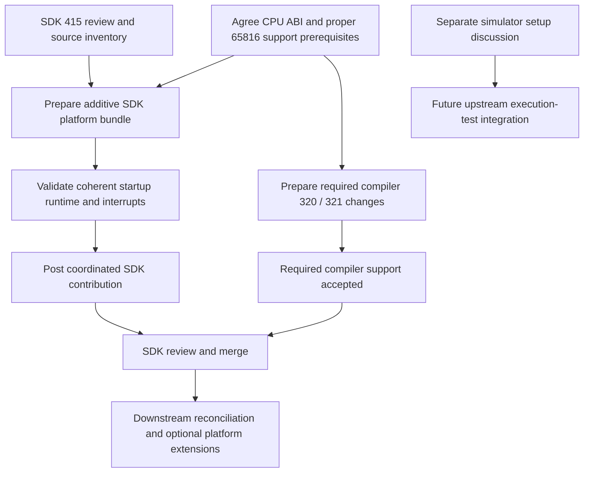

# SNES platform reconciliation with SDK #415

**Updated 2026-09-20. Status: planning and source/review audit completed; reconciled
branch, build and submission remain to do.** No comment or platform change has
been posted by this work.

Prepare an additive contribution to [SDK #415](https://github.com/llvm-mos/llvm-mos-sdk/pull/415),
working with Phillip-May's platform proposal and crediting reused work. Prepare the
SDK and compiler contributions in parallel. Do not promise a baseline-only SDK merge:
the maintainer explicitly requires proper 65816 support first. Agree what that means
in concrete ABI/compiler terms before treating any platform branch as merge-ready.

Independent fixes already posted—[compiler #604, MVN/MVP](https://github.com/llvm-mos/llvm-mos/pull/604)
and [SDK #450, longjmp zero normalization](https://github.com/llvm-mos/llvm-mos-sdk/pull/450)—
do not depend on this reconciliation. The [65816 simulator discussion](pr-preparations/2026-09-20/65816-simulator-discussion-body.md)
is a separate infrastructure proposal, not additional scope for those fixes.

## Verified starting point

- [x] Re-read #415's body, inline review comments and general discussion. It is open,
  not marked draft, at `e6a5c17cab52026cb66924a8e2bf5fab870536f2`.
- [x] Inspect the current PR file diff and our downstream platform sources. This
  is a source audit, not validation of a reconciled implementation.
- [x] Identify concrete review requirements and current downstream integration gaps.
- [x] Fetch and record SDK main `3f6968bbc156ff9a63102a8e158db868819bd61c`
  for the isolated preparation checkout. See the [file inventory](415-snes-reconciliation-inventory.md).

#415 includes a SNES platform, register/library headers, linker layout, vectors,
startup and an example. Its config lacks `-mcpu=mosw65816`; its startup explicitly
calls common initialization routines. Our platform uses native-mode startup and
linker fragments, but its CMake also includes far-call thunks and a far-memory
runtime built with fork-native features. It is not a drop-in stock-SDK submission.

## Resolve the existing review first

| Review requirement | Reconciliation action | Acceptance evidence |
|---|---|---|
| [Proper 65816 support before merge](https://github.com/llvm-mos/llvm-mos-sdk/pull/415#issuecomment-3463891415) | Ask which compiler capabilities and ABI commitments are required; propose a concrete contract and dependency list | Explicit agreement on merge prerequisites; do not infer that enabling `-mcpu` alone satisfies this |
| [WDC-derived vector code](https://github.com/llvm-mos/llvm-mos-sdk/pull/415#discussion_r2475341653) | Establish provenance of reused files; replace the flagged vector implementation with independently written SDK-style code | Clear source/license provenance and removal of the flagged implementation |
| [Use interrupt attributes](https://github.com/llvm-mos/llvm-mos-sdk/pull/415#discussion_r2475352593) | Use `__attribute__((interrupt))` for C handlers; keep only necessary vector/default-handler glue | Generated save/restore and RTI behavior checked under the supported CPU-width contract |
| [Use linker-ordered startup](https://github.com/llvm-mos/llvm-mos-sdk/pull/415#discussion_r2475358446) | Use common `.init`/`.call_main` ordering instead of a manual JSR initialization chain | Link map/disassembly and initialized-data/BSS/startup tests |
| [Select the CPU](https://github.com/llvm-mos/llvm-mos-sdk/pull/415#discussion_r2475379445) | Set `-mcpu=mosw65816` for target users and required runtime assembly | Clean configuration and build with the declared compiler baseline |
| [Register-header review](https://github.com/llvm-mos/llvm-mos-sdk/pull/415#discussion_r2475386178) | Inspect the exact questioned declarations and reconcile types, naming and include/API conventions | Explain the proposed changes; the short review comment does not establish a specific resolution |

Also fix the example filename `cgramtest.c.c` and the registration condition:
`^snes-` does not select a platform named exactly `snes`. Verify installed public
headers and a consumer build, not just an in-tree example.

## Proposed platform contract — for review

This records our current downstream assumptions as a starting point, not an already
accepted upstream ABI.

| Area | Proposed initial contract / decision needed |
|---|---|
| CPU mode | Native E=0; M=1 and X=1 at ordinary C boundaries. Opt-in wider regions must restore the agreed boundary state. Confirm with #321 work. |
| Direct page / data bank | DP=0 and DBR=0 for the near model. Specify startup establishment and preservation across calls, handlers and block moves. Do not rely on reset state without documenting the entry contract. |
| Hardware stack | Current startup uses S=$01FF and a page-1 stack. Either retain and enforce/document that limit, or expand stack storage and redesign the saved context before submission. |
| setjmp/longjmp | Current override stores only the low stack byte in the 19-byte common buffer and reconstructs page 1. Carry it only with that explicit stack contract; include zero-to-one normalization from #450 and test native execution separately. |
| Interrupts | Document supported entry widths, saved registers, DP/DBR behavior and return state. Wider-mode interruption must be demonstrated if the platform exposes wider codegen. |
| Near/far calls | Specify JSR/RTS versus JSL/RTL boundaries and bank assumptions. Do not expose fork-only far calling conventions as an accepted default. |
| ROM layout | Select an initial supported mapping and near code/data model with explicit linker overflow checks. Audit #415's bank layout before choosing what to retain; additional banks alone do not implement far C pointers. |

Do not describe our headers or linker scripts as disposable duplicates or promise
wholesale reuse before comparing their behavior. Preserve useful compatible parts
of #415, document deliberate differences, and credit authorship.

## Work packages and order

### 1. Prepare a concrete reconciliation baseline

- [x] Create isolated `/tmp/sdk-snes-reconcile` on recorded SDK main and import
  #415's touched-file snapshot. Shared integration files still need selective
  forward-porting; this is not a validated rebased candidate.
- [ ] Produce a file-level inventory: retain, adapt, independently replace, or defer.
  Include provenance and each linked review comment's resolution.
- [ ] Separate basic startup/vectors/headers/linker integration from far thunks,
  `mem-far.c`, `+mos-a16` requirements and extra ROM-mapping variants.
- [ ] Extract the smallest coherent native-mode platform contribution. Keep native
  startup, stack restoration and interrupt assumptions consistent in that bundle.
- [ ] Prepare a reviewable diff and short collaboration note for Phillip-May and
  the reviewer: what is reusable, what changes, what remains blocked. Ask whether
  to update #415 or supply a dependent branch/PR; do not open a competing duplicate.

### 2. Agree acceptance dependencies while preparing code

- [ ] Present the contract above and ask which parts of #320/#321 are mandatory for
  SDK merge. The review does not explicitly require every feature in our fork.
- [ ] Coordinate native-width work with the existing [#321 discussion](https://github.com/llvm-mos/llvm-mos/issues/321),
  including gingerbeardman's accumulator-only experiment. Do not call that work
  unclaimed or imply that only our implementation exists.
- [ ] Record concrete compiler commits/PRs required by the SDK bundle. Compiler
  work stays in llvm-mos; runtime/configuration changes stay in llvm-mos-sdk.
- [ ] Treat larger ROM mappings and far-pointer SDK integration as dependent work
  unless the agreed initial ABI requires them.

### 3. Validate the reconciled platform

- [ ] Clean SDK build with the declared compiler revision and an installed consumer
  example; exercise example selection, installed headers and target config.
- [ ] Check reset vectors, ROM header/checksum, linker placement and overflow
  diagnostics; verify startup bytes and initialization ordering.
- [ ] Run an asset-free startup test checking initialized RAM, BSS and stack/CPU
  state; use the existing downstream emulator tooling for reproducible evidence.
- [ ] Exercise native setjmp/longjmp stack restoration, zero normalization and
  nonzero return values. #450's 6502 simulator results do not validate this override.
- [ ] Exercise C interrupt handlers and return-state preservation under every mode
  the initial platform exposes. Test wider-region interruption if wider modes ship.
- [ ] Keep the invocation, pinned tools, expected RAM results and logs in a small
  review bundle. Do not import the full demo gallery or a new emulator framework.
- [ ] Rewrite extracted source/test comments around current contracts and run
  `dev/check-comment-history.py`; current downstream comments include stale and
  historical explanations that should not be copied into the submitted patch.

### 4. Submit and merge

- [ ] Post the agreed additive branch/PR with a review-comment resolution checklist,
  compiler dependencies, ABI contract and reproducible validation evidence.
- [ ] Satisfy the maintainer's compiler-support prerequisite and obtain platform
  review. Preparing a branch is not the same as meeting the merge gate.
- [ ] After merge, reconcile downstream platform copies and remove redundant
  overrides only when the pinned SDK/compiler revisions contain their replacements.

The separate simulator discussion can proceed independently. Existing local
execution evidence is useful for platform review; choosing and provisioning a new
upstream 65816 CI runner is not bundled into this platform patch by default.

## Dependency flow

**Preparation completed:** [initial file inventory](415-snes-reconciliation-inventory.md)
and isolated PR-head snapshot on current SDK main. **Next concrete deliverable:**
a selectively forward-ported implementation resolving the startup/vector/configuration
review. No reconciled build has been tested and upstream has not been contacted.
