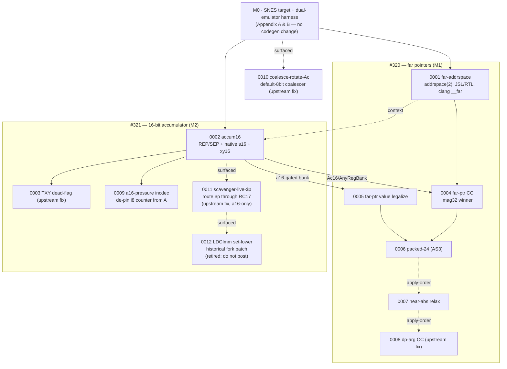
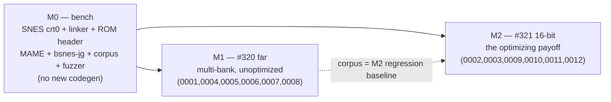
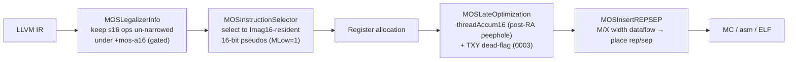
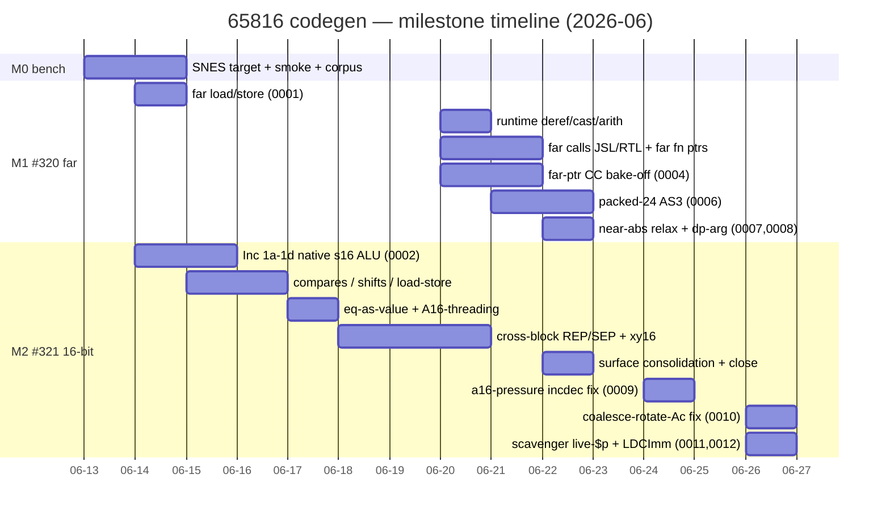
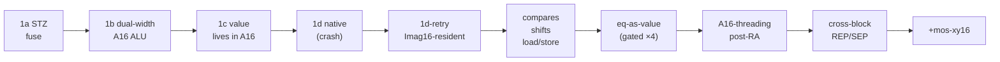

# 65816 C codegen for llvm-mos — patch-series review guide

This document is a reviewer's map of the patch stack that adds native **16-bit-accumulator** and
**far-pointer (24-bit address)** C codegen for the WDC 65816 to [llvm-mos](https://github.com/llvm-mos/llvm-mos),
together with an SNES target to exercise it. It exists to make the series **cheap to review**: every
*feature* change is opt-in and gated so the default 8-bit code generator is byte-identical (the only
default-path edits are a handful of isolated, upstream-bound bug fixes + one size win), every claim is backed
by a four-way differential test you can re-run, and the stack splits into two units (#320 far, #321 16-bit)
that review almost independently.

**Motivation — modern source-level debugging of the SNES.** This is *why the compiler work exists.*
Source-level debugging of SNES code is not new to *drdevtools* — its debugger **drmon** already reads the
legacy **assembler** symbol formats (`.sld`, COFF, ca65 `.dbg`, WLA-DX `.sym` — the COFF / Zardoz /
drdevtools-SPASM lineage). What drmon lacks is the **modern** path: an **ELF/DWARF** loader fed by an
*optimizing C compiler* on fully-open tooling. llvm-mos already emits **DWARF** (spec landed Dec 2025) and
ships the 65816 assembler/linker — but had **no 65816 C codegen**, the one missing producer. This series is
that producer: it closes the loop *optimizing C → SNES ROM + DWARF → source-level debug in drmon*, upgrading
drmon from assembler-tied debug info to standard DWARF from optimized C. The 16-bit/far codegen below is the
means; debuggable optimized C in drmon is the end. (Detail: [Appendix A.1](#a1-drmon) ·
[`INVESTIGATION.md`](INVESTIGATION.md) · [`ROADMAP.md`](ROADMAP.md) step 6, the DWARF round-trip.)

It addresses the two open, design-only upstream issues —
[#320 24-bit address space](https://github.com/llvm-mos/llvm-mos/issues/320) and
[#321 16-bit register mode](https://github.com/llvm-mos/llvm-mos/issues/321) — code-first, the posture the
maintainers ask for (ABI is blessed behind a running implementation, not ahead of it).

**Audience:** someone comfortable writing LLVM/GISel target code. **New to LLVM but fluent in compiler
construction?** Read the companion [LLVM primer](llvm-primer-for-65816-review.md) first — it maps every
LLVM/GISel term used here onto the concept you already know. We show the load-bearing hunk per step and
point at the full `.patch` for the rest; we do not reproduce 7 k lines of diff inline (that would defeat the
purpose). Per-step depth lives in the linked `docs/plans/YYYY-MM-DD-*.md` files.

---

## Table of contents

- [1. What's being submitted, and how to read it](#1-whats-being-submitted-and-how-to-read-it)
  - [1.1 The patch stack at a glance](#11-the-patch-stack-at-a-glance)
  - [1.2 The one invariant that makes this reviewable](#12-the-one-invariant-that-makes-this-reviewable)
  - [1.3 The correctness bar](#13-the-correctness-bar)
  - [1.4 Suggested review order](#14-suggested-review-order)
- [2. Architecture, dependencies, sequencing & timeline](#2-architecture-dependencies-sequencing--timeline)
  - [2.1 The 65816 in one screen](#21-the-65816-in-one-screen)
  - [2.2 Dependency graph](#22-dependency-graph)
  - [2.3 Milestone sequencing](#23-milestone-sequencing)
  - [2.4 Where the new passes sit](#24-where-the-new-passes-sit)
  - [2.5 Timeline](#25-timeline)
- [3. The narrative: each step, with need / patch / proof](#3-the-narrative-each-step-with-need--patch--proof)
  - [3.1 `0001` — #320 far address space (M1)](#31-0001--320-far-address-space-m1)
  - [3.2 `0002` — #321 16-bit accumulator (M2)](#32-0002--321-16-bit-accumulator-m2)
  - [3.3 `0003` — TXY/TYX dead-flag peephole](#33-0003--txytyx-dead-flag-peephole)
  - [3.4 `0004` — far-pointer calling convention](#34-0004--far-pointer-calling-convention)
  - [3.5 `0005` — far-pointer value legalization](#35-0005--far-pointer-value-legalization)
  - [3.6 `0006` — packed-24 (AS3) storage form](#36-0006--packed-24-as3-storage-form)
  - [3.7 `0007` — near-abs bank-relaxation](#37-0007--near-abs-bank-relaxation)
  - [3.8 `0008` — DP-pointer-argument CC (upstream bug)](#38-0008--dp-pointer-argument-cc-upstream-bug)
  - [3.9 `0009` — a16 register-pressure inc/dec de-pin](#39-0009--a16-register-pressure-incdec-de-pin)
  - [3.10 `0010` — coalesce-rotate-Ac (upstream bug)](#310-0010--coalesce-rotate-ac-upstream-bug)
  - [3.11 `0011` — register-scavenger live-`$p` save (upstream bug)](#311-0011--register-scavenger-live-p-save-upstream-bug)
  - [3.12 `0012` — retired `LDCImm` hardening experiment](#312-0012--retired-ldcimm-hardening-experiment)
- [4. Cross-cutting correctness arguments](#4-cross-cutting-correctness-arguments)
- [Appendix A — Testing setup](#appendix-a--testing-setup)
- [Appendix B — SNES platform changes & requirements](#appendix-b--snes-platform-changes--requirements)
- [Appendix C — Dead ends, experiments & spikes](#appendix-c--dead-ends-experiments--spikes)
- [Appendix D — Upstream bug fixes & status](#appendix-d--upstream-bug-fixes--status)

---

## 1. What's being submitted, and how to read it

### 1.1 The patch stack at a glance

Twelve patches, applied bottom-up (`git am 0001..0012`); the files are under [`patches/llvm-mos/`](https://github.com/wbniv/llvm-mos-65816/tree/main/patches/llvm-mos) (full
name in each step of [§3](#3-the-narrative-each-step-with-need--patch--proof)). LOC is patch size, not net
source change.

| Patch | Issue · M | LOC | What it does | Risk |
|-------|-----------|----:|--------------|------|
| **0001** far‑addrspace | #320 · M1 | 1471 | `addrspace(2)` far pointers: 32-bit ptr holding a 24-bit address; far load/store/deref/cast/arith (`lda long`), far calls (`JSL`/`RTL`), far function pointers, the clang `__far` surface | **High** — new address space, clang + backend |
| **0002** native widths | #321 · M2 | 6154 | Complete opt-in native-width implementation: `+mos-a16`, `+mos-xy16`, native ALU/compare/shift/load-store forms, cross-block `MOSInsertREPSEP` M/X tracking, ABI boundaries, and deterministic full-register ISR preservation | **High** — the core contribution; local, no PR yet |
| **0003** txy‑dead‑flag | [upstream](#appendix-d--upstream-bug-fixes--status) | 71 | One-line peephole fix: reusing a dead `LDImm` as `TXY`/`TYX` must clear the source's dead flag | **Trivial** — bug fix + MIR test |
| **0004** far‑cc | #320 · M1 | 509 | Far-pointer **calling convention**: pass/return `addrspace(2)` in one `Imag32` ZP reg (winner of a 4-variant bake-off) | Medium |
| **0005** far‑value‑legalize | #320 · M1 | 24 | One legalizer hunk: a far pointer held *as a value* (not just an access ptr) is a legal load/store value type. Split out because it is `+mos-a16`-context-entangled | Trivial |
| **0006** packed24 | #320 · M1 | 387 | `addrspace(3)` packed-24: a 3-byte in-memory storage form of a far pointer (banked-asset / jump tables); −25 % table storage | Medium |
| **0007** near‑abs‑relax | #320 · M1 | 28 | Don't bank-relax (`abs`→`long`) a **near** symbol — saves 1 B per A-register near-global access (~284 sites in the examples) | Low |
| **0008** dp‑arg‑cc | [upstream](#appendix-d--upstream-bug-fixes--status) | 51 | Upstream bug fix: an 8-bit `addrspace(1)` direct-page pointer **argument** was assigned a 16-bit register → illegal `COPY`. Reproduces on stock `mos6502` | Trivial — bug fix + `.ll` test |
| **0009** a16‑pressure‑incdec | #321 · M2 | 48 | Fixes a `+mos-a16 -O1/-Os` regalloc deadlock on real code (`globals.c`): lower a small-constant i8 add/sub (`\|amt\|≤2`) to a relocatable `G_INC`/`G_DEC` chain instead of A-pinned `ADCImm`, so a strength-reduced byte index can't pin the singleton `{A}` across a 16-bit-accumulator transit. DEFAULT byte-identical | Low |
| **0010** coalesce‑rotate‑Ac | [upstream](#appendix-d--upstream-bug-fixes--status) | 40 | Default-8bit register-**coalescer** correctness fix: refuse to coalesce two shift/rotate-referenced values into the A-only `Ac` class — pinning the loop-carried CRC-high byte to `A` stranded it in `Y` while the back-edge `ROL` read a stale `A`, a silent miscompile (both verifiers clean). Surfaced by the M2 zoom demo's differential | **Trivial** — bug fix + MIR test |
| **0011** scavenger‑live‑`$p` | [upstream](#appendix-d--upstream-bug-fixes--status) | 210 | Register-**scavenger** correctness fix: preserve a live `$p` across an *unbalanced* stack range (a `+mos-a16` 16-bit compare keeps N/Z live across a frame-carry spill; `$p` has no GPR home → illegal `$p is not a GPR`). Route `$p` hard-stack-neutrally through a dead index reg into `RC17`; drop the stale `assertNZDeadAt`. DEFAULT byte-identical (only a16 pressure triggers it) | Low — bug fix + a16 gate |
| **0012** ldcimm‑set‑lower | **retired** | 2 files | Historical hardening experiment accepting `LDCImm 1`. No current upstream producer emits it; `0027` corrected the former downstream producer to canonical `-1`. Retained in the fork stack/provenance only; **do not submit upstream** | Retired |

Four patches (`0003`, `0008`, `0010`, `0011`) are **upstream bug-fix candidates** surfaced by this work.
`0003`/`0008`/`0010` reproduce on the default 8-bit path; `0011` currently needs the `+mos-a16`
feature's longer flag live ranges to trigger. `0012` remains in the historical fork stack but was
retired from upstream submission on 2026-08-05 because it has no current producer.

### 1.2 The one invariant that makes this reviewable

> **The #320/#321 feature contribution is opt-in (`+mos-a16` / `+mos-xy16` / `addrspace(2)`) and gated so it
> cannot alter non-opted-in codegen — the 6502/65816 8-bit generator is byte-identical with the *feature*
> patches applied. The only deliberate changes to the default path are the three bundled upstream bug fixes
> (`0003`/`0008`/`0010`) and the `0007` near-abs size win — each isolated, named, and independently
> reviewable; none is feature behavior. (`0011` fixes a pristine-upstream path currently triggered only
> by `+mos-a16`; retired `0012` remains historical fork content. Both leave the default path byte-identical.)**

This is enforced, not asserted. The differential fuzzer ([Appendix A](#appendix-a--testing-setup)) compiles
every program **both** default and `+mos-a16` and compares both to a host oracle, so a feature gate that leaks
into the 8-bit path surfaces immediately as a `default@MAME ≠ host` mismatch (this caught a real
leak<sup>[[C16]](#c16-seed-42--legalizeicmp-swap-leak)</sup>). A reviewer can therefore trust that
**reviewing `0002` is reviewing *added* behavior**, never a silent change to what ships today. That same
default-leg check is also what surfaced the one genuine default-path *defect* in scope — the C24 coalescer
miscompile fixed by `0010` — so even the lone correctness change to default output is a named, differential-caught
bug fix, not a feature side-effect. The gating
discipline is spelled out in [§4](#4-cross-cutting-correctness-arguments).

### 1.3 The correctness bar

Every value-level change clears a **four-way differential**:

```
host-computed  ==  default(8-bit)@MAME  ==  +mos-a16@MAME  ==  +mos-a16@bsnes-jg
```

plus `llc -verify-machineinstrs` clean. Two independent emulators (MAME, used because it matches the
[drmon/drdevtools](#a1-drmon) debug backend; and the cycle-accurate bsnes-jg) rule out emulator-specific
quirks. Any
disagreement or crash is treated as a real defect with a concrete cause — never a "glitch". The bar is
load-bearing, not decorative: it caught a real **default-8bit** miscompile (a register-coalescer bug the M2
demo corpus surfaced) that this stack does *not* introduce — `+mos-a16` compiles the same fold correctly —
now root-caused to **generic upstream LLVM** and fixed as patch
`0010`<sup>[[C24]](#c24-default8-loopfold-crc-miscompile)</sup>. Full mechanics:
[Appendix A](#appendix-a--testing-setup).

### 1.4 Suggested review order

The stack is two near-independent units. `0002` (#321) depends on `0001` only for **shared-file context**
(both edit `MOSInstrLogical.td`, `MOSLegalizerInfo.cpp`), not for semantics; `0004`–`0006` (#320) depend on
`0002` for a few `+mos-a16`-gated lines (the `Ac16`/`AnyRegBank` register-class entries). `0010` belongs to
neither unit — it is a standalone default-8bit upstream fix. So:

1. **Skim** [§2](#2-architecture-dependencies-sequencing--timeline) (the machine + the graph).
2. **Warm up first** on the small standalone bug-fix patches — `0003`, `0008`, `0010` — quick,
   self-contained reviews independent of the feature work (`0010` is a ~15-LOC coalescer correctness guard).
3. **#320 reviewers:** then `0001` → `0004` → `0005` → `0006` → `0007` (`0008` already done in step 2).
4. **#321 reviewers:** then `0002` → `0009` → `0011` (the a16-surfaced register-scavenger fix), a
   self-contained unit (`0003` already done in step 2; retired `0012` is not an upstream review item).

---

## 2. Architecture, dependencies, sequencing & timeline

### 2.1 The 65816 in one screen

The 65816 is the 6502's 16-bit successor (the SNES CPU). What matters for codegen:

- **Two CPU modes.** Powers on in **6502-emulation mode** (`E=1`); software flips to **native mode**
  (`E=0`) via `XCE`. Native mode is the prerequisite for *any* 16-bit register. The SNES crt0 does this for
  every program ([Appendix B](#appendix-b--snes-platform-changes--requirements)).
- **Two width flags.** In native mode, status bits **`M`** (accumulator) and **`X`** (index X/Y) each select
  8- or 16-bit width, toggled by `REP`/`SEP`. `M=0` ⇒ `lda`/`adc`/`cmp`/`sta` are 16-bit and read/write two
  bytes. This is the entire lever #321 pulls — and the entire cost: a misplaced `rep`/`sep` is a correctness
  bug or a size regression.
- **24-bit address, banked.** Addresses are 24-bit = `bank:offset`. Three addressing classes matter:
  `abs` (16-bit operand, **DBR-relative**, reloc `R_MOS_ADDR16`); `long` (24-bit operand, **DBR-independent**,
  `R_MOS_ADDR24`); and zero-page/direct-page. #320 is about giving C a pointer that carries the bank.
- **`DBR`** (data bank register) supplies the bank for `abs`. The platform pins `DBR=0` so near data and MMIO
  resolve to bank 0 ([§4](#4-cross-cutting-correctness-arguments)).

llvm-mos keeps C locals **register-resident** in a fixed zero-page file of "imaginary registers" (`__rc0…`),
not on a hardware frame. The 16-bit work reuses that idea: a live 16-bit value's home is an **`Imag16`**
zero-page pair; the physical accumulator `A16` is entered only transiently (this is the key allocator-safety
property — [§3.2](#32-0002--321-16-bit-accumulator-m2), [§4](#4-cross-cutting-correctness-arguments)).

### 2.2 Dependency graph

Solid arrow = real dependency (semantic, or shared-file context that must apply in order); dotted `surfaced` =
this work *exposed* a pre-existing upstream bug but doesn't depend on the fix. The numeric order is the
`git am` order. `0007`/`0008` stack at the top of the #320 column but are semantically standalone.
`0009` is an a16 selector fix layered on `0002`; `0011` sits in the **#321 column** because its current
trigger needs `+mos-a16`/`+mos-xy16`. `0012` was exposed after fixing `0011`, then retired after
producer analysis showed that its ordinary `mos65c02` MIR test manufactured an unreachable state.
`0010` is the lone bug-fix **outside**
both columns: a
**default-8bit** coalescer miscompile that changes ships-today codegen (no feature flag) — the M2 demo merely
caught it.



The graph's shape is the reviewability claim: **two columns, one thin coupling.** #321 (`0002`) does not need
to understand far pointers; #320's later patches need only a handful of a16-gated register-class lines from
`0002`.

### 2.3 Milestone sequencing

One track, three milestones — each is the *test bench* for the next. The naive "ship a cheap 8-bit
intermediate, then optimize" framing is a false split: the bulk of the "cheap intermediate" is the SNES
target + emulator/CI loop, which is mandatory infrastructure for testing *any* codegen. So M0 is built once
with the existing 6502 backend (the throwaway 8-bit machine code is free), then #320 and #321 layer on with a
regression baseline already in hand. **M1 and M2 then proceed in parallel** against the same differential
harness.



### 2.4 Where the new passes sit

`0002` adds/extends three target passes. Placement is the correctness-critical design choice — the mode
pass runs **after** register allocation so it sees final widths, and the threading peephole runs **post-RA**
so it cannot reintroduce the allocator hazard it would otherwise risk ([§3.2](#32-0002--321-16-bit-accumulator-m2)).



### 2.5 Timeline

14 days, 530 commits, 142 plan files. M1 and M2 overlap deliberately.



---

## 3. The narrative: each step, with need / patch / proof

Per step: **Need** (evidence it's required), **Patch** (the load-bearing change; full diff in the named
`.patch`), **Proof** (the differential test + why it can't regress the default path).

### 3.1 `0001` — #320 far address space (M1)

**Need.** C on the 65816 needs a pointer that can address all 24 bits (cross-bank data tables, banked code).
Upstream llvm-mos has a 65816 *assembler/linker* but no C path to a far pointer — a default near pointer is
16-bit and bank-0-only. asiekierka's design sketch in #320 proposes a multi-address-space data layout; this
patch implements the load-bearing subset and proves it on silicon.

**Patch.** [`patches/llvm-mos/0001-320-far-addrspace.patch`](https://github.com/wbniv/llvm-mos-65816/blob/main/patches/llvm-mos/0001-320-far-addrspace.patch) (clang AST/Sema/CodeGen + the MOS backend;
25 files). The spine is a new address space + a 32-bit pointer datalayout:

```cpp
// llvm/lib/Target/MOS/MOSInstrInfo.h
enum AddressSpace { AS_Memory, AS_ZeroPage, AS_Far, NumAddrSpaces };  // AS_Far == 2

// datalayout (clang Targets/MOS.cpp, must match MOSTargetMachine.cpp):
//   ...-p1:8:8-p2:32:8-...        p1 = direct-page (8-bit), p2 = far (32-bit ptr / 24-bit addr)
```

A far pointer is a **32-bit** value whose low 24 bits are the 65816 address (4th byte stays zero). Far
accesses lower to absolute-`long` (`R_MOS_ADDR24`, DBR-independent); a `.far_*`-sectioned global lands in a
high bank and a far call emits `JSL`/`RTL` (the backend infers the callee's bank from its section, so the
call mechanism needs no ABI commitment). The clang side adds the `__far` type-attribute surface, a typed
`far_fn_t`, and `sizeof(far*) == 4`. Far function pointers can't be an `addrspace(2)` IR callee (LLVM forbids
a non-program-addrspace callee), so they thread the 24-bit target through a runtime slot + a generic
`__call_indir_far` stub<sup>[[C20]](#c20-far-fn-pointer-ir-representation)</sup>.

**Proof.** `dev/run.sh far-run far-bank1 far_indir far_cast far_arith far_call far_fnptr` — a far global in
bank `$01` reads back through `lda $018000` (`af 00 80 01`) on **both** MAME and bsnes-jg; `JSL`/`RTL` cross
the bank boundary; corpus stays **7/7**. The whole patch is `HasW65816`/addrspace-gated, so default 8-bit
codegen is untouched (csmith 0-mismatch). M1 acceptance evidence is in
[`docs/ROADMAP.md`](ROADMAP.md) steps 3–4. The far-pointer **CC**, **value**, and **packed** stories are the
later patches `0004`/`0005`/`0006`; two residuals are closed by-design, not as
fork hacks<sup>[[C21]](#c21-far-value-residuals)</sup>.

### 3.2 `0002` — #321 16-bit accumulator (M2)

This is the core contribution and the largest patch. It remains local: upstream #321 is an issue,
not an existing PR, and none of the current focused PRs (#577/#578/#579/#584) carries this work.
When submitted, it should be described as the complete opt-in native-width implementation and
reorganized into a reviewable commit series under one draft PR, not framed as a "first stage."
The aggregate patch is also **not the eventual PR diff**: shared MOS files currently include #320
far/packed-pointer and far-CC hunks, so upstream extraction must be hunk-level from a fresh base.
See the [canonical PR blueprint and extraction audit](321-upstream-native-width-pr.md).
The full diff is
[`patches/llvm-mos/0002-321-accum16.patch`](https://github.com/wbniv/llvm-mos-65816/blob/main/patches/llvm-mos/0002-321-accum16.patch)
(34 backend/test files at the current revision). It is best understood as: (1) a feature gate, (2) a mode-tracking pass,
(3) a coalescer-safe residency model, (4) a per-op native-s16 surface built increment by increment behind
that model, (5) the same machinery extended to 16-bit index registers (`+mos-xy16`).

**Need.** #321: model the accumulator as 16-bit and place `REP`/`SEP` at a late stage. 16-bit arithmetic in
8-bit codegen is a multi-byte carry chain; a single `M=0` `adc` does it in one op. The payoff is real but
**conditional** — a native 16-bit op routes operands through a zero-page `Imag16` pair inside a `rep`/`sep`
bracket, which *loses* to a tight 8-bit path when an operand is register-resident or consumed as bytes
([governing lesson 2](CLAUDE.md)). So every native form is gated to fire only where it wins.

**(1) The gate.** `MOSFeatures.td`:

```tablegen
def FeatureAccum16 : SubtargetFeature<"mos-a16", "HasAccum16", "true",
    "16-bit accumulator mode (insert REP/SEP) on the WDC 65816.">;
// NOT implied by FamilyW65816 — default mosw65816 (far-pointer) codegen is unaffected.

def FeatureIndex16 : SubtargetFeature<"mos-xy16", "HasIndex16", "true",
    "16-bit index register mode (insert REP/SEP X) on the WDC 65816.", [FeatureAccum16]>;
```

Everything downstream guards on `STI.hasAccum16()` (C++) or `let Predicates = [HasAccum16]` (tablegen). The
gate predicate must be the *same* one that enables the behavior — gating on a looser operand-shape test is
exactly the seed-42 leak<sup>[[C16]](#c16-seed-42--legalizeicmp-swap-leak)</sup>.

**(2) The mode pass.** `MOSInsertREPSEP.cpp` runs **after RA** and tracks an M-width lattice
(`{None, M8, M16, Conflict}`) by forward dataflow, placing `rep`/`sep` only at genuine transitions — inside a
block (seeded from the block's entry width) and on CFG edges `P→B` where `Out[P] ≠ In[B]`. Function entry,
calls, and returns are pinned 8-bit (the ABI boundary). Each instruction declares the width it needs via a
**`MLow`** TSFlag (bit 0 of the instruction format):

```cpp
// MOSInstrFormats.td:  bit MLow = 0;  let TSFlags{0} = MLow;
// MOSInsertREPSEP.cpp:  if (!STI.hasAccum16()) return;          // whole pass is gated
//                       if (MI.getDesc().TSFlags & MOS::TSFlagMLow) ... // op wants M=0
```

Cross-block tracking is what makes a 16-bit loop body hold `M=0` across iterations (`rep` hoists to the
preheader, `sep` sinks to the exit) instead of re-bracketing every iteration. The parallel **X-width** lattice
(for `+mos-xy16`) lives in the same pass.

**(3) Coalescer-safe residency — the central design decision.** The first prototype kept the s16 value
resident in `A16` across ops; because `A16`'s low byte *aliases* the 8-bit `A`, an 8-bit `LDImm` coalesced
into it and produced a malformed `$a16 = LDImm`<sup>[[C3]](#c3-gisel-native-s16-coalescer-crash)</sup>. The
shipped model instead keeps the value's home in an **`Imag16`** zero-page pair and enters the physical `A16`
**only** via load/store (`LDAImag16 → OP → STAImag16`), never via a COPY between 8- and 16-bit classes — so
there is nothing for the coalescer to corrupt. This invariant is load-bearing across the whole patch
(it is also why the spill paths needed fixing — F3<sup>[[C18]](#c18-f3--selectimm-a16-spill-crash)</sup>).

**(4) The native-s16 surface.** Built and measured one op-class at a time; each is a legalizer rule that
keeps a small s16 op un-narrowed under the gate + a selector that emits the `MLow=1` form on the transient
`A16`. Summary (each row has a committed differential micro-test):

| Op class | Mechanism | Test | Result |
|----------|-----------|------|--------|
| ALU add/sub/and/or/xor (global/local/imm) | `Imag16`-resident `LDA;OP;STA`; imm folds to `adc #i16`; near-abs operand folds to `adc abs` | `a16add` `a16local*` `a16imm` `a16loadfold` `a16mixfold` | add 31 B vs 48 B |
| ALU chains (add, bitwise, imm terms) | thread running sum through `A16`, one bracket | `a16chain*` `a16bitchain` | −N×(sta;lda) round-trips |
| Compares — unsigned/signed ordering, equality (branch) | keep s16 `G_SBC`/`ICMP` un-narrowed → `rep;lda;cmp;sep;bcc`; fused `CmpBr*16` pseudos; signed = unsigned on sign-flipped operands | `a16cmp` `a16scmp` `a16eq` `a16abscmp` | drops 8-bit `cpx/cpy` chain |
| Equality **as a value** `b=(a==c)` | route Z through `buildNZSelect`→`G_BRCOND_IMM`→`CmpBr*16`; **4 operand-residency-gated** wins only | `a16eqval{p,g,c}` | v3 both-global −24 % |
| Shifts ×1–7 (left, unsigned/signed right) | `asl/lsr` ×k on `A16`; ASHR = `cmp #$8000; ror a` per bit | `a16shift` `a16ashift` | no `rol/ror` pairs, no libcall |
| `inc a`/`dec a` (reg ±1, global ±1) | keep s16 `±1` un-narrowed → `INCAcc16`/`DECAcc16` | `a16incdec` `a16incabs` | no byte inc/carry chain |
| Load/store — indirect `(zp)`, absolute, indexed `abs,x`/`(zp),y` | route s16 `G_LOAD/STORE` to `*16_{INDIR,ABS,IDX}` (`MLow=1`) | `a16ptr` `a16abs` `a16absidx` `a16indiry` | one 16-bit op vs byte pair |
| s32 (`long`/`int32_t`) | s16 is the narrow type, so s32 = 2×s16; `4×s8→s32` merge custom-legalized | csmith seed-50/113 gates | `int32_t` works under a16 |
| Spill (static + reentrant soft-stack) | spill `Ac16` via 16-bit `LD/STAbs16`/`*Indir16`, never a GPR COPY | `a16spill*` | F3 fix |

**A16-threading** (`threadAccum16` in `MOSLateOptimization.cpp`, **post-RA**) then erases the redundant
`STAImag16 R; LDAImag16 R` round-trips a dependent chain leaves between self-contained ops — the value threads
through `$a16`. Post-RA is deliberate: RA has already chosen `$a16` on both sides, so the peephole cannot
reintroduce the C3 crash. Measured −31/−36 % on dependent chains. A 300-program scan retired "Phase 2" as
already-optimal; "Phase 3" (RA-level residency) was later built behind a hidden flag, measured
**net-negative**, and **closed**<sup>[[C2]](#c2-a16-threading-phase-3--ra-level-residency)</sup>.

**(5) `+mos-xy16`** reuses the whole apparatus for 16-bit X/Y: register classes `Xc16`/`Yc16`, the parallel
X-lattice, `selectXY16` direct + indexed handlers, and spill paths. Its one subtlety — narrowing `sep #$10`
**zeroes** the index high byte, so a non-index value must never be parked in `X16` across a narrowing point —
was a real miscompile, cvise-reduced and fixed<sup>[[C17]](#c17-xy16-index-high-byte-clobber)</sup>. The
xy16 calling convention is correct by construction (a cross-call-live index parks in a callee-saved `Imag16`
pair; physical `X16` is never live across a call).

**Proof.** The build-up:



Four-way differential on every micro-test; `-verify-machineinstrs` clean (including `a16localx`, the C3
guard); csmith **0-mismatch** over seeds 1–500; gcc c-torture **1098** PASS (-O1) / **1114** PASS (-Os),
4-way; corpus **7/7** at every step. Whole-surface measurement
([`dev/measure-native-s16-surface.sh`](https://github.com/wbniv/llvm-mos-65816/blob/main/dev/measure-native-s16-surface.sh)): the sustained-16-bit-arithmetic class the #321 bar names wins
decisively — dependent-chain **−63 %**, multi-value **−65 %**, `k_isort` **−39 %**, aggregate **−22 %
(−220 B)**. Honestly: 8/16-interleave **stress** kernels are *larger* under `+mos-a16` (`k_crc16` +27 %,
`k_prng` +60 %) — pure `rep`/`sep`+`Imag16` overhead with no asymmetric libcall — which is *exactly* why the
feature is opt-in and per-op-gated, not blanket. Two pathological residuals (an `-Os` RA-pressure crash; an
upstream scavenger N/Z crash) were `XFAIL`-pinned but are **now FIXED** (patches `0009` / `0011`+`0012`) and
are positive gates; the deferred Phase-3 residency rework they motivated was built, measured **net-negative**,
and **closed** — no `+mos-a16` register-pressure XFAILs
remain<sup>[[C2]](#c2-a16-threading-phase-3--ra-level-residency)</sup><sup>[[C19]](#c19-upstream-register-scavenger-nz-crash)</sup>.
Per-increment detail: the ~25 plans linked from [`docs/ROADMAP.md`](ROADMAP.md) step 5.

### 3.3 `0003` — TXY/TYX dead-flag peephole

**Need.** A pre-existing `MOSLateOptimization` peephole rewrites a redundant `LDImm` into a `TXY`/`TYX`
transfer when an identical constant is already in the other index register. When the source `LDImm` was
RA-rematerialized and marked `dead`, reusing it as a transfer source left the `dead` flag set → the verifier
rejects "Using an undefined physical register". This is a **stock llvm-mos** latent bug, surfaced by 65816
codegen (which exercises `TXY`/`TYX`).

**Patch.** [`patches/llvm-mos/0003-late-opt-txy-dead-flag.patch`](https://github.com/wbniv/llvm-mos-65816/blob/main/patches/llvm-mos/0003-late-opt-txy-dead-flag.patch) — clear the dead flag on the reused source,
+ two MIR regression tests (`ldimm_to_txy_clears_dead_source`, `…_tyx_…`):

```cpp
// MOSLateOptimization.cpp combineLdImm(): when reusing LoadX/LoadY as the transfer source
Load = &LoadX;   // (the fix clears Load->getOperand(0).setIsDead(false) before re-emit)
```

**Proof.** [`llvm/test/CodeGen/MOS/late-opt-65816.mir`](https://github.com/wbniv/llvm-mos-65816/blob/main/patches/llvm-mos/0003-late-opt-txy-dead-flag.patch) — both new functions crash pre-fix, pass post.
Independent of any feature flag; **upstream-bound** (postable as a standalone fix).

### 3.4 `0004` — far-pointer calling convention

**Need.** Once a far pointer is a C value (`0001`), it must pass to and return from functions. The mechanism
in `0001` only handles direct far *calls*; a far pointer flowing through the ABI needs a CC slot. Four ABI
encodings are plausible; the choice is an ABI commitment, so it was **measured**, not guessed.

**Patch.** [`patches/llvm-mos/0004-320-far-cc.patch`](https://github.com/wbniv/llvm-mos-65816/blob/main/patches/llvm-mos/0004-320-far-cc.patch). All four variants — (a) one `Imag32` ZP reg, (b)
`Imag16`+bank reg, (c) `A:X`+`Y`, (d) hardware stack — were built behind feature flags and two-emulator
measured. **Variant (a) `Imag32` won** and ships; the losers stayed a measured spike. It needs `Imag32` in
`AnyRegBank` (a COPY-through class constraint shared with `0002`, which is why `0004` stacks on `0002`):

```tablegen
// far (addrspace 2) pointer passed/returned in one 32-bit Imag32 location;
// guarded on the 32-bit-pointer shape — the only 32-bit pointer is a far ptr,
// so near ptrs / varargs scalars are untouched.
```

**Proof.** `dev/run.sh far_cc` round-trips `0xF3` MAME+bsnes-jg; default build **byte-identical**; csmith
0-mismatch. Measurement write-up: [`docs/320-upstream-far-cc-measurement-note.md`](320-upstream-far-cc-measurement-note.md);
study [plan](plans/2026-06-20-320-far-pointer-cc-build-all-variants.md).

### 3.5 `0005` — far-pointer value legalization

**Need.** A far pointer held *in a variable* (loaded/stored as data, not used as the access pointer) must be
a legal load/store **value** type. This is one hunk, split out of `0001` only because it is
`+mos-a16`-context-entangled (it interacts with the s16↔bytes narrowing that `0002` introduces) — keeping it
separate keeps `0001` a16-free and round-trip-provable.

**Patch.** [`patches/llvm-mos/0005-320-far-ptr-value-legalize.patch`](https://github.com/wbniv/llvm-mos-65816/blob/main/patches/llvm-mos/0005-320-far-ptr-value-legalize.patch) — add `PF` (the far-pointer value type)
to the legalizer's Cartesian product of load/store value types:

```cpp
// MOSLegalizerInfo.cpp — a PF value routes through legalizeLoad/Store, which
// inttoptr/ptrtoint it to s32 and re-runs; the s32 then narrows to bytes.
// PF is addrspace 2 — only W65816 far code forms one — so this is inert elsewhere.
B.customForCartesianProduct({S8, S16, PZ, P, PF}, {PZ, P, PF});   // was {S8,S16,PZ,P}
B.customForCartesianProduct({S8, PZ, P, PF}, {PZ, P, PF});
```

**Proof.** Inert on every non-W65816 subtarget (no `addrspace(2)` exists there). Exercised by the far suite's
store/load/array/struct cases; corpus 7/7.

### 3.6 `0006` — packed-24 (AS3) storage form

**Need.** A far pointer is 32-bit in a register but only 24 bits are meaningful. For **storage** — a jump
table or banked-asset table of N far pointers — the 4th byte is pure waste. `addrspace(3)` packed-24 is the
3-byte in-memory form (`p3:24:8`): `sizeof(packed*) == 3`, so a 16-entry table is 48 B instead of 64 B.

**Patch.** [`patches/llvm-mos/0006-320-packed24.patch`](https://github.com/wbniv/llvm-mos-65816/blob/main/patches/llvm-mos/0006-320-packed24.patch). Two non-obvious findings drove the implementation
(neither was the predicted "s24-narrowing" job): (1) `CodeGenPrepare` crashes on an invalid `MVT::i24` for a
24-bit pointer load → the packed pointer's *register* form is the 32-bit far form (`getPointerTy(AS3)→i32`),
memory footprint stays 3 B via datalayout; (2) the artifact combiner doesn't look through `inttoptr/ptrtoint`,
so packed↔bytes routes via `G_MERGE/UNMERGE{PFP,S8}` (no `s24` value), which **folds** against the adjacent
unmerge/merge in every shape clang emits. A static-initialized table also needed an
`AsmPrinter::emitNonStandardSizedConstant` hook to emit the `R_MOS_ADDR24_{SEGMENT_LO,HI,BANK}` triple per
entry (a single `R_MOS_ADDR8` was wrong).

**Proof.** `dev/run.sh packed24 packed24_table` → `0xF3`/`0xA5` on both emulators — the `0xF3` proves the
**bank byte survives** 3-byte packing (target is bank `$01`). Storage **48 B vs 64 B (−25 %)**; measured
break-even N≥1 ([`dev/measure-packed24.sh`](https://github.com/wbniv/llvm-mos-65816/blob/main/dev/measure-packed24.sh)). Opt-in (`addrspace(3)`), so default/near codegen is unchanged.

### 3.7 `0007` — near-abs bank-relaxation

**Need.** The 65816 assembler bank-relaxes `abs`→`long` when a symbol might live in a non-zero bank. But every
plain (non-`.far`) symbol accessed via the **A register** was being grown to 4-byte absolute-`long`
(`R_MOS_ADDR24`) and lld doesn't shrink it back, so the bloat reached the linked ROM — ~284 sites in the a16
examples, +1 B each. (X/Y escaped: they have no long form.)

**Patch.** [`patches/llvm-mos/0007-65816-near-abs-bank-relax.patch`](https://github.com/wbniv/llvm-mos-65816/blob/main/patches/llvm-mos/0007-65816-near-abs-bank-relax.patch) — one guard in
`MOSAsmBackend::fixupNeedsRelaxationAdvanced`:

```cpp
// A NEAR (non-.far) symbol via plain absolute addressing must stay 16-bit: the
// compiler emits the explicit long form whenever it genuinely needs a far access,
// so a plain-symbol Absolute is by construction a near access — valid under DBR=0.
// Conservative: a misclassification can only MISS the size win, never emit a
// wrong-bank access.
if (BankRelax && !Sec->getName().starts_with(".far"))
    return false;
```

**Proof.** Rests on the same `DBR=0` invariant the existing `STX`/`STY` near abs-stores already need
([§4](#4-cross-cutting-correctness-arguments)). Far data (`.far*`) still relaxes to `long`. ROM
**byte-identical** except the −1 B/site shrink; full `0001`–`0007` combined-stack gate green on both
emulators (corpus 7/7, packed24, far suite, the six a16 disasm gates made relaxation-form-tolerant).

### 3.8 `0008` — DP-pointer-argument CC (upstream bug)

**Need.** An 8-bit `addrspace(1)` direct-page pointer passed **as an argument** crashed the backend: the CC
had no rule for it, so it fell through to the generic `CCIfPtr` and got a 16-bit `RS` register → an illegal
size-mismatched `(p1) = COPY $rs` (def 8 / src 16). **Reproduces on stock `mos6502`** — a pre-existing
upstream defect, surfaced by the far-pointer work, fixed here so the stack is clean.

**Patch.** [`patches/llvm-mos/0008-mos-dp-arg-cc.patch`](https://github.com/wbniv/llvm-mos-65816/blob/main/patches/llvm-mos/0008-mos-dp-arg-cc.patch) — an 8-bit-slot rule before the generic `CCIfPtr`
(mirrors the i8 pool and the `0004` far rules), covering returns too:

```tablegen
// CC_MOS, before CCIfPtr:
CCIfPtrAddrSpace<1, CCAssignToReg<[A, X, RC2, RC3, RC4, RC5, RC6, RC7, RC8,
                                   RC9, RC10, RC11, RC12, RC13, RC14, RC15]>>,
```

**Proof.** New [`llvm/test/CodeGen/MOS/dp-pointer-arg.ll`](https://github.com/wbniv/llvm-mos-65816/blob/main/patches/llvm-mos/0008-mos-dp-arg-cc.patch) — `load_dp`/`store_dp` crash pre-fix, post-fix emit
the correct zero-page-indexed `lda 0,x` / `sta 0,x` and pass `-verify-machineinstrs`. Corpus 7/7. Drafted as
upstream [PR #563](https://github.com/llvm-mos/llvm-mos/pull/563) (`Fixes #561`).

### 3.9 `0009` — a16 register-pressure inc/dec de-pin

**Need.** Under `+mos-a16 -O1/-Os`, a real program (`globals.c`) hit a *"ran out of registers during register
allocation"* deadlock (default-8bit and `+mos-a16 -O0` always compiled clean). Root cause: a strength-reduced
i8 array index (stepped `i += 2`) selects to `add Ac,imm → ADCImm` — class `Ac` = `{A}`, because `adc` is
hardware-A-only — and is held live across the 16-bit indexed-load `Ac16` (= `A:B`) transit, colliding on the
single physical `A`; last-chance recolor fails on the singleton `{A}` and the one-instruction transit can't
spill.

**Patch.** [`patches/llvm-mos/0009-321-a16-pressure-incdec.patch`](https://github.com/wbniv/llvm-mos-65816/blob/main/patches/llvm-mos/0009-321-a16-pressure-incdec.patch) — under `hasAccum16()`,
`MOSInstructionSelector::selectAddSub` lowers a small-constant i8 add/sub (`|amt| ≤ 2`) to a relocatable
`G_INC`/`G_DEC` chain (`Anyi8` = A/X/Y/zp) instead of the A-pinned `ADCImm`, so the byte index coalesces into
the `X` array index (`inx; inx; cpx`) and frees `A16`. One spillable/relocatable change, no RA rework — and
the C2 coalescing rework was *ruled out* as the cause, so this is an orthogonal de-pin, not the (now-closed)
Phase-3 residency work.

**Proof.** Gated on `hasAccum16()`, so **DEFAULT 8-bit is byte-identical**. `a16regpress.c` (the former crash)
is now a positive gate (`dev/run.sh a16regpress` → `0x01A7`, both emulators); `globals.c` compiles + runs
clean; **−123 B over 122 c-torture programs (0 worse)**; the regen round-trips `0001..0009`. It does **not**
fix the deferred s16-pressure core — but the **scavenger-N/Z crash** that was once lumped into it has since
been fixed independently (`0011`, see §3.11); only the `pr15296` ZP-overflow XFAIL now stays.

### 3.10 `0010` — coalesce-rotate-Ac (upstream bug)

**Need.** A real **default-8bit** (no `+mos-a16`) `mosw65816` miscompile the M2 Mandelbrot-zoom demo's
differential caught: a CRC16 fold over an `int16_t m[4]` computes a *different* runtime value than the
byte-identical unrolled form (`0xE60E` vs correct `0xF56C`), with **both** `-verify-machineinstrs` and
`-verify-coalescing` clean. An instruction-level bsnes-core trace + a standalone `llc` repro
(`-join-liveintervals=false` flips it) pin it to the generic **register coalescer**: it merges two
shift/rotate-referenced values together into the A-only `Ac` class. Because `ASL`/`LSR`/`ROL`/`ROR` are
accumulator-only, an `Ac` value is pinned to `A` for its whole live range; when it is also loop-carried
across an inner conditional whose other arm needs `A` (the inlined CRC16 bit loop's bit-15 test reloads the
pre-rotate byte into `A`), the coalescer removes the `COPY` that would let the value vacate `A` — so the
allocator strands it in `Y` while the loop back-edge's `ROL` reads a **stale `A`**. The coalescer is generic
upstream LLVM, untouched by `0002` (every `0002` coalescer hunk is gated to the 16-bit
`Xc16`/`Yc16`/`Imag16`/`Ac16` classes, and `+mos-a16` is clean) → **definitively upstream**. Full forensic
chain: [[C24]](#c24-default8-loopfold-crc-miscompile).

**Patch.** [`patches/llvm-mos/0010-coalesce-rotate-ac.patch`](https://github.com/wbniv/llvm-mos-65816/blob/main/patches/llvm-mos/0010-coalesce-rotate-ac.patch) — ~15 lines in
`MOSRegisterInfo::shouldCoalesce`: refuse the join when `NewRC == AcRegClass` **and** both COPY operands are
`referencedByShiftRotate`. Keeping the `COPY` lets the value live in the broader `AImag8`/`AY` class and
vacate `A` as needed. This mirrors the function's existing rotate guards (which forbid coalescing rotate
values into `Imag8` for *performance*); the new arm is a *correctness* guard:

```cpp
// MOSRegisterInfo::shouldCoalesce — before the existing Imag8/AImag8 rotate guard:
if (NewRC == &MOS::AcRegClass &&
    referencedByShiftRotate(MI->getOperand(0).getReg(), MRI) &&
    referencedByShiftRotate(MI->getOperand(1).getReg(), MRI))
  return false;
```

**Proof.** New [`llvm/test/CodeGen/MOS/coalesce-rotate-ac.mir`](https://github.com/wbniv/llvm-mos-65816/blob/main/patches/llvm-mos/0010-coalesce-rotate-ac.patch)
(`-run-pass=register-coalescer`): the rotate→rotate `COPY` must survive. Repro flips `0xE60E`→`0xF56C`; corpus
**7/7**, c-torture **30/30**, csmith **54/60** (0 mismatch/crash); `-verify-machineinstrs` clean. Upstream PR
**drafted** ([`docs/upstream-coalesce-rotate-ac-pr.md`](upstream-coalesce-rotate-ac-pr.md)), branch
`wbniv:mos-coalesce-rotate-ac` to mint — see [Appendix D](#appendix-d--upstream-bug-fixes--status).

### 3.11 `0011` — register-scavenger live-`$p` save (upstream bug)

**Need.** A `+mos-a16`/`+mos-xy16` `-O1/-Os` crash on 8/500 fuzz seeds (`a16scavnz.c`):
`MOSRegisterInfo::saveScavengerRegister` assumed N/Z dead at every scavenge point **and** that a live `$p` is
only preserved across a *push/pull-balanced* range. Under 16-bit-accumulator flag live ranges, a 16-bit
compare keeps N (or Z) live across a frame-index materialization whose carry the scavenger places in `$c` — a
sub-register of `$p` — forcing the whole `$p` preserved across an **unbalanced** range. `$p` has no GPR spill
home → illegal `STImag8 $p` (`$p is not a GPR`) + an undefined-`$p` `PH $p` (asserts build aborts at
`assertNZDeadAt`). Pristine-upstream (`0002` touches no scavenger code) — see
[[C19]](#c19-upstream-register-scavenger-nz-crash). *This was previously deferred as an issue-with-no-fix; the
prior analysis missed the working approach.*

**Patch.** [`patches/llvm-mos/0011-mos-scavenger-live-p-save.patch`](https://github.com/wbniv/llvm-mos-65816/blob/main/patches/llvm-mos/0011-mos-scavenger-live-p-save.patch)
— in `MOSRegisterInfo.cpp`: for the unbalanced case, route `$p` **hard-stack-neutrally** through a dead 8-bit
index register into the reserved `RC17` slot — `PHP; PL<idx>; ST<idx> RC17` (save) / `LD<idx> RC17; PH<idx>;
PLP` (restore). Each half is net-0 on the hard stack, so it tolerates the surrounding imbalance; width-safe
because `MOSInsertREPSEP` runs *after* scavenging and forces index push/pull/load/store to `XW_X8` even under
`+mos-xy16`. Plus: flag the no-reaching-def `PHP $p` `undef` (verifier), drop the stale `assertNZDeadAt`
(its premise is the false invariant — flag preservation is holistic via the scavenger's interleaved P-saves),
and widen `canSaveScavengerRegister(P)` to match.

**Proof.** `a16scavnz.c` promoted from XFAIL to a positive gate ([`dev/a16scavnz.sh`](https://github.com/wbniv/llvm-mos-65816/blob/main/dev/a16scavnz.sh),
`dev/run.sh a16scavnz` → `0x22A6`, host==default==`+mos-a16`==`+mos-xy16`, MAME + bsnes-jg, **asserts-clean**);
`KNOWN_ISSUES["scavenger-p-not-gpr"]` dropped; differential fuzz **121/121** (seeds 1–80 + 165–205, including
the previously-XFAIL'd 169/173/196), 0 mismatch/crash; corpus **7/7** (default byte-identical); c-torture
sample 58/0-fail; `0011` round-trips. Upstream PR **drafted**
([`docs/upstream-scavenger-live-p-pr.md`](upstream-scavenger-live-p-pr.md)), branch
`wbniv:mos-scavenger-live-p-save` to mint.

### 3.12 `0012` — retired `LDCImm` hardening experiment

**Finding.** Once `0011` let compilation proceed past the scavenger, the fork's former a16 subtraction
producer sent plain `1` to `LDCImm`; `MOSMCInstLower` accepts only `0`/`-1`, so assertions aborted.
The proposed change treated every nonzero immediate as set carry, and an assertions-enabled red/green
test proved that behavior mechanically.

**Disposition (2026-08-05): RETIRED — DO NOT POST.** No current upstream producer emits `LDCImm 1`,
and patch `0027` corrected the former downstream producer to canonical `-1`. The direct baseline MIR
test manufactured an otherwise unreachable state, while accepting arbitrary nonzero immediates would
weaken the producer invariant. The historical patch
[`0012-mos-ldcimm-set-lowering.patch`](https://github.com/wbniv/llvm-mos-65816/blob/main/patches/llvm-mos/0012-mos-ldcimm-set-lowering.patch)
is retained only because it is part of the recorded fork-stack provenance.

The [retired PR draft](upstream-ldcimm-set-lowering-pr.md) remains an investigation record and carries
the exact red/green result. It is not a publication artifact.

---

## 4. Cross-cutting correctness arguments

Four invariants underpin the whole stack; a reviewer who accepts these can trust the per-step proofs.

1. **Gating discipline — gate on the feature predicate, not an operand shape.** Every `+mos-a16` change
   (including operand canonicalizations and helper predicates, not just instruction defs) is guarded by the
   *same* predicate that enables the feature behavior (e.g. `NativeS16Eq = hasAccum16() && Type==S16 &&
   Pred==ICMP_EQ`). A looser guard once let an EQ-only operand swap reverse a `<` compare in the *default*
   build<sup>[[C16]](#c16-seed-42--legalizeicmp-swap-leak)</sup>. The differential fuzzer's default leg is
   the standing enforcement.

2. **The `Imag16`-resident invariant — the accumulator is entered only by load/store.** A live 16-bit value's
   home is a zero-page `Imag16` pair; `A16` (whose low byte aliases the 8-bit `A`) is transient, entered via
   `LDAImag16`/left via `STAImag16`, **never** by a COPY between 8- and 16-bit register classes. This is what
   keeps the register coalescer from corrupting `$a16`<sup>[[C3]](#c3-gisel-native-s16-coalescer-crash)</sup>,
   and it is why both spill paths (static + reentrant) were fixed to spill `Ac16` via 16-bit load/store rather
   than a GPR COPY<sup>[[C18]](#c18-f3--selectimm-a16-spill-crash)</sup>.

3. **The `DBR=0` addressing contract.** Near data (8-bit `abs`, `R_MOS_ADDR16`) and MMIO are DBR-relative;
   the crt0 pins `DBR=0` explicitly (`phk; plb`) so they resolve to bank 0. The native-16 `long` path
   (`R_MOS_ADDR24`) is DBR-independent. `0007`'s near-abs relaxation and the `STX`/`STY` near-stores both rest
   on this single invariant ([Appendix B §6](#b6-the-dbr0-addressing-contract)).

4. **Volatile-tolerant, clobber-safe load folding.** An a16 fold that reads a memory operand at the *user's*
   point bails if any `mayStore`/`isCall` sits between def and user (`noStoreBetween`), so a load is never
   folded across a mutation (the pr34768 class). The upstream AA-precise `shouldFoldMemAccess` bails on
   volatile loads the #321 corpus folds single-use, so the fold helpers use the volatile-tolerant tailoring;
   the two were later unified in an AA-precise `noClobberBetween` (−26 B, 0 regressions).

---

## Appendix A — Testing setup

The bench is the credibility artifact: it lets a reviewer **re-run every claim**.

### A.1 The four-way differential gate

The bar for any value-level change:

```
host-computed  ==  default(8-bit)@MAME  ==  +mos-a16@MAME  ==  +mos-a16@bsnes-jg     + -verify-machineinstrs
```

<a id="a1-drmon"></a>

**drmon / drdevtools — the project's reason for being, and why MAME is primary.** *drdevtools* is the
open-source SNES development-tools suite this compiler feeds; *drmon* is its DAP source-level debugger
(coming to Linux), which today reads legacy assembler symbol formats (`.sld`/COFF/ca65/WLA-DX) and gains a
modern ELF/DWARF path from this work — see the [Motivation](#) note up top + [`INVESTIGATION.md`](INVESTIGATION.md). drmon's emulation core is **MAME's
`snes` driver**, so a ROM that is green on the MAME CI leg is by construction attachable in drmon. The
end-to-end goal this serves: *compile → optimized SNES ROM → llvm-mos DWARF symbols → source-level debug in
drmon*, entirely on open tooling (the compiler is the missing link; everything downstream already exists in
drdevtools). That is why MAME — not only the cycle-accurate bsnes-jg — is the primary CI emulator; the
DWARF round-trip is [`ROADMAP.md`](ROADMAP.md) step 6.

- **Two emulators.** **MAME** (`snes` driver, 0.285) is the primary because it matches the
  drmon/drdevtools debug backend (green-in-CI ⇒ attachable-in-drmon). **bsnes-jg** (cycle-accurate) is the
  independent second opinion — and is *deterministic* (fixed frame count + direct WRAM read, no Lua settle
  window), so its leg is load-insensitive and can run on a contended box. MAME's leg needs a **quiet box**
  (concurrent docker/MAME load flakes its settle window). A third emulator (Mesen2) was
  abandoned<sup>[[C23]](#c23-mesen2-abandoned)</sup>.
- **The default leg is the safety net.** Because each program is compiled *both* ways and both compared to
  the host oracle, an a16 helper that leaks into the 8-bit path shows up as `default@MAME ≠ host`. This is how
  gating discipline is enforced, not just asserted.

### A.2 Micro-tests (the per-feature gates)

Each value-level feature gets `examples/65816/a16<name>.c` + `dev/a16<name>.sh`: a `corpus_result` the script
asserts across host/default/a16 on both emulators, usually with a **disasm gate** (e.g. assert a native 16-bit
`cmp` is present and no 8-bit `cpx/cpy` remains). Wired into [`dev/run.sh`](https://github.com/wbniv/llvm-mos-65816/blob/main/dev/run.sh); closed with
`emu_verdict` (which rewrites the "both emulators" claim honestly under a bsnes-jg-only run). Templates:
`a16eqval*`. ~40 such tests exist (the table in [§3.2](#32-0002--321-16-bit-accumulator-m2)).

### A.3 The corpus

[`examples/snes/corpus/`](https://github.com/wbniv/llvm-mos-65816/tree/main/examples/snes/corpus) — small self-contained C programs (ALU, control flow, arrays/`.rodata`,
structs/pointers, recursion, `.data`/`.bss` init), host-checked against `expected.tsv`. `dev/run.sh corpus`
⇒ **7/7**. This is the M0 regression baseline that M1/M2 must never break.

### A.4 Differential fuzzers

- **builtin** ([`tools/a16_fuzz.py`](https://github.com/wbniv/llvm-mos-65816/blob/main/tools/a16_fuzz.py)): random C free of undefined behavior (UB) over mixed 8/16-bit vars + the full `+mos-a16` operator
  set; compiles twice, runs 4-way, delta-reduces on mismatch; reproducible seeds. Found three real defects on
  day one (a signed-shift compile hang, an `asl/lsr` carry-clobber miscompile, the F3 spill crash) — each now
  a committed regression test.
- **Csmith** (the default generator): language-level programs; seeds 1–500 run **0-mismatch** (a few legitimately
  SKIP when csmith's `main` diverges before `corpus_result`). Csmith caught the xy16 high-byte
  clobber<sup>[[C17]](#c17-xy16-index-high-byte-clobber)</sup> at seeds 247/445.

### A.5 GCC c-torture

Host prereq [`dev/fetch-torture.sh`](https://github.com/wbniv/llvm-mos-65816/blob/main/dev/fetch-torture.sh) (pinned gcc-14.2.0, sha256-verified) + a host-only compile/link filter
([`tools/torture_filter.py`](https://github.com/wbniv/llvm-mos-65816/blob/main/tools/torture_filter.py), 1288/1779 in-scope — full suite incl. `ieee/`+`builtins/` as of 2026-06-26). `dev/run.sh torture [N] [--opt …] [--sample N]` runs the
emulator differential — the **default build is the oracle**, so a non-PASS default ⇒ SKIP and any FAIL is a
real defect; known a16 crashes ⇒ XFAIL. Result: **1098** PASS (-O1) / **1114** PASS (-Os), 4-way, no
data-row XFAILs remaining.

### A.6 CI

[`.github/workflows/smoke.yml`](https://github.com/wbniv/llvm-mos-65816/blob/main/.github/workflows/smoke.yml) (`workflow_dispatch`), four jobs: `smoke` (corpus in MAME), `xcheck` (build the
from-source toolchain + SDK, bsnes-jg + secret-gated `corpus-a16`), `torture`, `fuzz-csmith` (both 4-way,
`needs: xcheck`). A `mode` input picks `sampled` (seeded subset) or `full`; all secret-gated (skip, don't
fail, without the SPC700 BIOS). `task ci-watch` streams step transitions + verdict.

### A.7 Build / disasm cheats (for re-running locally)

```sh
# compile + MIR-verify on the host (no container):
build/llvm-mos-install/bin/mos-clang --target=mos -mcpu=mosw65816 \
  -Xclang -target-feature -Xclang +mos-a16 -Os -mllvm -verify-machineinstrs -c FILE.c -o /tmp/x.o
# disasm / per-function size:
build/llvm-mos-install/bin/llvm-objdump -d --mcpu=mosw65816 /tmp/x.o
# emulator differential (Docker; quiet box for MAME):
dev/run.sh <name>          # e.g. a16add, far_call, corpus, fuzz 50 1
```

> **Gotcha worth knowing as a reviewer:** `build/.../bin/clang` is a symlink with a stale mtime; the real
> binary is `clang-23`. Confirm a rebuild took by checking `clang-23`'s mtime — a stale build silently serving
> old codegen has burned this project before. Full mechanics: [`docs/agent-handoff.md`](agent-handoff.md).

---

## Appendix B — SNES platform changes & requirements

The SNES target is M0: it adds no codegen, but it is the environment every codegen test runs in. It lives in
[`platforms/snes/`](https://github.com/wbniv/llvm-mos-65816/tree/main/platforms/snes) (+ [`platforms/snes-far/`](https://github.com/wbniv/llvm-mos-65816/tree/main/platforms/snes-far)) and is mirrored into a `vendor/llvm-mos-sdk` clone for
reconciliation with upstream sdk#415 ([§B.5](#b5-relationship-to-upstream-sdk415)).

### B.1 Files

| File | Purpose |
|------|---------|
| [`platforms/snes/crt0.c`](https://github.com/wbniv/llvm-mos-65816/blob/main/platforms/snes/crt0.c) | 65816 native-mode reset preamble (the contract below) + weak `nmi`/`irq` |
| [`platforms/snes/link.ld`](https://github.com/wbniv/llvm-mos-65816/blob/main/platforms/snes/link.ld) | LoROM 32 KiB memory map, sections, near-code budget, vectors |
| [`platforms/snes-far/link.ld`](https://github.com/wbniv/llvm-mos-65816/blob/main/platforms/snes-far/link.ld) | LoROM 64 KiB (bank `$00` + bank `$01` for `.far_text`/`.far_rodata`) |
| [`platforms/snes/header.s`](https://github.com/wbniv/llvm-mos-65816/blob/main/platforms/snes/header.s) | Cartridge header ($FFB0–$FFDF): title, map mode, checksum placeholders |
| [`platforms/snes/snes.h`](https://github.com/wbniv/llvm-mos-65816/blob/main/platforms/snes/snes.h) | Minimal register HAL (`INIDISP`, `NMITIMEN`, …) |
| [`platforms/snes/clang.cfg`](https://github.com/wbniv/llvm-mos-65816/blob/main/platforms/snes/clang.cfg) | `-mcpu=mosw65816` (platform default) + `-mlto-zp=224` + `-D__SNES__` — see [§B.7](#b7-mcpu-flow) |
| [`platforms/snes/call-near-from-far.s`](https://github.com/wbniv/llvm-mos-65816/blob/main/platforms/snes/call-near-from-far.s) | `__call_near_from_far` mixed-banking thunk |
| [`tools/snes-checksum.py`](https://github.com/wbniv/llvm-mos-65816/blob/main/tools/snes-checksum.py) | Post-link ROM-size byte + checksum/complement patcher |

### B.2 The crt0 native-mode contract

The 65816 boots in emulation mode and fetches the emulation RESET vector at `$FFFC` → `_start`. The 24-byte
`.init.50` fragment establishes the contract the codegen depends on, then force-blanks the PPU. The crt0 is
built with `-mcpu=mosw65816 -fno-lto`, so its 65816-only ops are plain mnemonics — `-fno-lto` is required
because module-level inline `asm()` under LTO doesn't receive the `W65816` subtarget feature
([§B.7](#b7-mcpu-flow)):

```asm
.section .init.50          ; runs at reset ($FFFC emulation RESET vector -> _start)
  sei                      ; mask IRQ — no interrupts during bring-up
  cld                      ; clear decimal mode (D is undefined at reset; we want binary)
  clc                      ; clear carry — seeds the C<->E swap that xce performs next
  xce                      ; E = 0  -> 65816 native mode
  rep #$10                 ; 16-bit index regs (so the txs below transfers 16 bits)
  ldx #$01ff               ; an 8-bit txs would set SP=$00FF, colliding with the direct page
  txs                      ; SP -> $01FF (page-1 hardware stack)
  sep #$30                 ; M=1, X=1: 8-bit A + index — the codegen default
  phk                      ; push program bank (= 0)
  plb                      ; DBR := 0 (explicit; abs globals + the MMIO writes below read DBR:addr)
  lda #$00                 ; A = $00 for the NMITIMEN store below
  sta $4200                ; NMITIMEN: no NMI / IRQ / auto-joypad
  lda #$8f                 ; A = $8F (bit 7 = force-blank, brightness 0)
  sta $2100                ; INIDISP: force blank, brightness 0
```

| Reg | Value | Why |
|-----|-------|-----|
| `E` | 0 native | `XCE` — prerequisite for any 16-bit register |
| `SP` | `$01FF` | page-1 hardware stack via a transient 16-bit `txs` |
| `M`/`X` | 1/1 (8-bit) | `SEP #$30` — codegen default; 16-bit regions bracketed by `rep/sep` |
| `DBR` | 0 | `PHK; PLB` — near `abs` data + MMIO are DBR-relative ([§B.6](#b6-the-dbr0-addressing-contract)) |
| `DP` | 0 | reset default; never moved |

After `.init.50` the common init chain runs (`.init.100` soft-stack, `.init.200` `.data`/`.bss`,
`.init.300` ctors, `jsr main`, spin). Native mode is the default for *every* program, not a per-test opt-in:
with M/X pinned 8-bit it runs the existing 8-bit generator identically. Full walkthrough:
[`docs/snes-bootup-sequence.md`](snes-bootup-sequence.md).

### B.3 Linker scripts

`snes/link.ld` (32 KiB LoROM) carves the fixed header/vectors into their own region so the near-code budget
is an enforced link-time contract:

```ld
MEMORY {
  zp     : ORIGIN = __rc31 + 1, LENGTH = 0x100 - (__rc31 + 1)  /* $0020-$00FF DP, past the imaginary regs */
  ram    : ORIGIN = 0x0200,     LENGTH = 0x1E00                /* $0200-$1FFF low WRAM (soft stack) */
  rom    : ORIGIN = 0x8000,     LENGTH = 0x7FB0                /* $8000-$FFAF near-code budget = 32688 B */
  romhdr : ORIGIN = 0xFFB0,     LENGTH = 0x0050                /* $FFB0-$FFFF header + vectors */
}
```

Over-budget now fails loudly (`region 'rom' overflowed by N bytes`) instead of an obscure `.snes_header`
overlap — this is the "near/far code model" decision: **no `-mcmodel` codegen mode**; near (`JSR`/`RTS`,
2-byte fn ptr) is the default and far is per-symbol opt-in. `snes-far/link.ld` adds
`rom_1 : ORIGIN = 0x018000, LENGTH = 0x8000` for `.far_rodata`/`.far_text` in bank `$01`, so a global tagged
`__attribute__((section(".far_rodata")))` gets VMA `$018xxx` → `R_MOS_ADDR24`.

### B.4 ROM header

`$FFB0–$FFDF`: title `"LLVM-MOS SNES"`, map mode `$20` (LoROM/slow), ROM-size byte + checksum/complement
patched post-link by [`tools/snes-checksum.py`](https://github.com/wbniv/llvm-mos-65816/blob/main/tools/snes-checksum.py) (checksum = sum of bytes mod `$10000`; complement =
checksum ^ `$FFFF`). Vectors: native at `$FFE0–$FFEF`, emulation at `$FFF0–$FFFF` with `$FFFC` RESET →
`_start`.

### B.5 Relationship to upstream sdk#415

[llvm-mos-sdk#415](https://github.com/llvm-mos/llvm-mos-sdk/pull/415) (@Phillip-May, stalled) is an
**8-bit/emulation-mode-only** SNES target (no `-mcpu=mosw65816`, no native mode) — SDK scaffolding, not
codegen, but real (a Celeste port runs on it). The posture is **additive, not replace**: keep the backend
codegen (this fork's contribution) in `llvm-mos`; contribute the native-mode crt0 + the dual-emulator CI
harness *on top of* #415; reuse his richer register header + multi-bank linker layout with credit. Detail:
[`docs/415-snes-target-reconciliation.md`](415-snes-target-reconciliation.md).

### B.6 The DBR=0 addressing contract

Worth stating plainly because three patches rest on it. Near scalar globals use 16-bit `abs`
(`R_MOS_ADDR16`), which reads **`DBR:addr`** — so they only resolve to bank-0 low WRAM if `DBR=0`. The crt0
pins it explicitly (`phk; plb`) rather than relying on the reset default, so a later bank switch / `MVN`/`MVP`
/ interrupt can't silently break it. The native-16 `long` path (`R_MOS_ADDR24`) carries its own bank and is
DBR-independent — so a single function can touch the *same* global both ways (low byte via `abs`, high via
`long`). `0007`'s near-abs relaxation and the `STX`/`STY` near-stores depend on exactly this invariant; gate
`dev/run.sh crt0native` asserts the `4b ab` (`phk; plb`) bytes are present in the linked ROM.

<a id="b7-mcpu-flow"></a>

### B.7 The `-mcpu` flow — three codegen levels

`-mcpu=mosw65816` is the *middle* of three codegen levels, routinely conflated (asiekierka raised exactly
this on [sdk#415](https://github.com/llvm-mos/llvm-mos-sdk/pull/415)):

| Level | How you get it | What it gives |
|-------|----------------|---------------|
| 1 — bare 6502 | nothing | the stock 6502 code generator |
| 2 — `-mcpu=mosw65816` | **the SNES platform default** (`clang.cfg`) | the upstream **Tier-1** 65816 ISA (`TXY`/`JSL`/`MVN`/`PEA`…) — free, *not* this work |
| 3 — `+mos-a16` / `+mos-xy16` / `addrspace(2)` | explicit opt-in, layered on level 2 | **this contribution** — 16-bit accumulator / far pointers (**Tier-2**) |

The SNES platform's `clang.cfg` sets level 2 as the default (`snes-far` inherits it via `@mos-snes.cfg`).
Three things keep this safe and orthogonal to the #320/#321 work: (1) the differential harness passes
`-mcpu=mosw65816` **explicitly** on *both* the default-oracle and feature legs — the only per-leg difference
is the target-feature — so the differential does not depend on the platform default; (2) the platform's own
objects (crt0, the far→near thunk) set `-mcpu=mosw65816` in their **CMake** build rule, not via `clang.cfg`,
so they are unaffected by the user-facing default (crt0 adds `-fno-lto` so its module-level asm gets the
`W65816` feature — [§B.2](#b2-the-crt0-native-mode-contract)); (3) only a *bare* `mos-snes-clang` build is affected, and it
gets the free Tier-1 instruction wins. The M0 corpus (**7/7**) and smoke (`sentinel == 0x42`) pass unchanged.

---

## Appendix C — Dead ends, experiments & spikes

The main body footnotes here by tag. These are the measured negatives and rejected approaches — kept because
"we tried the obvious thing and it lost, here's the number" is itself a reviewable finding (and several are
publishable upstream results). Disposition codes: **WON'T-DO** (measured net-negative, closed),
**measured-null** (no opportunity in real code), **deferred** (parked behind a concrete re-open trigger),
**reverted→fixed** (crashed, root-caused, solved differently), **upstream** (not our defect).

The three governing lessons these illustrate: (1) **measure, don't assume** — predicted codegen is routinely
wrong here; (2) **a native 16-bit op is not automatically smaller** — it depends on operand residency and
schedule; (3) **gate, don't blanket** — a blanket change that regresses common shapes to win a sub-case is
wrong.

### ABI / frame

#### C1. Frame-ABI three-way (DP-window vs stack-relative vs soft-static) — *measured-null*
Built P0 scaffolding + an A0 census to compare three 65816 frame strategies. The census short-circuited the
build: **0/13 realistic functions profit** (11/13 have *zero* static-stack spills — llvm-mos keeps locals
register-resident in `__rc`, and `&local`/arrays route through a pointer *in* `__rc`). A DP-window would
*tax* the abundant `__rc` accesses. Soft static stack retained; (a)/(b) confirmed-shelved by measurement, not
paper reasoning. Drafted as the [#321 CC design note](321-upstream-cc-frame-abi-note.md). Durable artifacts
(`frameabi_*`, census script) on `main`.

<a id="c2-a16-threading-phase-3--ra-level-residency"></a>

#### C2. A16-threading Phase 3 — RA-level `Ac16` residency — *closed (measured net-negative)*
Phases 1/1.5 (post-RA peephole) already capture −31/−36 % on chains; a 300-program scan left **1** genuine
remainder. Phase 3 (keep values in `Ac16` at allocation time) is capped by the single 65816 accumulator (two
live 16-bit values must spill to `Imag16` anyway) and re-risks the C3 coalescer crash. **Resolution
(2026-06-26):** the re-open trigger (a real function crossing ~10/14 `Imag16` pairs) **fired** — new
CORDIC/Mandelbrot/Hopalong kernels reached 10–14/14 — so the gated B0→B1→B2 spike was built behind a hidden
flag and **measured net-negative**: the `shouldCoalesce` Ac16 barrier (B0) is byte-for-byte inert, and pre-RA
residency (B1/B2) fires heavily but gives **zero peak-ZP relief and a +530 B whole-set regression** while
fully correct; a post-RA salvage of the low-pressure winners isn't real (the benefit is intrinsically
RA-level). So Phase 3 is **closed, not deferred**. All three issues that once motivated it are resolved
**without** residency: `globals.c`/`a16regpress.c` RA crash → `0009` (orthogonal i8-loop-counter de-pin,
coalescing ruled out — now a positive gate); scavenger-N/Z (`a16scavnz.c`) → `0011`/`0012`; `pr15296`
ZP-overflow → a **stale XFAIL** (now a positive gate). No `+mos-a16` register-pressure XFAILs remain.
[Phase-3 spike+verdict](investigations/2026-06-26-a16-phase3-prera-residency-spike.md).

### 16-bit codegen-form spikes

<a id="c3-gisel-native-s16-coalescer-crash"></a>

#### C3. GISel-native s16 coalescer crash (Increment 1d) — *reverted→fixed*
First native-s16 prototype kept the value in `A16` across ops; an 8-bit `LDImm` coalesced into `A16` (whose
low byte aliases the 8-bit `A`) → malformed `$a16 = LDImm`. Reverted to keep the tree green. **Solved
differently** by 1d-retry: value home = `Imag16`, `A16` transient via load/store only — the
invariant in [§4.2](#4-cross-cutting-correctness-arguments). Shipped in `0002`.

<a id="c6-ordering-as-value-branchless"></a>

#### C6. Ordering-as-value, branchless — both forms — *WON'T-DO*
`b = (a < c)` materialized branchlessly instead of via the select-diamond. Built **both** the 8-bit `adc`-tail
(v1) and the 16-bit `rol`-tail at M16 (candidate A) in full. v1: `a16cmpaudit` **+262 B**. Candidate A:
**+654 B** (both-widths) / +78 B (gated), whole a16 corpus **+340 B, ZERO programs improve** — *worse* than
v1. The select-diamond is the ambient-16-bit optimum: it folds inversion free, its M8 tail matches the
post-loop ambient mode, and it keeps the bool in `X` (not an `Imag16` slot that cascades to spills). Both
forms closed; candidate A preserved as `docs/plans/spikes/2026-06-21-321-ordering-value-candidate-a-spike.patch`.
A textbook "isolated-leaf win (42 B) that evaporates in realistic context".

#### C7. `inc abs` / `dec abs` memory-RMW — *WON'T-DO (unsafe)*
Global 16-bit `g ± 1` as a single `inc abs` instead of `lda; inc a; sta`. Rejected: the 65816 has **no
`inc long`**, and `inc abs` is **DBR-relative** — it only "happens to work" via the low-8 KB WRAM mirror and
would silently wrap for any data above `$1FFF` or in another bank. The accumulator form keeps the compiler's
DBR-independent long addressing. Reverted to the 3-instruction form.

#### C8–C12. EQ-as-value full-native materialize — *WON'T-DO / gated*
A family of attempts to materialize equality-as-a-value natively. **Blanket** native compare regresses common
shapes (register/global operands pay `Imag16`+`rep/sep` overhead that 8-bit `cpx;cmp` avoids) → split into
**four operand-residency-gated wins** instead (v1 indirect −4 B, v3 both-global −24 %, g==imm, v2 computed),
each measured no-regression and shipped in `0002`. The full-native tails lost: Option A (reuse-ops, carry→
diamond) **+14 B** on every shape (the flag→byte diamond is already optimal; arithmetic before it only adds
cost); Option B (branchless `rol`/`adc` tail) **+16…+28 B** (forgoes the `CmpBr` compare-fusion). Variable
shifts similarly stay 8-bit (inline loop > `__ashlhi3` libcall at -Os); `x == 0`-as-value stays 8-bit (+5 B
native).

### Address-space spikes

#### C13. AS4 zero-bank — *measured-null*
The 5th address space in asiekierka's model (a bank-0-restricted 16-bit pointer for size). **0/13** programs
benefit — no realistic code fits the constraint without spill pressure that doesn't exist. With this measured,
the five-address-space model is **complete**: AS0 near, AS1 DP, AS2 far (`0001`), AS3 packed-24 (`0006`), AS4
null.

#### C14–C15. AS3 packed-24 — *shipped, but the surprises are instructive*
Increment A (3-byte type) shipped cleanly. Increment B (codegen) was **not** the predicted s24-narrowing job
— see [§3.6](#36-0006--packed-24-as3-storage-form): the register form is i32 (the `MVT::i24`
`CodeGenPrepare` crash) and packed↔bytes routes via `G_MERGE/UNMERGE` (the combiner doesn't see through
`inttoptr`). Both findings are the kind a reviewer of a 24-bit-pointer target will hit.

### Correctness bugs found & fixed (regression-guarded)

<a id="c16-seed-42--legalizeicmp-swap-leak"></a>

#### C16. seed-42 — `legalizeICmp` swap leak — *fixed*
An EQ-only operand swap was guarded by a predicate that checked neither `hasAccum16()` nor `Pred==EQ`, so a
non-EQ `<`/`>` compare in the **default** build hit `std::swap(LHS,RHS)` and reversed. Caught by the fuzzer's
default leg. The origin of the [§4.1](#4-cross-cutting-correctness-arguments) gating rule.

<a id="c17-xy16-index-high-byte-clobber"></a>

#### C17. xy16 index high-byte clobber (seeds 247/445) — *fixed*
A non-index s16 value classed `Xc16`, loaded into `X16`, left live across an 8-bit-index op whose `sep #$10`
**zeroes** the index high byte → high byte lost. cvise-reduced to 8 lines. Fix (approach B): `selectXY16`
emits `LDXAbs16`/`LDYAbs16` only when the value is genuinely an index, else reclasses to `Imag16`. 4-way +
csmith 101–500 (0/400) + c-torture 60/60.

<a id="c18-f3--selectimm-a16-spill-crash"></a>

#### C18. F3 — `SelectImm $a16` spill crash — *fixed*
When an `Ac16` value is forced live across a call, the spill path only special-cased `Imag16`, so `Ac16` fell
through to a single-byte path emitting `GPR = COPY A16` → lowered to the invalid `SelectImm $a16`. Fix: spill
`Ac16` via direct 16-bit `LD/STAbs16` (static) / `*Indir16` (reentrant) to the frame slot — never a GPR COPY.
Restores the [§4.2](#4-cross-cutting-correctness-arguments) invariant. Tests `a16spill*`.

### Correctness bug found, root-caused & fixed — default-8bit coalescer (upstream)

<a id="c24-default8-loopfold-crc-miscompile"></a>

#### C24. Default-8bit matrix-fold-loop CRC miscompile — *fixed; upstream coalescer bug (patch `0010`)*
A real **default-8bit** (no `+mos-a16`) `mosw65816` miscompile the M2 Mandelbrot-zoom demo's differential
caught: a CRC fold `for(i<4){ crc=f(crc,(uint8_t)m[i]); crc=f(crc,(uint8_t)((uint16_t)m[i]>>8)); }` over an
`int16_t m[4]` computes a *different* runtime CRC than the byte-identical **unrolled** form (`0xE60E` vs
correct `0xF56C`). No UB (`i∈[0,4)`, `m` has 4 elements) → a genuine defect. It is **pressure-sensitive**:
standalone minimizations didn't trigger it until a fast host-side `sd`-mode repro
([`dev/loopfold-repro.sh`](https://github.com/wbniv/llvm-mos-65816/blob/main/dev/loopfold-repro.sh), ~10 s,
no container) made cvise tractable → a **43-line** minimal repro (`spikes/2026-06-25-loopfold-min.c`),
*minimal by ablation* (four simultaneous pressure sources, each load-bearing — remove any one and the bug
vanishes), which is why the earlier standalone attempts failed.

**Forensics (a model of "every anomaly has a concrete cause").** It is **8-bit-accumulator only** —
`+mos-a16` (16-bit accumulator) compiles the *same* fold correctly (loop == unroll == host) — so the defect
lives in the 65816 **default 8-bit** path, which `0002` doesn't touch. It is **verifier-clean** (survives
`-verify-machineinstrs` / `-verify-regalloc` / `-verify-coalescing` and every *disablable* post-RA peephole).
An env-gated bsnes-core instruction trace (a `CPU::read`/`write` + opcode hook into a private `vendor/bsnes-jg`
copy) **falsified** the initial "wrong-`X` indexed `m[]` load" hypothesis: `m[]` is stored *and* read
correctly with the correct index — the corruption is in the running 16-bit **`crc` accumulator**. A
standalone `llc` repro then made iteration fast and `-join-liveintervals=false` localized the pass to the
**register coalescer**.

**Root cause + fix (patch `0010`).** The coalescer merges two shift/rotate-referenced values into the A-only
`Ac` class; an `Ac` value is pinned to `A` (rotates are accumulator-only), so when the loop-carried CRC-high
byte is also needed on the inner bit-15 test's other arm (which reloads `A`), the merged-away `COPY` leaves
the allocator nowhere to evict it — it strands the value in `Y` while the back-edge `ROL` reads a stale `A`.
Fixed in **`MOSRegisterInfo::shouldCoalesce`** (~15 LOC): refuse the join when `NewRC == AcRegClass` ∧ both
operands are `referencedByShiftRotate` (a *correctness* sibling of the existing *performance* rotate guards).
Generic upstream LLVM machinery, independent of `0002` ⇒ **definitively upstream**, carried as
[`0010`](#310-0010--coalesce-rotate-ac-upstream-bug) + a `-run-pass=register-coalescer` lit test, upstream PR
drafted. Repro flips `0xE60E`→`0xF56C`; corpus 7/7, torture 30/30, csmith 54/60 (0 mismatch). The shipped
demo also keeps a source-level unroll, so `main` was green throughout. Tracked:
[loopfold plan](plans/2026-06-25-default8-loopfold-miscompile-reduce-and-fix.md) ·
[investigation](investigations/2026-06-25-default8-65816-loopfold-miscompile.md).

### Upstream bugs found (not our defects)

<a id="c19-upstream-register-scavenger-nz-crash"></a>

#### C19. Register-scavenger N/Z crash — *upstream, **fixed here** (`0011`)*
`+mos-a16 -O1/-Os` pressure keeps N/Z live where the upstream scavenger assumed them dead → `$p is not a GPR`
on 8/500 seeds. Pristine-upstream (no scavenger change in `0002`). **FIXED 2026-06-26** by `0011` (route a
live `$p` hard-stack-neutrally through a dead index reg into `RC17` for the unbalanced case; drop the stale
`assertNZDeadAt`). `a16scavnz.c` is now a positive gate (`dev/run.sh a16scavnz` → `0x22A6`, both emulators,
asserts-clean). Fixing it surfaced `LDCImm 1` → `MCInstLower` unreachable; the proposed `0012` tolerance
was later retired because no current upstream producer emits `1`, and `0027` corrected the former
downstream producer to canonical `-1`. See [§Appendix&nbsp;D](#appendix-d--upstream-bug-fixes--status) ·
[plan](plans/2026-06-26-321-scavenger-nz-live-p-save-fix.md).

#### C22. DP-pointer-argument CC crash (#561) — *upstream, fixed here*
See [§3.8](#38-0008--dp-pointer-argument-cc-upstream-bug). Reproduces on stock `mos6502`; fixed as `0008` +
upstream [PR #563](https://github.com/llvm-mos/llvm-mos/pull/563).

### Infrastructure abandoned

<a id="c20-far-fn-pointer-ir-representation"></a>

#### C20. Far fn-pointer IR representation
A far fn ptr can't be an `addrspace(2)` IR callee (LLVM forbids a non-program-addrspace callee). Threaded
instead via a volatile store of the 24-bit target to `__mos_far_target` + `call @__call_indir_far` (the stub
does `jml (__mos_far_target)`). The clang `far`/`long_call` attribute rewrites a `far`-attributed call into
that shape, reusing the MIPS `long_call`/`far` GNU spelling via a shared `ParseKind`.

<a id="c21-far-value-residuals"></a>

#### C21. Far-value residuals — *closed by-design*
Two far-pointer-as-value cases are intentionally not codegen'd: **dp→near** is the upstream C22 CC bug (no fork
hack); **default-8-bit far storage** is un-legalized **by design** — the 32-bit value's `s32↔bytes` bridge is
`+mos-a16`-gated, so a default build gets a clean `unable to legalize` rejection, never a miscompile.

<a id="c23-mesen2-abandoned"></a>

#### C23. Mesen2 abandoned
A third emulator (Mesen2) crashed on the Ubuntu 26.04 glibc-2.43 base (`free(): invalid pointer`) from a
prebuilt binary. MAME + bsnes-jg already give a two-emulator cross-check; parked pending a source build.

---

## Appendix D — Upstream bug fixes & status

Four of the twelve patches are **upstream bug-fix candidates** — defects in stock llvm-mos that this work
surfaced and fixed. They are separate from the #320/#321 feature contribution. Former fifth candidate
`0012` was retired on 2026-08-05: it has no current producer and must not be posted. The scavenger crash
was previously filed as an issue-with-no-fix; `0011` now contains a possible fix PR. The
exhaustive accounting — every PR/issue/design-note, the exact `gh` post commands, and the live snapshot — is
the single source of truth in [`upstream-contribution-status.md`](upstream-contribution-status.md); this is
the reviewer's slice of it.

**Last verified: 2026-07-26** — **#562 and #563 are MERGED** (upstream commits `9142aebae` / `8be054612`;
#561 auto-closed), so `0003`/`0008` are **dropped from the fork stack** — the "on merge" column below has
been executed for both. `0010`/`0011` (and `0015`/`0016`, added since) were later drafted; `0012` is
**retired, not merely unposted**. All artifacts were verified `git apply --check`-clean against tip
`8be054612`, but applicability does not make `0012` a submission candidate. The posting sequence is
planned: [submission campaign](plans/2026-07-26-upstream-submission-campaign.md). Refresh:
[`dev/upstream-status.sh`](https://github.com/wbniv/llvm-mos-65816/blob/main/dev/upstream-status.sh)
(or `gh pr list --repo llvm-mos/llvm-mos --author wbniv --state all`).

| Patch | Upstream defect | Repro on stock? | Upstream | Status | On merge | Test |
|-------|-----------------|-----------------|----------|--------|----------|------|
| `0003` | `mos-late-opt` reuses a dead `LDImm` as `TXY`/`TYX` without clearing the dead flag → verifier reject (`Using an undefined physical register`) | yes (`mosw65816`) | [PR&nbsp;#562](https://github.com/llvm-mos/llvm-mos/pull/562) | **MERGED** (`9142aebae`) | ✅ done — `0003` dropped 2026-07-25 | `late-opt-65816.mir` |
| `0008` | the calling convention gives an 8-bit `addrspace(1)` direct-page pointer **argument** a 16-bit register → illegal size-mismatched `COPY` | yes (plain `mos6502`) | [#561](https://github.com/llvm-mos/llvm-mos/issues/561) → [PR&nbsp;#563](https://github.com/llvm-mos/llvm-mos/pull/563) (`Fixes #561`) | **MERGED** (`8be054612`, #561 auto-closed) | ✅ done — `0008` dropped 2026-07-25 | `dp-pointer-arg.ll` |
| `0010` | the register coalescer merges two rotate-referenced values into the A-only `Ac` class → strands a loop-carried CRC byte in `Y` while the back-edge `ROL` reads a stale `A` (silent miscompile; both `-verify-machineinstrs`/`-verify-coalescing` clean) | yes (default-8bit `mosw65816`; standalone `llc`) | [PR draft](upstream-coalesce-rotate-ac-pr.md) (`wbniv:mos-coalesce-rotate-ac` to mint) | **DRAFTED · not posted** | drop `0010` + bump vendor pin | `coalesce-rotate-ac.mir` |
| `0011` | `saveScavengerRegister` assumed N/Z dead + a live `$p` only balanced-saveable, but `+mos-a16` keeps a compare/ALU flag live across a frame-vreg spill in an unbalanced range → illegal `$p is not a GPR` + undefined-`$p` `PH $p` | yes (assert exposed by `+mos-a16`) | [PR draft](upstream-scavenger-live-p-pr.md) (`wbniv:mos-scavenger-live-p-save` to mint) | **DRAFTED · not posted** | drop `0011` + bump vendor pin | `a16scavnz`<sup>[[C19]](#c19-upstream-register-scavenger-nz-crash)</sup> |
| `0012` | Proposed tolerance for noncanonical `LDCImm 1`; no current upstream producer, and `0027` removed the former downstream producer | no real producer (direct MIR manufactured it) | [retired investigation](upstream-ldcimm-set-lowering-pr.md) | **RETIRED · DO NOT POST** | keep only as fork/history provenance | assertions red/green retained as evidence |

Status enum: **POSTED·open** (live PR/issue) · **DRAFTED** (written; posting is user-triggered) · **MERGED**
(then dropped from the stack) · **RETIRED** (must not be posted) · **DEFERRED** (filed, not fixed). The **"repro on stock?"** column is what makes
these separable from the feature work — each reproduces on a pristine upstream build, so they are genuine
upstream defects, not artifacts of #320/#321. The feature patches (`0001`/`0002`/`0004`–`0007`/`0009`) are
**not** listed here: they are the contribution proper, gated on maintainer ABI blessing (status:
[`upstream-contribution-status.md`](upstream-contribution-status.md) → *Future / blocked*).

---

*Generated from: [`docs/ROADMAP.md`](ROADMAP.md), [`docs/implementation-status.md`](implementation-status.md),
[`docs/agent-handoff.md`](agent-handoff.md), the [`patches/llvm-mos/`](../patches/llvm-mos) stack, and the
[plan index](investigations/plan-index.md). Keep it current when the stack changes.*
