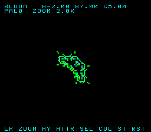
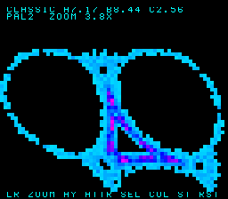

# Blossom — user manual

**Blossom** renders Barry Martin's *Hopalong* strange attractor live on the Super Nintendo and lets you
fly around it with the joypad. It is part of the `llvm-mos-65816` `+mos-a16` (16‑bit‑accumulator 65816)
demo family — the attractor is accumulated into a hit‑count grid in high WRAM via the far
read‑modify‑write path and shown through Mode 7, with the parameter panel drawn on a tiled background
spliced in by an HDMA mode‑switch.

The maths, for the curious: iterate from `(0,0)` with
`x' = y − sign(x)·√|b·x − c|`, `y' = a − x`, in Q8.8 fixed point (no FPU). Each visited cell is a "hit";
the hit count picks a colour, and the whole palette is rotated every frame for the shimmer.

---

## The screen


- **Value bar (top):** the live settings. `CLASSIC/DENSE/BLOOM` is the current attractor; `A`/`B`/`C` are
  its three parameters; `PAL` is the colour mode (0–3); `ZOOM` is the magnification.
- **Plot box (middle):** the attractor itself, centred. The cloud "blooms" in over ~10 s, then shimmers.
- **Control bar (bottom):** `LR ZOOM  AY ATTR  SEL COL  ST RST` — the legend for the buttons below.

---

## Controls

Blossom only uses these SNES buttons:

| SNES button | Action | Updates |
|---|---|---|
| **D‑pad** | Pan the view | — |
| **L** / **R** | Zoom out / in | `ZOOM` |
| **A** / **Y** | Next / previous attractor (re‑blooms) | name + `A` `B` `C` |
| **Select** | Cycle colour mode | `PAL` |
| **Start** | Reset view + attractor to defaults | all |

The value bar updates the instant you press a button — hold **R** and watch `ZOOM` climb toward `4.0X`;
tap **Select** and `PAL` steps `0→1→2→3`; press **A** and the name + `A/B/C` change to the next attractor.

---

## Running it

**Play interactively on this machine (MAME window):**

```
task blossom-play
```

Builds `build/blossom.sfc` if needed, opens a MAME window, and loads a key map so the on‑screen labels
match the keys (table below). Give it ~10 s to bloom in.

**Headless gate + screenshots** (no window; runs the differential checks and writes
`build/blossom-{jg,mame}.png`):

```
task blossom          # or: dev/run.sh blossom
```

**The ROM** is `build/blossom.sfc` — a standard LoROM `.sfc` you can load in any SNES emulator.

---

## Key mappings per emulator

The buttons Blossom needs are **D‑pad, L, R, A, Y, Select, Start**. How those land on your keyboard
depends on the emulator. Two that are pinned down:

### MAME — via `task blossom-play` (this repo)

Loads `dev/mame-snes-input.cfg`, which remaps the keys so the on‑screen letters match:

| SNES button | Key |
|---|---|
| D‑pad | **Arrow keys** |
| A | **A** |
| Y | **Y** |
| L | **L** |
| R | **R** |
| Select | **S** |
| Start | **Enter** |

### RetroArch (Snes9x / bsnes cores) — default keyboard

RetroArch's default RetroPad‑to‑keyboard layout (stable across versions; rebind under
**Settings → Input → Port 1 Controls**):

| SNES button | Key |
|---|---|
| D‑pad | **Arrow keys** |
| A | **X** |
| Y | **A** |
| L | **Q** |
| R | **W** |
| Select | **Right Shift** |
| Start | **Enter** |

(B = **Z**, X = **S** — Blossom doesn't use B/X.)

### Snes9x, bsnes/higan, other standalone emulators

Out‑of‑box defaults vary by version and platform, so rather than guess: open the emulator's input
configuration and confirm (or set) the keys for **D‑pad, L, R, A, Y, Select, Start** — that's all Blossom
touches. Typical menu paths:

- **Snes9x:** *Input → Joypad Configuration* (Windows) / *Settings → Input* (ports).
- **bsnes / bsnes‑jg / higan:** *Settings → Input* (or *Hotkeys*) → Controller Port 1.

A comfortable assignment that matches the on‑screen labels: arrow keys for the D‑pad, and **A**/**Y** on
the keys of the same name, **L**/**R** likewise, **Select**→a nearby key (e.g. *Right Shift* or *S*),
**Start**→*Enter*.

---

## The three attractors

Cycle them with **A** (next) / **Y** (previous). Each is a distinct, bounded Hopalong shape; switching
re‑blooms the cloud (~10 s).

| Name | a | b | c |
|---|---|---|---|
| **CLASSIC** | 7.17 | 8.44 | 2.56 |
| **DENSE** | 2.00 | 5.00 | 1.00 |
| **BLOOM** | −2.00 | 7.00 | 5.00 |



*Above: the **BLOOM** attractor (note the value bar reads `BLOOM A-2.00 B7.00 C5.00` — negative `a`).*

---

## Tips

- **The bloom is the point.** Right after boot or an attractor switch the cloud fills in over ~10 s
  (it's plotting thousands of orbit points). Once it's in, the motion is the palette shimmer — that part
  is a cheap 60 fps.
- **Zoom pivots on the attractor.** L/R magnify around the centre of the plot box, so the attractor stays
  put as you zoom. Pan (D‑pad) then slides it around; **Start** snaps everything back to defaults.
- **Colour modes** (Select, `PAL 0–3`) just rotate where the hue wheel starts — the shape is unchanged.



*Above: CLASSIC zoomed in with a different colour mode — `PAL2 ZOOM 4.0X`.*
