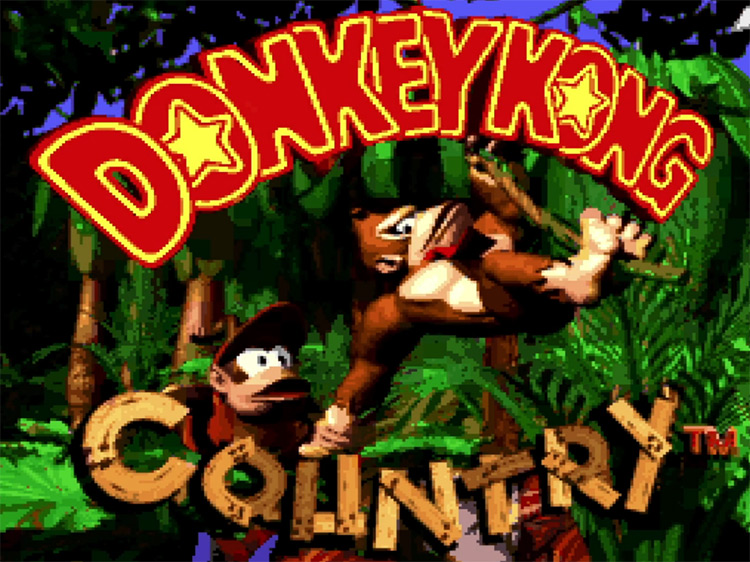
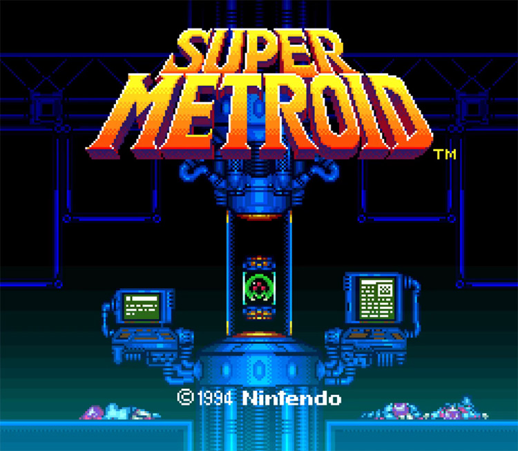
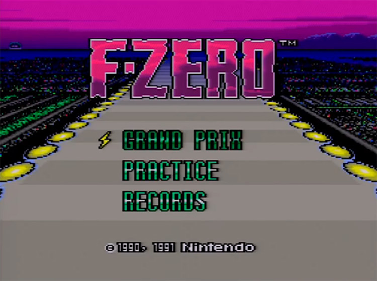
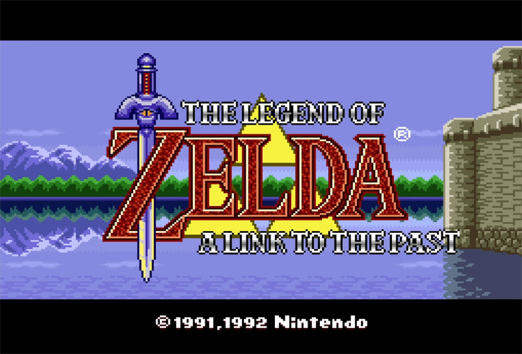
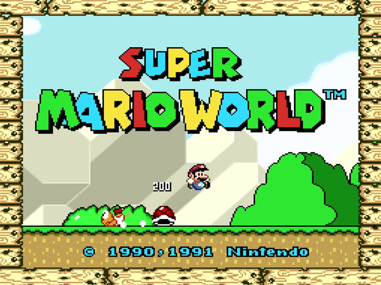
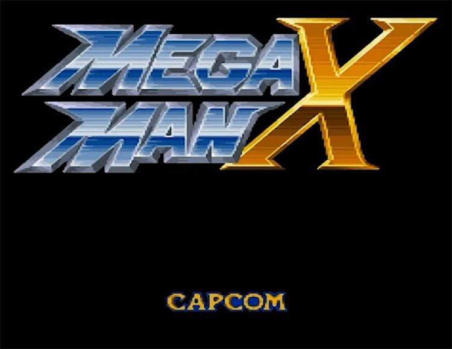
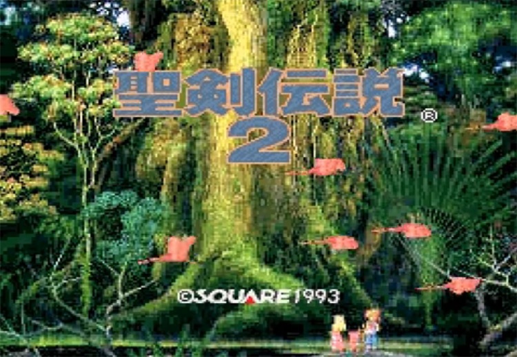
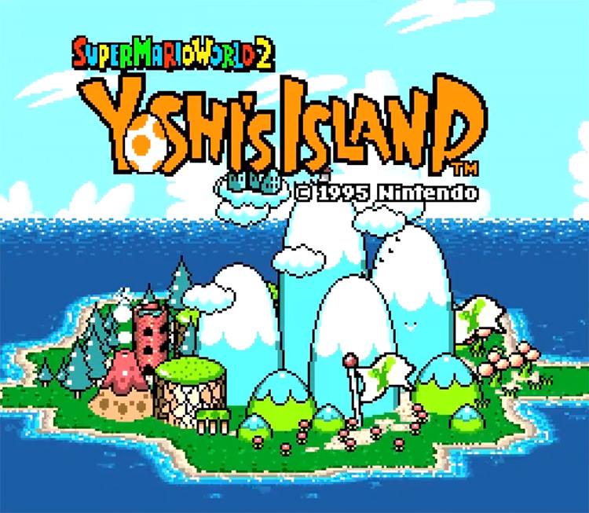
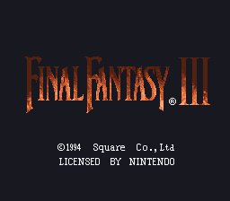

# SNES Title Screens — Reference Survey

A title screen has about three seconds to set genre, tone, and production value before the player touches anything. On SNES hardware this is done entirely with the PPU's layer system, HDMA tricks, and palette animation — no 3D pipeline, no blending unit. The best examples get outsized visual impact from a very constrained toolbox, which makes them worth studying in detail.

---

## Shortlist

| # | Game | Year | Key Technique | Why Study It |
|---|---|---|---|---|
| 1 | Donkey Kong Country | 1994 | Pre-rendered CGI tiles, multi-layer parallax | Impossible-looking depth from flat BG layers |
| 2 | Super Metroid | 1994 | HDMA sky gradient, atmospheric layering | Mood via colour; negative space; the "reveal" structure |
| 3 | F-Zero | 1990 | Mode 7 perspective track, HDMA sky | The canonical Mode 7 showcase; type-over-world |
| 4 | The Legend of Zelda: A Link to the Past | 1991 | 4-layer parallax, HDMA water reflection | Depth from layers alone; reflective illusion |
| 5 | Super Mario World | 1990 | Tile-border frame, live gameplay demo | Interactive attract mode as title context |
| 6 | Mega Man X | 1993 | Pure minimalism, two-tone metallic logo | Restraint as a technique; palette-shift shimmer |
| 7 | Secret of Mana | 1993 | Digitised photo BG, OAM sprite particles | Full-screen artwork as tile data; texture contrast |
| 8 | Yoshi's Island | 1995 | Super FX 2 scaling, crayon-art palette | Chip-assisted scaling for hand-drawn look |
| 9 | Final Fantasy VI | 1994 | Stark black field, palette-glowing logo | Extreme restraint; typography as the entire effect |

---

## Game-by-game Analysis

### 1. Donkey Kong Country (1994, Rare / Nintendo)

**Technique:** Pre-rendered Silicon Graphics workstation renders baked as 4bpp BG tile art. Three parallax background layers (jungle canopy, mid-ground foliage, sky) scroll at independent speeds. The characters (DK, Diddy) are pre-rendered sprite sheets, not hand-pixel-art.

**Hardware:** Standard BGMODE_1 with three BG layers. No special chips — the illusion is entirely in the source art pipeline. Rare pre-rendered every frame on SGI workstations and reduced the output to the SNES's 15-bit palette through careful palette quantisation.

**Design:** The jungle is dense and three-dimensional; the characters swing dynamically through the frame. At a time when 16-bit games looked obviously flat, DKC's title card read as a step-change in fidelity. The arched red logo sits above the action without occluding it.

**Lesson for our title card:** Art quality matters more than hardware tricks. Pre-computation (our corpus gate runs during the title) is the equivalent move — the visual result looks expensive but the runtime cost is deferred.

---

### 2. Super Metroid (1994, Nintendo R&D1)

**Technique:** HDMA colour gradient on BG colour register (CGRAM[0] / backdrop) changes sky colour per scanline — deep teal at the horizon, near-black at the top. A detailed machinery scene with multiple BG layers sits underneath the logo. The title fades in from black.

**Hardware:** The sky gradient is pure HDMA on the backdrop colour — zero tile/sprite cost. The logo is a large BG tile region; the machinery behind it uses BG1 + BG2 with independent scroll. The scene is subtly animated (small console screens blink).

**Design:** Extremely atmospheric. The colour gradient immediately signals "dark science-fiction." The logo reads before you consciously see it. The scene below the logo grounds the title card in a specific space — it is a room in the game world, not an abstract background.

**Lesson for our title card:** HDMA on CGRAM[0] (which our TitleLayer already uses for the rainbow backdrop) is the cheapest possible background effect. A gradient from a game-relevant colour to near-black reads as genre and sets mood before the logo has registered.

---

### 3. F-Zero (1990, Nintendo EAD)

**Technique:** Mode 7 affine transform renders a flat track texture as a receding perspective floor. HDMA on the Mode 7 matrix parameters (A/B/C/D/X/Y) varies the horizon geometry per scanline, creating the perspective warp. A pink-to-purple sky above the horizon is another HDMA colour gradient. The title card and menu text sit on an overlay BG layer above Mode 7.

**Hardware:** Mode 7 is a single-BG mode; the SNES dedicates the entire PPU to rotating/scaling one 128×128-tile map. The perspective floor is a HDMA trick that writes new matrix values to `REG_M7A`–`REG_M7D` and scroll registers every scanline. The logo floats on BG1 or as OAM sprites over the Mode 7 layer.

**Design:** The track rushing toward you signals "racing game" instantly. The neon palette (hot pink, electric yellow, acid green) was the futuristic aesthetic of 1990. This is a title screen that *demonstrates the game mechanic* — you are already on the track.

**Lesson for our title card:** The title card can show the *thing the demo does*, not just announce its name. The F-Zero approach is exactly what our demos should aspire to — the title is a preview. Also: HDMA matrix writes per scanline are inexpensive if values are pre-computed in a table.

---

### 4. The Legend of Zelda: A Link to the Past (1991, Nintendo EAD)

**Technique:** Four BG layers at independent scroll speeds create strong parallax depth: distant mountains, mid-ground castle walls, foreground water with an HDMA-driven horizontal scroll illusion simulating reflection ripples. The logo (Master Sword + Triforce) is tile art spanning both BG1 and BG2, composited with transparency. The sky is a static palette gradient.

**Hardware:** BGMODE_1 supports three BG layers (BG1 4bpp, BG2 4bpp, BG3 2bpp). The water "reflection" is an HDMA horizontal scroll on BG1/BG2 that shifts each row left or right by a pre-computed sine value — a classic WRAM-table trick. Palette entry 0 of each sub-palette is transparent, enabling the logo composition.

**Design:** Multi-layer parallax is the most convincing depth effect available without Mode 7. Zelda stacks four layers in a single static scene and achieves a sense of grandeur that feels like looking at a real landscape. The water reflection completes the illusion of a world you can believe in.

**Lesson for our title card:** Parallax scroll in BGMODE_1 is free (two independent BG scroll registers per BG, no HDMA needed for basic parallax). Even a two-speed scroll between BG1 and BG3 would add visual depth to our title. The water-reflection HDMA trick (per-row BG scroll from a sine table) costs one HDMA channel and one pre-computed table.

---

### 5. Super Mario World (1990, Nintendo EAD)

**Technique:** A decorative tile-border frame (brown brick pattern) surrounds the active display area. The title text occupies the upper third in large multi-colour BG tile art. Below the title, a live gameplay excerpt runs — Mario is animated and moving, a Yoshi egg is present — this is not a static image but an actual partial game simulation.

**Hardware:** The border frame is BG3 (low-priority) with the centre tiles blank, revealing BG1 behind it. The game simulation in the title uses the same engine as actual gameplay. The title card is effectively the attract mode displayed beneath a title-text overlay.

**Design:** Instantly communicates "platform game," "colourful," "playful," with no ambiguity. The live gameplay excerpt is a promise: what you see is what you play. The framed-image composition is a known trustworthy structure — like a TV screen or a painting.

**Lesson for our title card:** Showing the demo running behind the title text is the strongest possible argument for the demo. Our `TitleLayer` on BG2 already allows BG1/BG3 to render beneath it — the demo's actual output is visible through the title's transparent colour 0 regions, if the timing were extended.

---

### 6. Mega Man X (1993, Capcom)

**Technique:** Pure black background. Two large metallic logo words ("MEGA MAN") in blue-silver gradient tile art, plus a large gold "X" in a separate style — the two-tone contrast is the entire visual event. Below: the publisher name in small yellow text. Nothing else. No background art, no animation beyond a possible palette-cycling shimmer on the metallic tones.

**Hardware:** The logo is likely OAM sprite assembly (8×8 or 16×16 sprites tiled together) or BG1 tile art on a black BG. The metallic gradient is a palette chosen from 15-bit colour — no special hardware needed. The background is simply `CGRAM[0] = 0`.

**Design:** The logo is so large it nearly fills the screen. Negative space makes the metallic text read as physically heavy and premium. The two-tone palette (cold blue-silver + warm gold) signals a tonal upgrade from the NES originals. Restraint is itself a technique — if everything is maximalist, nothing reads.

**Lesson for our title card:** Our title card currently uses a rainbow cycling backdrop. That is the opposite of this approach. For demos where we want the title to signal precision or seriousness, a static deep colour (not cycling) with high-contrast ink would be more effective. The Mega Man X lesson is: know when to turn the effects off.

---

### 7. Secret of Mana (1993, Square)

**Technique:** A digitised photographic background — a real forest photographed and quantised to SNES palette — fills the screen as BG tile art. Small red particle sprites (petals or leaves) animate across the scene via OAM. The logo is tile art in a semi-transparent style. The depth of the photographic background is illusory but reads as lush and naturalistic.

**Hardware:** BGMODE_1; the "photograph" is 4bpp BG tile data, palette-quantised through an offline tool. Each 8×8 tile uses a unique entry in the 4 available 4bpp sub-palettes (256 colour total). The floating particles are OAM sprites (8×8 or 16×16). No special chips.

**Design:** Square's RPGs in this era used digitised or painted backgrounds to signal "this world is rich and real." The photographic forest immediately codes as "adventure in nature," distinct from Zelda's pixel-art landscapes. The contrast between the photorealistic BG and the stylised logo typography is the key tension.

**Lesson for our title card:** A high-detail photographic or painted BG tile set is a VRAM investment (fills BG1's character space), but it is purely offline work — no runtime cost. For a demo that renders a natural scene (fractal terrain, L-system plant), pre-rendering a lush establishing shot as the title BG would visually prime the viewer.

---

### 8. Yoshi's Island (1995, Nintendo EAD)

**Technique:** The Super FX 2 coprocessor handles sprite scaling and rotation that the base SNES cannot do at this quality. The title art uses a deliberate crayon/watercolour aesthetic — outlines, dithered fills, pastel colours — to evoke hand-drawn children's book illustration. The island scene is a diorama with layered elements and an animated sky. Clouds are OAM sprites that drift across the scene.

**Hardware:** Super FX 2 chip on the cartridge. The chip pre-processes scaled/rotated sprites and writes them into VRAM as tile data; the SNES PPU renders them as ordinary BG tiles. The aesthetic choice to look hand-drawn reduces the pixel-count expectations: dithered fills and thick outlines hide aliasing that would look wrong in a "realistic" style.

**Design:** The visual style is the genre signal. "Hand-drawn = innocent, playful, for children." It is the opposite of Super Metroid. The island-in-sea composition gives a physical sense of scale and adventure. Every element has a shadow or outline, making the scene read clearly even at SNES resolution.

**Lesson for our title card:** Style choice is a hardware trick. If you commit to a low-resolution aesthetic (thick outlines, flat fills, limited palette), you can achieve high visual clarity with very few tiles. Our 8×8 font on BG2 already uses this principle. A title card with a deliberately stylised BG — drawn to match the demo's own aesthetic — would be more coherent than a generic gradient.

---

### 9. Final Fantasy VI (1994, Square)

**Technique:** Entirely black screen. The logo text glows orange-red using palette animation — the same text tile set is recoloured across frames to simulate inner fire. No background art, no sprites, no hardware tricks beyond CGRAM writes per frame. The copyright notice is in plain white small text at the bottom.

**Hardware:** A single BG layer with the logo tile art. Colour animation is achieved by writing new RGB values to the logo's CGRAM palette entries each frame (or each several frames) — the same mechanism as our ink shimmer. No HDMA, no OAM.

**Design:** The logo glows. That is literally everything. The restraint signals that the game has no need to prove itself; the name is sufficient. After the elaborate animated intro sequence that precedes this screen, the still glowing title is a landing point — it lets the player breathe. The contrast between the intro's complexity and the title's silence is itself a deliberate pacing choice.

**Lesson for our title card:** Palette animation on the logo ink is already implemented in our `TitleLayer` (the ink shimmer, range 24–31). FF6 demonstrates this can be the *only* effect and still be powerful. For demos where the rainbow backdrop is too festive, replacing it with a deep matching colour and increasing the ink shimmer amplitude (e.g. 0–31, cycling through hue) would achieve the FF6 glow effect cleanly.

---

## Synthesis: Patterns Worth Stealing

**The backdrop is a free canvas.** `CGRAM[0]` is the hardware backdrop — our rainbow cycle already uses it. Super Metroid, F-Zero, and Zelda all use HDMA on colour registers (not tile layers) for their sky gradients. A static or slowly-shifting deep colour is zero tile cost and zero OAM cost. Try a demo-specific hue rather than always cycling full rainbow.

**Show the demo through the title.** Super Mario World runs the game beneath the title text. Our `TitleLayer` on BG2 already composites over BG1/BG3 via transparent colour 0. The demo's output is visible during the title if the demo emits. Currently demos black-out during the title (they run, but the screen is faded up over the static scene). Fading up *while the demo is rendering* would give a live preview, no extra hardware cost.

**Negative space reads as quality.** Mega Man X and FF6 both use black fields. The eye interprets a mostly-black screen with a lit element as high production value, not laziness. Our title card currently competes against itself with rainbow + shimmer + fly-in simultaneously. Choosing *one* of these per demo rather than all three might read better.

**The fly-in direction implies genre.** Elements entering from the top descend (gravity, authority). Elements entering from the sides suggest lateral movement (racing, combat). Elements fading in from black (FF6, Super Metroid) imply emergence from darkness (atmosphere, mystery). Our current vertical fly-in (top+bottom converging to centre) implies balance, symmetry, and arrival — fitting for a demo showcase.

**Pixel-centring matters more than it seems.** Our HDMA-based sub-tile pixel centring is unusual — most SNES titles accept the 8 px tile grid and compensate by using even-character-count title strings. The fact that we go to the effort of per-scanline HDMA nudging for a 4 px correction signals that we care about precision. Worth keeping.

**Typography is the title card.** In every entry above, the logo treatment (size, weight, colour, glow, position) carries more than any background. Our 8×8 font is small by comparison — the entire two-line title occupies ≈8 rows of the 32-row tilemap. Scaling up (16×16 or 24×24 font via assembled tiles) with a single-line title and more surrounding negative space would land closer to how these reference titles feel.

**Palette animation is always free.** Every game here uses at least one palette-cycle trick (DKC's shimmer, Super Metroid's gradient settle, FF6's glow). CGRAM writes cost one DMA job per entry per frame and are always available. Our two-entry write (ink + backdrop) could be expanded to animate the full palette-7 range (16 entries) for a richer logo treatment with no additional tile cost.
