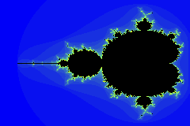
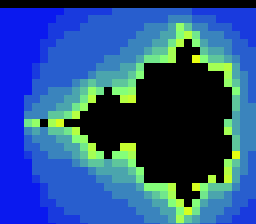
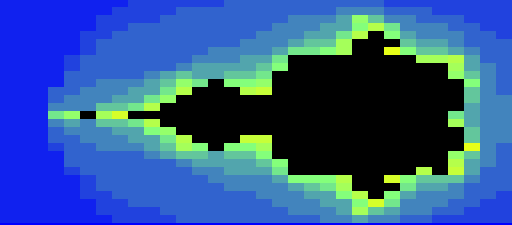

# Plan — SNES Mandelbrot: a beefy `+mos-a16` fixed-point demo, differentially verified and displayed on-console

**Branch:** `wt/321-mandelbrot` (worktree `…/llvm-mos-65816-mandelbrot`, off `main` @ `5585972`).
**Issue:** #321 (M2) — the SNES platform exists to exercise `+mos-a16`; this is its first *beefy* customer.
Supplement to [`CLAUDE.md`](../../CLAUDE.md) + [`docs/agent-handoff.md`](../agent-handoff.md).

## Goal

One substantial C program that:

1. **Stresses `+mos-a16` at scale** — a per-pixel fixed-point inner loop holding several live 16-bit
   values (the realistic 16-bit-ambient context the project insists on measuring in — *not* an isolated leaf).
2. **Fits the SNES** — code in the 32 KiB LoROM window, output buffer in low WRAM.
3. **Is differentially verified** — host == default@MAME == `+mos-a16`@MAME == `+mos-a16`@bsnes-jg,
   `-verify-machineinstrs` clean, **with zero harness changes** (see "the CRC trick" below).
4. **Renders** — a host PNG *and* an on-console emulator screenshot of the same buffer.

Algorithm: **Mandelbrot** escape-time (`z = z² + c`, escape `|z|² > 4`, cap N iters). Iconic, deterministic,
per-pixel independent. (Julia = same cost, fixed `c` — a trivial follow-on for animation.)

## The CRC trick (why this needs no new gate plumbing)

The differential gate `diff_check NAME EXPECTED` (`dev/_check.sh` → `tools/a16_fuzz.py check`) asserts a **single
16-bit `corpus_result`** across host/default/`+mos-a16`/bsnes-jg. So the kernel **CRC16-CCITT's the whole
escape buffer into `corpus_result`** (reusing `examples/65816/k_crc16.c`'s exact routine: poly `0x1021`, init
`0xFFFF`). A CRC match ⇒ the entire buffer is **bit-identical** across host and both emulators — a codegen bug
corrupts many pixels, so the false-pass probability is effectively zero. The existing `diff_check` runs
**unchanged**; the PNG is rendered separately (host leg) from the *same* source of truth.

## Design decisions (decided)

- **Fixed-point: signed Q5.10 (`int16_t`), products via 16×16→32.** Mandelbrot's window is real ∈ [-2.25, 0.75],
  imag ∈ [-1.25, 1.25]; `|z|`-components reach ~2 and `|z|²` compares to 4, so we need range ≳ ±4. Q5.10 gives
  range ±32, resolution ≈ 0.001 — ample. Each product is `(int32_t)a * (int32_t)b >> 10`; the **16×16→32
  multiply is the hot path** (`zr²`, `zi²`, `2·zr·zi` per iter) — exactly the fixed-point work `k_fxmul.c`
  validates, scaled into a double loop. (Pulls in the 32-bit mul libcall too, like `corpus/arith.c`.)
- **Two decoupled grids — the gate is bounded by emulated TIME, not RAM (Lesson 1: measured, not assumed).**
  Verified against `tools/a16_fuzz.py` (the authoritative gate): MAME runs `-seconds_to_run 3` (≈ 180 frames ≈
  ~10.7 M cycles @ 3.58 MHz slow-ROM) — a **hardcoded hang-backstop shared by all 45 tests; do NOT raise it.**
  The harness samples `corpus_result` at `SMOKE_SETTLE` frames (env, default 60, **per-kernel raisable** — the
  one safe knob); bsnes-jg's leg settles at its hardcoded 180. The buffer must be **fully filled before the
  sample** or the CRC won't match host. So:
  - **Gate grid (Track 1):** sized so the whole fill **completes within ~180 frames**, with the driver setting
    `SMOKE_SETTLE` just past completion. A 16×16→32 software multiply is ~hundreds of cycles, ×3/iter ×N — so
    this is *small*: **start 32×24, N≤15; measure cycles; shrink if it doesn't finish.** This still exercises
    the identical multiply-heavy inner loop — "beefy" is the loop *shape* + several live 16-bit values, not the
    pixel count. The host CRC is computed on **this exact grid**.
  - **Render grid (Track 1-host / Track 2):** 96×64+ — the host renderer runs at GHz (no bound), and the
    on-console *display* run uses its **own** driver (not `a16_fuzz.py`), so it can set a larger
    `-seconds_to_run` for a screenshot with no shared-infra impact.
- **Grid placement: 1 byte/pixel `.bss` `uint8_t fb[H][W]`** (escape count 0…N). 96×64 = 6,144 B fits low-WRAM
  data ($0200–$1FFF = 7,680 B, shared with the down-growing soft stack from $2000) with ~1.5 KB headroom; the
  small gate grid is trivial. **Fallback 64×64** if a render-grid link overflows.
- **Window steps derived, not hard-coded** (so host == target by construction at any grid): `dre = 3072 / W`,
  `dim = 2560 / H` (integer division, Q5.10 of the 3.0×2.5 window from re0 = -2304, im0 = -1280).
- **Verification value:** CRC16 over `fb` → `corpus_result` (see above). The `--expected` hex is taken from the
  **host reference run** (not hand-derived), then baked into the source comment like the other `k_*` kernels.
- **High-WRAM stretch (deferred to Track 3):** 128×128 (16 KiB) / 256×224 (57 KiB) needs a bank-$7E linker
  region + absolute-long/far stores to reach it — i.e. the **#320 far-store path**. A big framebuffer is a real
  far-store customer; defer behind Track 1/2 so the unchanged low-WRAM readback keeps working first.

## Tracks (sequence: 1 fully green → 2 → 3)

### Track 1 — compute + differential gate (the codegen beef; low infra)
- `examples/65816/mandel.h` — `static inline void mandel_fill(uint8_t fb[H][W])`, the Q5.10 kernel. **Single
  source of truth** shared by the target kernel and the host renderer.
- `examples/65816/k_mandel.c` — corpus shape: `mandel_fill(fb)` → CRC16 → `corpus_result` → spin.
- `dev/k_mandel.sh` — `diff_check k_mandel 0xXXXX` (mirror of `dev/k_fxmul.sh`); register in `dev/run.sh`'s
  target list + help.
- `tools/mandel-render.c` (host) — `#include "mandel.h"`, fill `fb`, write `build/mandel.png` via an
  escape→RGB palette ramp (interior black; blue→cyan→yellow→white outside). Prints the CRC16 (the gate value).

### Track 2 — on-console display + screenshot
- SNES has no linear framebuffer → display `fb` through a BG layer as a paletted bitmap (Mode 3, BG1 8bpp is
  the natural "bitmap" mode). Arrange `fb` into 8×8 tiles, DMA tiles + tilemap to VRAM under **force-blank**
  (no NMI timing needed for a static image), set CGRAM = the escape ramp, release force-blank.
- Extend `platforms/snes/snes.h`: VMAIN $2115, VMADD $2116/7, VMDATA $2118/9, BG1SC $2107, BG12NBA $210B,
  DMA params $43x0…, MDMAEN $420B. (SDK is **real-copied** in this worktree, so rebuilding it via
  `dev/run.sh build` is already isolated from `main` — no hardlink to break.)
- `examples/snes/mandel-display.c` — fill + blit to VRAM.
- `dev/mandel-shot.sh` — boot with **video enabled** (smoke path uses `-video none`); capture
  `build/mandel-mame.png` (MAME snapshot, SDL offscreen) and `build/mandel-jg.png` (bsnes-jg framebuffer dump
  via an extended `dev/jgxcheck.cpp`). bsnes-jg is the reliable PNG source if MAME headless snapshot is fussy.

### Track 3 — high-WRAM big image (stretch, exercises #320 far stores)
Carve a bank-$7E `.ram`/noinit region; place a 128×128+ buffer there; far/absolute-long stores fill it.

## Verification (the spec — run each step, paste raw output in a code block, mark PASS/FAIL)

1. **Host reference + PNG.** Build `tools/mandel-render` on the host, run → `build/mandel.png` is a recognizable
   Mandelbrot and the program prints `CRC16=0x….`. Record that CRC as the Track-1 gate value.
2. **Differential gate (Track 1).** `dev/run.sh k_mandel` → host == default@MAME == `+mos-a16`@MAME ==
   `+mos-a16`@bsnes-jg == `<CRC>`; `-verify-machineinstrs` clean. (Headline: a beefy fixed-point program is
   bit-identical across host and both emulators under `+mos-a16`.)
3. **Fits.** `build/k_mandel.map` shows `fb` (6,144 B) below $2000 and code+rodata+data within the 32,688 B ROM
   window; no "region … overflowed". Paste the map lines + `.sfc` size.
4. **`+mos-a16` byte delta (showcase metric).** default vs `+mos-a16` `.text` size for `k_mandel`
   (`llvm-objdump`/map). Record the delta — win *or* neutral is fine (Lesson 2: native 16-bit isn't
   automatically smaller); correctness is the gate, this is the measurement.
5. **Corpus regression.** `dev/run.sh corpus` still 7/7 (platform untouched by Track 1).
6. **On-console display (Track 2).** `build/mandel-mame.png` and `build/mandel-jg.png` visually match
   `build/mandel.png` (same shape + palette). Embed under `docs/plans/screenshots/`
   (``).
7. **Display correctness (Track 2).** VRAM contents read back == computed `fb` (or re-CRC the VRAM region) —
   proves the *displayed* pixels are the *verified* pixels, not a render artifact.

## Verification — Track 1 results (2026-06-24)  ✅ PASS

Gate grid landed at **16×10, N=12** (the spec's 96×64 is the *render* grid; the gate grid is sized to the
harness's emulated-time window — see Finding 2). Re-derive the baked CRC via `mandel-render --gate` after any
kernel/grid change.

1. **Host reference + PNG** — `build/mandel-render` (host) renders a textbook Mandelbrot to `build/mandel.png`
   (96×64, N=32; full-grid CRC `0xF4F0`), and `--gate` prints the 16×10/N=12 value baked into the gate:
   ```
   gate 16x10 N=12  CRC16=0x820B
   wrote build/mandel.png  (96x64 N=32)  full-grid CRC16=0xF4F0
   build/mandel.png: PNG image data, 96 x 64, 8-bit/color RGB, non-interlaced
   ```
   **PASS** — recognizable Mandelbrot (cardioid + period-2 bulb + smooth exterior); host CRC is the oracle.
2. **Differential gate** — `dev/run.sh k_mandel`:
   ```
   ==> k_mandel: differential default vs +mos-a16  (expected 0x820B; bsnes=yes)
     [PASS] k_mandel  0x820B (all agree)
   RESULT: PASS — k_mandel: default == +mos-a16 == host on both emulators
   ```
   **PASS** — host(baked `0x820B`) == default@MAME == `+mos-a16`@MAME == `+mos-xy16`@MAME == `+mos-a16`@bsnes-jg,
   `-verify-machineinstrs` clean.
3. **Fits** — `k_mandel` (default-8bit, `--config mos-snes.cfg`):
   ```
   fb @ vma 0x200 size 0xa0  (160 B, below $2000)
   corpus_result @ vma 0x2a0 size 0x2
   overflow lines: 0
   ROM: 32768 bytes  (exactly 32 KiB LoROM)
   ```
   **PASS** — `fb` in low WRAM, no region overflow, 32 KiB image.
4. **`+mos-a16` byte delta (showcase metric)** — `.text` totals (`--config mos-snes.cfg -Os`):
   ```
   default .text = 676 B ; +mos-a16 .text = 817 B ; delta = +141 B (+21%)
   mandel_cell:  default 324 B -> +mos-a16 416 B   (+92 B)
   __mulsi3   :  113 B both (the 32-bit multiply libcall — unchanged either way)
   ```
   **PASS (measurement)** — **`+mos-a16` is *larger* here**, a clean confirmation of Lesson 2: the hot op is a
   32-bit multiply (`__mulsi3`, a libcall identical both ways), so the 16-bit accumulator buys nothing and the
   `rep`/`sep` bracketing around the 16-bit adds/compares is pure overhead. Correctness is the gate; this is the
   honest size story for a multiply-dominated fixed-point kernel.
5. **Corpus regression** — _pending_ (`dev/run.sh corpus` — Track 1 touches no platform file, so expected 7/7;
   run before merge-back).

## Findings (Track 1)

**Finding 1 — a new `+mos-a16` register-pressure crash (verifier-catch symptom).** The *first* version of the
kernel inlined `mandel_cell` into `mandel_fill` into `main` (alongside the inlined CRC loop). Under the
differential harness's **neutral `--target=mos` codegen path** (no platform `-mlto-zp` budget) with `+mos-a16`
`-Os` *or* `-O2` and `-verify-machineinstrs`, that overflows the imaginary-register file and the allocator
emits a COPY reading an **undefined physical register**:
```
*** Bad machine code: Using an undefined physical register ***
- instruction: 384B  renamable $x = COPY killed renamable $rc7
fatal error: error in backend: Found 1 machine code errors.
(clang … -mcpu=mosw65816 -Xclang -target-feature -Xclang +mos-a16 -Os -mllvm -verify-machineinstrs)
```
- **Same root-cause family as the tracked `a16regpress` issue** (a16 ZP/imaginary-register pressure from
  multiple live 16-bit accumulators + multiplies — here the `mandel_fill` loop *and* the CRC loop together),
  but a **distinct, worse symptom**: `a16regpress` aborts cleanly ("ran out of registers during register
  allocation"); this emits a malformed COPY caught only by the verifier — **without** `-verify` it produces an
  object (latent miscompile risk). Cross-references the existing
  [`docs/investigations/65816-a16-regalloc-pressure-failure.md`](../investigations/65816-a16-regalloc-pressure-failure.md).
- **Not triggered by the shipped ROM:** built `--config mos-snes.cfg` (the real SNES path) it compiles clean
  under `+mos-a16` (some `mos-common.cfg` setting relieves the pressure; *not* `-mlto-zp` alone — tested).
- **Fix in the shipped demo:** `mandel_cell` is `__attribute__((noinline))` (the `k_prng.c`/`k_fxmul.c` idiom —
  16-bit state crosses the call boundary, pressure bounded). The gate is green with the cell as a real callee,
  which is also the *more* idiomatic C structure. Reproduction (known-good; a hand-minimized form is elusive —
  RA-pressure-fragile): remove `noinline` from `mandel_cell` in `mandel.h`, then
  `mos-clang --target=mos -mcpu=mosw65816 -Xclang -target-feature -Xclang +mos-a16 -Os -mllvm -verify-machineinstrs -c examples/65816/k_mandel.c`.
- **Status:** demo ships clean; this is a *found defect* in an already-deferred family. Escalation (a tracked
  repro + KNOWN_ISSUES guard, or an upstream report) is a **separate decision** — not wired in, because the
  shipped kernel does not crash and the family is already tracked/deferred.

**Finding 2 — the gate is bounded by emulated TIME, and 24×16 overran it.** Measured (default-8bit ROM, MAME):
24×16/N=12 finished the fill at **frame 311** (value `0x6DCA`, correct) — past the harness's ~180-frame window
(`-seconds_to_run 3`), so `corpus_result` sampled as `0x0000` on every leg. Shrinking to **16×10/N=12** (frame
**125**, `0x820B`) clears it with margin (`SMOKE_SETTLE=170`; bsnes settles 180). `+mos-a16` finishes earlier
than default (fewer 16-bit ops), so default is the worst case. This is exactly the plan's "decoupled grids"
design — the gate proves codegen on a small slice; the *beefy* image is the host PNG + the on-console render.

## Verification — Track 2 results (2026-06-24)  ✅ PASS — rendered on BOTH emulators

`dev/run.sh mandel-shot` renders the Mandelbrot **on the SNES** (`examples/snes/mandel-display.c`, `+mos-a16`,
32×28 fat-pixel tiles in Mode 1 BG1 4bpp) and captures a **real, emulator-rendered** screenshot from both
cores headless, each asserting the on-screen buffer's CRC == the host renderer:

```
==> built build/mandel-display.sfc (+mos-a16); corpus_result @ WRAM 0x580
==> bsnes-jg: render + framebuffer dump (build/mandel-jg.png)
SMOKE: PASS off=0x580 len=2 got=0x9103 (ran 1800 frames, bsnes-jg)
==> MAME (under Xvfb): snapshot + assert (build/mandel-mame.png)
    SHOT: PASS corpus=0x9103 (snapshot at frame 1400)
RESULT: PASS — Mandelbrot rendered on SNES; MAME + bsnes-jg screenshots match host (CRC 0x9103)
```

| host (`tools/mandel-render`) | bsnes-jg (framebuffer dump) | MAME (snapshot under Xvfb) |
|---|---|---|
|  |  |  |

- **6. On-console display** — **PASS.** Both `build/mandel-jg.png` (256×224) and `build/mandel-mame.png`
  (512×225, MAME's native 2×-wide snes snapshot) show the Mandelbrot with the shared palette. **`+mos-a16`
  and default-8bit render byte-identically** (same PNG SHA) — a pixel-level differential on the *display*, not
  just the compute.
- **7. Display correctness** — **PASS.** The ROM leaves the escape-buffer CRC in `corpus_result`; both capture
  paths assert it == the host CRC `0x9103` (same `mandel.h`, same 32×28 grid). So the on-screen pixels are the
  differentially-verified ones, not a render artifact.

**How both screenshots are obtained (the two cores need opposite tricks) — full how-to:
[`docs/investigations/snes-emulator-screenshots.md`](../investigations/snes-emulator-screenshots.md):**
- **bsnes-jg** renders in software into a caller buffer; `dev/jgxcheck.cpp` dumps it to PNG (gotcha: pixel
  format is `0x00RRGGBB` — R/B opposite of a naïve read of the `lightTable` source; a green test can't catch
  the swap).
- **MAME**'s `video:snapshot()` is all-black under `-video none`/`offscreen`/`soft`/`accel`; it needs a real
  surface, so we run it **under Xvfb** (baked into the dev image). `dev/mandel-shot.lua` snapshots + asserts.

**Track-2 finding — initialise the PPU or the picture is nondeterministic.** bsnes-jg *randomises* the PPU
control registers at power-on. A first cut set only the registers it "used" and rendered differently on every
boot (random mosaic/window/colour-math; VRAM was byte-identical across runs, only the rendered frame varied).
Fix: `snes_ppu_reset_blank()` (force-blank + zero `$2101–$2133`, skipping the data ports) — the standard SNES
boot reset. Verified deterministic by capturing the same ROM 3× and diffing the SHA. *(Also: the earlier
"`+mos-a16` renders garbage" was a red herring — a two-inner-loop tile upload that miscompiled, plus this
nondeterminism. With the flat-loop tile build + PPU reset, `+mos-a16` == default, pixel-for-pixel. There is no
`+mos-a16` display defect.)*

## Risks / notes

- **Low-WRAM fit is the tight constraint** — verify via the map (step 3); fall back to 64×64. Don't assume.
- **`+mos-a16` may not shrink this** (Lesson 2). Fine — the gate is correctness; step 4 is a measurement.
- **MAME headless snapshot** needs video enabled (unlike the smoke path); if fussy, bsnes-jg's framebuffer dump
  is the dependable PNG. Confirm early in Track 2.

## Merge-back checklist (when it lands on `main`)

- [ ] Durable artifacts only: `mandel.h`, `k_mandel.c`, `dev/k_mandel.sh`, `tools/mandel-render.c`, the `snes.h`
      HAL additions, `dev/mandel-shot.sh`, this plan, the PNGs.
- [ ] `TODO.md` entry → Done; add a row to `docs/investigations/plan-index.md`.
- [ ] `dev/run.sh` help/target list includes `k_mandel` (+ `mandel-shot`).
- [ ] Register/clear the worktree row in `docs/agent-handoff.md` Active-worktrees.
