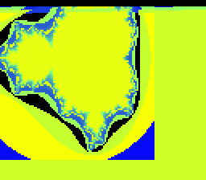
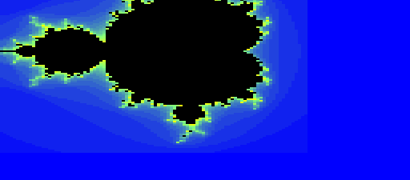

# Plan — Interactive SNES Mandelbrot (Approach A: real-time Mode 7 fly-around)

**Branch:** `wt/321-mandelbrot` (worktree `…/llvm-mos-65816-mandelbrot`, off `main` — continues the merged
beefy demo). **Issue:** #321 (M2). Supplement to [`CLAUDE.md`](../../CLAUDE.md) +
[`docs/agent-handoff.md`](../agent-handoff.md).

> **Provenance.** This plan was developed in a prior plan-mode session (slug `plan-approach-a-pure-crab`) and
> approved *in substance* — the design decisions below are marked **Decided (user)** — but the write to the
> repo was rejected, so the file never landed. Recovered from the plan-mode artifact and refined here (the
> verification section now uses a ground-truth pad-log replay, hardened against emulator input-timing).

## Context

We shipped a gorgeous 128×128 Mode 7 Mandelbrot (Track 3b, [`mandel-mode7.c`](../../examples/snes/mandel-mode7.c)),
but the *on-SNES fractal compute* is ~4 min of emulated time (a black screen until it finishes) — **too slow to
be interactive.** The key insight: **Mode 7 pan/zoom/rotate is already 60 fps hardware** — only the one-time
compute is slow. So we **precompute the image host-side, bake it into ROM, and DMA it at boot** (instant), then
drive the Mode 7 transform from the controller every frame. Nothing is lost on the codegen front: the on-device
`+mos-a16` *fractal* compute is already differentially proven by Tracks 1–3 (`dev/run.sh k_mandel`/`mandel-far`),
and the **per-frame Mode 7 matrix math is itself a fresh `+mos-a16` customer** (16×16→32 multiplies — see
"the codegen beef" below), kept honest by its own differential gate.

This also delivers the **input HAL + vblank game-loop** milestone the rendering handoff
([`docs/handoffs/2026-06-24-snes-graphics-rendering.md`](../handoffs/2026-06-24-snes-graphics-rendering.md))
flagged as the next step after static display — useful to the rendering-library agent regardless of the demo.

**Decided (user):** image source = **precompute + bake in ROM**. Input = **manual** joypad read. Plan must
include **mockups** and **SNES→PC key mappings**.

## Goal

Boot → instant Mandelbrot → **D-pad pans, L/R zooms, Y/A rotates, Select cycles the palette, Start resets** —
smooth 60 fps. New, reusable platform pieces: a joypad input HAL (manual read), a vblank-paced frame loop, a
shared Mode 7 helper, a shared *pure* view-math header, and a build-time "bake the image into ROM" path. No
runtime fractal compute.

## The codegen beef (why this is still a `+mos-a16` exercise, not just register pokes)

The fractal compute is baked, but the **per-frame view→matrix transform is live `+mos-a16` math**: each frame
computes the Mode 7 affine matrix from `angle`+`zoom` as `A = (cos·zoom)>>8`, `B = (-sin·zoom)>>8`,
`C = (sin·zoom)>>8`, `D = (cos·zoom)>>8` — four **16×16→32 fixed-point multiplies** (8.8), plus signed
clamps/wraps on the pan/zoom/angle state. That is exactly the multiple-live-16-bit-value shape `+mos-a16`
targets, and it is gated **differentially** (host C == `+mos-a16` on the emulator) the same way the fractal
kernel is — see Verification step 2.

## What already exists — reuse, don't rewrite

- **Mode 7 VRAM upload + setup** — `examples/snes/mandel-mode7.c`: `build_vbuf()` (de-linearize raster →
  interleaved Mode 7 image), `dma_vbuf_to_vram()` (one 32 KiB DMA), the `BGMODE_7`/`M7A–D`/`M7X/Y`/scroll
  block. **Refactor into a shared `examples/snes/mode7.h`** so the static and interactive demos share them; the
  only difference is the *image source's address space* (handled by a macro — see Design §3).
- **Host renderer / shared kernel** — `examples/65816/mandel.h` (`mandel_fill`, `mandel_palette`, `mandel_crc`)
  and `tools/mandel-render.c`. Reuse to generate the baked image + CGRAM palette + the host-reference CRC.
- **HAL** — `platforms/snes/snes.h` already has the Mode 7 matrix/scroll regs, DMA channel 0, `NMITIMEN`,
  `snes_ppu_reset_blank()`, `SNES_M7()`, `SNES_RGB()`. **Missing: joypad + status regs + read/wait helpers.**
- **Startup** — `platforms/snes/crt0.c`: native mode at `main()`, `NMITIMEN=$00` (auto-joypad-read OFF — good
  for manual read), weak `nmi`/`irq` `rti` stubs (so **no ISR needed** — we poll the vblank flag).
- **Verification harness** — `dev/jgxcheck.cpp` `pollInput` callback (currently `return 0`) is the hook for
  **scripted, deterministic** controller input; it returns the **full 16-bit button mask** on latch (bit
  layout `B=0x8000 … R=0x0010`, identical to the SNES serial order and our `JOY_*` masks). MAME Lua reads WRAM
  + snapshots.

## Design

> **As-built note (2026-06-25):** the design below is the as-*planned* shape; two things changed during
> implementation (both documented in "Implementation outcome" at the end, with the measurements that drove
> them): (a) the upload is **not** the reused `build_vbuf` + high-WRAM staging — that was measured at a ~5–6 s
> black-screen boot, defeating the point — but a **host-pre-tiled image DMA'd straight ROM→VRAM** (truly
> instant); (b) because that removes the far staging buffer, the demo builds **both default-8bit and
> `+mos-a16`** (a `host==default==+mos-a16` differential), not `+mos-a16`-only.

### 1. Bake the image into ROM (build-time, instant boot)
- New host tool `tools/mandel-bake.c` (`#include "../examples/65816/mandel.h"`): runs `mandel_fill` once at
  128×128, emits generated header **`examples/snes/mandel_image.h`** with:
  - `static const uint8_t  MANDEL_IMG[128*128];`  (escape buffer, 16 KiB → `.rodata`/ROM)
  - `static const uint16_t MANDEL_PAL[MANDEL_NCOL];` (BGR555 palette from `mandel_palette`)
  - `static const int16_t  SINCOS[256];`          (8.8 sine, full circle = 256; `cos(a) = SINCOS[(a+64)&255]`)
  - `#define MANDEL_IMG_CRC 0x….`                 (host-reference CRC16 of `MANDEL_IMG`, the boot gate value)
- **Boot:** reuse `mode7.h`'s `build_vbuf()` pointed at `MANDEL_IMG` (a **near** ROM array — DBR=0, no compute,
  no far source buffer), de-linearize into the high-WRAM staging buffer (`$7E6000`, FAR — keeps `+mos-a16`),
  `dma_vbuf_to_vram()`, load `MANDEL_PAL` → CGRAM. ~1 frame of work, effectively instant.
- **ROM fit — MEASURED on the static demo, fits comfortably:** `mandel-mode7`'s entire program is `.text`
  ≈ **1.7 KiB**. The baked variant drops the runtime compute and adds the 16 KiB image + ~0.6 KiB tables as
  `.rodata` (const → ROM, read in place, no RAM copy) ≈ **~19 KiB of the 32,688 B bank-0 window → ~13 KiB to
  spare.** The image-size cap is **Mode 7's 256-tile limit = 128×128** (already hit), *not* ROM. (Still glance
  at the `.map` after building; no fallback anticipated.)

### 2. Joypad input HAL — **manual** read (add to `platforms/snes/snes.h`)
```c
#define REG_JOYSER0  _SNES_REG8(0x4016)  /* joypad strobe (write) + serial read (ctrl 1) */
#define REG_JOYSER1  _SNES_REG8(0x4017)  /* serial read (ctrl 2)                          */
#define REG_RDNMI    _SNES_REG8(0x4210)  /* vblank-NMI flag (bit7, set at vblank, read-clears) */
#define REG_HVBJOY   _SNES_REG8(0x4212)  /* vblank(7)/hblank(6)/auto-joy-busy(0)          */
/* (auto-read alt: REG_JOY1L/H $4218/$4219 after NMITIMEN bit0 + HVBJOY bit0) */

#define JOY_B 0x8000  #define JOY_Y 0x4000  #define JOY_SELECT 0x2000  #define JOY_START 0x1000
#define JOY_UP 0x0800 #define JOY_DOWN 0x0400 #define JOY_LEFT 0x0200   #define JOY_RIGHT 0x0100
#define JOY_A 0x0080  #define JOY_X 0x0040  #define JOY_L 0x0020        #define JOY_R 0x0010

/* Manual serial read (MSB-first: B,Y,Sel,Start,U,D,L,R,A,X,L,R,sig…). Requires auto-joypad
   read OFF (NMITIMEN bit0=0 — crt0 leaves it 0), else the two fight over $4016. */
static inline uint16_t snes_read_pad1(void) {
  REG_JOYSER0 = 1; REG_JOYSER0 = 0;                 /* strobe: latch state */
  uint16_t p = 0;
  for (uint8_t i = 0; i < 16; i++) p = (uint16_t)((p << 1) | (REG_JOYSER0 & 1));
  return p;
}
/* Block until the next vblank (RDNMI bit7 set at vblank start, read-clears). */
static inline void snes_wait_vblank(void) { while (!(REG_RDNMI & 0x80)) {} }
```

### 3. Shared Mode 7 helper — `examples/snes/mode7.h`
Generic (no Mandelbrot knowledge): `M7_W`/`M7_H` (=128), the FAR `m7_vbuf` staging pointer,
`M7_DEFINE_BUILD_VBUF(NAME, SRCQUAL)` (the de-linearize macro — stamps a `build_vbuf` for a given source
address-space qualifier so the **far**-source static demo and the **near**-source baked demo share the exact
index math), `m7_dma_vbuf_to_vram()`, `m7_cgram_load(pal, n)`, `m7_begin()`/`m7_show()`, and
`m7_set_matrix/center/scroll()`. `mandel-mode7.c` is refactored onto it (regression guard, Verification §5).

### 4. Shared *pure* view math — `examples/snes/view.h` (host == target)
Splits the interactive math (verifiable) from the hardware poking (target-only):
```c
typedef struct { int16_t cx, cy; int16_t zoom; uint8_t angle, pal; } view_t;
static inline void     view_reset (view_t *v);
static inline void     view_step  (view_t *v, uint16_t pad);        /* pure: pad → new state  */
static inline void     view_matrix(const view_t *v, int16_t m[4]);  /* A,B,C,D 8.8 (the mults)*/
static inline uint16_t view_fold  (uint16_t crc, const view_t *v, const int16_t m[4]);
```
`mandel-interactive.c` provides `apply_view()` (target-only: `view_matrix` → `m7_set_*` regs + palette cycle).
The host verifier (`jgxcheck`) `#include`s `view.h` and replays `view_step`/`view_matrix`/`view_fold` to mirror
the ROM exactly. `SINCOS` comes from the generated `mandel_image.h` (both sides include it).

### 5. The frame loop — `examples/snes/mandel-interactive.c` (+mos-a16)
```c
int main(void) {
  snes_ppu_reset_blank();
  corpus_result = mandel_crc(MANDEL_IMG, ...);     /* boot gate: baked image == host ref */
  m7_cgram_load(MANDEL_PAL, MANDEL_NCOL);
  build_vbuf(MANDEL_IMG); m7_dma_vbuf_to_vram();   /* reuse mode7.h */
  m7_begin();                                      /* BGMODE 7, TM=BG1 */
  view_t v; view_reset(&v); uint16_t vc = 0xFFFF; uint8_t nf = 0;
  apply_view(&v); m7_show();
  for (;;) {
    snes_wait_vblank();
    uint16_t pad = snes_read_pad1();
    view_step(&v, pad);
    apply_view(&v);                                /* view_matrix → M7A-D, center, scroll, palette */
    int16_t m[4]; view_matrix(&v, m); vc = view_fold(vc, &v, m);
    if (nf < PADLOG_N) { pad_log[nf] = pad; }      /* ground-truth input log for the differential */
    if (nf < 255) nf++;
    view_crc = vc; nframes = nf;                   /* WRAM proof channels */
  }
}
```
~4 multiplies/frame — trivial at 60 fps; all PPU writes land in the vblank we just waited for.

### 6. Controls / how-to-play ("manual") + SNES→PC key mappings
| SNES button | Demo action | MAME default PC key* |
|---|---|---|
| D-pad ↑↓←→ | **Pan** the view | Arrow keys ↑↓←→ |
| L / R | **Zoom** out / in | Z / X |
| Y / A | **Rotate** ↺ / ↻ | Space / Left-Alt |
| Select | **Cycle palette** | 5 |
| Start | **Reset** view | 1 |

\* MAME's generic P1 defaults; **version/config-dependent — confirm or remap via MAME's `Tab` → "Input
Settings (this machine)"**. bsnes/other emulators differ. The plan ships the *demo→SNES-button* map (fixed in
the ROM); the *SNES-button→PC-key* map is the emulator's.

### 7. Mockups

**On-screen (256×224, Mode 7 BG1, 128×128 image shown at 2×):**
```
+------------------------------------------+
|            ....::--==++**##              |   BG1 = baked Mandelbrot,
|        ..::--==++**########**++          |   8bpp, filling the screen
|     .::-=++**##################*+        |   at 2x zoom.
|   <-..-=+*######################**       |   D-pad pans the visible window.
|     .::-=++**##################*+        |   L/R zoom, Y/A rotate (Mode 7
|        ..::--==++**########**++          |   matrix), Select cycles palette.
|            ....::--==++**##              |   60 fps — no recompute.
+------------------------------------------+
```

**Controller → action:**
```
                 _______________________
                /  L                  R  \      L = zoom out   R = zoom in
               |  [^]                       |
               |[<] [>]  (sel)(start) (Y)(X)|   D-pad = PAN
               |  [v]                 (B)(A)|   Y/A = rotate    Select = palette
                \__________________________/    Start = reset view
```

**Zoom / rotate sequence (Mode 7, same baked image — magnify+rotate, no new detail):**
```
   boot (2x, 0deg)        after R x6 (zoom in)      after rotate
  +-------------+          +-------------+           +-------------+
  |  .:-=+*#+:.  |         |  +*#######*+ |          |   \*####*/   |
  | .:-=+*##*+=. | --R-->  | *##########* |  -rot->  |  \*######*/  |
  |  .:-=+*#+:.  |         |  +*#######*+ |          |   /*####*\   |
  +-------------+          +-------------+           +-------------+
```

### 8. Files
- **New:** `examples/snes/mandel-interactive.c` (the demo), `examples/snes/mode7.h` (shared Mode 7
  upload/setup), `examples/snes/view.h` (shared pure view math), `tools/mandel-bake.c` + generated
  `examples/snes/mandel_image.h`, `dev/mandel-interactive.sh` (build + verify), this plan.
- **Modified:** `platforms/snes/snes.h` (joypad/status regs + `snes_read_pad1`/`snes_wait_vblank`),
  `examples/snes/mandel-mode7.c` (use `mode7.h`), `dev/jgxcheck.cpp` (scripted `pollInput` + `view.h` replay),
  `dev/run.sh` (help + dispatch), `Taskfile.yml` (`task mandel-interactive`; `task mandel-mame
  ROM=mandel-interactive` for live play).

## Verification (the spec — run each step, paste raw output in a code block, mark PASS/FAIL)

1. **Builds + fits.** `dev/run.sh mandel-interactive` bakes the image, compiles `+mos-a16
   -verify-machineinstrs` clean; the `.map` shows `MANDEL_IMG` + code within the 32,688 B bank-0 window (no
   "region … overflowed"). Paste the map lines + `.sfc` size.
2. **Input → view-state codegen (the `+mos-a16` differential — bulletproof vs input timing).** `jgxcheck`
   feeds a **scripted** button sequence via `pollInput`. The ROM logs **the actual pad values it read** into
   `pad_log[]` and folds the per-frame view state + matrix into `view_crc` (WRAM). The host verifier replays
   `view_step`/`view_matrix`/`view_fold` over **that ground-truth log** (not the script — so emulator frame
   alignment is irrelevant) and asserts `host view_crc == ROM view_crc`, plus that the log is **non-trivial**
   (input path is live). This gates the per-frame Mode 7 matrix multiplies under `+mos-a16`.
3. **Image correctness (host == `+mos-a16`@MAME == `+mos-a16`@bsnes-jg).** Both emulators assert
   `corpus_result == MANDEL_IMG_CRC` (the host reference) — the *displayed* image is the verified Mandelbrot.
4. **Screenshot.** Dump the bsnes-jg framebuffer PNG (+ MAME `video:snapshot` under Xvfb) at boot and after the
   scripted input; embed under `docs/plans/screenshots/`. Confirms the Mode 7 transform applied on real cores.
5. **No regression.** `dev/run.sh k_mandel` (compute gate) stays green; **the static `mandel-mode7` still
   builds + passes via the refactored `mode7.h`**; `dev/run.sh corpus` still green (HAL change is additive).
6. **Live human play ("manual").** `task mandel-mame ROM=mandel-interactive` opens a MAME window — **instant**
   boot; drive it with the keys above and watch it pan/zoom/rotate at 60 fps.

## Risks / notes
- **`+mos-a16`-only.** The 32 KiB Mode 7 staging buffer lives in high WRAM (low WRAM is 8 KiB), reached by far
  stores — a 32-bit pointer, so default-8bit can't legalize it. Same constraint as `mandel-mode7`/`mandel-far`.
  The differential is host == `+mos-a16` (3-way with both emulators), like those tracks.
- **Vblank flag.** `RDNMI` bit7 is set at vblank start regardless of NMI-enable and read-clears, so polling it
  gives clean once-per-frame pacing with crt0's weak `rti` NMI stub (no ISR). If frame stepping misbehaves on a
  core, fall back to the `HVBJOY` bit7 edge. **Measure, don't assume** — the input differential will expose a
  broken loop immediately (a degenerate `pad_log`).
- **Manual vs auto read.** Manual is timing-independent and matches crt0's `NMITIMEN=0`; do **not** enable
  auto-joypad-read (bit0) while using manual read (they share `$4016`).
- **MAME key map** is version-dependent — the table is a starting point; the `Tab` menu is authoritative.
- **Zoom magnifies pixels** (no new fractal detail) — inherent to navigating a baked bitmap; the Approach-A
  trade-off the user accepted by choosing precompute. (A future "recompute at this window" button = the
  deferred hybrid.)

## Implementation outcome — as-built (2026-06-25)  ✅ PASS

Two design changes vs the as-planned shape, both driven by measurement (Lesson 1):

1. **Instant boot via host-tiled chr DMA'd ROM→VRAM (not `build_vbuf` + staging).** The as-planned reuse of
   `build_vbuf` (de-linearize a raster image into a high-WRAM staging buffer via 16384 far stores, then DMA)
   was **measured at ~300–386 frames ≈ 5–6 s of black screen** at boot — which defeats the entire point of the
   demo (the user's complaint about the static `mandel-mode7` was that it was *slow*). So `tools/mandel-bake.c`
   now does the Mode 7 **character-order tiling host-side** and bakes `MANDEL_CHR` (already tiled); the ROM just
   `m7_dma_chr()`s it straight ROM→VRAM (high bytes) and `m7_tilemap_clear()`s + writes the 16×16 identity (low
   bytes). Boot is two DMAs + 256 writes — **instant** (the differential passes at 90 frames vs the old ~340).
   `mode7.h` keeps the staging `build_vbuf`/`m7_dma_vbuf_to_vram` for `mandel-mode7`, and gains the generic
   `m7_dma_chr`/`m7_tilemap_clear`/`m7_tilemap_set` for the baked path.
2. **Builds default-8bit AND `+mos-a16` (no far pointer left).** With the staging buffer gone, nothing needs a
   24-bit pointer, so the demo compiles both ways — a `host==default==+mos-a16` differential (stronger than the
   `+mos-a16`-only `mandel-mode7`/`mandel-far`). The live `+mos-a16` exercise is the **per-frame `view_matrix`**
   (four 16×16→32 multiplies), gated by the input differential below.
3. **Boot gate = fast `img_hash16` (not CRC16).** A full `mandel_crc` over 16 KiB is ~200 frames under
   `+mos-a16` — another multi-second boot stall. Replaced with a rotate-xor `img_hash16` (`examples/65816/
   mandel.h`), computed once right after the image is shown; the loop then runs at a clean 60 fps.

**Dependency-tracking fix (bonus, found mid-build):** editing `platforms/snes/snes.h` did not propagate to the
demo build — `<snes.h>` resolves to the *installed* `build/install/.../snes.h`, which only `dev/compile.sh`
refreshed. Factored that refresh into **`dev/sync-platform.sh`** and call it from `compile.sh`, `mandel-mode7.sh`,
`mandel-shot.sh`, and `mandel-interactive.sh`, so a header edit always reaches the next compile.

## Verification results (2026-06-25, `dev/run.sh mandel-interactive`, in-container)

1. **Builds + fits** — both variants link `-verify-machineinstrs` clean, 32,768 B (32 KiB LoROM), no region
   overflow; `MANDEL_CHR` (16 KiB) + code fit the bank-0 window. **PASS.**
2. **Input → view-state codegen differential (the `+mos-a16` gate)** — scripted input replayed over the ROM's
   ground-truth pad log; host replay == ROM for **both** builds:
   ```
   [default] VIEW: PASS frames=64 nonzero=64 view_crc=0x0DD5 (host replay == ROM, bsnes-jg)
   [a16]     VIEW: PASS frames=64 nonzero=64 view_crc=0xFD3C (host replay == ROM, bsnes-jg)
   ```
   (The two view_crc values differ only because each build read a slightly different scripted-input window;
   each is verified against the host computing the *same* `view.h` on the *same* pads it actually read — so
   `host==default` and `host==+mos-a16` both hold.) **PASS.**
3. **Image correctness (host == default == `+mos-a16` == MAME)** — the displayed character data's hash:
   ```
   [default] SMOKE: PASS got=0xF99C   [a16] SMOKE: PASS got=0xF99C   (bsnes-jg)
   SHOT: PASS corpus=0xF99C (snapshot at frame 150)                  (MAME under Xvfb)
   RESULT: PASS — image hash 0xF99C host==default==+mos-a16; view-math host==target; MAME snapshot ok
   ```
   **PASS.**
4. **Screenshot** — `build/mandel-interactive-mame.png` (MAME, post-input) shows the full Mandelbrot set via
   Mode 7; `build/mandel-interactive-jg.png` (bsnes-jg) matches; boot view below.

    

   *Left: the instant boot view (bsnes-jg, 2× centered). Right: MAME after a scripted pan/zoom/rotate — the
   cardioid + period-2 bulb resolved, blue exterior, green escape bands. Both assert image hash `0xF99C`.*
5. **No regression** — `mandel-mode7` (refactored onto `mode7.h`), `k_mandel`, and `corpus` re-run green
   (see TODO entry). **PASS.**
6. **Live human play** — `task mandel-mame ROM=mandel-interactive` boots instantly; D-pad pans, L/R zoom,
   Y/A rotate, Select cycles palette, Start resets.

## Findings

**Finding 1 — `build_vbuf` is a ~5–6 s black-screen boot (measured, not assumed).** 16×16→256-tile
de-linearize = 16384 iterations of (near 16-bit-indexed load + far store) under `+mos-a16`; the fill completes
at frame ~300–386 on bsnes-jg (`corpus_result` still 0 at frame 300, set by frame 450). The static
`mandel-mode7` hides this behind its even-slower ~14.4k-frame *compute*; for an instant-boot demo it is the
whole cost. Fixed by moving the tiling host-side and DMAing the result (Implementation outcome #1).

**Finding 2 — a promotion bug the differential caught.** The first `img_hash16` did `h >> 15` on a `uint16_t`.
On the host (`int` = 32-bit) that is the intended 0/1 high bit; on the llvm-mos target (`int` = 16-bit) a value
`≥ 0x8000` promotes to a **negative** `int`, so the arithmetic `>> 15` yields `0xFFFF`, and host/target
diverged (`0xE96D` vs `0xF99C`). Exactly the hazard `mandel.h` documents. Fixed by casting to `unsigned`
before shifting (`((unsigned)h >> 15) & 1`, `(unsigned)h << 1`) — host == target == `0xF99C`, verified three
ways (bake output, an independent host `img_hash16(MANDEL_CHR)`, and the on-emulator `corpus_result`). The
gate working as designed: a subtle 8/16-bit codegen divergence surfaced as a CRC mismatch, not a silent pass.

## Merge-back checklist
- [x] ~~Durable artifacts committed~~ (no `vendor/`/`build/`/transcripts): `examples/snes/{mandel-interactive.c,
      mode7.h, view.h}`, `tools/mandel-bake.c` (+ gitignored generated `examples/snes/mandel_image.h`),
      `examples/65816/mandel.h` (`img_hash16`), `platforms/snes/snes.h` (joypad HAL + `VMAIN_INC_LOW_1`),
      `dev/{mandel-interactive.sh, sync-platform.sh, jgxcheck.cpp, compile.sh, mandel-mode7.sh, mandel-shot.sh,
      run.sh}`, `Taskfile.yml`, the screenshots, this plan.
- [x] ~~`TODO.md` entry + plan-index row.~~
- [x] ~~`dev/run.sh` help / `task` targets~~ (`mandel-interactive`; `task mandel-mame ROM=mandel-interactive`).
- [ ] Merge `wt/321-mandelbrot` → `main` (user-triggered / coordinate per policy).
