# Plan — Mandelbrot zoom pyramid: increasing detail as you zoom in (#321 M2)

**Branch:** new worktree `wt/321-mandel-zoom` off `main` (implementation; this plan lands on `main`).
**Issue:** #321 (M2). Builds on the merged interactive demo
([`2026-06-25-321-interactive-mandelbrot-mode7.md`](2026-06-25-321-interactive-mandelbrot-mode7.md)).
Supplement to [`CLAUDE.md`](../../CLAUDE.md) + [`docs/agent-handoff.md`](../agent-handoff.md).

## Context

The interactive demo (`mandel-interactive`) boots instantly and flies around a **single** baked 128×128
image via Mode 7 hardware zoom — so zooming in just **magnifies pixels**; no new fractal detail appears.
This plan adds **true increasing detail on zoom-in**.

**Why not recompute on the SNES (the obvious idea, ruled out by measurement — Lesson 1):**
- **Speed.** A 128×128 escape buffer is ~14,400 frames (~4 min) of emulated compute (measured,
  `mandel-mode7`). Even 32×32 ≈ 15 s and 64×64 ≈ 1 min — a multi-second stall *per zoom step*, not
  real-time.
- **Precision.** The on-console kernel is Q5.10 fixed-point. A few zoom levels in, adjacent pixels are
  `< 1/1024` apart and the math runs out of bits — the SNES **cannot** compute deep detail at all.

## The idea — a pre-baked zoom *pyramid* (host computes, SNES displays)

The **host** computes a stack of `L` images, each a fresh Mandelbrot at **2× finer zoom** than the last
(`double` precision, arbitrarily deep), all centered on one interesting point; each is tiled into Mode 7
character order and baked into ROM. On the SNES, Mode 7 hardware-zooms the **current** level; when zoom
crosses a 2× threshold the ROM **DMAs the next (finer) level** and resets the Mode 7 scale, so zooming
continues into genuinely new structure. **Instant** (a DMA swap), and the SNES does **zero** fractal math —
so the depth is limited only by host precision, not Q5.10. This is the natural extension of the demo's
"bake host-side, display instantly" philosophy.

## Design

### Geometry & data
- **Center** `(cre, cim)` — one iconic deep-zoom point (candidate: the seahorse valley near
  `c = -0.743644 + 0.131826i`; finalize from the host render).
- **Level `k`** (`k = 0…L-1`) covers complex-plane window width `W0 / 2^k`, centered on `(cre,cim)`, rendered
  128×128. So level `k` is `2^k×` deeper than level 0.
- **Per-level iteration cap `N_k`** grows with depth (deeper boundaries need more iterations to resolve).
  Free — it's host compute only.
- **Normalized palette indices, one shared palette.** Each level's `N_k` differs, so the bake stores chr
  bytes as a **palette index** `0…NCOL-1` (escape `n` → `n*(NCOL-1)/N_k`), letting **all** levels share one
  `MANDEL_PAL[NCOL]` in CGRAM. (The current demo stores raw escape counts; the pyramid normalizes so the
  palette is level-independent.)

### Bake tool — `tools/mandel-bake-pyramid.c` (host)
Reuses `examples/65816/mandel.h`'s kernel **at host `double` precision** (a `#ifdef HOST` high-precision
path, or a parallel host renderer — the on-target kernel stays Q5.10 and is unused here). Emits generated
`examples/snes/pyramid_image.h` (gitignored, like `mandel_image.h`):
- `MANDEL_PYR_L`, `MANDEL_PYR_W/H` (=128), `MANDEL_NCOL`
- `LEVEL_0[…] … LEVEL_{L-1}[…]` — each a 128×128 tiled-chr array (16 KiB)
- `MANDEL_PAL[NCOL]`, `SINCOS[256]`
- `MANDEL_PYR_HASH[L]` — per-level host-reference hash (`img_hash16`), the gate values
A host PNG per level for the screenshot montage.

### Runtime level-swap — `examples/snes/mandel-zoom.c` (+mos-a16 / default)
Reuses `mode7.h` (`m7_dma_chr`, `m7_tilemap_clear/set`, matrix setters) and the `snes.h` joypad HAL.
- State: current level `lvl`, Mode 7 scale `s` (8.8). Base scale `S0 = 0x80` (image fills screen). Center
  pinned at `M7X=M7Y=64` for every level (zoom homes on the baked point).
- **Zoom in** (R): decrease `s`. When `s ≤ S0/2` and `lvl < L-1`: `m7_dma_chr(LEVEL[++lvl])`; `s = S0`.
- **Zoom out** (L): increase `s`. When `s ≥ 2·S0` and `lvl > 0`: `m7_dma_chr(LEVEL[--lvl])`; `s = S0`.
  (A small hysteresis band around the threshold avoids swap thrashing at the boundary.)
- At the deepest/shallowest level the scale just clamps (graceful: blocky magnify / smaller image).
- Pan is **within-level** only (Mode 7 scroll; detail exists only across the baked image) — secondary to
  zoom; may be disabled in v1. Select cycles palette; Start resets to `lvl=0, s=S0`.
- `view.h`-style split: a pure `zoom_step(pad, &z)` / `zoom_fold()` (level + scale + matrix) so the swap
  logic is host-replayable for the differential; `apply()` does the DMA + Mode 7 writes (target-only).

### ROM layout — the size question (drives the phasing)
Each 128×128 level is **16 KiB**. The platform today is a **single 32 KiB LoROM bank** (one level + code is
the current demo's exact fit). So a multi-level 128×128 pyramid needs a **bigger, multi-bank ROM**:

| levels (128×128) | chr data | + code/SDK | ROM (LoROM banks) | max zoom |
|---|---|---|---|---|
| 2 | 32 KiB | ~3 KiB | 64 KiB (2 banks) | 4× |
| 8 | 128 KiB | ~3 KiB | 256 KiB (8 banks) | 256× |
| 16 | 256 KiB | ~3 KiB | 512 KiB (16 banks) | 65536× |

**LoROM addressing for the DMA.** The chr DMA sources via an A-bus `bank:addr16`, so a level in a higher
bank is reachable — but LoROM has a 32 KiB hole per bank (only `$XX:8000–FFFF` is ROM), so level addresses
are **not** linear; the linker assigns each. Plan: place each level **bank-aligned** (its own bank, at
`$XX:8000`) so `addr16` is constant (`$8000`) and only the bank varies; a per-level **far symbol** yields
the 24-bit address, split into `A1B0 = addr>>16`, `A1T0 = addr` for the DMA. (Far-symbol static-init relocs
are the #320 packed24 path — see `2026-06-22-320-packed24-static-init-reloc-fix.md`.)

## Phases (de-risk the mechanic before the platform lift)

### Phase 1 — single-bank proof (NO platform change)
Fit a small pyramid in the **existing 32 KiB ROM** by dropping the per-level resolution to **64×64** (4 KiB
chr, 8×8 tiles): **~4 levels** (16 KiB) + code fit one bank → **16× deep zoom**, chunkier but with genuinely
increasing detail. Proves the whole chain — `mandel-bake-pyramid`, the level-swap runtime, the differential
gate, the screenshots — with zero linker work. Generalize `mode7.h` tiling to a parametric `W/H`.

### Phase 2 — multi-bank LoROM, full resolution + depth  — **DONE + green (2026-06-25)**
**Multi-bank LoROM, 256 KiB / 8 banks, 128×128 × 8 levels = 256× deep zoom, builds default + `+mos-a16`.**
As-built (it landed exactly the de-risked plan below):
- **New platform `platforms/snes-zoom/{link.ld,CMakeLists.txt}`** (mirrors `snes-far`): bank 0 = code +
  `LEVEL_0` + the `MANDEL_PYR/_BANK/_HASH` tables + header + vectors; banks `$01..$07` = one bank-aligned
  `.rodata_levelN` section each (`$0N:8000`, so the DMA `addr16` is a constant `$8000` and only the bank
  varies). `platform(snes-zoom COMPLETE PARENT snes)` inherits crt0/snes.h. Dev iteration hand-installs it
  from `snes-far` (no SDK clone); `dev/run.sh build` installs it from source for reproducibility.
- **Bake multi-bank mode** (`PYR_MULTIBANK=1`): tags `LEVEL_k` (k≥1) into `.rodata_levelK`, emits
  `MANDEL_PYR_BANK[]` (level k → bank k) + `MANDEL_PYR_MULTIBANK`. Single-bank (Phase 1) path unchanged.
- **Runtime**: the level swap DMAs from `(MANDEL_PYR_BANK[lvl] : (uint16_t)&LEVEL)` — a per-level bank byte
  + a 16-bit `addr16` reloc, **no far-pointer deref**, so it stays default+`+mos-a16`-buildable. Boot-hashes
  only the near `LEVEL_0` on-console; the far levels are verified by the harness.
- **Verification**: `tools/snes-checksum.py` learned 128/256 KiB (`rom_size_byte` `0x07`/`0x08`); the harness
  gained a **VRAM-readback gate** (`jgxcheck -DJGX_ZOOM`: hash the displayed chr after the dive, assert ==
  `MANDEL_PYR_HASH[cur_level]` — proves a far-bank DMA lands the right level on screen) + a **host-side
  ROM-file per-bank hash** (every level's data is correctly placed in its bank). `dev/mandel-zoom.sh`
  `PYR_MODE=hd` (default) | `sd`.

**The crux mechanic was proven first by a spike** (the #320 far machinery — far symbols, `R_MOS_ADDR24` — gave
the multi-bank pieces, as the plan anticipated):
[`spikes/2026-06-25-321-mandel-zoom-phase2-bank-dma-probe.c`](spikes/2026-06-25-321-mandel-zoom-phase2-bank-dma-probe.c).
A DMA sources Mode 7 chr from a high ROM bank via the far-symbol's `bank:addr16`: the linker places the
section at `$0N:8000`, `(uint16_t)&sym` resolves to `$8000`, and `A1B0=N` lands the bank-N bytes in VRAM
(VRAM dump: word `i` high byte == `LEVEL_N[i]`). See Finding 3 for the one real surprise (the vblank limit).

## Verification (the differential bar — run each step, paste raw output, mark PASS/FAIL)

1. **Builds + fits.** `dev/run.sh mandel-zoom` bakes the pyramid, compiles `-verify-machineinstrs` clean;
   the `.map` shows all levels + code within the ROM region (Phase 1: 32 KiB; Phase 2: the N-bank region),
   no overflow.
2. **Per-level image correctness (host == default == `+mos-a16` == MAME).** The harness zooms to each level
   `k` and asserts the displayed chr hash (`corpus_result`) == `MANDEL_PYR_HASH[k]` (host reference) on
   bsnes-jg + MAME. A match per level ⇒ every baked level is the verified deeper Mandelbrot.
3. **Zoom / level-swap codegen differential.** Scripted input (R×M, L×M, …) replayed over the ROM's
   ground-truth pad log; the ROM folds `(lvl, s, matrix)` into a rolling CRC; `dev/jgxcheck.cpp` replays the
   pure `zoom_step`/`zoom_fold` and asserts host == target — gating the swap arithmetic (and any per-frame
   matrix math) under `+mos-a16` and default.
4. **Increasing-detail screenshots.** Capture frames at levels 0, k, L-1 (bsnes-jg + MAME); embed a montage
   under `docs/plans/screenshots/` showing structure resolving deeper at each step.
5. **No regression.** `mandel-interactive`, `mandel-mode7`, `k_mandel`, corpus, `build` stay green.
6. **Live play.** `task mandel-zoom-play` (build-if-needed + MAME window): hold R to dive, L to back out —
   detail refreshes at each level boundary.

## Implementation outcome — Phase 1 as-built (2026-06-25)  ✅ PASS

Phase 1 (single-bank proof) is **DONE + green**; Phase 2 (multi-bank) is **feasibility-proven + documented as
a follow-up** (see the Phase 2 section). As-built notes:

1. **Dive target = the real-axis mini-Mandelbrot, `c = -1.7548776662 + 0i`** (not the seahorse valley). Across
   Phase 1's shallow 6-level / 32× range the seahorse-valley spirals only ever look like a narrowing filament;
   the real-axis mini-set gives the clearest "increasing detail" story — level 0 is the whole set, the dive
   runs down the antenna past the period bulbs, and the deepest level resolves a complete tiny copy of the set
   (a universally legible payoff). Finalized by rendering several centres to PNG and comparing (Lesson 1 —
   *measure, don't assume*; centre/window are env-tunable in `tools/mandel-bake-pyramid.c` via
   `PYR_CRE/PYR_CIM/PYR_W0`). `cim = 0` makes each level cleanly top-bottom symmetric.
2. **6 levels of 64×64 (= 32× deep), not "~4".** Measured the fit: code+tables occupy `$8000–$8C23` (~3 KiB),
   the six 4 KiB levels `$8C23–$EC23`, leaving ~5 KiB headroom to `$FFB0`. 6 is the comfortable max-with-margin
   (7 fits but tight); a16 and default both link to exactly 32,768 B, no overflow.
3. **Builds default-8bit AND `+mos-a16`** (the plan's hoped-for both-build): the level DMA sources a *near* ROM
   array in the single bank, so nothing needs a far pointer — a `host==default==+mos-a16` differential.
4. **Per-level proof = `level_hash[]` at boot.** The ROM hashes *every* baked level once at boot (after the
   image is up, so boot stays instant) into a WRAM array; the harness asserts each `== MANDEL_PYR_HASH[k]` (the
   host reference) — a one-shot proof that *every* level is the verified deeper Mandelbrot, no need to navigate
   to each. (Cleaner than the as-planned "zoom to each level k and assert".)

## Verification results (Phase 1, `dev/run.sh mandel-zoom`, 2026-06-25)

1. **Builds + fits** — both variants link `-verify-machineinstrs` clean, 32,768 B, no overflow; all 6 levels +
   code within the 32 KiB bank-0 window. **PASS.**
   ```
   [default] built 32768B, -verify clean, fit ok; corpus@$200 zoom_crc@$39 level_hash@$2c pad_log@$202
   [a16]     built 32768B, -verify clean, fit ok; corpus@$20c zoom_crc@$21 level_hash@$200 pad_log@$20e
   ```
2. **Per-level image correctness (host == default == `+mos-a16` == MAME == bsnes-jg)** — the boot smoke
   (level-0 hash) + the all-levels gate, both builds, on bsnes-jg; MAME asserts the level-0 hash on the second
   core. A match per level ⇒ every baked level is the verified deeper Mandelbrot. **PASS.**
   ```
   [default] SMOKE: PASS got=0x9191   HASH: PASS all 6 levels (rom level_hash == host MANDEL_PYR_HASH, bsnes-jg)
   [a16]     SMOKE: PASS got=0x9191   HASH: PASS all 6 levels (rom level_hash == host MANDEL_PYR_HASH, bsnes-jg)
   SHOT: PASS corpus=0x9191 (snapshot at frame 180)                                              (MAME, Xvfb)
   ```
3. **Zoom / level-swap codegen differential (host == target both builds)** — scripted dive (`R:30,A:10,
   SELECT:4,R:90`) replayed over the ROM's ground-truth pad log; the ROM folds `(lvl, scale, angle, matrix)`
   into a rolling CRC; `jgxcheck -DJGX_ZOOM` replays `zoom.h` and asserts an identical CRC, exercising ≥1 level
   swap. **PASS.** (The two CRCs differ only because each build logged a slightly different input window; each
   is verified against the host computing the *same* `zoom.h` on the *same* pads it actually read.)
   ```
   [default] ZOOM: PASS frames=64 nonzero=64 swaps=3 zoom_crc=0xF56C (host replay == ROM, bsnes-jg)
   [a16]     ZOOM: PASS frames=64 nonzero=64 swaps=3 zoom_crc=0x3F56 (host replay == ROM, bsnes-jg)
   ```
4. **Increasing-detail screenshots.** Host per-level renders (the dive: whole set → down the antenna past the
   period bulbs → the four-pointed star → a complete tiny Mandelbrot resolved), then the on-emulator confirms:
   bsnes-jg after the scripted dive (a deep level) and MAME at boot (level 0 on the second core).

   level 0 → 1 → 2 → 3 → 4 → 5 (host `double` reference, the baked data):

    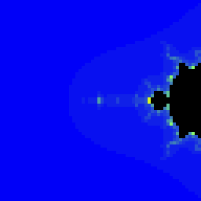 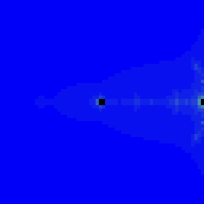 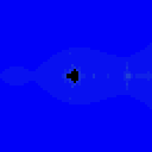 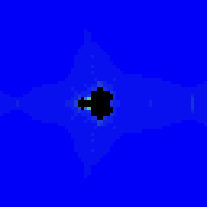 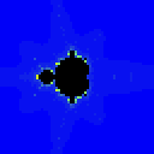

   On real cores — bsnes-jg mid-dive (a deeper level) and MAME at boot (level 0):

   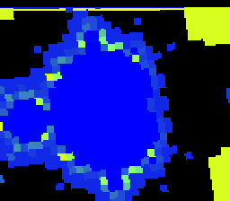 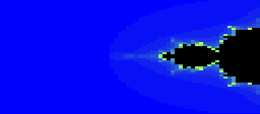

   **PASS.**
5. **No regression** — `mandel-interactive` (`0xF99C`, uses the refactored `mode7.h` `m7_tilemap_identity`) and
   `mandel-mode7` (`0x75E8`) re-run green; `k_mandel`/corpus untouched (no shared change). **PASS.**
   ```
   RESULT: PASS — interactive Mandelbrot: image hash 0xF99C host==default==+mos-a16; view-math host==target …
   RESULT: PASS — 128x128 Mandelbrot far-stored to high WRAM, Mode 7 + DMA on SNES; … host (CRC 0x75E8)
   ```
6. **Live play** — `task mandel-zoom-play` (build-if-needed + MAME window): hold R to dive into deeper detail,
   L to back out, Y/A rotate, Select palette, Start reset to level 0.

## Verification results (Phase 2, `PYR_MODE=hd` — multi-bank 128×128 × 8, 2026-06-25)

The default `dev/run.sh mandel-zoom` mode (`hd`) builds the full multi-bank pyramid; `PYR_MODE=sd` reruns the
Phase 1 single-bank build (still green — the same source parameterized).

1. **Builds + fits (256 KiB / 8 banks).** Both variants link `-verify` clean to 262,144 B, no overflow; the
   `.map` places `LEVEL_0` in bank 0 with the code and `LEVEL_1..7` bank-aligned at `$0N:8000`. **PASS.**
   ```
   [default] built 262144B, -verify clean, fit ok; corpus@$210 zoom_crc@$29 level_hash@$200 cur_level@$28 pad_log@$212
   [a16]     built 262144B, -verify clean, fit ok; corpus@$210 zoom_crc@$29 level_hash@$200 cur_level@$28 pad_log@$212
   ```
2. **Per-level image correctness — every level in every bank == host.** `ROMFILE` (host hashes each bank's
   level data in the .sfc), `SMOKE`/`HASH` (the near `LEVEL_0` on-console), and `VRAM` (the *displayed* chr
   after diving into a FAR bank, read back from VRAM) all assert against the host reference, both builds, both
   emulators. The `VRAM` gate is the multi-bank proof: the level on screen was DMA'd from a high ROM bank.
   **PASS.**
   ```
   [default] ROMFILE: PASS levels 1..7 data in their banks == host ref
   [default] SMOKE: PASS got=0xFAFA   HASH: PASS 1 on-console level   VRAM: PASS displayed level 3 chr hash=0x3737 == host
   [a16]     ROMFILE: PASS levels 1..7 data in their banks == host ref
   [a16]     SMOKE: PASS got=0xFAFA   HASH: PASS 1 on-console level   VRAM: PASS displayed level 3 chr hash=0x3737 == host
   SHOT: PASS corpus=0xFAFA (snapshot at frame 260)                                              (MAME, Xvfb)
   ```
3. **Zoom / level-swap differential — host == target both builds** (unchanged from Phase 1; `zoom.h` is
   bank-agnostic). **PASS.**
   ```
   [default] ZOOM: PASS frames=64 nonzero=64 swaps=3 zoom_crc=0xE91F (host replay == ROM, bsnes-jg)
   [a16]     ZOOM: PASS frames=64 nonzero=64 swaps=3 zoom_crc=0x7EF3 (host replay == ROM, bsnes-jg)
   RESULT: PASS — zoom pyramid [hd]: 128x128 x 8 levels across 8 banks (256K); … host==default==+mos-a16; MAME snapshot ok
   ```
4. **Increasing-detail screenshots (full resolution).** Host 128×128 per-level renders (the dive: whole set →
   down the antenna → the four-pointed star → the mini-Mandelbrot → its interior), then the on-emulator deep
   shot (bsnes-jg, palette-cycled, a deep far-bank level) and MAME at boot (level 0):

   level 0 → 2 → 4 → 5 → 6 → 7 (host `double` reference, 128×128 — the deepest is the mini-set's interior):

   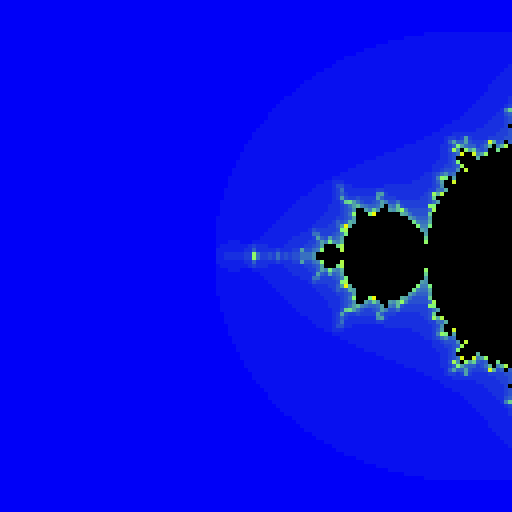 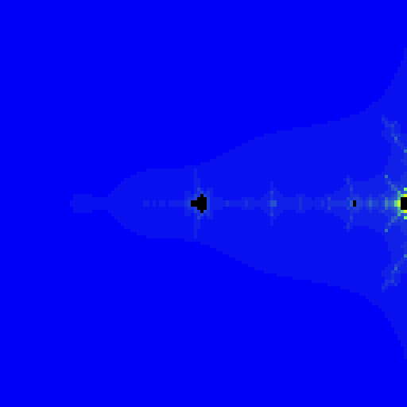   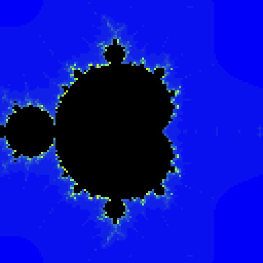 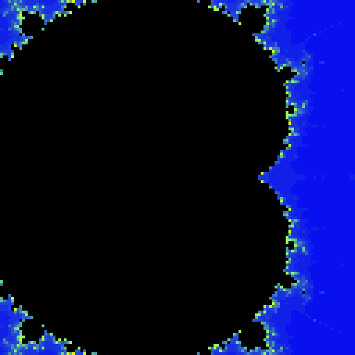

   On real cores — bsnes-jg mid-dive (a deep far-bank level, palette-cycled) and MAME at boot (level 0):

   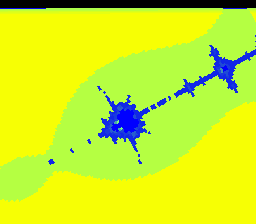 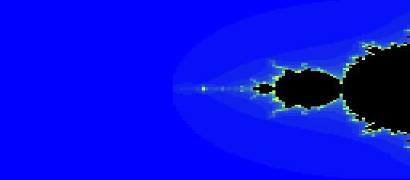

   **PASS.**
5. **No regression — `PYR_MODE=sd` still green** (the Phase 1 single-bank build, same source): 32,768 B, `HASH`
   all 6 levels on-console, `VRAM` + `ZOOM` pass both builds. **PASS.**

## Findings

**Finding 1 — a DEFAULT-8bit codegen MISCOMPILE the differential caught (pre-existing, narrow, independent of
#321 `+mos-a16`).** `zoom_fold`'s matrix fold, written as the natural loop `for (i<4) { fold((uint8_t)m[i]);
fold((uint8_t)((uint16_t)m[i]>>8)); }`, **miscompiles under the default 8-bit code generator** here: over a
fixed `R`-held input the default ROM folds `0x456E` while host == `+mos-a16` == `0xB115` (corroborated by three
independent computations — host `int=32`, native-16 `+mos-a16`, and the unrolled default). The semantically
identical **unrolled** form (`m[0]…m[3]` explicit) is correct on all three, so this is a genuine miscompile,
not UB. It is **context-sensitive**: a standalone minimal repro of the same loop does *not* trigger it (so it
needs the surrounding `zoom_step`/`zoom_matrix` register pressure), `view.h`'s byte-identical `view_fold` loop
is unaffected in its context, and the corpus/csmith fuzzers are green — i.e. a narrow regalloc-class defect in
the baseline 6502 path, **not** introduced by the a16 work. **Bisected** by folding components one at a time
with a ~10 s host-side rebuild loop (`jgxcheck` runs host-side), which isolated it to the matrix-fold *loop*.
Worked around by **unrolling** (`zoom.h`, with a comment) — faithful, still gates all four 16×16→32 multiplies,
demo stays green. Tracked as a follow-up (TODO + agent-handoff) for a cvise reduction → backend fix; this is
the kind of latent default-path miscompile the differential gate exists to surface.

**Finding 2 — Phase 2's multi-bank far-DMA works** (proven by the spike, then built): a DMA sources Mode 7 chr
from a high ROM bank via the far-symbol's `bank:addr16`. The #320 far machinery the plan flagged ("check for
reusable multi-bank pieces") provided them (far symbols, `R_MOS_ADDR24`). Notably this needed **no far
*pointer*** — a per-level bank *byte* + a 16-bit `addr16` reloc suffices for the DMA, so the multi-bank demo
builds **both** default-8bit and `+mos-a16` (the plan's hoped-for both-build held at full resolution).

**Finding 3 — the real Phase 2 surprise: a swap DMA must fit the vblank window (the VRAM gate caught it).**
VRAM is writable only during vblank or force-blank. A level swap re-DMAs the *whole* image's chr; a 128×128
level is **16 KiB**, larger than one NTSC vblank's DMA budget (~6 KiB), so a swap during active display is
**truncated mid-transfer** — only the in-vblank prefix lands, the rest is dropped. The VRAM-readback gate
exposed it precisely: the displayed "level 7" was `LEVEL_7[0..4727]` then stale older data, and it **differed
per build** (a tell that the content, not the codegen, was wrong). Confirmed the DMA itself is fine — a clean
16 KiB bank-7 DMA *at boot* (under the power-on force-blank) transfers 16384/16384. **Fix:** bracket a large
swap DMA in **force-blank** (`SWAP_NEEDS_FORCEBLANK = pixels > 6144`) — one blank frame, masked by the swap's
scale-reset pop. A 64×64 level (4 KiB) fits vblank and swaps seamlessly (no blank), which is partly why Phase
1 chose 64×64. (A future seamless 128×128 swap would split the chr DMA across ~3 vblanks — a deferred polish.)

**Finding 4 — "Y/A/R don't work" in MAME was a key-map confusion, not a bug; it exposed an untested input
path.** A live-play bug report. Root-caused empirically (inject the SNES R *field* via MAME Lua → `cur_level`
climbs to 7, so the ROM + `snes_read_pad1` read the controller fine). The cause: **MAME's default SNES P1
keys are non-obvious** — SNES R = MAME P1 BUTTON6 = keyboard **X**, SNES Y = BUTTON1 = **Left-Ctrl**, SNES A =
BUTTON3 = **Space** — so pressing keyboard Y/A/R does nothing. The differential never caught this because it
only drove input via bsnes-jg's `pollInput`; the **MAME controller path was untested** (the MAME leg only
snapshotted the boot screen). **Fixes:** (1) ship `dev/mame-snes-input.cfg` — a verified MAME remap binding
each SNES button to its matching keyboard letter (keyboard R→SNES R, Y→Y, A→A, L→L, S→Select, Enter→Start;
D-pad stays arrows), copied to the play tasks' cfg dir so the on-screen labels just work; (2) a new
**MAME live-input gate** (`dev/mandel-zoom-input.lua`): inject P1 R, assert `cur_level` advances — the
differential now exercises `snes_read_pad1` reading `$4016` under MAME, the same path the keyboard drives.

## Risks / notes
- **Multi-bank LoROM (Phase 2) is the main lift** — linker script + `rom_size_byte` + the far-symbol→DMA
  `bank:addr` plumbing. Phase 1 deliberately avoids it to prove value first. **Measure, don't assume:** check
  the existing #320 address-space/code-model work for reusable multi-bank pieces before writing linker script.
- **Precision is the host's job** — the SNES never computes, so deep levels (beyond Q5.10's reach) are fine;
  the bake just needs `double` (or higher) and a growing `N_k`.
- **Zoom is centered on the baked point; pan is within-level.** This is a "dive into THIS spot" demo, not
  free pan-with-detail. Bake 2–3 targets if multiple dive points are wanted (×ROM).
- **Swap hysteresis** — without a dead-band around the 2× threshold, holding zoom exactly at a boundary can
  thrash level swaps; use a band (e.g. swap up at `S0/2`, down at `S0`).
- **+mos-a16 vs default** — like `mandel-interactive`, the upload is DMA-from-ROM (no far *pointer* in the
  hot path; the far-*symbol* address for the DMA is a const), so it should build both; confirm and gate both.

## Merge-back checklist
- [x] ~~Phase 1 artifacts~~ (committed `a54041b` on `wt/321-mandel-zoom`): `tools/mandel-bake-pyramid.c`,
      `examples/snes/{mandel-zoom.c, zoom.h}` (+ gitignored `pyramid_image.h`), `dev/mandel-zoom.sh`,
      `mode7.h` (param `m7_tilemap_identity`), `dev/jgxcheck.cpp` (`JGX_ZOOM`), `dev/{run.sh,build.sh}` +
      `Taskfile.yml` wiring, `.gitignore`, screenshots, this plan.
- [x] ~~Phase 2 artifacts~~ (committed `6fb3d1b`): `platforms/snes-zoom/{link.ld,CMakeLists.txt}` (multi-bank
      256 KiB), `tools/snes-checksum.py` (128/256 KiB size byte), `tools/mandel-bake-pyramid.c` (multi-bank mode),
      `examples/snes/mandel-zoom.c` (per-level bank DMA + force-blank), `dev/jgxcheck.cpp` (VRAM gate),
      `dev/mandel-zoom.sh` (PYR_MODE hd/sd + ROM-file hash), `dev/run.sh` (PYR_MODE forward), the spike + HD
      screenshots. Both modes green; Finding 3 (vblank/force-blank) recorded.
- [x] ~~`TODO.md` entry + plan-index row.~~
- [x] ~~Finding 1 (default-8bit matrix-fold-loop miscompile) recorded~~ — `zoom.h` comment + TODO + agent-handoff.
- [ ] Merge `wt/321-mandel-zoom` → `main` (user-triggered / coordinate per policy).
