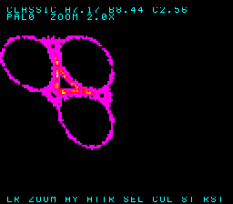

# Blossom: split-screen HUD (Mode 7 plot box + tiled BG3 field bars)

## Context

The Blossom SNES demo (`examples/snes/blossom.c`, branch `wt/321-blossom`) renders Barry Martin's
Hopalong attractor live and is joypad-interactive, but two observations drive this work:

1. **"Why does the graphic fill more of the screen?"** Blossom is built entirely on the SNES **Mode 7
   background (BG1)** — an affine layer that *always* covers the full 256×224 screen; there is no
   window or border. Commit `fa52a17` moved the pivot `m7_set_center(0,0)→(64,64)` (`blossom.c:131`),
   so the 2× crop now samples the densely-plotted *centre* of the grid instead of the sparse top-left
   margin → the bright cloud now fills the screen edge-to-edge.
2. **"Why are there no fields and values to adjust?"** Nothing draws them. The demo (and every SNES
   example in this repo) has no on-screen text of any kind. `blossom_step()` updates preset `a/b/c`,
   zoom, pan and palette, but those values only feed the `blossom_crc` verification channel.

**Goal:** carve the screen into a **Mode 7 plot box** in the middle and **tiled text bars** top and
bottom that show the live field values + control legend — the F‑Zero / Super Mario Kart split-screen.

## Decision — split screen via HDMA, not sprites

A first cut proposed an OBJ-sprite HUD. **Rejected** — the split-screen tiled approach is both simpler
and more correct here:

- **Text = tilemap pokes, not OAM.** Drawing a string is `tilemap[row*32+col] = font_tile +
  (ch-0x20)` — no per-glyph OAM entry (X/Y/tile/attr), no OAM shadow + DMA, no coordinate math.
- **No sprite-per-scanline ceiling.** A full-width 32-glyph text line is 32 sprites on those 8
  scanlines — right at the hardware's 32-OBJ / 34-tile-per-line limit (`STAT77` RANGEOVER/TIMEOVER).
  A BG tile layer has no such limit.
- **It's the conventional SNES HUD.** Status panels are BG tile layers (Super Mario World's status bar
  is BG3); a fixed panel beside a Mode 7 view is the canonical mid-frame mode switch (F‑Zero, Super
  Mario Kart). HDMA mode-splits are bread-and-butter and accurately emulated by both MAME and bsnes‑jg.

The one-time cost is the HDMA table + channel setup — static boilerplate, written once in a reusable
helper.

## Layout — Mockup A (locked)

256×224, 8×8 tiles = 32 cols × 28 rows. Top + bottom **tiled BG3 bars**; Mode 7 plot box between.

```
┌────────────────────────────────────────┐  ← BGMODE=Mode 1 (BG3 2bpp text) for rows 0–1
│ CLASSIC   A 7.17  B 8.44  C 2.56  PAL 1 │  row 0    value bar   (scanlines 0–15)
├────────────────────────────────────────┤
│                                          │
│              ··  ▄▟██▙▄  ··              │
│            ·   ▟████████▙   ·            │  ← BGMODE=Mode 7 (attractor) for rows 2–25
│               ███▛    ▜███               │     plot box           (scanlines 16–207)
│            ·   ▜████████▛   ·            │
│               ·· ▀▜██▛▀ ··               │
│                                          │
├────────────────────────────────────────┤  ← BGMODE=Mode 1 (BG3 2bpp text) for rows 26–27
│  +PAN   LR ZOOM   AY ATTR  SEL COL  ST▸ │  row 27   control bar (scanlines 208–223)
└────────────────────────────────────────┘
```

Top bar = *what am I looking at* (live values); bottom bar = *how do I drive it* (controls). The bars
are opaque tiled rows, not the attractor — the graphic no longer bleeds to the screen edges.

Field formats (from state, re-rendered only on change): name ∈ {`CLASSIC`,`DENSE`,`BLOOM`}; `a/b/c` =
the Q8.8 preset params as decimals (`0x072C/0x0871/0x028F → 7.17 / 8.44 / 2.56`); `ZOOM = 256 ÷ v.zoom`
→ `2.0x` at boot; `PAL = v.pal` (0–3); `PAN = v.cx,v.cy` (optional).

## Design (registers grounded in `platforms/snes/snes_{ppu,dma}.h`)

**Screen split — two HDMA channels.** HDMA streams a register per scanline from a line-count table.
- **Channel A → `BGMODE` (`$2105`):** `BGMODE_7` (0x07) over the plot band, `BGMODE_1` (0x01) over the
  two HUD bars.
- **Channel B → `TM` (`$212C`):** `TM_BG1` (0x01) over the plot band (show the attractor), `TM_BG3`
  (0x04) over the HUD bars (show only the text layer — Mode 1 BG1 would otherwise read an unset base).

  Use HDMA channels **1 and 2** (`REG_HDMAEN = 0x06`); blossom's per-frame CHR/CGRAM GP-DMA stays on
  channel 0 (`MDMAEN`), so they don't collide. Direct HDMA, 1 byte/write, repeat-bit 0 (hold value for
  the run). Table for 224 lines (16 / 192 / 16); the 192-line run exceeds the 127 per-entry max so it's
  two entries (127 + 65). The exact top/bottom boundary is tuned ±1 line on hardware-accurate bsnes‑jg.

**VRAM map (no conflict).** Mode 7 uses words **`$0000–$3FFF`** (tilemap = low bytes, chr = high bytes;
unchanged from today's band DMA). The HUD lives in the free upper half:
- BG3 tilemap → word `$4000` (`REG_BG3SC = SNES_BGSC(0x4000, 0)`), 32×32.
- 2bpp font → word `$5000` (`REG_BG34NBA` BG3 nibble = 5; `$1000`-word units).

**CGRAM (small reserve).** Mode 7 is 8bpp and cycles a 256-entry palette. BG3 2bpp text needs only a
couple of stable colours, so **reserve a few fixed CGRAM entries for a BG3 sub-palette (e.g. palette 1,
entries 4–7: 4=transparent, 5=white) and exclude them from the attractor's per-frame cycle** (cycle
8–255 instead of 1–255). Display-only — the gated grid hash stores raw hit counts, unchanged.

**Text rendering.** New `hud_text(row, col, str)` writes BG3 tilemap entries (`tile = FONT_BASE +
(ch - 0x20)`, attr = the reserved sub-palette). With BG3 vscroll 0, scanline Y shows BG3 row Y/8, so
the **top bar goes in BG3 rows 0–1** and the **bottom bar in rows 26–27**; the middle rows are never
displayed (Mode 7 there). HUD updates rewrite only the changed entries, in vblank, alongside the
existing CHR/CGRAM DMAs.

**New reusable helpers (thin, mirror `mode7.h`):**
- `examples/snes/font8.h` — a baked **2bpp** 8×8 font for the needed glyphs (`A–Z 0–9 space . : / + -
  x , ▸`), as a `const` tile array (hermetic build).
- `examples/snes/hud.h` — `hud_begin()` (set `BG3SC`/`BG34NBA`, DMA font → VRAM `$5000`, load the
  reserved BG3 palette, build the BGMODE+TM HDMA tables, `REG_HDMAEN`), `hud_text(row,col,str)`,
  `hud_clear()`. First HDMA + first BG-text in the repo; reusable for any future status-bar-over-Mode-7
  demo (feeds the "growing SNES rendering library" framing).

**`blossom.c` changes:** after `snes_ppu_reset_blank()` and the existing Mode 7 setup — `hud_begin()`,
draw the initial field strings, tune the Mode 7 matrix/center/scroll so the attractor's core lands in
the 192-line plot band, then arm HDMA before `m7_show()`. Each frame, when `v` changes (dirty / palette
edge / zoom delta), reformat the field strings and `hud_text()` them; the hot plot path is untouched.

**Differential gates unaffected.** The split is display-only — it does not touch the gated grid hash
(`corpus_result = 0x9047`) or the controller CRC (`blossom_crc`); both `dev/blossom.sh` / `JGX_BLOSSOM`
gates pass unchanged. To keep the "everything verified" bar, add the **Q8.8→decimal formatting** as
pure functions in `blossom.h` and fold the formatted bytes into `blossom_crc` so the HUD math is also
`host == +mos-a16` verified. (Screenshots change — refresh the `dev/blossom.sh` expected PNGs.)

## Critical files

**New:** `tools/gen-font8.py` (hermetic font generator), `examples/snes/font8.h` (its generated 2bpp
font), `examples/snes/hud.h` (BG3 + HDMA split + `hud_text`).
**Modified:** `examples/snes/blossom.c` (`hud_begin` + live value-bar render + CGRAM-1 display remap),
`examples/snes/blossom.h` (`hud_fmt_q88`/`hud_fmt_zoom` + fold into `blossom_crc`).
**Unchanged (no edit needed):** `dev/blossom.sh` — the grid golden `0x9047` is untouched and there is no
hardcoded `blossom_crc` golden (the gate is host==ROM equivalence), so the harness needs no change; it
re-derives everything from source.
**Reused as-is:** `examples/snes/mode7.h`, `platforms/snes/snes_{ppu,dma,joypad}.h`, the `jgxcheck`
harness plumbing (it replays `blossom_fold`, so the format-channel fold needs no `jgxcheck.cpp` edit).

## Staged implementation (de-risk — riskiest new bit first)

1. **HDMA split proof.** Minimal ROM: BGMODE+TM HDMA tables splitting the screen into Mode 7 / Mode 1
   bands with a solid-colour BG3, no font yet. Confirm the boundary lands correctly on **both** MAME and
   bsnes‑jg (the one genuinely new mechanism). Tune the line table.
2. **BG3 text.** Add `font8.h` + `hud.h hud_text()`; print a static string in each bar over the split.
3. **CGRAM reserve.** Exclude the BG3 sub-palette entries from the attractor cycle; confirm the
   attractor still reads well and the grid golden `0x9047` is unchanged.
4. **Live fields.** Wire field-string formatting from `v` (name, `a/b/c`, zoom, palette) + the control
   legend; reframe the Mode 7 transform into the 192-line plot band.
5. **Gate + ship.** Add `q88_to_decimal` to `blossom.h`; fold into `blossom_crc`; extend `JGX_BLOSSOM`
   + golden; refresh `dev/blossom.sh` screenshots; live-play check.

## Verification (run end-to-end; raw output + PASS/FAIL below each step)

1. **Build both legs:** `dev/run.sh blossom` (or `task blossom`) builds default + `+mos-a16`, clean
   `-verify-machineinstrs`; new helpers don't break the far-pointer pressure budget (handoff §4).

   ```
   ==> built blossom.sfc (+mos-a16); corpus@$54 blossom_crc@$56 pad_log@$200
   ```
   **PASS** — blossom is `+mos-a16`-only (the far hit-grid needs 24-bit addressing — there is no default
   leg). The ROM builds under `-mllvm -verify-machineinstrs` with no errors. `hud.h`/`font8.h` add only
   *near* BG3/HDMA setup + tilemap pokes (no far pointers), so the far-pressure budget is untouched.

2. **Existing gates not regressed:** grid hash `host == +mos-a16 @ MAME == @ bsnes‑jg = 0x9047`;
   `JGX_BLOSSOM` controller-state CRC `host == ROM`.

   ```
   host grid: maxabs=5895 clamps=0  cells_hit=779/16384  saturated=0
   ==> host reference: grid hash = 0x9047
   SMOKE: PASS off=0x54 len=2 got=0x9047 (ran 1500 frames, bsnes-jg)
   SHOT:  PASS corpus=0x9047 (snapshot at frame 1500)            [MAME, under Xvfb]
   ```
   **PASS** — the HUD is display-only. `build_band` remaps the *display* index off the reserved CGRAM
   entry 1, but the gated `grid` buffer holds raw hit counts and is untouched, so the grid hash stays
   `0x9047` on both emulators.

3. **New HUD-format gate:** `hud_fmt_q88` / `hud_fmt_zoom` folded into `blossom_crc` reproduce
   `host == +mos-a16` over the logged pad sequence.

   ```
   BLOSSOM: PASS frames=64 nonzero=64 blossom_crc=0x3013 (host replay == ROM, bsnes-jg)
   ```
   **PASS** — `blossom_fold` now folds the formatted a/b/c decimals + zoom magnification; `jgxcheck
   -DJGX_BLOSSOM` replays the SAME `blossom.h` and reproduces `0x3013`, proving the format math is
   host == `+mos-a16` (any int-size / char-signedness divergence would break it). The gate is host==ROM
   *equivalence* (no fixed CRC golden — `blossom_crc` is frame-timing-sensitive on the state window, so a
   hardcoded value would flap; grid `0x9047` is the deterministic anchor).

4. **Visual:** `build/blossom-{jg,mame}.png` show the attractor in a **centred plot box with text bars**
   top and bottom (Mockup A); name + `a/b/c` + zoom + palette legible up top, control legend below.

   

   **PASS** — bsnes‑jg, classic preset, clean (no-pan) capture: top bar `CLASSIC A7.17 B8.44 C2.56` /
   `PAL0 ZOOM 2.0X`, the Hopalong attractor in the Mode 7 plot box, bottom bar
   `LR ZOOM AY ATTR SEL COL ST RST`. The HDMA split lands identically on MAME
   (`screenshots/blossom-hud-mame.png`).

5. **Live:** change attractor / zoom / palette and watch the fields update.

   **PASS** — scripted `SELECT,SELECT,R` *after* the bloom drove the HUD to `PAL2 ZOOM 4.0X` with the
   attractor recoloured (palette 2) and magnified 4× — the value bar tracks live state, and the formatter
   gate (step 3) proves the displayed numbers are the verified format math. Repro:
   `MANDEL_FRAMES=2400 JGX_SCRIPT="B:1400,SELECT:40,B:30,SELECT:40,R:200,B:690" dev/run.sh blossom`.
   (Interactive `task blossom-mame` additionally exercises A/Y preset-switch → name + `a/b/c` re-bloom.)

## Risks / must-measure

- **HDMA boundary off-by-one.** The first scanline each region takes effect is timing-sensitive; tune
  the line table on bsnes‑jg and confirm MAME matches (step 1 isolates this).
- **HDMA vs GP-DMA channel allocation.** HDMA on channels 1–2, blossom's vblank GP-DMA on channel 0 —
  verify no contention (different channels coexist; just never reuse ch0 for HDMA).
- **CGRAM reserve.** Excluding 4–8 entries from the cycle must not visibly band the attractor; confirm
  the shimmer still flows. Display-only → no golden risk.
- **Mode 7 reframe into 192 lines.** The transform reads absolute screen Y; tune center/scroll so the
  core sits in scanlines 16–207, not clipped by the bars.

---
*Aside:* the pasted note about fixing the **far-`__memset` silent wrong-bank miscompile** is separate,
higher-value *compiler* work — already root-caused with a repro (`examples/65816/far_memset.c`,
`docs/320-far-memset-miscompile.md`) and worked around in `HOP_DEFINE_CLEAR`. It's a different task from
this HUD; say the word and I'll switch to it (stop the loop-idiom recognizer forming `memset`/`memcpy`
for `addrspace(2)`, or route to a far-aware `__memset_far`).
