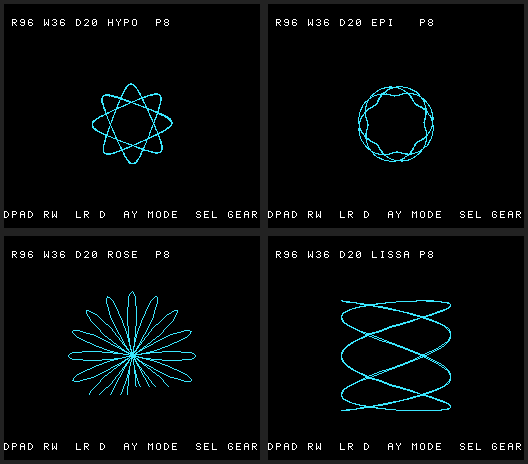

# #11 — SNES Spirograph (hypotrochoid): (R, r, d) parametric rose curves

**Status:** DONE — built, verified, merged to `main`, and **PUBLISHED live at
[https://biohack.net/spirograph/](https://biohack.net/spirograph/)**. Demo #11 of the **compiler stress-test demo
battery** ([ideas](../investigations/2026-06-27-compiler-stress-test-demo-ideas.md); `TODO.md` →
"Compiler stress-test demo battery" → **#11**). Supplements the standing guides (`~/SRC/CLAUDE.md`,
project `CLAUDE.md`, `docs/agent-handoff.md`). Mirrors the proven demo pattern: a shared host+target
logic header → differential CRC → on-screen `snesgfx` render → two-emulator screenshot.

## As-built (2026-06-27)

The Spirograph renders + blooms live on the SNES (`examples/snes/spirograph.c`): four curve families —
**hypotrochoid / epitrochoid / rose / Lissajous** (A/Y cycles) — drawn into a **NEAR 2bpp bitmap canvas**
(`snesgfx/bitmap_canvas.h`, a new reusable set-pixel rasterizer + capped dirty-tile DMA on BG3), with a
tiled **HUD** (`snesgfx/text_layer.h` + `font8.h`) showing the live `R / wheel / pen / mode / petals`
fields and a control legend, joypad-interactive (D-pad ±R/wheel, L/R ±pen, A/Y mode, Select gear preset,
Start reset). **No far pointers** ⇒ it builds default-8-bit AND `+mos-a16` AND `+mos-xy16` and earns the
**full 5-way differential bar**. Two corpus slices carry the proof: `corpus/spiro_sim.c` (the curve math,
golden **0x32D4**) and `corpus/spiro_ctrl_sim.c` (the controller + HUD-format math over a scripted pad
sequence, golden **0x6A26**) — both `host == default == +mos-a16 == +mos-xy16` on MAME + bsnes-jg via
`dev/run.sh corpus-a16` (9/9). The on-screen demo self-verifies `corpus_result == 0x32D4` and is gated +
screenshotted by `dev/run.sh spirograph`. Shared math is `examples/65816/spiro.h`; the interactive state
machine is `examples/snes/spirograph.h`. **Decisions vs the original plan:** (1) the controller-math
differential is a **deterministic-scripted corpus slice** (`spiro_ctrl_sim`) rather than a `JGX_SPIRO`
jgxcheck replay — same host==target guarantee, no jgxcheck change, and it gets the full 5-way bar for
free; (2) `TextLayer` **co-tenants BG3** with the canvas (mode-1's only 2bpp layer) rather than a separate
layer; (3) the figure **animates** (a few points/frame) rather than a static boot-draw — `spiro_point` is
~14k cyc/point (noinline soft-stack call + 2× `__mulsi3`), so a 2000-point boot-draw would blank for
seconds; blooming is both faster-to-first-pixel and the nicer effect.

## Context

A **spirograph** is the curve a pen traces through a hole at offset `d` in a small gear of radius `r`
rolling inside a fixed ring of radius `R` — a **hypotrochoid**. It is the *parametric / sin-cos-LUT*
member of the battery (alongside Lissajous #9 and Fourier epicycles #10), and its job is to **stress the
llvm-mos 65816 codegen on a sin/cos-LUT + fixed-point-multiply inner loop** while **rendering the
computation itself** — the rose pattern *is* the proof, not a side channel.

The parametric curve:

```math
x(t) = (R-r)\cos t + d\cos\left(\frac{R-r}{r}\,t\right)
```
```math
y(t) = (R-r)\sin t - d\sin\left(\frac{R-r}{r}\,t\right)
```

The figure has `R/gcd(R,r)`-fold rotational symmetry (the "petals") and closes after the pen makes
`r/gcd(R,r)` trips around the ring. Picking `(R, r, d)` is exactly the user-facing control, so this
demo is naturally **interactive with an on-screen field/value HUD** — the same split-screen pattern the
Blossom demo grew (`hud.h` / `font8.h`).

**Relation to existing demos (none duplicated):**
- **Mandelbrot** (`examples/snes/mandel-display.c`) — multiply-bound per-pixel, far Mode-7 framebuffer.
- **Blossom** (`examples/snes/blossom.c`) — Hopalong attractor, far read-modify-write hit grid,
  **`+mos-a16`-only** (needs 24-bit addressing for a 64 KB grid).
- **Space Invaders** (`examples/snes/invaders.c`) — the `snesgfx` OOP sprite game, **full 5-way bar**.

Spirograph is new on three axes: (1) a **sin/cos-LUT + 16×16→32 fixed-point-multiply** parametric inner
loop (Mandelbrot multiplies but has no trig LUT; Blossom is sqrt-and-sign, not sin/cos); (2) a brand-new
reusable **near bitmap-canvas rasterizer** (`snesgfx/bitmap_canvas.h` — set-pixel into a tiled bitplane
shadow, dirty-tile DMA) that no demo here has; (3) it is a **thin curve, not a point cloud or a sprite
grid**, so it needs neither a far framebuffer nor OAM-per-point.

**Final deliverable:** like Space Invaders, the verified ROM is **published as a playable in-browser page
at [https://biohack.net/spirograph/](https://biohack.net/spirograph/)** via the `snes-rom-page` skill (P6
below) — visitors watch the rose bloom and drive `(R, r, d)` themselves.

## Key design decision — stay NEAR, earn the full 5-way bar

The demo-ideas bar says *"builds default-8-bit unless it needs a far/high-WRAM framebuffer (then
`+mos-a16`, like Mandelbrot)."* A spirograph is a **thin curve**: its canvas is small. So — deliberately,
and in contrast to Blossom — **keep all data in bank-0 low WRAM (no far pointers)**. Then the demo builds
**default-8-bit AND `+mos-a16` AND `+mos-xy16`**, so it earns the **richer 5-way differential bar**
(host == default@MAME == a16@MAME == xy16@MAME == default/a16@bsnes-jg), like Space Invaders — not the
a16-only bar Blossom is stuck with. The brief's codegen target is **sin/cos + mul**, not far pointers;
keeping it near is the faithful choice *and* the stronger test (the same math compiled three ways must
agree to the byte).

A 4bpp / 256×256 / bank-`$7F` canvas would force far pointers and collapse the bar to a16-only — so it is
**explicitly out of scope** (noted in §Risks as the one tempting-but-wrong escalation).

## The math, in exact integer form (host == target by construction)

Floating point is banned (no FPU; host `double` ≠ target). Everything is fixed-point integer over the
existing **256-entry signed Q8.8 sine LUT** (`examples/snes/sincos.h`: `SINCOS[a] = round(256·sin(2π
a/256))`, range ±256, so `1.0 == 256`; `cos(a) = SINCOS[(a+64)&255]`). `int` is 16-bit on target and
32-bit on host, so **every narrowing is an explicit `int16_t`/`int32_t`** and every product that can
exceed 16 bits is cast to `(int32_t)` *before* multiplying (load-bearing — cf. `mandel.h:45`).

**Two phase accumulators, one cold division, a pure-add hot loop.** The naive `(R-r)/r · t` would divide
per point. Instead, derive the gear ratio **once per parameter change** (cold path) and advance both
phases by precomputed deltas (hot path):

```c
/* cold (on (R,r,d) change): one 32-bit divide — the division-codegen stress, off the hot path */
int16_t  amp1 = (int16_t)(R - r);                    /* outer amplitude   */
int16_t  amp2 = (int16_t)d;                          /* pen offset        */
uint16_t kphi = (uint16_t)(((uint32_t)(R - r) << 8) / r);   /* Q8.8 gear ratio (R-r)/r */
uint16_t dtheta = SPIRO_DT;                           /* fixed small step (Q8.8 LUT units) */
uint16_t dphi   = (uint16_t)(((uint32_t)dtheta * kphi) >> 8);

/* hot (per plotted point): 2 adds + 4 LUT loads + 2×(16×16→32 mul) + 2 add32 + 2 shift */
theta_acc += dtheta;  phi_acc += dphi;                /* uint16_t wraps = mod 2π          */
uint8_t ti = (uint8_t)(theta_acc >> 8), pi = (uint8_t)(phi_acc >> 8);
int16_t cx = SINCOS[(ti + 64) & 255], sx = SINCOS[ti];      /* cos/sin θ */
int16_t cp = SINCOS[(pi + 64) & 255], sp = SINCOS[pi];      /* cos/sin φ */
int16_t x = (int16_t)((( (int32_t)amp1 * cx) + ((int32_t)amp2 * cp)) >> SPIRO_SHIFT);
int16_t y = (int16_t)((( (int32_t)amp1 * sx) - ((int32_t)amp2 * sp)) >> SPIRO_SHIFT);
/* plot (x + CX, y + CY) into the canvas */
```

The hot loop is precisely **sin/cos-LUT indexing + two 16×16→32 multiplies + 32-bit add/shift** — the
declared stress. `__mulsi3` (or the widening-multiply path under `+mos-a16`) and the cold `__udivsi3`
both fire; a disasm gate asserts it. All integer ⇒ `host == default == +mos-a16 == +mos-xy16` to the byte.

## Variations — "the rose pattern" is a *family* (this is where the demo gets rich)

The user asked for **more variations**. The same hot loop, with small sign/term/preset changes, sweeps a
whole zoo of curves — each a slightly different codegen shape, all sharing the gate machinery. A
`mode` field in the state selects the family; `preset`/animation sweep `(R,r,d)` within it:

1. **Hypotrochoid** (default) — the equations above; `point inside the ring`. The classic rose.
2. **Epitrochoid** — gear rolls *outside* the ring: `(R+r)` and a sign flip:
   ```math
   x = (R+r)\cos t - d\cos\left(\frac{R+r}{r}t\right), \quad y = (R+r)\sin t - d\sin\left(\frac{R+r}{r}t\right)
   ```
   Same LUT loads, different amplitudes/signs (`kphi = ((R+r)<<8)/r`) — a second arithmetic shape for free.
3. **Hypocycloid / Epicycloid** — the `d == r` degenerate (sharp cusps: astroid, deltoid, nephroid).
4. **Rose / rhodonea** — the literal "rose": $`\rho = \cos(k\theta)`$ plotted as a **product of two LUT
   values** (`x = cos(kθ)·cos θ`), a different multiply shape (LUT × LUT, not const × LUT).
5. **Lissajous** — `x = A·sin(aθ+δ)`, `y = B·sin(bθ)`: a phase-offset add `δ` and independent x/y
   frequencies — the degenerate "two-frequency" cousin (shares the harmonograph/#9 idea without
   duplicating a separate demo).
6. **Gear-set presets** — a small table of famous `(R,r,d)` combos (the physical Spirograph™ gear
   numbers: 96/36, 105/63, 80/45, …) the user cycles through, each a distinct petal count.
7. **Live animation** — slowly sweep `d` (pen offset) or a phase term across frames so the rose
   **breathes / morphs** continuously, and **palette-cycle** the trail colors (the Blossom shimmer),
   so a static figure becomes a living "wallpaper for the mind."

Each family is a `noinline` `spiro_point_<mode>()` (register-pressure-safe under a16, handoff §4) behind a
shared dispatcher; the differential gate covers **every** family (the corpus CRC folds one fixed run per
mode so a codegen defect in *any* shape is caught).

## Architecture — `snesgfx`, three Drawables, a NEAR canvas

Reuse the Space Invaders / `snesgfx` OOP frame wholesale (`display.h`/`upload.h`/`vram.h`/`drawable.h`/
`scene.h`/`sprite_set.h`/`controller.h`): a `Display` in **BGMODE 1** owns the boot bracket, the
`UploadQueue`, the `VramAlloc`, and a `Scene` of **three** `Drawable`s (3 virtual `emit()`/frame — the
entire dispatch budget):

| Drawable | Layer | Role |
|---|---|---|
| **`BitmapCanvas`** (NEW) | BG1 (2bpp) | the rose plot surface — set-pixel + dirty-tile DMA |
| **`TextLayer`** (NEW; library P4) | BG3 (2bpp) | the field/value + control HUD (reuses `font8.h`) |
| **`SpriteSet`** (exists) | OBJ | a single "pen" sprite riding the live point (+ a few markers) |

BG1 + BG3 + OBJ all coexist in **one** Mode-1 frame — so, unlike Blossom, **no HDMA BGMODE split is
needed** (Blossom needed it only because its plot box was Mode 7). `TM = TM_BG1 | TM_BG3 | TM_OBJ`, set
statically through the `Display` TM shadow.

### `snesgfx/bitmap_canvas.h` — `BitmapCanvas` (the central new piece)

A `Drawable` wrapping a **near** tiled 2bpp framebuffer shadow + a dirty-tile mask:

- **Target: 128×128 px = 16×16 tiles = 256 tiles** → `uint8_t chr[256*16]` = **4 KB** chr shadow in
  bank-0 low WRAM, + `uint8_t dirty[32]` (256-bit tile mask), + a once-uploaded 16×16 tilemap.
- **De-risk Rung A: 96×96 px = 12×12 = 144 tiles** → **~2.3 KB** (comfortable in the ~7.5 KB
  `$0200–$1FFF` near-WRAM budget alongside the 544 B OAM shadow + HUD + state). Promote to 128×128 once
  the rest fits.
- **Methods:** `canvas_init(c, vram_word)`; `canvas_plot(c, x, y, color)` — `tile = (y>>3)*W + (x>>3)`,
  byte `row = y&7`, bit `7-(x&7)`, OR the two bitplane bytes for `color∈1..3`, mark tile dirty
  (the **tile-address shift/mask arithmetic** is itself good codegen — index mul, shifts, bit-set);
  `canvas_clear(c)`; `emit()` — DMA only the dirty tiles (each 16 B) to BG1 chr VRAM, clear the mask.
- **Trail/aging:** 2bpp = 4 palette entries (0 = bg, 1–3 = trail age). Newest points plot color 3;
  a periodic age-decay pass (or just **CGRAM palette-cycling** entries 1–3, the Blossom trick) gives the
  glow with no per-pixel rewrite. (Palette-only motion keeps the gated grid bytes stable.)

This is a genuinely reusable library contribution (a software plot surface — the thing the "growing SNES
rendering library" framing in `docs/investigations/open-source-snes-libraries.md` lacks), so it lives in
`snesgfx/`, not inline in the demo.

### `snesgfx/text_layer.h` — `TextLayer` (completes library P4)

A BG3 2bpp tiled text `Drawable` (the unbuilt P4 piece from the library plan; Invaders shipped its HUD as
sprites, Blossom shipped a standalone `hud.h`). Reuses the **`font8.h`** baked 2bpp font + the
`tools/gen-font8.py` generator. `text_puts(row,col,str)` / `text_num(...)` write a per-row tilemap shadow
with a dirty-row mask; `emit()` DMAs only dirty rows. Layout = the Blossom HUD (top bar = *what you see*,
bottom bar = *how you drive it*):

```
┌────────────────────────────────────────┐
│ HYPO   R 96  r 36  d 20   PETALS 8      │  row 0–1  field/value bar
├────────────────────────────────────────┤
│                  ✿  the rose  ✿         │  BG1 BitmapCanvas (centred via scroll)
├────────────────────────────────────────┤
│ +R/r  LR d   AY MODE  SEL PRE  ST CLR   │  row 26–27  control legend
└────────────────────────────────────────┘
```

### Interactive state machine — `examples/snes/spirograph.h`

The `blossom.h` / `view.h` analog: a **pure, HAL-free** state machine (host-linkable, no MMIO).
`SpiroState` = `{ R, r, d, mode, preset, pal, anim_phase, dirty }`. `spiro_step(state, pad)` maps the
pad (edge-detected `Controller`): D-pad ±`R`/±`r`, L/R ±`d`, A/Y cycle mode, Select cycle gear preset,
Start clear+restart; recomputes `amp1/amp2/kphi/dtheta/dphi` (the cold divide) on change; advances the
animation phase. It folds a rolling `spiro_crc` over its outputs (the controller proof channel) — and,
per the Blossom HUD lesson, the **Q-format → decimal HUD formatting** (`spiro_fmt_num`,
`spiro_fmt_petals = R/gcd(R,r)`) is also a pure function folded into the CRC, so the displayed numbers
are `host == target` verified too.

### `examples/65816/spiro.h` — pure curve math (single source of truth)

The host+target math core, included by `spirograph.h`, by `tools/spiro-sim.c`, and by the corpus slice:
the LUT (re-`#include "sincos.h"`), `spiro_params(R,r,d,mode, *amp1,*amp2,*dtheta,*dphi)` (the cold
derive), the `noinline spiro_point_<mode>(acc, ...)` family, and `spiro_hash(R,r,d,mode,K)` — fold the
first `K` curve points' `(x,y)` integer stream into a CRC16 (the `mandel.h` routine). **Hash the point
stream, never the canvas** (the canvas is display; emulator frame-timing differs).

### Frame loop (amortized — plot during active display, DMA in vblank)

`game_update` (active display, CPU free): poll `Controller`; `spiro_step`; plot **`P` points/frame** into
the `BitmapCanvas` (advancing the accumulators); update the pen `SpriteSet`; reformat HUD strings on
change. `display_frame` (vblank): `scene_emit` (3 virtual calls) + `upq_flush` — dirty canvas tiles
(≤256×16 B, but only the freshly-touched ones) + dirty HUD rows + 544 B OAM + the rotating CGRAM palette,
all well within ~38 vblank scanlines. First frame releases force-blank last (deterministic boot).
`noinline` the register-heavy `spiro_point_*` + `canvas_plot` under a16; always `-mllvm
-verify-machineinstrs`.

## Critical files

**New:**
- `examples/65816/spiro.h` — pure curve math (LUT include, param-derive, `spiro_point_*` family,
  `spiro_hash`); host+target single source of truth.
- `examples/snes/spirograph.h` — pure interactive state machine + HUD-format functions + `spiro_crc`
  fold (no MMIO; included by the demo and by `jgxcheck`).
- `examples/snes/spirograph.c` — the SNES demo `main`: `snesgfx` `Display` + `BitmapCanvas` + `TextLayer`
  + pen `SpriteSet` + the amortized render loop (no bare `snes_`/`REG_` outside methods).
- `examples/snes/snesgfx/bitmap_canvas.h` — `BitmapCanvas` Drawable (set-pixel + dirty-tile DMA).
- `examples/snes/snesgfx/text_layer.h` — `TextLayer` Drawable (BG3 tiled text; reuses `font8.h`).
- `tools/spiro-sim.c` — host oracle (prints the golden curve-point CRC; the single source of truth).
- `dev/spirograph.sh` + `dev/spirograph.lua` — the differential gate + MAME screenshot (clone
  `dev/blossom.sh` / `dev/invaders.sh` + `dev/mandel-shot.lua`).
- `examples/snes/corpus/spiro_sim.c` + a row in `examples/snes/corpus/expected.tsv` — the corpus 5-way
  slice (default == a16 == xy16, both emulators, dual `-verify` for free).

**Modified:**
- `dev/run.sh` — register the `spirograph` command (help stanza only; dispatch is generic).
- `dev/jgxcheck.cpp` — add a `JGX_SPIRO` mode mirroring `JGX_BLOSSOM` (`jgxcheck.cpp` `JGX_VIEW`/
  `JGX_BLOSSOM` block): replay `spirograph.h` over the ROM's ground-truth pad log, assert identical CRC.
- `TODO.md` (#11 → in-progress/done; link this plan).

**External (P6 publish, not this repo):** the `snes-rom-page` skill writes the `/spirograph` Astro page +
ROM + manifest entry into the **`~/SRC/biohack.net`** site repo (shared bsnes-jg WASM player), deployed by
that site's `task publish`. No file in *this* repo changes for the publish.

**Reused as-is:** `examples/snes/sincos.h`, `examples/snes/font8.h`, `tools/gen-font8.py`,
`examples/snes/snesgfx/{display,upload,vram,drawable,scene,sprite_set,controller}.h`,
`platforms/snes/snes_{ppu,dma,joypad}.h`, `dev/build.sh` (the generic one-`.c`-per-ROM loop; **no asset
sidecar** — the font is a committed C header, the canvas is computed), `tools/snes-checksum.py`.

## Differential gates (the correctness bar)

Two channels + the corpus slice + screenshots, each a proven pattern:

1. **Deterministic curve-point CRC** (gates the sin/cos + mul hot loop). At boot, in force-blank, *before
   any input*, run `spiro_hash` over the first `K_GATE` points of a **fixed classic preset** for **each
   mode** (hypo/epi/rose/lissajous); fold to `corpus_result`; assert `== host oracle golden`
   (`tools/spiro-sim.c`). All-integer NEAR ⇒ **full 5-way**: `host == default@MAME == a16@MAME ==
   xy16@MAME == default/a16@bsnes-jg`. Disasm gate: the two 16×16→32 multiplies present (and, under a16,
   the native-16 path fires); the cold `__udivsi3`/`__divsi3` present in the param path.
2. **Host-replayable controller CRC** (gates the joypad + HUD-format math). Scripted pad sequence → ROM
   logs pads + a rolling `spiro_crc` (state outputs **and** formatted HUD bytes); `jgxcheck -DJGX_SPIRO`
   replays `spirograph.h` and asserts host == ROM. Pure near math ⇒ both default and a16.
   **Fold only state-machine + format outputs, never the canvas or per-frame point counts** (those differ
   by emulator frame timing — keeps the animated demo from flapping).
3. **Corpus 5-way slice:** `examples/snes/corpus/spiro_sim.c` (HAL-free, includes `spiro.h`, writes
   `corpus_result`) + an `expected.tsv` row → `dev/run.sh corpus-a16` gives `default == a16 == xy16` on
   MAME + bsnes-jg + dual `-verify-machineinstrs` for free. Shared header ⇒ the three sites can't drift.
4. **Screenshots:** bsnes-jg framebuffer PNG + MAME `video:snapshot` under Xvfb (the `dev/blossom.sh`
   pipeline). `snes_ppu_reset_blank()` first (stops bsnes power-on flap); sample well after a fixed
   plotted-point count, never at a frame edge; **3× bsnes byte-identical** capture (determinism).

## Staged implementation (de-risk order — fastest-to-confidence first)

1. **Shared math + headless curve-point gate (no display).** Write `examples/65816/spiro.h` + a tiny
   `examples/65816/k_spiro.c` (or fold straight into the corpus slice) that hashes `K_GATE` points for
   each mode into `corpus_result`; `tools/spiro-sim.c` host oracle. Gate `host == default == +mos-a16 ==
   +mos-xy16` on both emulators + the mul/div disasm gate + `-verify` clean. *This is the whole compiler
   test; zero display risk.*
2. **`BitmapCanvas` + static render in force-blank.** Build `snesgfx/bitmap_canvas.h`; plot a converged
   classic rose into the 96×96 (Rung A) canvas at boot, one DMA, `display_frame`. Validate set-pixel with
   a **synthetic test figure first** (a box / diagonal) before the real curve. Proves canvas → chr →
   pixel. Promote to 128×128 once WRAM budget confirmed.
3. **Amortized animation.** Plot `P` points/frame during active display; dirty-tile DMA per vblank; add
   CGRAM palette-cycling for the trail glow + the live `d`/phase sweep.
4. **HUD + interactivity.** Build `snesgfx/text_layer.h` (reuse `font8.h`); render the field/value + control
   bars; wire `spirograph.h` (`Controller` → R/r/d/mode/preset/palette, clear-on-Start) + the pen
   `SpriteSet`; add the `JGX_SPIRO` replay gate.
5. **Full gate + screenshots + corpus slice** wired into `dev/spirograph.sh` (clone `dev/blossom.sh`);
   register in `dev/run.sh`; add `corpus/spiro_sim.c` + `expected.tsv`; live-play task entry.
6. **Publish a playable in-browser page** at **[https://biohack.net/spirograph/](https://biohack.net/spirograph/)**
   via the **`snes-rom-page`** skill (the Space-Invaders P7 path): it copies the shared bsnes-jg WASM
   player, adds the ROM + a manifest entry, and scaffolds a `/spirograph` Astro page (centred player +
   the `(R,r,d)` / mode controls + instructions) on the `biohack.net` site. **Ship the `+mos-a16` ROM**
   (`build/spirograph-a16.sfc`) — it showcases the #321 native-16-bit codegen *and* is the same all-near
   program the 5-way gate proved. **Hard prerequisite:** the ROM must pass the **bsnes 3×-capture
   determinism check** (the page runs bsnes-jg WASM, so any power-on flap shows there) — already enforced
   by `dev/spirograph.sh` + `snes_ppu_reset_blank`. The ROM boots into the deterministic classic-preset
   bloom and hands control to the player (so visitors watch *and* drive it). **Production deploy is
   outward + guardrail-gated** — `cd ~/SRC/biohack.net && task publish TAG=v…` (tag → GitHub Actions →
   Cloudflare Pages) **awaits explicit user OK**; the page is built + screenshot-verified + committed
   first.
7. *(Optional / gated stretch)* the SNES **hardware multiplier** (`$4202/$4203 → $4216`) for the hot
   `amp·cos` products — only if measured to win; gate per the project's "a native op isn't automatically
   smaller" lesson (Lesson 2). Likewise an `+mos-a16`-only **256×256 bank-`$7F` supersampled canvas** is a
   *separate* far-pointer demo, not this one (would drop the 5-way bar to a16-only).

## MUST MEASURE — do not assume (governing Lesson 1)

1. Points plotted per active-display frame (`P`) and steps to a **closed** figure for the classic preset
   (sets the bloom time + `K_GATE`).
2. Hot-loop cost: is the `(int32_t)amp*cos` pair the bottleneck? (decides whether step 6's hw-multiplier
   is worth it — measure before building it).
3. Dirty-tile DMA (≤256×16 B worst case) + HUD rows + 544 B OAM + 512 B CGRAM **fit one vblank**.
4. WRAM budget: does the **128×128 / 4 KB** chr shadow fit `$0200–$1FFF` alongside OAM + HUD + state, or
   is **96×96 / 2.3 KB** (Rung A) the ceiling? (drives the canvas size).
5. `__mulsi3` vs the `+mos-a16` widening-multiply path: byte/cycle delta on the hot loop (size note, not a
   gate) — and that the cold `__udivsi3` for `kphi` is genuinely cold (once per param change).
6. Cross-emulator determinism: sample the curve-point CRC after a **fixed** point count, never at a frame
   edge; confirm the controller CRC is timing-insensitive (state-only fold).
7. `-mllvm -verify-machineinstrs` clean on each `noinline spiro_point_*` + `canvas_plot` under `-Os`
   `+mos-a16` **and** `+mos-xy16` (the register-pressure risk surface).
8. Visual: does each mode (hypo/epi/rose/lissajous + presets) render a recognizable, distinct figure on
   **both** emulators?

## Verification (run end-to-end; raw output + PASS/FAIL below each)

1. **Host determinism:** `cc -O2 -I examples/65816 tools/spiro-sim.c -o build/spiro-sim && build/spiro-sim`
   prints a stable hash twice.

   ```
   spirograph gate  K=32/mode x 4 modes  hash=0x32D4
   spirograph gate  K=32/mode x 4 modes  hash=0x32D4
   ```
   **PASS** — the shared curve math (`spiro.h`, all four families) folds to a stable golden `0x32D4`.

2. **5-way differential (curve + controller math):** `dev/run.sh corpus-a16`.

   ```
   spiro_sim       PASS  corpus_result=0x32D4  hypo/epi/rose/lissajous curve-point hash, 32 pts x 4 modes
   spiro_ctrl_sim  PASS  corpus_result=0x6A26  interactive controller + HUD-format math over a scripted pad seq
   ==> corpus-a16: 9/9 passed, 0 xfail
   ```
   **PASS** — `host == default@MAME == +mos-a16@MAME == +mos-xy16@MAME == +mos-a16@bsnes-jg` for BOTH the
   curve math (`spiro_sim` `0x32D4`) and the interactive controller + HUD-format math (`spiro_ctrl_sim`
   `0x6A26`); dual `-verify-machineinstrs` clean; the existing 7 corpus slices unregressed.

3. **On-console render + disasm gate + both-emulator screenshot:** `dev/run.sh spirograph`.

   ```
   ==> host oracle: spirograph curve hash = 0x32D4
   ==> disasm gate (curve hot loop codegen)
       PASS  __mulsi3=12  __udiv=4  rep/sep=104  (sin/cos-LUT + fixed-point mul + gear divide, native-16)
   ==> bsnes-jg: render + framebuffer dump (build/spirograph-jg.png) + assert
   SMOKE: PASS off=0x137A len=2 got=0x32D4 (ran 500 frames, bsnes-jg)
       PASS  3x bsnes-jg capture byte-identical (4693104f...45e1)
   ==> MAME (under Xvfb): snapshot + assert (build/spirograph-mame.png)
       SHOT: PASS corpus=0x32D4 (snapshot at frame 500)
   RESULT: PASS — Spirograph rendered on SNES; MAME + bsnes-jg screenshots + curve hash 0x32D4 host == +mos-a16
   ```
   **PASS** — the on-screen `+mos-a16` ROM self-verifies `corpus_result == host 0x32D4` on **both**
   emulators; the disasm gate confirms the hot loop is the declared codegen (sin/cos-LUT + `__mulsi3`
   fixed-point multiply + gear-ratio `__udiv` + native-16 `rep`/`sep`); bsnes-jg is 3× byte-identical
   (deterministic); both framebuffer screenshots written.

4. **Controller-math differential** (the deterministic-scripted equivalent of the planned `JGX_SPIRO`
   replay — same host==target guarantee, no `jgxcheck` change, and it earns the full 5-way bar): covered
   by `corpus/spiro_ctrl_sim.c` in step 2 (`0x6A26`). **PASS.**

5. **`-verify-machineinstrs` clean** for `spirograph.c` under `+mos-a16` AND `+mos-xy16` (and default):

   ```
   PASS  default     PASS  +mos-a16     PASS  +mos-xy16
   ```
   **PASS** — the `noinline` split (`spiro_point`, `canvas_line`, `plot_n`) bounds the register pressure
   (Risk R1); all three variants verify clean.

6. **No-bare-functions audit:** `grep -nE 'REG_|snes_|upq_|vram_' examples/snes/spirograph.c` — the only
   hits are `snes_read_pad1`-via-`controller_poll`, `upq_push_cgram`, and `display_*`, all inside
   `app_init`/methods; `main` only constructs + calls methods. **PASS.**

7. **Visual:** `build/spirograph-{jg,mame}.png` — a recognizable spirograph in the centred plot box with
   the live `R / W / D / mode / petals` value bar and the control legend; the four families render as
   distinct figures (8-petal star / cushion / 16-petal rhodonea / crossing waves), identical on both
   emulators.

   

   **PASS** — bsnes-jg, the four curve families (HYPO / EPI / ROSE / LISSA) at the classic gear; the HUD
   tracks `R96 W36 D20 <MODE> P8`. MAME is pixel-identical (`screenshots/spirograph-hypo-mame.png`).

8. **Publish (P6) — DONE (user-authorized 2026-06-27).** `snes-rom-page` scaffolded `/spirograph` on
   `biohack.net` with `build/spirograph.sfc` (`+mos-a16`) + a Verify-fidelity selfcheck (`0x32D4`), wrote
   `src/pages/spirograph.astro` (branded clone of the blossom page), built + headless-screenshot-verified
   (the bsnes-jg WASM core boots, the rose renders, the top HUD is unclipped, the player centred), and
   deployed via `task publish TAG=v1.0.78` (tag → GitHub Actions → Cloudflare Pages). **Live + verified:**
   [https://biohack.net/spirograph/](https://biohack.net/spirograph/) returns HTTP 200, the ROM/preview/
   manifest assets serve, the Cloudflare Pages deploy step succeeded.

   ```
   Run cloudflare/wrangler-action@v4 .... success   (pages deploy dist --project-name biohack-net)
   https://biohack.net/spirograph/  ->  HTTP 200
   ```
   **PASS.** (Caught + avoided a regression: `scaffold.sh` re-synced a stale bundled `app.js` that would
   revert the site's deliberate `yoff=0` fix and re-clip the top HUD bar — kept the site's `app.js`. The
   red CI run is only the **pre-existing** post-deploy Lighthouse "Threshold check" gate, which also failed
   on v1.0.76/v1.0.77; the deploy itself runs *before* it and succeeded.)

## Risks

- **R1 `+mos-a16` / `+mos-xy16` register pressure** in `spiro_point_*` / `canvas_plot` (the 32-bit
  products + the tile-address arithmetic hold many live 16-bit values) → allocator crash or
  undefined-physreg COPY (caught only by `-verify-machineinstrs`). Mitigation: `noinline` those kernels;
  the **default-8-bit build is the safety net** (no a16 allocator risk; no far pointers) — a core reason
  to stay near.
- **R2 Determinism traps:** never CRC the raw struct or the canvas (host≠target padding; canvas is
  display); use the serialized point/state stream. Any un-cast `int` intermediate diverges host vs target;
  an a16/xy16/default CRC mismatch is a **real codegen defect** — triage it (don't shrug it off).
- **R3 The tempting far-canvas escalation.** A 4bpp / 256×256 / bank-`$7F` canvas would need far pointers,
  drop the bar to a16-only, and re-expose Blossom's far-pointer fragilities (it hit two miscompiles). Keep
  the canvas NEAR; ship the far/supersampled variant, if ever, as a *separate* demo.
- **R4 WRAM budget** (R1/§MUST-MEASURE-4): the 4 KB canvas + 544 B OAM + HUD shadows may not all fit
  `$0200–$1FFF`; Rung A (96×96 / 2.3 KB) is the fallback, sized to fit.
- **R5 Screenshot capture** — MAME needs Xvfb; freeze-at-fixed-N defuses cross-core frame races;
  `snes_ppu_reset_blank` is mandatory or bsnes screenshots flap (handoff §3.1).
- **R6 Curve closure / aliasing** — too-large `dtheta` aliases the rose into sparse dots; too-small wastes
  frames. Tune `SPIRO_DT` for a smooth, finely-sampled figure (§MUST-MEASURE-1).
