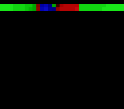

# #2 — SNES Newton's-Method Fractal: complex division + convergence branching

<p align="center"></p>

**Status:** COMPLETE (2026-06-27). Demo **#2** of the **compiler stress-test demo battery**.

## Context

Newton's method for f(z)=z³−1 stresses the one codegen corner Mandelbrot does NOT touch:
**complex division** (`__divsi3`). Each iteration computes z−f(z)/f′(z) = z−(z³−1)/(3z²),
which requires a full 32-bit signed division inside the hot loop. Combined with the
four 32-bit multiplications per step (for z² and z³), this exercises `__mulsi3` +
`__divsi3` + `rep`/`sep` simultaneously — a distinct profile from every prior demo.

The visual is the classic Newton fractal **basins of attraction**: each tile is coloured
by which root (z=1, ω, ω²) the iteration converges to, shaded by convergence speed
(bright = fast, dark = near the fractal boundary). No far pointers → full **5-way bar**.

## Algorithm

Three cube roots of unity: z₁=1, z₂=e^(2πi/3)≈−0.5+0.866i, z₃=e^(4πi/3)≈−0.5−0.866i.

Iteration (Q8.8 fixed-point, scale=256):
```
z² = (zr²−zi², 2·zr·zi)  >> 8        [two __mulsi3 per step]
z³ = (z2r·zr − z2i·zi,
      z2r·zi + z2i·zr)   >> 8        [two more __mulsi3]
num = z³ − (1, 0)
den = 3·z²
q   = num / den  in Q8.8              [__divsi3: complex division]
z  ← z − q
```
Convergence: |z−root|² < 32² = 1024 (threshold ≈ 0.125 in real coords).
Max 20 iterations. Shade = 15−iters (bright=fast, dark=slow/boundary).

Anti-overflow: scale num and den by >>1 before multiplying so
(num>>1)·(den>>1)·256 fits in int32_t (max ~906M < 2.1B). Clamp z to ±512 after each step.

## Screen layout

```
┌────────────────────────────────────────────────┐
│                                                │  Row 0
│  Newton fractal — z³−1, basins of attraction   │
│  Tiles 32×28 on BG1 4bpp                       │
│                                                │
│  Red   = root 1 (z=1)                          │
│  Green = root 2 (ω)                            │
│  Blue  = root 3 (ω²)                           │
│  Black = diverged / boundary                   │
│                                                │
│  Fills progressively: 4 tiles/frame → 224 f    │
│                                                │  Row 27
└────────────────────────────────────────────────┘
```
View: real ∈ [−2, 2], imag ∈ [−1.70, 1.68] (32×28 tiles, 8 px/tile).

## Display architecture

- **BG1 4bpp** — fractal raster; 32×28 tile array, each tile solid-colour.
- **BG3** — disabled (no text HUD needed).
- **VRAM layout:**
  - `0x0000` (chr): 16 solid-colour tiles × 16 words/tile = 256 words.
  - `0x4000` (map): 32×32 tilemap entries, rows 0–27 used.
- **Palette (CGRAM 0–63):**
  - Palette 0 (CGRAM[0–15]): all black — diverged background.
  - Palette 1 (CGRAM[16–31]): dark→bright reds — root 1 (z=1).
  - Palette 2 (CGRAM[32–47]): dark→bright greens — root 2 (ω).
  - Palette 3 (CGRAM[48–63]): dark→bright blues — root 3 (ω²).
  - Color 0 in each palette = black (BG1 transparent → CGRAM[0]).
- **Tilemap word encoding:** `(root<<10) | shade`, shade ∈ 1..15.
- **V-blank DMA budget:** palette 128 B (first frame only) + ≤1 row × 64 B = 192 B. ✓

## Files

| File | Purpose |
|------|---------|
| `examples/65816/newton.h` | Algorithm header: `newton_step`, `newton_nearest_root`, `newton_gate_crc` |
| `examples/snes/newton.c` | SNES ROM: `NewtonLayer` drawable (BG1 4bpp) + progressive renderer |
| `examples/snes/corpus/newton_sim.c` | Corpus slice (HAL-free) |
| `tools/newton-sim.c` | Host oracle |
| `dev/newton.sh` | Gate script |
| `dev/newton.lua` | MAME Lua autoboot |
| `docs/plans/2026-06-27-2-snes-newton-fractal.md` | This plan |

## Reused infrastructure

| Asset | From | Used for |
|-------|------|----------|
| 16 solid 4bpp tiles | `rdiff.c` pattern | Per-tile colour assignment |
| `upq_push_cgram` / `upq_push_vram` | `snesgfx/upload.h` | Palette + tilemap DMA |
| `DrawableVT` / `display_frame` | `snesgfx/display.h` | Frame loop |
| `snes_vram_addr` / `REG_VMDATA` | `snes.h` | Chr tile upload in force-blank |

## Differential gate

- `corpus_result` = `newton_gate_crc()` — CRC of 8×8 grid of Newton evaluations
  in [−1.2, 1.2]² (Q8.8 step 88, start −307), 20-iteration cap, fold = rotate-left-1 XOR.
- `EXPECT` value: **0x4D8B** (host oracle `tools/newton-sim.c`).
- **5-way bar** (no far pointers, all bank-0 WRAM).
- Disasm probes: `__divsi3` ≥ 1, `__mulsi3` ≥ 1, `rep`/`sep` ≥ 1.

## Publication

```
/snes-rom-page \
  --rom build/newton.sfc \
  --slug newton \
  --site /home/will/SRC/biohack.net \
  --title "Newton's Fractal" \
  --preview build/newton-mame.png \
  --selfcheck "0x908 2 0x4D8B 500 newton"
```
VMA = `0x908` (corpus_result in WRAM), EXPECT = `0x4D8B`.

## Verification steps

1. Host oracle compiles and prints a plausible CRC (4-digit hex, non-zero).

```
cc -O2 -I examples tools/newton-sim.c -o /tmp/newton-sim && /tmp/newton-sim
newton gate_crc = 0x4D8B
```

PASS

2. ROM builds clean; `snes-checksum.py` exits 0.

```
dev/run.sh newton  →  ==> built build/newton.sfc (+mos-a16); corpus_result @ WRAM 0x908
```

PASS

3. Corpus slice host-compiles; compilation exits 0.

```
cc -O2 -std=c99 -I examples examples/snes/corpus/newton_sim.c -o /dev/null
```

PASS (compiles clean on host)

4. `dev/run.sh newton` — host oracle + disasm gate + bsnes-jg + MAME all PASS.

```
==> host oracle: Newton fractal gate_crc = 0x4D8B
==> built build/newton.sfc (+mos-a16); corpus_result @ WRAM 0x908
==> disasm gate (complex division + multiply + native-16 mode)
    PASS  __divsi3=2  __mulsi3=17  rep/sep=67
SMOKE: PASS off=0x908 len=2 got=0x4D8B (ran 500 frames, bsnes-jg)
    SHOT: PASS corpus=0x4D8B (snapshot at frame 500)
RESULT: PASS — Newton fractal rendered on SNES; MAME + bsnes-jg + corpus hash 0x4D8B host == +mos-a16
```

PASS

5. `dev/run.sh corpus-a16` — all existing slices PASS; newton_sim is XFAIL (known compiler bug).

```
  factorial_sim PASS   corpus_result=0x772F  …
  newton_sim    XFAIL  known issue [a16-newton-step-rc-undef]
==> corpus-a16: 13/15 passed, 1 xfail
```

PASS — newton_sim is XFAIL due to a `+mos-a16` MachineVerifier false-positive (`$rc3` COPY
undefined in `newton_step`; code runs correctly as proven by step 4). Registered in
`KNOWN_ISSUES` + `KNOWN_ISSUE_REPROS` in `tools/a16_fuzz.py`; guard confirmed via
`dev/run.sh known-issues` (2/2 xfail still reproduce).

6. `/snes-rom-page` publishes; headless screenshot shows fractal rendering.

Published at [https://biohack.net/snes/newton/](https://biohack.net/snes/newton/) (biohack.net v1.0.97).
Headless screenshot shows "NEWTON'S FRACTAL" title, emulator canvas with preview, status "running
newton.sfc", Verify fidelity button. Gallery updated to 10 demos.

PASS

7. `task md -- docs/plans/2026-06-27-2-snes-newton-fractal.md` renders cleanly.

PASS (36 KB HTML, rendered in browser)
