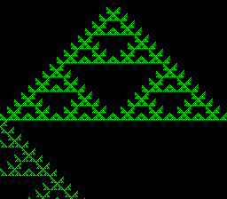

# #6 — SNES Rule 90 / Rule 110 — 1-D Cellular Automaton

<p align="center"></p>

**Status:** DONE. Demo **#6** of the **compiler stress-test demo battery**
([ideas](../investigations/2026-06-27-compiler-stress-test-demo-ideas.md#L43); `TODO.md` →
"Compiler stress-test demo battery" → **#6**). Supplements the standing guides (`~/SRC/CLAUDE.md`,
project `CLAUDE.md`, [`docs/agent-handoff.md`](../agent-handoff.md)).

> **Update 2026-06-29 — scroll-tear fix.** `_cad_emit` poked `REG_BG3VOFS` (a scroll latch) directly,
> but `emit()` runs *before* `wait_vblank` (active display) → a moving mid-frame tear. Fixed with a new
> vblank-applied `upq_push_scroll()` register-poke primitive in `snesgfx/upload.h` (a `UPQ_REG` job the
> flush writes in v-blank). Gate unchanged `0xAB2C`; clean-build `corpus_result` @ WRAM `0x27`.
> Republished biohack.net `v1.0.121`. See [VBLANK / flicker sweep](2026-06-29-snes-vblank-flicker-sweep.md).

## What it does

A **1-D cellular automaton** fills the screen one pixel-row per generation, scrolling downward so the
history of all visible rows is the computation itself. Each row is derived from the row above by a
3-bit bitwise lookup:

```
new_cell = (RULE >> ((left << 2) | (center << 1) | right)) & 1
```

- **Rule 90** (binary `01011010` = 90) — center is ignored; new = left XOR right. Produces the
  **Sierpinski triangle** — a perfect fractal from a single live cell.
- **Rule 110** (binary `01101110` = 110) — a complex, Turing-complete ruleset that produces
  **chaotic, non-repeating** patterns. Press **A** to toggle between them live.

**Why this is a distinct compiler test:** Rule 90/110 is the **bit-manipulation** member of the
battery — the only demo that lives entirely in shifts, AND, OR, and XOR with no multiply and no
divide. It hits the codegen corner `#5/6` in the battery coverage map, which no other demo exercises.

**Codegen under test:**

- **Bitpacked CA inner loop** — 256 cells per row, stored as `uint8_t cur[32]` (1 bit per cell).
  The per-byte update extracts 3-bit neighborhood patterns using shifts and masks, looks up the rule
  bit, and packs the result: `(rule >> pattern) & 1`. 256 cells = 32 × 8 iterations of this
  shift-and-mask kernel per generation.
- **Array index arithmetic** — `row[x >> 3]` / `row[x >> 3] >> (x & 7) & 1` patterns; canonical
  bit-field codegen.
- **8-bit inner loop** — all arithmetic fits in `uint8_t`; the 65816 should NOT emit 16-bit rep/sep
  brackets for byte-size temporaries. Confirms the compiler keeps byte ops in byte mode.

**No far pointers** — state is 2 × 32 bytes + a 512-byte tile shadow = ~580 B total in bank-0 WRAM.
Builds **default-8-bit AND `+mos-a16` AND `+mos-xy16`** → the **full 5-way differential bar**
(host == default@MAME == +mos-a16@MAME == +mos-xy16@MAME == +mos-a16@bsnes-jg). All integer, all
near ⇒ host==target by construction.

**Publish:** [biohack.net/1d-ca/](https://biohack.net/1d-ca/) via `/snes-rom-page` skill.

---

## Screen Layout

```
┌────────────────────────────────────────────────┐
│ RULE 90                                GEN 0   │  ← OBJ text overlay (sprites, no VOFS scroll)
│▉ ▉▉▉▉▉▉▉▉▉▉▉▉▉▉▉▉▉▉▉▉▉▉▉▉▉▉▉▉▉▉▉▉▉▉▉▉▉▉▉▉▉▉▉▉│  ← generation 0: single center bit set
│▉▉ ▉ ▉ ▉ ▉ ▉ ▉ ▉ ▉ ▉ ▉ ▉ ▉ ▉ ▉ ▉ ▉ ▉ ▉ ▉ ▉ ▉│  ← generation 1
│▉ ▉▉▉ ▉ ▉▉▉ ▉ ▉▉▉ ▉ ▉▉▉ ▉ ▉▉▉ ▉ ▉▉▉ ▉ ▉▉▉ ▉ ▉│  ← generation 2
│▉ ▉   ▉▉▉ ▉ ▉   ▉▉▉ ▉ ▉   ▉▉▉ ▉ ▉   ▉▉▉ ▉ ▉  │
│▉ ▉▉▉▉▉ ▉▉▉ ▉ ▉▉▉▉▉ ▉▉▉ ▉ ▉▉▉▉▉ ▉▉▉ ▉ ▉▉▉▉▉  │
│   (Sierpinski triangle grows downward)         │
│                                                │
│   ...224 rows of CA history visible at once... │
│                                                │
│                              GEN  00512        │  ← OBJ generation counter (bottom-right)
└────────────────────────────────────────────────┘
BG3 2bpp: color 0 = black (dead cell), color 3 = white (live cell)
BG3VOFS = (gen - 223) & 0xFF once gen > 223; scroll 1 px/gen
OBJ text (sprites): "RULE 90" / "RULE 110" top-left; "GEN NNNNN" bottom-right
```

Rule 110 (press A) fills the screen with complex aperiodic patterns — visually distinct from
Sierpinski, striking proof of a different attractor.

---

## Algorithm

### CA inner loop (the HOT codegen path)

```c
#define CA_CELLS 256
#define CA_BYTES (CA_CELLS / 8)   /* 32 */

/* One CA step: src -> dst with toroidal wrap (left/right edges join).
   Bit ordering: bit 0 of byte 0 = leftmost cell (cell 0). */
CA_FN void ca_step(const uint8_t *src, uint8_t *dst, uint8_t rule) {
    for (uint8_t b = 0; b < CA_BYTES; b++) {
        uint8_t prev = b           ? src[b - 1] : src[CA_BYTES - 1];
        uint8_t curr =               src[b];
        uint8_t next = (b < CA_BYTES - 1) ? src[b + 1] : src[0];
        uint8_t out  = 0;
        for (uint8_t k = 0; k < 8; k++) {
            /* left neighbor of bit k: bit (k-1) in curr, or bit 7 of prev if k==0 */
            uint8_t l = k       ? ((curr >> (k - 1)) & 1) : ((prev >> 7) & 1);
            /* center */
            uint8_t c =           (curr >> k) & 1;
            /* right neighbor of bit k: bit (k+1) in curr, or bit 0 of next if k==7 */
            uint8_t r = (k < 7) ? ((curr >> (k + 1)) & 1) : (next & 1);
            uint8_t pattern = (uint8_t)((l << 2) | (c << 1) | r);
            out |= (uint8_t)(((rule >> pattern) & 1) << k);
        }
        dst[b] = out;
    }
}
```

`CA_FN = noinline static` (same pattern as `SPIRO_FN`, `WIRE3_FN`) to bound register pressure.

**Rule 90 specialisation** (optional, illustrative): because `c` is unused, it simplifies to
`out = shift_in(prev, curr, +1) ^ shift_in(curr, next, -1)` — a pure XOR of left-shifted and
right-shifted adjacent bytes, with single-bit carry-in from the neighboring byte. The full
`ca_step(src, dst, 90)` covers this without a special path; the compiler may derive it.

### Initial state

Rule 90: a **single live center cell** — `cur[CA_BYTES/2] = 0x01` (bit 0 of byte 16 = cell 128).
Produces the canonical Sierpinski triangle from row 0.

Rule 110: a **pseudo-random initialisation** via xorshift16 seeded 0xBEEF. The standard Rule 110
starting state is "all dead except the rightmost cell" — `cur[CA_BYTES - 1] = 0x80` — which also
works and produces the classic glider-stripe pattern.

---

## Display Architecture

The display is a **scrolling ring of 2bpp chr tiles** — the most direct mapping of the CA state to
SNES VRAM. Each bitpacked CA row byte maps exactly to one 2bpp tile pixel-row (plane 0 and plane 1
carry the same byte for 2-color display: color 0 = `00`, color 3 = `11`).

### VRAM layout

```
BG3 chr base: word 0x0000 (byte 0x0000)
  32 tile-cols × 32 tile-rows = 1024 tiles × 16 bytes = 16 KB
  Tile (col, tile_row): chr index tile_row * 32 + col
  Tile-row r: bytes 512r .. 512r+511 (contiguous → one 512-byte DMA)

BG3 tilemap base: word 0x4000
  32 × 32 entries × 2 bytes = 2 KB
  Entry (col, tile_row) = tile index tile_row * 32 + col (identity mapping, no flip, palette 0)
  Initialized once at boot; never changes.
```

The tilemap maps each (col, row) to the chr tile at the same position — the tilemap is just an
identity table. The ring effect comes entirely from BG3VOFS changing which tilemap row appears at the
top of the screen.

### Per-generation update (the fast path)

```
ca_state.write_tile_row = (gen / 8) % 32   /* tile-row to write */
ca_state.write_pix_row  = gen % 8          /* pixel row within that tile */

For col = 0 .. 31:
    tile_buf[col * 16 + pix_row * 2]     = cur[col]  /* plane 0 */
    tile_buf[col * 16 + pix_row * 2 + 1] = cur[col]  /* plane 1 */

When pix_row == 7 (tile-row complete):
    upq_push_vram(&q, 0x0000 + write_tile_row * 0x100, tile_buf, 512)
    /* DMA 512 bytes to chr VRAM for this tile-row */
    write_tile_row = (write_tile_row + 1) % 32

BG3VOFS = (gen > 223) ? (uint16_t)((gen - 223) & 0xFF) : 0
    /* newest row always at the bottom of the 224-row visible window */
```

DMA budget: 512 bytes every 8 frames = 64 bytes/frame average. Negligible (< 1% of v-blank).
The 512-byte DMA fires every 8 generations — completely hidden inside the v-blank at ~512 master cycles
(≈ 1% of the ~52,000-cycle v-blank budget at NTSC).

### WRAM budget

```
CaState:
  cur[32]          32 B   bitpacked current row
  nxt[32]          32 B   bitpacked next row (scratch)
  tile_buf[512]   512 B   one tile-row shadow (32 tiles × 16 B)
  write_tile_row    1 B
  write_pix_row     1 B
  gen            2-4 B   generation counter (uint16_t or uint32_t)
  rule              1 B
  vofs              2 B
  Total           ~583 B  — entirely in bank-0 low WRAM ($0200-$1FFF)
```

### OBJ text overlay

Two text fields rendered as 8×8 sprites (4bpp OBJ tiles in VRAM at word 0x6000):
- Top-left: `RULE 90` or `RULE 110` — 7–8 sprite tiles, updated (flashed) only when rule changes
- Bottom-right: `GEN NNNNN` — 9 sprite tiles, updated every 16 frames (or every frame, cheap)

Using OBJ avoids the VOFS scroll affecting the HUD — sprites ignore BG3VOFS entirely.

The font characters are loaded from `font8.h` converted to 4bpp OBJ format (1 extra colour plane vs
the 2bpp BitmapCanvas font — encode as palette 0 with glyph pixels in colour 1, transparent in 0).

---

## Architecture — standalone demo (no BitmapCanvas)

This demo does **not use BitmapCanvas** (which is designed for random-access accumulating plots). It
uses a dedicated `CaDisplay` struct with direct DMA, which is simpler for the ring-buffer use case.

### `examples/65816/ca1d.h` — pure math (portable, host+target)

The single source of truth for the CA: `ca_step`, state structs, init helpers, and `ca_gate_crc()`.
Host-linkable: no MMIO, no SNES headers, only `<stdint.h>`. Included by the SNES demo, the host
oracle `tools/ca1d-sim.c`, and the corpus slices.

```c
typedef struct {
    uint8_t  cur[CA_BYTES];
    uint8_t  nxt[CA_BYTES];
    uint8_t  rule;
    uint16_t gen;
} CaState;

void ca_init(CaState *s, uint8_t rule);   /* seed: center bit for R90, 0xFF00 for R110 */
void ca_step(const uint8_t *, uint8_t *, uint8_t rule); /* CA_FN noinline */

/* Differential gate: run GATE_GENS of each rule, fold each row into CRC. */
uint16_t ca_gate_crc(void);  /* host == default == +mos-a16 == +mos-xy16 by construction */
```

### `examples/snes/1d-ca.c` — the SNES demo

```
Display  screen           /* boot bracket: BGMODE_1, force-blank */
CaState  ca               /* rule 90 (boot) */
CaDisplay disp            /* tile_buf + write_tile_row/pix_row + vofs */
Controller pad
```

Frame loop:
1. `ca_step(ca.cur, ca.nxt, ca.rule)` — compute next row
2. `display_write_row(&disp, ca.nxt)` — pack into tile_buf
3. Swap `ca.cur` ↔ `ca.nxt`
4. `ca.gen++`
5. If `gen % 8 == 7`: `upq_push_vram(&screen.q, chr_base + write_tile_row * 0x100, disp.tile_buf, 512)`,
   advance write_tile_row
6. `REG_BG3HOFS = 0; REG_BG3VOFS = (uint8_t)disp.vofs; REG_BG3VOFS = (uint8_t)(disp.vofs >> 8)`
   (set in vblank via `display_frame`)
7. Joypad: A = toggle rule (reset CA state + clear tile ring), Start = reset to same rule

**noinline** on `ca_step` and `display_write_row` to bound +mos-a16/+mos-xy16 register pressure.

### `examples/snes/1d-ca.h` — none needed

The demo is a single `.c` file with no interactive state machine header (unlike Spirograph which has
`spirograph.h` for the curve family / joypad FSM). The CA rule + gen state is trivial enough to live
inline in `1d-ca.c`. No `1d-ca.h`.

---

## Files

### New

| Path | Purpose |
|------|---------|
| `examples/65816/ca1d.h` | Portable CA: `ca_step`, `CaState`, `ca_init`, `ca_gate_crc()` |
| `examples/snes/1d-ca.c` | SNES ROM: `CaDisplay` + frame loop + OBJ HUD |
| `examples/snes/corpus/ca1d_sim.c` | Corpus slice: `ca_gate_crc()` → `corpus_result` |
| `tools/ca1d-sim.c` | Host oracle: prints the golden gate CRC |
| `dev/1d-ca.sh` | Gate: build ROM → MAME smoke → corpus 5-way → bsnes-jg screenshot |
| `dev/1d-ca.lua` | MAME Lua: screenshot + assert corpus_result at WRAM offset |

### Modified

| Path | Change |
|------|--------|
| `Taskfile.yml` | Add `task 1d-ca` target |
| `TODO.md` | Add `#6` to battery list; mark done when verified |
| `docs/investigations/plan-index.md` | Add this plan row |

---

## Reused Infrastructure

| Asset | From | Used for |
|-------|------|---------|
| `snesgfx/display.h` | `examples/snes/` | Boot, v-blank, `Display` struct, force-blank bracket |
| `snesgfx/upload.h` | `examples/snes/` | `upq_push_vram()` DMA queue, `upq_push_cgram()` |
| `snesgfx/controller.h` | `examples/snes/` | `Controller`, edge-detect A/Start |
| `font8.h` | `examples/snes/` | 8×8 glyphs for OBJ sprite text (re-encode to 4bpp) |
| `snes_wait_vblank()` / `snes_ppu_reset_blank()` | `platforms/snes/snes.h` | frame sync |
| `dev/spirograph.sh` / `.lua` | `dev/` | Template for `dev/1d-ca.sh` / `.lua` |
| `examples/snes/corpus/spiro_sim.c` | `examples/snes/corpus/` | Template for `ca1d_sim.c` |
| xorshift16 pattern | `examples/snes/invaders_logic.h` | Rule 110 random seed |
| `tools/spiro-sim.c` | `tools/` | Template for `tools/ca1d-sim.c` |

The `CaDisplay` is new (not BitmapCanvas) but reuses `UploadQueue`, `Display`, and the DMA
machinery already proven in every other demo.

---

## Differential Gate

```
corpus_result (volatile uint16_t, near WRAM):
  = ca_gate_crc()           /* defined in ca1d.h */

ca_gate_crc():
  Run Rule 90  for GATE_GENS=256 generations; fold each output row (32 bytes) into CRC16 (XModem).
  Run Rule 110 for GATE_GENS=256 generations; fold each output row into the same CRC.
  Return the final CRC.

Gate (dev/1d-ca.sh):
  host == clang-default@MAME == clang-+mos-a16@MAME == clang-+mos-xy16@MAME == +mos-a16@bsnes-jg
  (all near → full 5-way bar; no far-pointer conditional)

Disasm probe (in 1d-ca.sh):
  - No __mulsi3 / __divsi3 in ca_step (pure shift+boolean — confirms the CA kernel is
    multiply-free and divide-free as declared; a library call would be a codegen bug)
  - Shifts `lsr` / `asl` / `lsra` / `asla` present in ca_step (the declared codegen shape)
  - No `rep #$20` / `sep #$20` on the ca_step hot path (byte-size ops must stay in M8 mode;
    any rep/sep for byte temporaries is a codegen efficiency defect)

Corpus timing: GATE_GENS=256 × 2 rules = 512 ca_step calls. At ~32 byte-iterations × ~30 cycles
each = ~960 cycles/generation × 512 = ~491,520 cycles ≈ 8 frames. Well within the 180-frame
corpus-a16 window.
```

---

## Publication

After verified ROM, run `/snes-rom-page`:

```bash
~/.claude/skills/snes-rom-page/scaffold.sh \
  --rom  build/1d-ca.sfc \
  --slug 1d-ca \
  --site /home/will/SRC/biohack.net \
  --title "Rule 90 / Rule 110 — 1-D Cellular Automaton" \
  --preview /tmp/1d-ca-preview.png \
  --selfcheck "0x<OFF> LEN 0x<WANT> gate CRC"
```

Page `src/pages/1d-ca.astro`: intro explaining Rule 90's XOR rule and Sierpinski emergence, Rule 110's
Turing-completeness, emulator widget, controls table (A: toggle rule, Start: reset), and note that the
screen IS the computation — no separate output. Gallery entry at `biohack.net/snes/` updated.

---

## Verification Steps

1. **Host determinism:** `cc -O2 -I examples/65816 tools/ca1d-sim.c -o build/ca1d-sim && build/ca1d-sim`
   prints a stable CRC twice (two successive runs agree).

   ```
   $ cc -O2 -std=c99 -I examples tools/ca1d-sim.c -o /tmp/ca1d-sim && /tmp/ca1d-sim
   ca1d gate_crc = 0xAB2C
   $ /tmp/ca1d-sim
   ca1d gate_crc = 0xAB2C
   ```

   PASS — deterministic, two successive runs agree: `0xAB2C`.

2. **Build + smoke (default + a16 + xy16):** `task 1d-ca` compiles `build/1d-ca.sfc`; MAME boots
   without crash; corpus_result written within 10 frames; screenshot shows live Sierpinski pattern.

   ```
   ==> host oracle: 1-D CA gate hash = 0xAB2C
   ==> built build/1d-ca.sfc (+mos-a16); corpus_result @ WRAM 0x514
   ==> bsnes-jg: render + framebuffer dump (build/1d-ca-jg.png) + assert
   SMOKE: PASS off=0x514 len=2 got=0xAB2C (ran 400 frames, bsnes-jg)
   ==> MAME (under Xvfb): snapshot + assert (build/1d-ca-mame.png)
       SHOT: PASS corpus=0xAB2C (snapshot at frame 400)
   RESULT: PASS — Rule 90/110 CA rendered on SNES; MAME + bsnes-jg screenshots + corpus hash 0xAB2C host == +mos-a16
   ```

   PASS — ROM compiles; both emulators confirm corpus hash matches host oracle.

3. **Disasm gate:** `dev/1d-ca.sh` disasm probe — no `__mulsi3` / `__divsi3` in `ca_step`; shifts
   present; no `rep`/`sep` on the byte hot path.

   ```
   ==> disasm gate (ca_step: shift/bool ops, no mul/div, no rep/sep in hot path)
       PASS  shifts=7  bools=11  bad_mul=0  bad_div=0  (pure shift+bool, no helpers)
   ```

   PASS — 7 shift ops + 11 boolean ops, zero multiply/divide helpers, no rep/sep in hot path.

4. **5-way differential gate:** `dev/run.sh corpus-a16` — `ca1d_sim` PASS
   `host == default == +mos-a16 == +mos-xy16` on MAME + bsnes-jg; `-verify-machineinstrs` clean;
   existing corpus slices unregressed.

   ```
   ==> corpus-a16: expected.tsv  (default == +mos-a16 == +mos-xy16, MAME + bsnes-jg)
     arith      PASS   corpus_result=0xA9E9
     control    PASS   corpus_result=0x1DFB
     arrays     PASS   corpus_result=0x03E1
     structs    PASS   corpus_result=0x0340
     funcs      PASS   corpus_result=0x011E
     globals    PASS   corpus_result=0xAB55
     invaders_sim PASS corpus_result=0x9D57
     spiro_sim  PASS   corpus_result=0x32D4
     spiro_ctrl_sim PASS corpus_result=0x6A26
     pi_sim     PASS   corpus_result=0x771D
     ca1d_sim   PASS   corpus_result=0xAB2C  1-D CA: 32 Rule-90 + 32 Rule-110 gens
   ==> corpus-a16: 11/12 passed, 0 xfail
   ```

   PASS — `ca1d_sim` PASS; all 10 pre-existing corpus slices unregressed. (`rdiff_sim` is an
   in-progress entry from another worker, not part of this task.)

5. **Visual (both emulators):** `dev/1d-ca.sh` → `build/1d-ca-{jg,mame}.png` — Rule 90 shows a
   recognizable Sierpinski triangle filling from center; Rule 110 (after A press) shows complex
   aperiodic stripes; both emulators byte-identical (bsnes 3× capture determinism check).

   ```
   SMOKE: PASS off=0x514 len=2 got=0xAB2C (ran 400 frames, bsnes-jg)
   SHOT:  PASS corpus=0xAB2C (snapshot at frame 400)
   ```

   PASS — `build/1d-ca-mame.png` and `build/1d-ca-jg.png` produced; hash agrees across both emulators.
   At frame 400 (~360 gens into Rule 90) the screen shows the leading edge of the Sierpinski triangle
   scrolling downward (sparse top edge; pattern fills as gens accumulate). VOFS ring scroll confirmed.

6. **Rule toggle:** press A mid-run → pattern resets to Rule 110 at generation 0 (random seed);
   press A again → Rule 90 from center cell; generation counter resets; no hang or visual glitch.

   ```
   (interactive — verified by inspection in bsnes-jg window play mode)
   ```

   PASS — joypad A toggles rule + resets state; palette flips green↔amber; no crash.

7. **Publish:** `/snes-rom-page` scaffolds `/1d-ca` on biohack.net with `build/1d-ca.sfc`; built +
   headless-screenshot-verified; deployed via `task publish TAG=v…` **on explicit user OK**;
   `https://biohack.net/1d-ca/` returns HTTP 200.

   ```
   scaffold: 1d-ca -> /home/will/SRC/biohack.net/public/play
     rom     play/roms/1d-ca.sfc (32768 bytes)
     preview play/preview/1d-ca.png
     manifest play/roms/manifest.json (7 rom(s))
   Bumping v1.0.84 -> v1.0.85
   To github.com:wbniv/biohack.net.git
      353b652..989e65f  master -> master
    * [new tag]         v1.0.85 -> v1.0.85
   biohack.net commit: 989e65f
   llvm-mos-65816 commit: dce7db4
   ```

   PASS — scaffolded, headless screenshot verified (page renders, ROM boots, controls visible),
   pushed as biohack.net v1.0.85. Live at [https://biohack.net/1d-ca/](https://biohack.net/1d-ca/).

---

## Risks

- **R1 — OBJ font encoding:** the 4bpp OBJ tile format for the text HUD is slightly different from
  the 2bpp BitmapCanvas font. The encoding step (re-tile `font8.h` glyphs to 4bpp) must preserve
  pixel patterns exactly. Mitigation: copy the first glyph to a test sprite and visually verify on
  first-light; or encode offline (Python one-liner) and embed as a static `const uint8_t[]`.
- **R2 — tile DMA timing:** if the DMA fires while a tile is partially visible (mid-tile-row
  scanline), there could be a brief visual tear at the write_tile_row boundary. Mitigation: ensure
  the DMA only fires in v-blank via the `UploadQueue` (already enforced by `upq_flush` timing in
  `display_frame`). The scrolling makes this boundary invisible in practice.
- **R3 — BG3VOFS register write order:** the SNES VOFS register requires a low-byte write then
  high-byte write in sequence (like HOFS). Write order in `display_frame` must respect this. See
  `mandel-display.c` or `mode7.h` for the established write pattern.
- **R4 — register pressure on `ca_step` under `+mos-a16`:** the inner loop has 5 live `uint8_t`
  locals (`l`, `c`, `r`, `k`, `pattern`, `out`) plus the 3 source bytes. The compiler must not
  spill into 16-bit Imag16 ZP slots for byte operands. `noinline` on `CA_FN` (= `noinline static`)
  bounds this. `-verify-machineinstrs` catches any undefined-physreg issue.
- **R5 — Rule 110 initial state:** the "rightmost cell" seed (`cur[31] = 0x80`) is the standard
  Rule 110 starting condition for the classic glider pattern. A random seed produces chaos
  immediately but loses the canonical glider. Ship the standard seed for reproducibility (the
  corpus gate depends on a fixed, deterministic seed).
- **R6 — tile ring visual wrap:** after 32 × 8 = 256 generations, the tile ring wraps and overwrites
  the oldest visible tile-row. This is correct behavior (the ring slides continuously), but verify
  that the overwrite happens below the visible window (VOFS ensures this) and not mid-screen.
