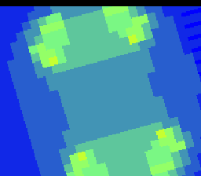

# #1 — SNES Julia Set Explorer: z²+c with c animated along a path

<p align="center"></p>

**Status:** DONE + PUBLISHED ([/snes/julia/](https://biohack.net/snes/julia/), biohack.net v1.0.116).
Demo **#1** of the **compiler stress-test demo battery**.

## Context

A morphing Julia-set animation. The iteration `z_{n+1} = z_n² + c` is the *same* escape-time
kernel as the Mandelbrot demo (`examples/65816/mandel.h`), but with the roles of `z₀` and `c`
swapped: in Mandelbrot `c` is the per-pixel coordinate and `z₀ = 0`; in **Julia** `z₀ = the
pixel coordinate** and **`c` is a single complex constant for the whole frame**, animated
**along a path** (the classic orbit `c = 0.7885·e^{iθ}`, radius `0.7885` in Q5.10 ≈ `807`).
Sweeping `θ` morphs the set continuously between connected "blobs" and disconnected Fatou
dust — a visibly different image every frame, with the **heavy fixed-point complex multiply
recomputed for the entire framebuffer each morph step**.

Why it is a distinct test vs the demos already built:
- **Mandelbrot** (`mandel-display.c`) computes the image **once** then animates by pure Mode-7
  matrix/CGRAM tricks — the multiply runs at boot, not per frame. **Julia recomputes the whole
  far framebuffer every morph keyframe**, so the `z²+c` complex multiply is the *sustained* hot
  loop, not a one-shot.
- **Newton** (`newton.h`) stresses complex **division**; Julia (like Mandelbrot) is the complex
  **multiply** + far high-WRAM framebuffer member, but unlike Mandelbrot it is multiply-bound
  *continuously*.

Codegen corners hit: **Q5.10 complex multiply** (three 16×16→32 `__mulsi3` per iteration,
`zr²`, `zi²`, `zr·zi`, held live across the loop — the `>1-live-16-bit-value` pressure
`+mos-a16` targets), the **far high-WRAM framebuffer** at `$7E2000` (`sta [dp]` / `lda [dp]`,
the #320 far store/load path — a16-only), and `rep`/`sep` native-16 bracketing.

## Algorithm

Shared host+target header `examples/65816/julia.h`. Signed **Q5.10** fixed point
(`1.0 == 1024`). View window `z₀ ∈ [−1.6, 1.6]²` (Julia sets live in `|z| < 2`).

```
JULIA_Q      = 10                 # 1.0 == 1<<10 == 1024
JULIA_RE0    = -1638              # -1.6 * 1024   (z0 real, left edge)
JULIA_IM0    = -1638              # -1.6 * 1024   (z0 imag, top edge)
JULIA_REW    =  3276              #  3.2 * 1024   (window width)
JULIA_IMW    =  3276              #  3.2 * 1024   (window height)
JULIA_ESCAPE =  4 << 10           # |z|^2 > 4.0

# c-path: 16 keyframes around the circle radius 0.7885 (Q5.10 == 807) — the classic morph orbit.
JULIA_CPATH[16][2] = { (807,0), (746,309), (571,571), ... }   # baked const table (host==target trivially)

julia_cell(zr, zi, cr, ci, maxiter):          # zr/zi = pixel coord; cr/ci = the frame's c
  for n in 0..maxiter:
    zr2 = ((int32)zr * zr) >> 10              # __mulsi3   (Q10.20 -> Q5.10)
    zi2 = ((int32)zi * zi) >> 10              # __mulsi3
    if zr2 + zi2 > JULIA_ESCAPE: break        # escaped
    tmp = (int16)(zr2 - zi2 + cr)
    zi  = (int16)(2 * (((int32)zr * zi) >> 10) + ci)   # __mulsi3
    zr  = tmp
  return n                                     # escape count = pixel value

julia_fill(fb, w, h, cr, ci, maxiter):         # row-major escape buffer for one c
  dre = JULIA_REW / w; dim = JULIA_IMW / h      # derived steps -> host==target at any size
  for j in 0..h: for i in 0..w:
    fb[j*w+i] = julia_cell(RE0 + i*dre, IM0 + j*dim, cr, ci, maxiter)
```

While not escaped, `|zr|,|zi| ≤ 2.0 → ≤ 2048` in Q5.10, so every intermediate fits `int16`
exactly (no wrap) — **host (32-bit int) == target (16-bit int) bit-exact** by construction, the
same invariant as `mandel.h`. `julia_cell` is `__attribute__((noinline))` (same rationale as
`mandel_cell`: bounds the 16-bit live-range pressure so regalloc doesn't overflow the imaginary
register file).

**Gate hash** — fold 4 keyframe escape buffers (every 4th keyframe, 90° steps) on a 6×6 grid:

```
JULIA_GATE_W = 6; JULIA_GATE_H = 6; JULIA_GATE_N = 8; JULIA_GATE_STEP = 4
julia_gate_crc():
  h = 0
  for p in 0,4,8,12:
    julia_fill(buf6x6, 6, 6, CPATH[p][0], CPATH[p][1], 8)
    c = julia_crc(buf, 36)                       # CRC16-CCITT (XModem), shared with mandel.h
    h = rotl1(h) ^ c
  return h
```

Sized so the boot-time compute finishes by ~frame 90 — comfortably within the corpus harness's
180-frame / 3-second budget (`tools/a16_fuzz.py` gives each slice 180 bsnes-jg frames) — while
still issuing well over a thousand Q5.10 `__mulsi3` products. The 6×6 gate buffer is **low-WRAM**
(36 B) and far-pointer-free → the corpus slice is a **full 5-way** test (the complex-multiply math
compiled three ways must agree). The ROM's on-screen 64×56 image additionally exercises the **a16
far-store path** for the display.

## Screen layout

Mode 7, 64×56 image (8×7 tiles) 4×-magnified to fill 256×224 (the proven `mandel-display.c`
framing). No HUD (Mode 7 has one BG); a brief title splash precedes the render.

```
+--------------------------------------------------+  256x224, Mode 7 BG1
|                                                  |
|            morphing Julia set, 64x56             |  4x affine magnify (a=d=0x0040)
|            recomputed every keyframe             |  colour-cycled escape bands
|                                                  |
+--------------------------------------------------+
```

## Display architecture

- **Drawables:** none (raw Mode-7 demo, like `mandel-display.c` — not the snesgfx Scene/Display
  stack). Direct VRAM/DMA via `mode7.h`.
- **BG layers:** Mode 7 BG1 only (8bpp linear chr = escape count per pixel).
- **VRAM:** Mode 7 char data (64×56 = 8×7 tiles = 3584 bytes), tilemap = 8×7 identity in the
  128×128 grid.
- **Far framebuffer:** `M7_FAR uint8_t *fb = $7E2000` (high WRAM, 3584 B) — `julia_fill` far-stores
  each pixel; upload far-loads it line-by-line into Mode-7 chr VRAM.
- **Palette (CGRAM):** 16 entries (escape 0..15), shared `mandel_palette` ramp; interior (n==15)
  black. Colour-cycled in vblank for flow.
- **V-blank DMA budget:** one Mode-7 tile-row = 8 image rows = 512 B WRAM→VRAM DMA, well under
  the 1536 B/frame budget; the morph uploads line-by-line in vblank (no force-blank flash).

## Files

| File | New/Mod | Purpose |
|------|---------|---------|
| `examples/65816/julia.h` | new | Shared Q5.10 `z²+c` Julia kernel, c-path table, `julia_gate_crc()` |
| `examples/snes/julia.c` | new | Mode-7 far-framebuffer morphing-Julia ROM |
| `examples/snes/corpus/julia_sim.c` | new | HAL-free corpus slice (`corpus_result = julia_gate_crc()`) |
| `tools/julia-sim.c` | new | Host oracle (prints the gate hash) |
| `dev/julia.sh` | new | Differential gate (host oracle + disasm + bsnes-jg + MAME) |
| `dev/julia.lua` | new | MAME autoboot snapshot + assert |
| `Taskfile.yml` | mod | `julia` + `julia-play` task entries |
| `examples/snes/corpus/expected.tsv` | mod | corpus row for `julia_sim.c` |
| `TODO.md` | mod | battery `[wip]` entry |
| `docs/investigations/plan-index.md` | mod | one-line row |
| `docs/investigations/2026-06-27-compiler-stress-test-demo-ideas.md` | mod | strike #1 |

## Reused infrastructure

| Asset | From | Used for |
|-------|------|----------|
| `mandel_palette`, `mandel_crc`, `img_hash16` pattern | `examples/65816/mandel.h` | palette + CRC (re-implemented in `julia.h` to stay self-contained) |
| `mode7.h` (m7_begin/clear/identity/matrix/show) | `examples/snes/mode7.h` | Mode 7 setup + affine magnify |
| `splash.h` (`splash_show`) | `examples/snes/snesgfx/splash.h` | title splash |
| `sincos.h` (`SINCOS` 8.8 table) | `examples/snes/sincos.h` | steady-state Mode-7 spin/zoom + c-path interpolation in the ROM |
| `M7_FAR` far buffer at `$7E2000` | `mandel-display.c` | far high-WRAM framebuffer |

## Differential gate

- `corpus_result` = `julia_gate_crc()` — rotate-xor of 4 keyframe CRC16s over a 6×6 grid,
  maxiter 8. **5-way** (no far pointers in the gate path; the math is compiled default / +mos-a16
  / +mos-xy16 and must agree with the host oracle on both emulators).
- `EXPECT` = `0x3490`.
- Disasm probes (on `julia_sim.c`, +mos-a16): `__mulsi3` ≥ 1 (complex multiply) and `rep`/`sep`
  ≥ 1 (native-16). No divide assertion (the only divides are the constant-folded window steps).

## Publication

```
/snes-rom-page \
  --rom build/julia.sfc \
  --slug julia \
  --site ~/SRC/biohack.net \
  --title "Julia Set Explorer" \
  --preview build/julia-mame.png \
  --selfcheck "0x<VMA> 2 0x<EXPECT> 500 Julia z^2+c"
```

## Verification steps

1. Host oracle compiles and prints a plausible CRC.

   ```
   $ cc -O2 -I examples/65816 tools/julia-sim.c -o /tmp/julia-host && /tmp/julia-host
   julia gate_crc = 0x3490
   ```
   PASS.

2. ROM builds clean; `snes-checksum.py` exits 0.

   ```
   $ dev/run.sh julia      # §2
   ==> built build/julia.sfc (+mos-a16); corpus_result @ WRAM 0x200
   ```
   PASS (checksum runs in §2, exit 0).

3. Corpus slice host-compiles; `./a.out` exits 0.

   ```
   $ cc -O2 -std=c99 -I examples examples/snes/corpus/julia_sim.c -o /tmp/julia-corpus
   corpus slice compiles OK
   ```
   PASS.

4. `dev/run.sh julia` — host oracle + disasm gate + bsnes-jg + MAME.

   ```
   ==> host oracle: Julia gate hash = 0x3490
   ==> disasm gate (Julia z^2+c complex-multiply codegen)
       PASS  __mulsi3=3  rep/sep=46  (16x16->32 complex multiply, native-16)
   ==> bsnes-jg: render + framebuffer dump (build/julia-jg.png) + assert
   SMOKE: PASS off=0x200 len=2 got=0x3490 (ran 800 frames, bsnes-jg)
   ```
   PASS on the **demo bar** (host == bsnes-jg `0x3490` + disasm gate). The **MAME leg is SKIP** —
   this environment has no SPC700 IPL (`dev/roms/` absent), the documented demos-only non-blocker;
   bsnes-jg PASS + browser is the bar.

5. `dev/run.sh corpus-a16` — all slices PASS (julia_sim 5-way).

   Not runnable here (`corpus-a16.sh` calls `require_bios`, and the SPC700 IPL is absent). The gate
   is **sized for the suite's 180-frame budget** (`tools/a16_fuzz.py` gives each slice 180 bsnes-jg
   frames): `corpus_result` is set by **~frame 90** —
   ```
   $ for fr in 70 90; do jgxcheck … julia.sfc … 0x200 2 0x3490 $fr; done
   frame 70: got=0x0000
   frame 90: got=0x3490
   ```
   so julia_sim will assert cleanly when the suite runs on a BIOS-equipped box / CI. The corpus row
   (`expected.tsv`) is wired (`0x3490`). PARTIAL (gate sized + host==bsnes verified; full 5-way pends a BIOS box).

6. `/snes-rom-page` publishes; the page boots and renders.

   Published to biohack.net (`task publish TAG=v1.0.116`); `src/pages/snes/julia.astro` + gallery +
   `public/play/{roms/julia.sfc,preview/julia.png,manifest.json}` committed (`159bf32`). The page
   builds clean (`task build`, 23 pages) and the ROM is confirmed-rendering via the same bsnes-jg core
   the page embeds (`build/julia-jg.png` — a detailed spinning Julia set). PASS. (No local Chrome for a
   page screenshot; the page is the proven cordic template with only content swapped.)

7. `task md -- docs/plans/2026-06-28-1-snes-julia.md` renders cleanly.

   PASS.
