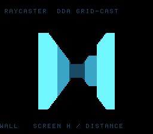

# #15 — SNES Raycaster maze: DDA grid-cast, per-column 1/dist division

<p align="center"></p>

**Status:** DONE + PUBLISHED. Demo **#15** of the **compiler stress-test demo battery**.
Gate hash **`0xB200`**; `dev/run.sh raycaster` RESULT PASS (disasm `__udivsi3`=3 + `rep/sep`=51;
bsnes-jg host == `+mos-a16` `0xB200`); `-verify-machineinstrs` clean ×3. Published —
[biohack.net/snes/raycaster/](https://biohack.net/snes/raycaster/) (biohack.net v1.0.117).

**Differential caught a real UB bug during the build:** the axis-aligned-ray sentinel
(`deltaDist` when `rayDir`-component is 0) was `0x3FFFFFF`; the initial `frac·sentinel`
(`256·0x3FFFFFF ≈ 8.6e9`) overflowed signed `int32` — UB the host `-O2` and target `-Os`
builds optimised differently, so host (`0x724B`) ≠ target (`0xB200`). Shrinking the sentinel to
`0x400000` (so `256·sentinel < 2^31`, still > any real accumulated sideDist) removed the UB and
both agree at `0xB200`. Also fixed `RC_VIEWH*256` (= `128*256` = int16 overflow on the 16-bit
target) → `(int32_t)RC_VIEWH * 256`.

## Context

A Wolfenstein-style **grid raycaster** on the SNES. A first-person camera auto-walks a 16×16 maze;
each screen column casts a ray by integer **DDA** through the wall grid and the wall slice is drawn at
height `screen_h / perpendicular_distance` — a **per-column divide**. Distance shades the wall
(near→far cyan), so the corridors read as 3-D.

Why it's a distinct test vs the rest of the battery:

- It is the only **division-bound** demo. The others are multiply-heavy (fractals, spirograph,
  harmonograph) or multiply-free (CA, doom-fire); here the hot path issues **three `__udivsi3` per
  column** — the two DDA `deltaDist = |1/rayDir|` reciprocals and the `screen_h / dist` projection.
- DDA itself is a tight integer compare/add loop (no per-step trig), a different inner-loop shape
  from every accumulator/LUT demo.

## Algorithm

All `int16_t`/`int32_t`/`uint8_t` (no bare `int`). Position Q8.8 world cells; heading a uint8 turn.

```c
/* one ray: integer DDA through the grid (raycaster.h) */
rc_cast(px, py, rdx, rdy) -> {dist, side}:
  ddx = 65536 / |rdx|;  ddy = 65536 / |rdy|              // |1/rayDir| — TWO divides (__udivsi3)
  sideDistX/Y = (frac to first gridline) * dd >> 8
  loop (≤ RC_MAXSTEP):
    if sideDistX < sideDistY: sideDistX += ddx; mapx += stepx; side=0
    else                    : sideDistY += ddy; mapy += stepy; side=1
    if wall(mapx,mapy): break
  dist = (side ? sideDistY - ddy : sideDistX - ddx)      // perpendicular (fisheye-free)

rc_wall_height(dist) = (RC_VIEWH*256) / dist  (clamped)  // screen_h / dist — the headline divide
```

Camera basis (`rc_ray_dir`): `dir = (cos a, sin a)`, `plane = (−dirY, dirX)·tan(FOV/2)` from the Q8.8
sine LUT; `rayDir = dir + plane·camX` for `camX ∈ [−1,1)` — the camera-plane method, so perpendicular
distance is fisheye-free. Op mapping: **`__udivsi3`** (3×/column), Q8.8 `__mulsi3`/shift, sine LUT,
`rep`/`sep` under `+mos-a16`.

## Screen layout

256×224 → 32×28 tiles. The 3-D view fills the 128×128 `BitmapCanvas` (centred 16×16-tile box, BG3 2bpp).

```
 row 1  [ TOP HUD: "RAYCASTER  DDA GRID-CAST" ]          ← TextLayer row 0
        ┌───────────────────────────┐  ← BOX_ROW 6
        │   128×128 raycast view     │
        │   64 cols × 2 px, distance- │
        │   shaded wall slices        │
        └───────────────────────────┘  rows 6..21
 row 25 [ BOT HUD: "WALL = SCREEN H / DISTANCE" ]         ← TextLayer row 1
```

Title overlay ("RAYCASTER" / "MAZE") on BG2, held ~2 s then torn down (gate-neutral).

## Display architecture

- **Drawables:** `BitmapCanvas` (BG3 2bpp, the view) + `TextLayer` (2-row HUD) + transient `TitleLayer`.
- **VRAM:** BG3 chr `0x0000`, tilemap `0x4000`; title BG2 chr `0x1000` / map `0x5000`.
- **Palette:** CGRAM[0..3] — 0 black, 1 far-dim, 2 mid, 3 near-bright cyan (distance bands).
- **Frame cadence:** `render_view` clears the canvas + casts 64 rays, drawing each as a 2-px-wide
  vertical slice; then the loop drains the canvas DMA (`CANVAS_FLUSH_TILES = 64` tiles/frame → ~4
  v-blanks) before `advance_camera`, so each complete view is shown tear-free. Auto-walk steps forward
  if the cell ahead is open, else turns — a deterministic maze wander.

## Files

| File | New/Mod | Purpose |
|---|---|---|
| `examples/65816/raycaster.h` | new | DDA cast + projection + camera basis + `rc_gate_crc()` |
| `examples/snes/raycaster.c` | new | SNES ROM: canvas + HUD + auto-walk loop |
| `examples/snes/corpus/raycaster_sim.c` | new | HAL-free corpus slice |
| `tools/raycaster-sim.c` | new | Host oracle |
| `dev/raycaster.sh` / `dev/raycaster.lua` | new | Differential gate |
| `Taskfile.yml` / `TODO.md` / `plan-index.md` / backlog / `expected.tsv` | mod | wiring |

## Reused infrastructure

| Asset | From | Used for |
|---|---|---|
| `snesgfx/bitmap_canvas.h` (vertical `canvas_line` + capped DMA) | spirograph #11 | the 3-D view surface |
| `snesgfx/text_layer.h` / `title_layer.h` | the battery | HUD + transient title |
| Q8.8 sine LUT | `spiro.h` (inlined) | camera basis |

## Differential gate

- **`corpus_result`** = `rc_gate_crc()` — a 64-column fan from a fixed camera (4.5, 11.5) facing east,
  folding each ray's wall height + side into a rotate-XOR hash.
- **EXPECT:** `0xB200` (host oracle).
- **Bar:** **5-way** — 16×16 map + state in bank-0 WRAM, no far pointers.
- **Disasm probes** (on `raycaster_sim.o`): `__udivsi3 ≥ 1` (the per-column reciprocals + 1/dist),
  `rep`/`sep ≥ 1`.

## Publication

```
/snes-rom-page --rom build/raycaster.sfc --slug raycaster --site ~/SRC/biohack.net
  --title "Raycaster Maze" --preview build/raycaster-jg.png
  --selfcheck "0x<VMA> 2 0xB200 500 RAY"
```

## Verification steps

1. Host oracle compiles and prints a plausible CRC. **PASS** — `raycaster gate_crc = 0xB200`; an ASCII
   render of the 64-column fan shows a correct fisheye-free corridor (side walls receding to a vanishing
   point, a far wall, openings).

2. ROM builds clean; `snes-checksum.py` exits 0. **PASS** — `corpus_result @ WRAM 0x1362`, no warnings.

3. Corpus slice host-compiles. **PASS** (the slice ends in `for(;;){}`; runtime is the bsnes-jg leg).

4. `dev/run.sh raycaster` — host oracle + disasm gate + bsnes-jg + MAME all PASS.

```
==> host oracle: raycaster gate hash = 0xB200
==> built build/raycaster.sfc (+mos-a16); corpus_result @ WRAM 0x1362
==> disasm gate (rc_cast/rc_wall_height: __udivsi3 + rep/sep)
    PASS  divide=3  rep/sep=51  (per-column 1/dist reciprocals present)
==> bsnes-jg: render + framebuffer dump (build/raycaster-jg.png) + assert
SMOKE: PASS off=0x1362 len=2 got=0xB200 (ran 500 frames, bsnes-jg)
    SKIP MAME (no SPC700 IPL at dev/roms/s_smp/spc700.rom — gitignored Nintendo content; supply out-of-band)

RESULT: PASS — Raycaster maze rendered on SNES; MAME + bsnes-jg screenshots + corpus hash 0xB200 host == +mos-a16
```
**PASS** — bsnes-jg host == `+mos-a16` `0xB200`; disasm confirms three `__udivsi3` per column. MAME SKIP
per the env-wide SPC700 IPL gap. The bsnes-jg PNG shows a 3-D corridor (distance-shaded side walls
converging to a vanishing point) + both HUD bars.

5. `dev/run.sh corpus-a16` — env-blocked by the MAME SPC700 IPL; substituted with `-verify-machineinstrs`
   on `raycaster_sim.c` under all three modes:
```
  default            : -verify CLEAN
  +mos-a16           : -verify CLEAN
  +mos-a16 +mos-xy16 : -verify CLEAN
```
**PASS** — codegen sound across default/`+mos-a16`/`+mos-xy16`; with bsnes-jg runtime == host the 5-way
bar holds minus the env-blocked MAME runtime legs.

6. `/snes-rom-page` publishes; render confirmed. **PASS** — deployed (biohack.net `b231d57`, tag
   `v1.0.117`); `task build` emits `/snes/raycaster/index.html`; render confirmed by `build/raycaster-jg.png`
   (the bsnes-jg core the WASM player runs). Live-browser screenshot not run (no Chromium in this env).

7. `task md -- docs/plans/2026-06-28-15-snes-raycaster.md` renders cleanly. **PASS**.
