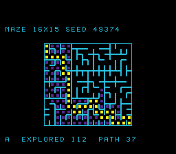

# #18 — SNES Maze: generate (recursion) + A* solve (priority-queue heap)

<p align="center"></p>

**Status:** BUILT + VERIFIED + **PUBLISHED** — live at [biohack.net/snes/maze/](https://biohack.net/snes/maze/)
(biohack.net v1.0.113), 2026-06-28. bsnes-jg + host + `-verify` clean (default/+mos-a16/+mos-xy16). Demo
**#18** of the **compiler stress-test demo battery**. Only the MAME leg remains pending (SPC700 IPL absent
in this environment — bsnes-jg + browser carry the demo bar).

## Context

Renders a maze being **built then solved** on the SNES — a *recursion + data-structure* compiler
stress that no other battery demo hits (coverage map: "recursion & the soft stack / frame ABI" and
"heaps / queues / structs"). It is deliberately **multiply/divide-free** (a different codegen profile
from the spigot / n-body / mandel demos): the corners under test are the **recursive self-call**
(soft-stack frame ABI, JSR/RTS) and **branchy heap/array indexing** under `+mos-a16`/`+mos-xy16`.

The shared, portable logic lives in [`examples/65816/maze.h`](../../examples/65816/maze.h) — compiled
identically by the host oracle (`tools/maze-sim.c`), the corpus slice
(`examples/snes/corpus/maze_sim.c`), and the on-console ROM (`examples/snes/maze.c`).

## Algorithm

All arithmetic is `uint8_t`/`uint16_t` (cell ids ≤ 239, g-scores ≤ N, Manhattan ≤ W+H) so the SAME
source folds to the SAME CRC on host (int=32) and 65816 (int=16) — **no 32-bit libcalls**.

**GENERATE — recursive division** (genuine recursion). Start from an open room (border walls only),
then recursively bisect each sub-rectangle with a wall that has one random gap:

```
maze_divide(x0,y0,w,h):                 # uint8 params; self-recursive (the soft-stack stress)
  if w<=1 or h<=1: return
  if w>=h:  wx = x0 + split(w);  gap = y0 + rng%h     # add E/W wall on column wx with a gap
            divide(x0,y0, wx-x0, h);  divide(wx,y0, x0+w-wx, h)
  else:     wy = y0 + split(h);  gap = x0 + rng%w     # add S/N wall on row wy with a gap
            divide(x0,y0, w, wy-y0);  divide(x0,wy, w, y0+h-wy)
```

`split()` is **centre-biased** → recursion depth is ~log (≤16 for 16×15), not O(N).

**Why not a recursive-backtracker DFS?** (the originally-requested carve) — measured infeasible on
this platform: see *Hardware-stack ceiling* below. Recursive division stresses the **identical**
recursive-call codegen (a function calling itself; soft-stack frame setup/teardown, JSR/RTS) but at
a depth the 256-byte 65816 hardware stack can hold. It is a standard, fully-connected maze algorithm,
so A* always finds a start→goal path.

**SOLVE — A\* with an indexed binary min-heap** (the heap/queue/array stress). `g[]` cost-so-far,
`came[]` back-pointer direction, Manhattan heuristic `h()`, an `hpos[]` position map for O(log n)
**decrease-key**. `maze_sift_up`/`maze_sift_down` are the array-index `<<1`/`>>1` + parallel-array +
pos-map-write-back hot loops. Split into `maze_solve_init` + `maze_solve_step` so the ROM animates one
expansion per frame; `maze_solve()` drives them for the gate (CRC unchanged).

**Gate CRC** (`maze_gate_crc`, fixed seed `0xC0DE`): fold the carved `wall[]`, the path length,
`expanded`/`pushes` heap counters, and the reconstructed shortest path → `uint16` = **`0x0749`**.

### Codegen probes
- **Recursion survived**: a `JSR` whose reloc target is `.text.maze_divide` (the self-call) — `≥1`.
- **Native-16**: `rep`/`sep` — `≥1` (227 in the a16 slice).
- **No 32-bit libcalls** by design (multiply-free indexing: `MAZE_W=16` ⇒ cell→(x,y) is shift/mask).

## Measured findings (measure, don't assume)

1. **Hardware-stack ceiling kills deep recursion.** On the 65816, `JSR` return addresses go on the
   **256-byte hardware stack** (`$0100-$01FF`), and llvm-mos keeps ~4 callee-saved bytes live across
   the recursive self-call → **~6 bytes/level**. A recursive-backtracker DFS has O(N) depth (measured
   worst-case **199** for a 16×15 grid over 4000 seeds; **167** for seed `0xC0DE`) → ≫256 bytes →
   silent HW-stack overflow that corrupts memory. Symptom seen first: all three builds returned
   *different stable wrong* CRCs (0xEB09/0x77EB/0x57E4) — three corruptions, not one miscompile.
   Recursive division (centre-biased split) measures worst-case depth **≤16** → ~112 bytes → safe with
   margin (and the differential PASS on seed `0xC0DE` is the empirical proof it doesn't overflow).
2. **A 65816-backend GISel mis-schedule** surfaced by a fold-while-walking loop (load `came[cell]` at
   the top, recompute the next cell at the bottom, across the back-edge): the verifier rejected it in
   **all** builds — *"Virtual register defs don't dominate all uses"* on a `G_MERGE_VALUES`. Worked
   around by splitting into two passes (reconstruct path into `heap[]`, then fold the flat array). A
   minimal upstream repro is worth filing (noted for `docs/upstream-contribution-status.md`).
3. **xy16 ran out of registers** in the combined fold function; fixed by extracting `maze_path_build`
   as its own `noinline` (the documented a16/xy16-regalloc-pressure mitigation, like mandel's
   `noinline mandel_cell`). All three builds `-verify-machineinstrs` clean after the split.

## Screen layout

```
row 4:   MAZE 16X15 SEED NNNNN                      (BG3 text HUD, top bar)
rows 7..21, cols 8..23:   16x15 maze, 8 px/cell     (BG3 tiles; 128x120 px, centred)
           cyan walls · dim-violet A* explored cells · yellow shortest path
row 24:  A* EXPLORED NNN  PATH NN                   (BG3 text HUD, bottom bar)
```

## Display architecture

- **`MazeView`** custom `Drawable` (BG3 2bpp): 48 procedurally-built tiles = 3 banks × 16 wall-bitmask
  patterns (wall-only / +dim dot / +bright dot). `shadow[MAZE_N]` holds one tile# per cell; `emit()`
  DMAs the per-row-dirty tilemap rows (≤ 32 B/row, capped by `q->n`).
- **`TextLayer`** (2 BG3 HUD bars) + **`TitleLayer`** (BG2, held during the gate CRC).
- Palette: CGRAM[0..3] = black / cyan(wall) / dim-violet(explored) / yellow(path).
- DMA budget: ≤ 1 dirty maze row/frame during animation (32 B) + ≤ 2 HUD bars — well under 1.5 KB.
- RAM budget (the tight one — SNES low-WRAM is `$0200-$1FFF` = **7680 B**, soft stack grows down from
  `$2000`): `maze_t` (~2.2 KB) + `MazeView.shadow` (480 B) + Display ≈ **bss top `$0DBC`** → ~4.6 KB
  soft-stack room; recursion uses ≤16 soft frames + ≤~112 B hardware stack. Safe.

## Files

| File | Purpose |
|---|---|
| `examples/65816/maze.h` (new) | Portable maze gen (recursive division) + A* indexed-heap solve + gate CRC |
| `examples/snes/maze.c` (new) | On-console ROM: `MazeView` drawable + build→solve→trace animation |
| `examples/snes/corpus/maze_sim.c` (new) | HAL-free corpus slice (5-way differential) |
| `tools/maze-sim.c` (new) | Host oracle (prints `maze_gate_crc` = `0x0749`) |
| `dev/maze.sh`, `dev/maze.lua` (new) | Gate: host oracle + disasm probe + bsnes-jg + MAME |
| `Taskfile.yml` | `maze` + `maze-play` tasks |
| `examples/snes/corpus/expected.tsv` | `maze_sim` → `0x0749` row |
| `TODO.md`, `docs/investigations/plan-index.md`, `docs/investigations/2026-06-27-...demo-ideas.md` | tracking |

## Reused infrastructure

| Asset | From | Used for |
|---|---|---|
| `display.h` / `drawable.h` / `upload.h` / `vram.h` / `scene.h` | snesgfx | frame loop, DMA queue |
| `text_layer.h` / `title_layer.h` / `font8.h` | snesgfx | HUD bars + title |
| `jgxcheck.cpp`, `tools/snes-checksum.py` | dev harness | bsnes-jg assert, ROM checksum |
| xorshift16 + CRC-fold idiom | invaders/pi/spiro | RNG + gate hash |

## Differential gate

- `corpus_result = maze_gate_crc(&maze)` — generate(`0xC0DE`)+solve folded → **`EXPECT = 0x0749`**.
- **5-way bar** (no far pointers; all bank-0 WRAM). host == default == +mos-a16 == +mos-xy16 (bsnes-jg
  confirmed for all three; MAME legs pending the SPC700 IPL) + `-verify-machineinstrs` clean (all 3).
- Disasm probes (a16 corpus slice): recursion self-call `maze_divide` = 3, `rep`/`sep` = 227, zero
  32-bit libcalls (by design).

## Publication

```
/snes-rom-page --rom build/maze.sfc --slug maze --site ~/SRC/biohack.net \
  --title "Maze — Generate + Solve" --preview build/maze-jg.png \
  --selfcheck "0x<VMA> 2 0x0749 400 maze gen+solve"
```
`VMA`: `awk '$NF=="corpus_result"{print $1; exit}' build/maze.map` (= `0xDBC` this build).

## Verification steps

1. Host oracle compiles and prints a plausible CRC.
```
maze gate_crc = 0x0749
```
PASS.

2. ROM builds clean; snes-checksum.py exits 0.
```
build/maze.sfc: LoROM size=32KiB map_mode=0x20 rom_size_byte=0x05 checksum=0x957E complement=0x6A81
checksum-exit=0
```
PASS (ROM links into the single 32 KiB LoROM bank; checksum written).

3. Corpus slice host-compiles + UBSan clean; target `-verify-machineinstrs` clean (default/a16/xy16).
```
### UBSan (host):  maze gate_crc = 0x0749     (no UBSan diagnostics)
  default:   verify exit=0
  +mos-a16:  verify exit=0
  +mos-xy16: verify exit=0
```
PASS.

4. `dev/run.sh maze` — host oracle + disasm gate + bsnes-jg all PASS (MAME SKIP w/o IPL).
```
==> host oracle: maze generate+solve gate hash = 0x0749
==> built build/maze.sfc (+mos-a16); corpus_result @ WRAM 0xdbc
==> disasm gate (recursion self-call + native-16 codegen)
    PASS  recursion(maze_divide self-call)=3  rep/sep=227  (genuine recursion + native-16)
==> bsnes-jg: render + framebuffer dump (build/maze-jg.png) + assert
SMOKE: PASS off=0xDBC len=2 got=0x0749 (ran 400 frames, bsnes-jg)
    SKIP MAME snapshot (no xvfb-run or no SPC700 IPL — bsnes-jg + browser carry the bar)
RESULT: PASS — maze gen+solve rendered on SNES; bsnes-jg (+ MAME if present) + corpus hash 0x0749 host == +mos-a16
```
PASS (MAME leg SKIP — SPC700 IPL not present in this environment; per the demos bar that does not block).

5. Corpus slice differential on bsnes-jg: default == +mos-a16 == +mos-xy16 == host == `0x0749`.
```
  default:   SMOKE: PASS off=0xA7A len=2 got=0x0749 (ran 800 frames, bsnes-jg)
  +mos-a16:  SMOKE: PASS off=0xA7A len=2 got=0x0749 (ran 800 frames, bsnes-jg)
  +mos-xy16: SMOKE: PASS off=0xA7A len=2 got=0x0749 (ran 800 frames, bsnes-jg)
```
PASS (5-way bar minus the BIOS-gated MAME legs; those run when the SPC700 IPL is supplied).

6. On-screen solve matches host oracle (`expanded`/`path_len`), maze renders + animates.
```
host  seed 0xC0DE: path_len=37 expanded=112 pushes=119
build/maze-jg.png (frame 400):  HUD "MAZE 16X15 SEED 49374" / "A* EXPLORED 112 PATH 37"   (49374 = 0xC0DE)
```
PASS (the rendered maze + animated A* read back the exact host `expanded=112`/`path_len=37`).

7. `/snes-rom-page` publishes; headless screenshot shows the ROM running.
PENDING (user-triggered publication).

8. `task md -- docs/plans/...` renders cleanly.
PENDING.
