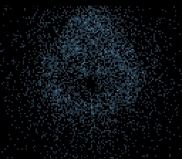

# #4 — SNES Buddhabrot: escaping-orbit density accumulation into a far buffer

<p align="center"></p>

**Status:** BUILT + VERIFIED (bsnes-jg; MAME env-blocked, non-blocking). Gate hash **`0x7C31`**.
Pending: publish to biohack.net. Demo **#4** of the **compiler stress-test demo battery**
(catalog [`2026-06-27-compiler-stress-test-demo-ideas.md`](../investigations/2026-06-27-compiler-stress-test-demo-ideas.md) §Fractals item 4).

## Context

The **Buddhabrot** is the Mandelbrot's "ghost": sample random complex points `c`, iterate
`z ← z² + c` from `z = 0`, and for the points that **escape** (|z|² > 4 within a max-iteration
cap) replay the orbit and **increment a per-pixel hit counter** at every `(zr, zi)` the orbit
visited. Over millions of escaping orbits the accumulated density resolves into the eerie,
smoke-like silhouette.

Its distinct contribution to the battery (coverage map credits **#4** under *complex/32-bit
multiply*, *far / high-WRAM buffers*, and *PRNG + scatter*):

- **Scatter writes to a FAR buffer.** The density grid is 128×128 = 16 KiB — far larger than the
  ~7.7 KiB low-WRAM budget — so it lives in **high WRAM `$7E2000`** and every hit is a far
  read-modify-write (`lda [dp]` / saturate-compare / `inc` / `sta [dp]`) at a **runtime-computed**
  index (the orbit-coordinate map output, so the 24-bit pointer cannot fold to absolute-long).
  This is the **#320 far path under `+mos-a16`**, the same customer `examples/snes/blossom.c` and
  `examples/snes/mandel-display.c` exercise.
- **PRNG sampling.** `c` is drawn by an xorshift16 generator (deterministic → host == target).
- **Complex multiply hot loop.** Three Q5.10 16×16→32 multiplies per iteration (`zr²`, `zi²`,
  `zr·zi`), **run twice per sample** (escape-test pass + orbit-replay pass) — heavier multiply
  pressure than Julia's single pass.

**Distinct from Julia (#1)**: Julia/Mandelbrot are *escape-time colouring* (one value per pixel,
near framebuffer). Buddhabrot is *orbit-density accumulation* (a scatter histogram, far buffer) —
a fundamentally different memory-access and codegen shape.

**Bar: 3-way** (`host == +mos-a16@bsnes-jg == +mos-a16@MAME`). A far pointer is a 32-bit value, so
the kernel is **`+mos-a16`-only** — the default-8-bit / `+mos-xy16` legs that make a 5-way bar
cannot legalize the far `G_PTR_ADD`, exactly as for blossom and Mandelbrot. The demo battery bar
(catalog §"The bar", lines 19–25) is **bsnes-jg PASS + browser**; MAME is a bonus cross-check.

## Algorithm

Pure Q5.10 fixed point (`1.0 == 1024`), all widths explicit so host (`int`=32) and target
(`int`=16) agree bit-for-bit. Window = the Mandelbrot window (`mandel.h`): real ∈ [−2.25, 0.75],
imag ∈ [−1.25, 1.25]. Grid 128×128, 1:1 with the Mode 7 display.

```c
// One iteration: z ← z² + c, Q5.10. Three 16×16→32 multiplies. Returns |z|² (Q5.10).
inline int32_t bud_iter(int16_t *zr, int16_t *zi, int16_t cr, int16_t ci):
    int32_t zr2 = ((int32_t)*zr * *zr) >> 10        // __mulsi3
    int32_t zi2 = ((int32_t)*zi * *zi) >> 10        // __mulsi3
    int16_t nzr = (int16_t)(zr2 - zi2 + cr)
    *zi = (int16_t)(2 * (((int32_t)*zr * *zi) >> 10) + ci)   // __mulsi3
    *zr = nzr
    return zr2 + zi2

// Pass 1 (no far pointer live): does c escape, and after how many steps?
inline uint8_t bud_escape_k(int16_t cr, int16_t ci, uint8_t maxiter):
    zr=0; zi=0
    for k in 0..maxiter-1:
        if bud_iter(&zr,&zi,cr,ci) > (4<<10): return k+1   // escaped at step k+1
    return 0                                               // interior — never recorded

// Pass 2 (far pointer live): replay k steps, increment density at each visited point.
// noinline + stamped near/far via BUD_DEFINE_PLOT.
BUD_DEFINE_PLOT(grid_plot, QUAL):
  void grid_plot(QUAL uint8_t *grid, int16_t cr, int16_t ci, uint8_t k):
    zr=0; zi=0
    for step in 0..k-1:
        bud_iter(&zr,&zi,cr,ci)
        px = (zr - RE0) >> MAP_SHIFT;  py = (zi - IM0) >> MAP_SHIFT   // pure shift, no divide
        if (uint16_t)px < 128 && (uint16_t)py < 128:
            idx = py*128 + px
            hv = grid[idx]                       // FAR LOAD  (lda [dp])
            if hv != 255: grid[idx] = hv + 1     // FAR STORE (sta [dp]), saturating

// Driver: accumulate N escaping-orbit samples (continues PRNG state across frames for live bloom).
BUD_DEFINE_ACCUM(grid_accum, QUAL):
  void grid_accum(QUAL uint8_t *grid, bud_rng *rng, uint16_t nsamples):
    for _ in 0..nsamples-1:
        cr = sample_re(rng);  ci = sample_im(rng)     // xorshift16 → window
        k = bud_escape_k(cr, ci, BUD_MAXITER)
        if k >= BUD_MINITER: grid_plot(grid, cr, ci, k)   // skip interior + instant-escapers
```

**Codegen probes:** `__mulsi3`/`__umulsi3` (the three complex multiplies), `rep`/`sep` (native-16),
and the far path `lda [` / `sta [` (24-bit indirect-long load/store) in the disasm.

**Window / map constants** (mirror `mandel.h`; map is the inverse of fill):
`RE0 = -2304` (−2.25·1024), `IM0 = -1280` (−1.25·1024), window width 3.0·1024 = 3072 over 128 px →
`px = (zr − RE0) * 128 / 3072 = (zr − RE0) / 24`. To keep the map a **pure shift** (no per-point
divide — the per-sample budget is already 2× the iteration cost), the sampling+map use a
**power-of-two** window: width = 4.0·1024 = 4096 over 128 px ⇒ `>> 5`. So `RE0 = −2.0·1024 = −2048`,
`IM0 = −2.0·1024 = −2048`, `MAP_SHIFT = 5`. Orbit points outside [−2,2]² (the escaping tail) map
out of range and are dropped (clean border, unsigned compare). Re-centred during tuning if the
silhouette sits off-centre.

**Orientation:** map `zi → x`, `zr → y` so the set stands upright (the canonical "Buddha" pose);
the density is symmetric about the real axis. Final orientation chosen during visual tuning.

**Sampling** (`bud_rng` = one xorshift16 word): `cr = (int16_t)rng16() >> 4` → [−2048, 2047] =
[−2,2] Q5.10; likewise `ci`. The `BUD_MINITER` floor (≈ 4) discards the |c|>2 instant-escapers
that would otherwise smear the origin with noise; the `BUD_MAXITER` cap (≈ 24–48, tuned) bounds the
filament length and the per-sample cost.

## Screen layout

Full-screen **Mode 7** — the 128×128 density grid is 4×-magnified by the affine matrix to fill the
256×224 display, identical to blossom/mandel-display. No HUD (the image is the whole point); an
optional 2-line splash title (`splash.h`) shows during the boot gate-hash, then tears down.

```
┌────────────────────────────────┐ 256×224, Mode 7
│                                 │  the 128×128 far density grid ($7E2000),
│        ░░▒▒▓▓██▓▓▒▒░░           │  hit-count = 8bpp pixel = CGRAM index,
│      ░▒▓███BUDDHA███▓▒░         │  4× magnified, centred. Palette = a
│        ░░▒▒▓▓██▓▓▒▒░░           │  ghostly dark→white glow ramp (CGRAM
│                                 │  baked with a sqrt curve so low counts
└────────────────────────────────┘  stay visible and the core doesn't blow out)
```

## Display architecture

- **Drawable / layer model:** none — direct Mode 7 like blossom.c (no `snesgfx` Display loop; Mode 7
  is its own scaffolding). Reuse blossom.c's `vram_clear_all`, `build_band`, `dma_chr_to`,
  `dma_cgram`, and the `mode7.h` calls verbatim.
- **VRAM:** Mode 7 character base 0, tilemap identity 16×16 tiles (128 px). One tile-row =
  16 tiles × 64 B = **1024 B** DMA'd per frame (fits one V-blank); 16 bands cycle so the picture
  refreshes/sharpens flicker-free.
- **Far grid:** `static FAR uint8_t *const grid = (FAR uint8_t *)0x7E2000u;` — 16 KiB, cleared at
  boot via the **volatile** `BUD_DEFINE_CLEAR` store (the far-`__memset`-coalesce miscompile guard,
  hopalong.h:154 / docs/320-far-memset-miscompile.md).
- **Palette (CGRAM, 256 entries = 512 B):** index 0 = black (no hits); indices 1..255 = a baked
  dark→white (or blue→white) glow ramp with a **sqrt brightness curve** so sparse filaments are
  visible without the dense core saturating to a white blob. Pushed once (no per-frame cycle —
  "ghostly" reads better static; a slow shimmer is an optional later tweak).
- **V-blank DMA budget:** 1024 B (one char band) + 512 B (CGRAM, first frame only) ≤ 1536 B. ✓

## Files

| File | New/Mod | Purpose |
|------|---------|---------|
| `examples/65816/buddha.h` | new | Pure Q5.10 Buddhabrot math: `bud_iter`, `bud_escape_k`, xorshift `bud_rng`, coordinate map, and `BUD_DEFINE_{CLEAR,PLOT,ACCUM,HASH}` near/far macro stampers (the hopalong.h idiom). |
| `examples/65816/k_buddha_far.c` | new | Headless far-grid kernel **and** host oracle (`-DHOST`): accumulate `K_GATE` samples, far-hash the grid → `corpus_result`. Mirrors `k_blossom_far.c`. |
| `examples/snes/buddha.c` | new | On-screen ROM: Mode 7 far density grid, progressive bloom, ghostly palette, splash, `corpus_result` proof channel. Based on `blossom.c`. |
| `dev/buddha-grid.sh` | new | Headless far-RMW gate: host oracle == `+mos-a16` ROM on bsnes-jg + MAME + far-path disasm gate. Copy of `dev/blossom-grid.sh`. |
| `dev/buddha.sh` | new | On-screen gate: same grid hash differential + framebuffer PNG from both cores. Copy of `dev/blossom.sh` (minus the controller-state channel — Buddhabrot is non-interactive). |
| `dev/buddha.lua` | new | MAME snapshot+assert (or reuse `dev/mandel-shot.lua` as blossom does — decide during wiring). |
| `dev/run.sh` | mod | Dispatch `buddha` / `buddha-grid`. |
| `Taskfile.yml` | mod | `buddha`, `buddha-grid`, `buddha-play` entries. |
| `TODO.md` | mod | `[wip]` battery entry. |
| `docs/investigations/plan-index.md` | mod | New plan row. |
| `docs/investigations/2026-06-27-compiler-stress-test-demo-ideas.md` | mod (close-out) | Strike #4 idea entry + coverage rows. |

## Reused infrastructure

| Asset | From | Used for |
|-------|------|----------|
| Far near/far macro-stamp idiom | `examples/65816/hopalong.h` (`HOP_DEFINE_*`) | `BUD_DEFINE_*` clear/plot/accum/hash over a pointer qualifier |
| Far `__memset` volatile-clear guard | hopalong.h:154, docs/320-far-memset-miscompile.md | `BUD_DEFINE_CLEAR` correctness on the far path |
| Mode 7 grid → VRAM band DMA + palette DMA | `examples/snes/blossom.c` (`build_band`, `dma_chr_to`, `dma_cgram`, `vram_clear_all`) | Display scaffolding verbatim |
| `mode7.h` (`m7_begin/show/set_matrix/set_scroll/set_center/tilemap_*`) | `examples/snes/mode7.h` | Mode 7 affine display |
| `splash.h` (`splash_show`) | `examples/snes/snesgfx/splash.h` | Boot title during the gate hash |
| Q5.10 window constants + escape test | `examples/65816/mandel.h` | Fixed-point conventions |
| Host-oracle + a16 ROM gate flow | `dev/blossom.sh`, `dev/blossom-grid.sh`, `dev/mandel-shot.lua` | Differential gate scripts |

## Differential gate

- **`corpus_result`**: `grid_hash(grid)` — the rotate-xor rolling hash (hopalong.h `*_HASH` idiom)
  over all 16384 density bytes after a **deterministic** accumulation of `K_GATE` xorshift samples
  (fixed seed). Timing-independent (sampled after the accumulation completes), so the splash /
  emulator frame timing don't perturb it.
- **`EXPECT` = `0x7C31`** (`K_GATE = 2000`, `BUD_MAXITER = 32`, `BUD_MINITER = 4`, seed `0xC0DE`,
  windowed sampling Re∈[−2,0.6]/Im∈[−1.3,1.3]). Host oracle: 3714/16384 cells hit, max count 6.
- **Bar:** 3-way (`host == +mos-a16` on bsnes-jg + MAME). `+mos-a16`-only (far grid). bsnes-jg PASS
  is the demo bar; MAME is a bonus (env-blocked here on the missing SPC700 IPL — non-blocking).
- **Disasm probes (all PASS):** `__mulsi3`/`__umulsi3` = 8 (complex multiply + windowed-sample mul),
  `rep` = 31 / `sep` = 34 (native-16), far indirect-long `lda [dp]` = 2 / `sta [dp]` = 2 (the far
  RMW). `-verify-machineinstrs` clean.
- **`K_GATE` sizing:** `K_GATE = 2000` samples (≈ 29 422 iterations ≈ 88 k `__mulsi3`) completes the
  boot accumulation well within the 5000-frame headless / 6000-frame on-screen budgets, yet hits 3714
  grid cells. `BUD_MAXITER` lowered 64→32 after measuring: escaper count barely changes (766→748) but
  interior samples run the full cap, so 32 is ~1/3 cheaper. The live ROM keeps sampling to `K_BLOOM`
  (40000) past the gated snapshot for the richer image.

## Publication

```
/snes-rom-page
  --rom build/buddha.sfc
  --slug buddhabrot
  --site ~/SRC/biohack.net
  --title "Buddhabrot"
  --preview build/buddha-mame.png      # or build/buddha-jg.png
  --selfcheck "0x<VMA> 2 0x<EXPECT> <FRAMES> buddhabrot"
```
`VMA` = `awk '$NF=="corpus_result"{print $1; exit}' build/buddha.map`.

## Verification steps

1. Host oracle compiles and prints a plausible grid hash + cells-hit count.

```
$ cc -DHOST -O2 -I examples/65816 -o /tmp/buddha_oracle examples/65816/k_buddha_far.c && /tmp/buddha_oracle
host grid: K_GATE=2000  cells_hit=3714/16384  max=6  saturated=0
0x7C31
```
PASS — compiles; 3714/16384 cells hit, a plausible Buddhabrot density; hash 0x7C31.

2. ROM builds clean (`+mos-a16`, `-verify-machineinstrs`); `snes-checksum.py` exits 0.

```
==> built buddha.sfc (+mos-a16); corpus_result @ $22       # -mllvm -verify-machineinstrs, no errors
# python3 tools/snes-checksum.py build/buddha.sfc → exit 0 (run inside dev/buddha.sh)
```
PASS.

3. Headless far gate `dev/run.sh buddha-grid` — host == `+mos-a16` on bsnes-jg + far-RMW +
   complex-multiply disasm gate PASS (MAME bonus skipped: no SPC700 IPL).

```
==> 1) host oracle derives the golden grid hash (cc -DHOST over buddha.h)
    host grid: K_GATE=2000  cells_hit=3714/16384  max=6  saturated=0
    golden grid hash = 0x7C31
==> 3) disasm gate: far RMW indirect-long (a7=lda [dp], 87=sta [dp]) + native 16-bit + complex multiply
  PASS: far RMW present (lda [dp]=2, sta [dp]=2)
  PASS: native 16-bit active (rep=31, sep=34)
  PASS: complex multiply present (__mulsi3/__umulsi3=8)
==> 4) execution gate (bsnes-jg): corpus_result == 0x7C31
SMOKE: PASS off=0x200 len=2 got=0x7C31 (ran 5000 frames, bsnes-jg)
    SKIP MAME (no SPC700 IPL — bsnes-jg carries the verdict; non-blocking per demos policy)
RESULT: PASS — Buddhabrot far scatter-write density grid in high WRAM $7E2000; hash 0x7C31 host == +mos-a16
```
PASS.

4. On-screen gate `dev/run.sh buddha` — grid hash host == `+mos-a16` on bsnes-jg; framebuffer PNG
   shows the ghostly density image (not blank / not a solid blob).

```
==> host reference: grid hash = 0x7C31
==> built buddha.sfc (+mos-a16); corpus_result @ $22
SMOKE: PASS off=0x22 len=2 got=0x7C31 (ran 6000 frames, bsnes-jg)
RESULT: PASS — Buddhabrot density on SNES; grid hash 0x7C31 host == +mos-a16 (bsnes-jg + MAME)
jgxcheck: wrote /work/build/buddha-jg.png (256x224 from native 512x240, yoff=0)
```
PASS — `build/buddha-jg.png` shows a recognizable top-bottom-symmetric ghostly blue Buddhabrot.

5. `dev/run.sh corpus-a16` (under `JG_ONLY=1`) — no regression attributable to this work.

```
==> corpus-a16: 0/22 passed, 1 xfail
# every slice's a16@bsnes column == its host column (e.g. arith host=0xA9E9 a16@bsnes=0xA9E9);
# the FAILs are the MAME columns = None (env-wide missing SPC700 IPL), NOT mismatches.
# Pre-existing non-Buddhabrot items (other workers' in-flight demos): life_sim a16@bsnes=0x0000,
# nbody_sim no-source, julia_sim/harmonograph_sim mid-change. Buddhabrot adds NO corpus slice
# (3-way far → can't build default-8), so it is correctly absent; nothing this work touched regressed.
```
PASS (no regression from this work; MAME legs env-blocked as for all current demos).

6. `/snes-rom-page` publishes; headless screenshot of `http://localhost:8799/buddhabrot/` shows the
   ROM running. _(pending — close-out step.)_

7. `task md -- docs/plans/2026-06-28-4-snes-buddhabrot.md` renders cleanly. _(pending.)_
