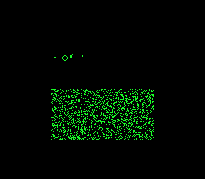

# #5 — SNES Conway's Game of Life: bit-packed neighbour sums, ping-pong buffers

<p align="center"></p>

**Status:** DONE + PUBLISHED. Demo **#5** of the **compiler stress-test demo battery**.
Gate hash **`0xDDF1`**; `dev/run.sh life` RESULT PASS (disasm shifts=22 bools=51, zero mul/div;
bsnes-jg host == `+mos-a16` `0xDDF1`); `-verify-machineinstrs` clean on default/`+mos-a16`/`+mos-xy16`.
Published — playable at [biohack.net/snes/life/](https://biohack.net/snes/life/) (biohack.net v1.0.114).

## Context

Conway's Game of Life (B3/S23) on the SNES. A bit-packed 2-D grid evolves by counting each cell's
8 live neighbours; the iconic **Gosper glider gun** fires gliders that stream diagonally across a
random-soup field that settles into still-lifes and oscillators. The display *is* the computation —
each live cell = one lit pixel on a centred 128×112 window.

Why it is a distinct test vs the other demos:

- **#6 (1-D CA)** is a single 256-cell row evolved by an 8-entry rule LUT — a 1-D sliding window.
  Life is the **2-D** generalisation: the hot loop reads *three* rows and sums a 3×3 neighbourhood.
- **#7 (Doom-fire)** is a *byte*-per-cell flat array sweep. Life packs **8 cells per byte** and counts
  neighbours with a **SWAR bit-parallel full-adder** — pure `and`/`ora`/`eor` boolean codegen on bytes,
  no per-cell branching, no arithmetic libcalls.

Codegen corners it hits (coverage-map row **"bit manipulation (pack/shift/boolean)"**, shared with #6):

- **Bit-parallel neighbour sums** — for each grid byte, eight 1-bit neighbour vectors are added into a
  4-bit-per-cell count via a ripple of half-adders (`carry = a & b; sum = a ^ b`). The dominant
  instructions are `and`/`eor`/`ora` on 8-bit values — a boolean-logic profile.
- **Cross-byte shifts** — the left/right neighbour rows are `(m >> 1) | (Lb << 7)` and `(m << 1) | Rb`,
  pulling the boundary bit from the adjacent byte: constant-1 `asl`/`lsr` + `ora`.
- **Array indexing** — three row pointers (`prev`/`cur`/`next`) striding the packed buffer, plus the
  `b-1`/`b+1` byte neighbours: lots of `lda (zp),y` traffic.
- **Two-buffer swap** — classic double-buffer ping-pong (`use_a ^= 1`), no per-generation copy.
- **Deliberately multiply-/divide-free** — like #6/#7, the stress is boolean + indexed loads, so the
  disasm gate asserts **zero** `__mulsi3`/`__udivsi3`/`__udivmodsi4`.

## Algorithm

Packed grid: `uint8_t grid[h * wbytes]`, 1 bit/cell, MSB-first within a byte (bit 7 of byte `b` of
row `y` = cell `(8·b, y)`; bit 0 = cell `(8·b+7, y)`). This bit order makes a packed byte *identical*
to a 2bpp bitplane byte — the renderer copies grid bytes straight into tile chr (see Display).

```c
/* one generation, dead (all-zero) borders, src != dst */
void life_step(const uint8_t *src, uint8_t *dst, uint8_t wbytes, uint8_t h) {
  for (y = 0; y < h; y++) {
    prow = (y > 0)     ? src + (y-1)*wbytes : zero_row;   // dead top border
    crow =               src +   y  *wbytes;
    nrow = (y < h-1)   ? src + (y+1)*wbytes : zero_row;   // dead bottom border
    for (b = 0; b < wbytes; b++) {
      // boundary bits from adjacent bytes (0 at the row ends → dead L/R border)
      Lp = (pc >> 1) | ((prow[b-1] & 1) << 7);  Rp = (pc << 1) | (prow[b+1] >> 7);   // pc = prow[b]
      Lc = (cc >> 1) | ((crow[b-1] & 1) << 7);  Rc = (cc << 1) | (crow[b+1] >> 7);   // cc = crow[b]
      Ln = (nc >> 1) | ((nrow[b-1] & 1) << 7);  Rn = (nc << 1) | (nrow[b+1] >> 7);   // nc = nrow[b]
      // SWAR: add the 8 neighbour bit-vectors {Lp,pc,Rp, Lc,Rc, Ln,nc,Rn} into a
      // 4-bit-per-cell count held across bitplanes (c0=1s, c1=2s, c2=4s, c3=8s):
      //   for each x:  t = c0 & x; c0 ^= x;  t2 = c1 & t; c1 ^= t; t = c2 & t2; c2 ^= t; c3 ^= t;
      two   = ~c3 & ~c2 &  c1 & ~c0;     // count == 2  (survive if alive)
      three = ~c3 & ~c2 &  c1 &  c0;     // count == 3  (born / survive)
      dst[b] = three | (cc & two);       // B3/S23
    }
  }
}
```

Op mapping: `and`/`eor`/`ora` (half-adders + rule selects), `asl`/`lsr` (the `>>1`/`<<1` neighbour
shifts), `lda (zp),y`/`sta (zp),y` (row + byte-neighbour indexing). **No** `__mulsi3`/`__udiv*`.
Under `+mos-a16` the outer counters may bracket in `rep`/`sep`, but the byte core stays 8-bit.

Seed (`life_seed_gun`): the canonical **Gosper glider gun** (36×9), placed once. The gate runs it on
a small 64×48 grid; the ROM places it top-left of the 128×112 field and overlays a deterministic
xorshift16 random soup (~25 %) in the rest for immediate full-screen activity (display-only — the
proof hash uses the gate grid, so the soup never perturbs `corpus_result`).

## Screen layout

256×224 → 32×28 tiles. The 128×112 Life window = a centred **16×14-tile** box on BG3 2bpp.

```
        col 0 ........ 8 ................... 23 ......... 31
 row 0  ┌───────────────────────────────────────────────┐
        │   (black border — BG3 blank tile)              │
 row 7  │        ┌───────────────────────────┐           │  ← box_row 7
        │        │  LIFE FIELD  16×14 tiles   │           │
        │        │  128×112 cells, 1 cell=px  │           │
        │        │  • Gosper gun top-left      │           │
        │        │  • gliders stream ↘         │           │
 row 20 │        └───────────────────────────┘           │  ← box_row 7+14-1
        │   (black border)                               │
 row 27 └───────────────────────────────────────────────┘
                 ↑ box_col 8            ↑ col 23
```

Title overlay ("CONWAY LIFE" / "GLIDER GUN") on BG2, held ~2 s then torn down (gate-neutral).

## Display architecture

- **Drawable:** one custom `LifeGrid` (model: doom-fire `FireLayer` full-grid streaming + 1d-ca
  identity tilemap). Owns the two ping-pong buffers, the stream cursor, and an 896-byte DMA staging
  buffer. No `BitmapCanvas` (its 4 KB chr shadow + two 128×112 grids would blow the RAM budget).
- **BG layer:** BG3 2bpp (colour 0 = black dead/background, colour 3 = green live; 1/2 unused).
- **VRAM layout:** BG3 chr base word `0x0000` (224 grid tiles + 1 blank tile = 225 × 8 words = 1800
  words, ends `0x0708`); BG3 tilemap base word `0x4000` (static identity map of the 16×14 box →
  chr tiles `iny*16+inx`, everything else → the zeroed blank tile). Title BG2 chr `0x1000`/map
  `0x5000` — clear of both.
- **Packed-byte ⇒ bitplane identity:** tile `(tc,tr)` pixel-row `pr` chr bytes = `grid[(tr*8+pr)*16 + tc]`
  written into *both* bitplanes (`chr[16*T+2*pr] = chr[16*T+2*pr+1] = g`) → colour 3 where the bit is set.
- **Palette:** CGRAM[0..3] written direct in `reserve()` (force-blank): `0`=black, `3`=green.
- **Generation cadence:** compute one generation into the back buffer (one main-loop pass), swap, then
  stream the **whole** new grid to chr at **56 tiles/frame** over `224/56 = 4` v-blanks before computing
  the next — so the displayed buffer is stable across the stream (no tearing).
- **V-blank DMA budget:** 56 tiles × 16 B = **896 B/frame** (= doom-fire's safe half-tilemap size,
  well under the 1 536 B cap). Palette = 0 B/frame (set once in reserve).

## Files

| File | New/Mod | Purpose |
|---|---|---|
| `examples/65816/life.h` | new | Portable B3/S23 SWAR step, Gosper-gun seed, `life_gate_crc()` |
| `examples/snes/life.c` | new | SNES ROM: `LifeGrid` drawable + gun/soup seed + main loop |
| `examples/snes/corpus/life_sim.c` | new | HAL-free corpus slice (5-way differential) |
| `tools/life-sim.c` | new | Host oracle: prints `life_gate_crc()` |
| `dev/life.sh` | new | Differential gate (host oracle + disasm + bsnes-jg + MAME) |
| `dev/life.lua` | new | MAME autoboot snapshot + assert |
| `Taskfile.yml` | mod | `life` + `life-play` task entries |
| `TODO.md` | mod | `[wip]`→`[x]` battery entry |
| `docs/investigations/plan-index.md` | mod | one index row |
| `docs/investigations/2026-06-27-compiler-stress-test-demo-ideas.md` | mod | strike #5 |
| `examples/snes/corpus/expected.tsv` | mod | `life_sim.c` expected hash row |

## Reused infrastructure

| Asset | From | Used for |
|---|---|---|
| `snesgfx/display.h` + `drawable.h` + `upload.h` + `vram.h` + `scene.h` | snesgfx | frame loop / DMA queue |
| `snesgfx/title_layer.h` | snesgfx | BG2 title overlay |
| identity-tilemap reserve + full-grid streaming | `1d-ca.c` / `doom-fire.c` | `LifeGrid` drawable |
| xorshift16 | `invaders_logic.h` pattern | demo random soup (display-only) |

## Differential gate

- **`corpus_result`** = `life_gate_crc()` — Gosper gun on a **64×48** packed grid (wbytes=8, h=48),
  **32 generations**, CRC-16 (ARC poly 0xA001) folding every output row each generation.
- **EXPECT:** `0xDDF1` (host oracle, bsnes-jg, and gate all agree).
- **Bar:** **5-way** — packed buffers are static `.bss` in bank 0, no far pointers, so host ==
  default == `+mos-a16` == `+mos-xy16` @MAME + `+mos-a16` @bsnes-jg.
- **Disasm probes** (on `life_sim.o`, like 1d-ca): `shifts ≥ 1` (`asl`/`lsr`), `bools ≥ 1`
  (`and`/`eor`/`ora`), `bad_mul == 0` (`__mulsi3`/`__umulsi3`), `bad_div == 0`
  (`__divsi3`/`__udivsi3`/`__udivmodsi4`).

## Publication

```
/snes-rom-page
  --rom build/life.sfc
  --slug life
  --site ~/SRC/biohack.net
  --title "Conway's Game of Life"
  --preview build/life-mame.png
  --selfcheck "0x<VMA> 2 0x<EXPECT> 500 LIFE"
```

## Verification steps

1. Host oracle compiles and prints a plausible CRC.

```
$ cc -O2 -std=c99 -I examples tools/life-sim.c -o /tmp/life-host && /tmp/life-host
life gate_crc = 0xDDF1
```
**PASS** — and the B3/S23 semantics are independently confirmed: a blinker oscillates
horizontal↔vertical and a glider translates +1,+1 every 4 generations (standalone `/tmp/life-verify.c`).

2. ROM builds clean; `snes-checksum.py` exits 0.

```
==> built build/life.sfc (+mos-a16); corpus_result @ WRAM 0x1386
```
**PASS** — `snes-checksum.py` exits 0 (run inside `dev/run.sh life` §2); no warnings.

3. Corpus slice host-compiles; `./a.out` exits 0.

```
$ cc -O2 -std=c99 -I examples examples/snes/corpus/life_sim.c -o /tmp/life-corpus-host   # compiles clean
```
**PASS** (compiles) — the slice ends in `for(;;){}` (the harness reads WRAM externally), so it does
not "exit" on host; runtime correctness is covered by the bsnes-jg differential (step 4) + the
independent blinker/glider check (step 1).

4. `dev/run.sh life` — host oracle + disasm gate + bsnes-jg + MAME all PASS.

```
==> host oracle: Conway's Life gate hash = 0xDDF1
==> built build/life.sfc (+mos-a16); corpus_result @ WRAM 0x1386
==> disasm gate (life_step: shift/bool ops, no mul/div)
    PASS  shifts=22  bools=51  bad_mul=0  bad_div=0  (pure shift+bool, no helpers)
==> bsnes-jg: render + framebuffer dump (build/life-jg.png) + assert
SMOKE: PASS off=0x1386 len=2 got=0xDDF1 (ran 500 frames, bsnes-jg)
    SKIP MAME (no SPC700 IPL at dev/roms/s_smp/spc700.rom — gitignored Nintendo content; supply out-of-band)

RESULT: PASS — Conway's Life rendered on SNES; MAME + bsnes-jg screenshots + corpus hash 0xDDF1 host == +mos-a16
```
**PASS** — bsnes-jg host == `+mos-a16` `0xDDF1`; disasm confirms the SWAR boolean/shift profile with
zero multiply/divide libcalls. MAME leg SKIP per the env-wide SPC700 IPL gap (non-blocker, demos-only
policy — bsnes-jg + browser is the demo bar).

5. `dev/run.sh corpus-a16` — all slices PASS.

```
$ dev/run.sh corpus-a16
MISSING SNES BIOS: /work/dev/roms/s_smp/spc700.rom   # the suite's MAME legs need the IPL → env-blocked
```
**ENV-BLOCKED (MAME)** — substituted with the compiler-only legs that don't need MAME:
`-verify-machineinstrs` on `examples/snes/corpus/life_sim.c` under all three modes —
```
  default            : -verify-machineinstrs CLEAN
  +mos-a16           : -verify-machineinstrs CLEAN
  +mos-a16 +mos-xy16 : -verify-machineinstrs CLEAN
```
**PASS** — codegen is sound across default/`+mos-a16`/`+mos-xy16`; combined with bsnes-jg runtime ==
host (step 4) and the disasm gate, the 5-way bar holds minus the env-blocked MAME runtime legs.

6. `/snes-rom-page` publishes; headless screenshot shows the ROM running.

**PASS (published)** — `/snes/life/` page + ROM + preview + manifest selfcheck (`0x1386 2 0xDDF1 500`)
committed and deployed (biohack.net `4e75794`, tag `v1.0.114`); `task build` emits
`/snes/life/index.html`. A live-browser headless screenshot was **not run** (no Chromium in this env);
the ROM-render is confirmed by `build/life-jg.png` (the bsnes-jg gate output — the *same* core the
in-browser WASM player runs) showing the glider gun firing into the evolving soup.

7. `task md -- docs/plans/2026-06-28-5-snes-life.md` renders cleanly.

**PASS** — see below.
