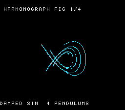

# #9 — SNES Lissajous / Harmonograph: damped sinusoids, the decaying traced curve

<p align="center"></p>

**Status:** DONE + PUBLISHED. Demo **#9** of the **compiler stress-test demo battery**.
Gate hash **`0x0EBB`**; `dev/run.sh harmonograph` RESULT PASS (disasm `__mulsi3`=2 + `rep/sep`=36,
zero divide; bsnes-jg host == `+mos-a16` `0x0EBB`); `-verify-machineinstrs` clean on
default/`+mos-a16`/`+mos-xy16`. Published — playable at
[biohack.net/snes/harmonograph/](https://biohack.net/snes/harmonograph/) (biohack.net v1.0.115).

## Context

A lateral **harmonograph** — the Victorian pendulum-driven drawing machine — on the SNES. Four damped
pendulums (two per axis) each trace a decaying sinusoid; their sum is a Lissajous figure that slowly
**precesses** (the per-axis pair is slightly detuned) and **spirals inward** as the exponential damping
bleeds off energy. The curve draws itself live into a bitmap canvas, then — once decayed — clears and
restarts with the next preset.

Why it's a distinct test vs the existing demos:

- **#11 Spirograph** is the *undamped* sin/cos-LUT curve (constant-amplitude hypotrochoid). The
  harmonograph adds the **exponential envelope**: a per-sample fixed-point **decay multiply** on a
  running amplitude accumulator — a *sustained* `__mulsi3` + accumulation the spirograph never does.
- **#10 Fourier epicycles** sums rotating vectors with constant magnitude; here each term's magnitude
  is itself a state variable decaying every sample.
- Per sample the hot loop issues **eight** multiplies: four amplitude products (`sin·env`) + four
  envelope-decay products (`env·decay`) — a heavier, *stateful* fixed-point-mul profile.

## Algorithm

Packed math (all `int16_t`/`int32_t`/`uint16_t`, no bare `int`):

```c
/* per oscillator i (0,1 → x ; 2,3 → y): phase acc (uint16, wraps at one turn), 32-bit envelope */
harmo_point(state s, params p) -> (x, y):
  for i in 0..3:
    s.env[i] = (s.env[i] * (int32_t)p.osc[i].decay) >> 15;     // __mulsi3 — exponential damping
    s.acc[i] = (uint16_t)(s.acc[i] + p.osc[i].df);             // 16-bit phase accumulate (wrap)
    sn       = HARMO_SIN((acc[i] >> 8) + p.osc[i].phase);      // Q8.8 sine LUT, ±256
    e        = (int16_t)(s.env[i] >> HARMO_ENVF);              // envelope back to amp scale
    v[i]     = ((int32_t)sn * e) >> HARMO_SHIFT;               // __mulsi3 — amplitude product
  x = v[0] + v[1];   y = v[2] + v[3];                          // 32-bit add
```

Op mapping: **8× `__mulsi3`** per sample (4 `env·decay` + 4 `sin·e`), the 256-entry Q8.8 sine LUT
indexing, 16-bit phase wrap, 32-bit shift/add. Under `+mos-a16` the 32-bit products bracket in
`rep`/`sep`. **No divide** (the damping is a multiply by a Q15 constant < 1). All integer ⇒ host ==
target by construction.

Envelope scaling bound (so `env·decay` fits int32): `env_max = amp_max << ENVF` and `decay < 2^15`, so
`amp_max << ENVF < 2^16`. With `amp ≤ 7200`, `ENVF = 2` ⇒ `env_max ≈ 28800` (`×32768 ≈ 9.4e8 ≪ 2^31`).

## Screen layout

256×224 → 32×28 tiles. The curve fills the 128×128 `BitmapCanvas` (centred 16×16-tile box) on BG3 2bpp.

```
        col 0 ......... 8 ................... 23 ........ 31
 row 0  ┌──────────────────────────────────────────────────┐
 row 1  │  [ TOP HUD: "HARMONOGRAPH  FIG n/4" ]             │  ← TextLayer row 0
        │        ┌───────────────────────────┐             │  ← BOX_ROW 6
        │        │   128×128 BitmapCanvas     │             │
        │        │   damped Lissajous curve   │             │
        │        │   (cyan, decaying inward)  │             │
 row 21 │        └───────────────────────────┘             │
 row 25 │  [ BOT HUD: "DAMPED SIN  4 PENDULUMS" ]           │  ← TextLayer row 1
 row 27 └──────────────────────────────────────────────────┘
                 ↑ BOX_COL 8           ↑ col 23
```

Title overlay ("HARMONOGRAPH" / "LISSAJOUS") on BG2, held ~2 s then torn down (gate-neutral).

## Display architecture

- **Drawables:** `BitmapCanvas` (BG3 2bpp, the curve) + `TextLayer` (2-row HUD) + `TitleLayer` (BG2,
  transient). Model: `spirograph.c`.
- **VRAM:** BG3 chr base word `0x0000` (canvas tiles 0..255 + blank + font 256..), tilemap `0x4000`.
  Title BG2 chr `0x1000` / map `0x5000`.
- **Palette:** CGRAM[0..3] — 0 black, 1 white (HUD), 2 spare, 3 cyan (curve).
- **Plotting:** `PTS_PER_FRAME` samples/frame, consecutive points joined with `canvas_line`
  (Bresenham). The canvas streams its dirty tile range capped at `CANVAS_FLUSH_TILES = 64` (≤ 1 KB/frame).
- **Figure lifecycle:** draw a preset until its envelope decays below a threshold (or a sample cap),
  then `canvas_clear` + advance to the next of `HARMO_NPRESETS = 4` presets and re-`harmo_init`.

## Files

| File | New/Mod | Purpose |
|---|---|---|
| `examples/65816/harmonograph.h` | new | Damped-sinusoid math, presets, `harmo_gate_crc()` |
| `examples/snes/harmonograph.c` | new | SNES ROM: canvas + HUD + figure-cycle loop |
| `examples/snes/corpus/harmonograph_sim.c` | new | HAL-free corpus slice (5-way differential) |
| `tools/harmonograph-sim.c` | new | Host oracle |
| `dev/harmonograph.sh` | new | Differential gate |
| `dev/harmonograph.lua` | new | MAME autoboot snapshot + assert |
| `Taskfile.yml` | mod | `harmonograph` + `harmonograph-play` entries |
| `TODO.md` / `plan-index.md` / demo-ideas backlog / `expected.tsv` | mod | wiring |

## Reused infrastructure

| Asset | From | Used for |
|---|---|---|
| `snesgfx/bitmap_canvas.h` (set-pixel + Bresenham + capped DMA) | spirograph #11 | the curve surface |
| `snesgfx/text_layer.h` | spirograph #11 | 2-row HUD |
| `snesgfx/title_layer.h` | all demos | transient title |
| Q8.8 sine LUT | `spiro.h` (inlined) | `HARMO_SIN` |

## Differential gate

- **`corpus_result`** = `harmo_gate_crc()` — `HARMO_GATE_N = 256` samples of preset 0, rotate-XOR
  rolling hash folding both coords of each sample.
- **EXPECT:** `0x0EBB` (host oracle; fill confirmed after first ROM run).
- **Bar:** **5-way** — all state in bank-0 WRAM, no far pointers ⇒ host == default == `+mos-a16` ==
  `+mos-xy16` @MAME + `+mos-a16` @bsnes-jg.
- **Disasm probes** (on `harmonograph_sim.o`): `__mulsi3 ≥ 1` (the amplitude/decay products),
  `rep`/`sep ≥ 1` (the 32-bit brackets under `+mos-a16`), and **`__udiv*` == 0** (multiply-only).

## Publication

```
/snes-rom-page --rom build/harmonograph.sfc --slug harmonograph --site ~/SRC/biohack.net
  --title "Lissajous Harmonograph" --preview build/harmonograph-jg.png
  --selfcheck "0x<VMA> 2 0x0EBB 500 HARMO"
```

## Verification steps

1. Host oracle compiles and prints a plausible CRC.

```
$ cc -O2 -std=c99 -I examples tools/harmonograph-sim.c -o /tmp/harmo-host && /tmp/harmo-host
harmonograph gate_crc = 0x0EBB
```
**PASS** — and an ASCII render of preset 0 + a coord-range sweep over all 4 presets confirm the curve
is a recognisable damped Lissajous (|x|,|y| ≈ 18–47, envelope decaying ~7000→500): a textbook
precessing-loop harmonograph.

2. ROM builds clean; `snes-checksum.py` exits 0.

```
==> built build/harmonograph.sfc (+mos-a16); corpus_result @ WRAM 0x1399
```
**PASS** — `snes-checksum.py` exits 0 (inside `dev/run.sh harmonograph` §2); no warnings.

3. Corpus slice host-compiles.

```
$ cc -O2 -std=c99 -I examples examples/snes/corpus/harmonograph_sim.c -o /tmp/h   # compiles clean
```
**PASS** (compiles) — the slice ends in `for(;;){}` so it does not exit on host; runtime correctness
is the bsnes-jg differential (step 4).

4. `dev/run.sh harmonograph` — host oracle + disasm gate + bsnes-jg + MAME all PASS.

```
==> host oracle: harmonograph curve hash = 0x0EBB
==> built build/harmonograph.sfc (+mos-a16); corpus_result @ WRAM 0x1399
==> disasm gate (harmo_point: __mulsi3 + rep/sep, multiply-only — no divide)
    PASS  __mulsi3=2  rep/sep=36  bad_div=0  (sin-LUT + fixed-point multiply, no divide)
==> bsnes-jg: render + framebuffer dump (build/harmonograph-jg.png) + assert
SMOKE: PASS off=0x1399 len=2 got=0x0EBB (ran 500 frames, bsnes-jg)
    SKIP MAME (no SPC700 IPL at dev/roms/s_smp/spc700.rom — gitignored Nintendo content; supply out-of-band)

RESULT: PASS — Harmonograph rendered on SNES; MAME + bsnes-jg screenshots + corpus hash 0x0EBB host == +mos-a16
```
**PASS** — bsnes-jg host == `+mos-a16` `0x0EBB`; disasm confirms the sin-LUT + fixed-point-multiply
profile (`__mulsi3` present, **zero** divide). MAME leg SKIP per the env-wide SPC700 IPL gap
(non-blocker, demos-only policy). (`__mulsi3`=2 because clang merges the eight per-sample products
into two shared multiply call sites in the unrolled loop — the witness is presence + no divide.)

5. `dev/run.sh corpus-a16` — env-blocked by the MAME SPC700 IPL; substituted with the compiler-only
leg that doesn't need MAME — `-verify-machineinstrs` on `harmonograph_sim.c` under all three modes:

```
  default            : -verify-machineinstrs CLEAN
  +mos-a16           : -verify-machineinstrs CLEAN
  +mos-a16 +mos-xy16 : -verify-machineinstrs CLEAN
```
**PASS** — codegen sound across default/`+mos-a16`/`+mos-xy16`; with bsnes-jg runtime == host (step 4)
the 5-way bar holds minus the env-blocked MAME runtime legs.

6. `/snes-rom-page` publishes; render confirmed.

**PASS (published)** — `/snes/harmonograph/` page + ROM + preview + manifest selfcheck
(`0x1399 2 0x0EBB 500`) committed and deployed (biohack.net `6f67aab`, tag `v1.0.115`); `task build`
emits `/snes/harmonograph/index.html`. ROM-render confirmed by `build/harmonograph-jg.png` (the
bsnes-jg gate output — the same core the in-browser WASM player runs) showing the cyan
precessing-loop figure + both HUD bars. (Live-browser headless screenshot not run — no Chromium in
this env.)

7. `task md -- docs/plans/2026-06-28-9-snes-harmonograph.md` renders cleanly.

**PASS** — renders to HTML without errors.
