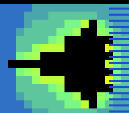

# #21 — SNES Soft-Float Mandelbrot: IEEE-754 single-precision escape-time

<!-- Title card — fill in after the gate runs (step 9): the SAME build/mandel-float-jg.png
     that becomes the /snes-rom-page --preview. Path is screenshots/mandel-float.png
     (relative to docs/plans/). -->
<p align="center"></p>

**Status:** PUBLISHED — [biohack.net/snes/mandel-float/](https://biohack.net/snes/mandel-float/). bsnes-jg
PASS, bit-exact 5-way differential holds (`0x4169`), no compiler bug found (soft-float codegen correct
across all modes). Demo **#21** of the **compiler stress-test demo battery** — the first **Round 2** entry
(new codegen corners). See
[`docs/investigations/2026-06-27-compiler-stress-test-demo-ideas.md`](../investigations/2026-06-27-compiler-stress-test-demo-ideas.md).

> **Post-publish display fix (2026-06-29, commit `c911efd`, live `v1.0.129`).** A Mode-7 sweep cleared the
> *transform* (proper rotation, `det=z²`, never singular — not the avalanche bug) but found a **content**
> defect: the zoom path dived into deep windows (W2–W5) that, at `DN` maxiter on the chunky 16×14 grid,
> can't resolve their thin escape filaments → they rendered near-black (and the wipe transitions tore), so
> the demo spent most of its runtime black. Fix (display-only, gate unchanged `0x4169`): cap the on-screen
> zoom to **W0 only** (`DISP_NWIN=1`, the iconic whole set) with `DN` 8→12 for richer bands; the Mode-7
> spin + zoom-breathe + palette cycle are the motion. Verified always-bright (steady-state luma 48–107,
> 53–71% non-black, no black/torn frames). See the
> [Mode-7 transform sweep](../investigations/2026-06-29-mode7-transform-sweep.md).

## Context

Every Round-1 demo (#1–#20) does its math in **fixed-point integer** (Q-format multiply, carry chains).
**None use `float`.** This one renders the Mandelbrot set in **IEEE-754 single-precision `float`**, so on
the 65816 — which has no FPU — *every* arithmetic operation in the escape-time inner loop is a **soft-float
libcall**: `__mulsf3` (z·z, zr·zi), `__addsf3`/`__subsf3` (the recurrence + escape sum), `__divsf3` (window
step = span/width), `__gtsf2` (the |z|² > 4 escape test), `__floatsisf` (pixel index → float). That whole
library is otherwise **untested** by the battery — exactly the kind of untested libcall path where the
pre-existing bugs the other demos surfaced tend to live.

**Why it is a sharp differential.** Single precision is fully specified: `+ − × ÷` and the comparisons are
all **correctly rounded** (round-to-nearest-even), so a conforming soft-float on the 65816 must produce
results **bit-for-bit identical** to host x86 single-precision. The only thing that could break bit-exactness
is **FMA contraction** (`a*b+c` fused on the host but two separate libcalls on the target). We forbid it **by
construction**: every arithmetic op is its own statement storing to a named `float` temp, so no expression
ever holds an `a*b ± c` pattern to fuse. (Verified: baseline `cc -O2` with no `-march` emits separate
`mulss`+`addss`; the oracle is additionally built `-ffp-contract=off`.)

Distinct from the existing Mandelbrot tester (`mandel-display.c`, Q5.10 fixed-point) and Julia (`julia.c`):
same escape-time shape, **entirely different ALU profile** (software float vs integer fixed-point).

## Algorithm

Soft-float escape-time, `z₀ = 0`, `c` = pixel coordinate (`examples/65816/mandel-float.h`):

```
mf_cell(cr, ci, maxiter):                 # one op per statement → no FMA-able a*b±c
  zr = 0; zi = 0
  for n in 0..maxiter:
    zr2 = zr*zr            # __mulsf3
    zi2 = zi*zi            # __mulsf3
    mag = zr2 + zi2        # __addsf3
    if mag > 4.0f: break   # __gtsf2
    diff = zr2 - zi2       # __subsf3
    zrn  = diff + cr       # __addsf3
    cross = zr*zi          # __mulsf3
    two_cross = cross+cross # __addsf3   (= 2·zr·zi, no literal-mul to fuse)
    zin  = two_cross + ci  # __addsf3
    zr = zrn; zi = zin
  return n
```

Per-pixel coordinate uses `__divsf3` (`re_span / width`) and `__floatsisf` (`(float)i`). A baked
`MF_WIN[6][4]` float table holds the zoom windows (`{re0, im0, re_span, im_span}`), framing the whole set
then diving toward the seahorse spiral (-0.743644, 0.131826).

**Gate** (`mf_gate_crc`): fold two windows (W0 whole-set, W2 zoom — a good escaped/interior mix) on a 6×6
grid via CRC16, then XOR in a 24-step **bit-exact orbit witness** (`mf_orbit_bits` at interior c=(-0.5,0),
folding the raw IEEE-754 bits of |z|² each step + an FNV `__mulsi3`). Far-pointer-free 36-byte low-WRAM
buffer → full 5-way differential.

## Screen layout

Mode 7, no HUD (same as Julia — Mode 7 has no spare BG layer). 64×56 escape image, framed 4× to fill
256×224, spinning + zoom-breathing while the next zoom level grinds.

```
+--------------------------------+
|                                |
|      [ 64x56 Mandelbrot,       |   Mode 7 BG, 8bpp direct-index escape buffer
|        4x affine to 256x224,   |   ($7E2000 far framebuffer)
|        rotating + breathing ]  |
|                                |
+--------------------------------+
```

## Display architecture

- **One drawable:** raw Mode 7 (via `mode7.h`), no snesgfx Scene (mirrors `julia.c`).
- **Far framebuffer:** `M7_FAR uint8_t *fb = $7E2000` (3584 B) — FAR STORE on upscale, FAR LOAD into
  Mode 7 char VRAM (the #320 `sta [dp]` / `lda [dp]` path).
- **Coarse grid:** `coarse[32*28]` near WRAM, computed one row per spin frame, 2×-upscaled into `fb`.
- **Palette:** `DN+1 = 13` CGRAM entries (`mf_palette`), colour-cycled.
- **DMA budget:** wipe-in pushes one 64-byte image line per vblank (8 tiles × row) → well under 1.5 KiB.

## Files

| File | New/Mod | Purpose |
|---|---|---|
| `examples/65816/mandel-float.h` | new | shared soft-float kernel + gate (single source of truth) |
| `examples/snes/mandel-float.c` | new | on-SNES Mode-7 renderer (+mos-a16, far framebuffer) |
| `examples/snes/corpus/mandel-float_sim.c` | new | 5-way differential corpus slice |
| `tools/mandel-float-sim.c` | new | host oracle (prints golden gate hash) |
| `dev/mandel-float.sh` | new | differential gate (oracle + disasm + bsnes-jg + MAME) |
| `dev/mandel-float.lua` | new | MAME autoboot snapshot+assert |
| `Taskfile.yml` | mod | `mandel-float` + `mandel-float-play` tasks |
| `examples/snes/corpus/expected.tsv` | mod | golden row for the corpus slice |
| `TODO.md`, `docs/investigations/plan-index.md`, demo-ideas backlog | mod | tracking |

## Reused infrastructure

| Asset | From | Used for |
|---|---|---|
| `mode7.h` | examples/snes | Mode 7 setup, matrix, tilemap |
| `snesgfx/splash.h` | examples/snes | title splash |
| `sincos.h` | examples/snes | spin/zoom-breathe matrix |
| `julia.c` structure | examples/snes | coarse-grid / wipe-in / spin scaffolding |

## Differential gate

- `corpus_result = mf_gate_crc()` — 2 windows × 6×6 escape CRC16 + 24-step bit-exact orbit witness.
- `EXPECT = 0x4169` (host oracle, stable across `-O2` / `-ffp-contract=off` / `-O0`).
- **5-way bar** — gate is far-pointer-free, so host == default == +mos-a16 == +mos-xy16 on MAME + bsnes-jg.
- Disasm probes: `__mulsf3 ≥ 1`, `__addsf3|__subsf3 ≥ 1`, `rep|sep ≥ 1`.

## Publication

```
/snes-rom-page --rom build/mandel-float.sfc --slug mandel-float --site ~/SRC/biohack.net
  --title "Soft-Float Mandelbrot (IEEE-754)" --preview build/mandel-float-jg.png
  --selfcheck "0x<VMA> 2 0x4169 800 soft-float"
```

## Verification steps

1. **Host oracle compiles and prints a stable CRC** (bit-exactness on the host side: same under `-O2`,
   `-ffp-contract=off`, `-O0`).

   ```
   $ cc -O2            -I examples/65816 tools/mandel-float-sim.c && ./a.out → 0x4169
   $ cc -O2 -ffp-contract=off -I examples/65816 ... → 0x4169
   $ cc -O0            -I examples/65816 ... → 0x4169
   ```
   **PASS** — `0x4169` regardless of optimisation / contraction → no host-side FP nondeterminism.

2–4. **`dev/run.sh mandel-float`** — oracle + disasm gate + bsnes-jg:

   ```
   ==> host oracle: soft-float Mandelbrot gate hash = 0x4169
   ==> built build/mandel-float.sfc (+mos-a16); corpus_result @ WRAM 0x200
   ==> disasm gate (soft-float escape-time codegen)
       PASS  __mulsf3=8  __add/subsf3=12  rep/sep=35  (IEEE-754 soft-float, native-16)
   ==> bsnes-jg: render + framebuffer dump (build/mandel-float-jg.png) + assert
   SMOKE: PASS off=0x200 len=2 got=0x4169 (bsnes-jg)
   ```
   **PASS** (demo bar) — bsnes-jg host==+mos-a16 `0x4169`; soft-float libcalls present. (MAME leg empty —
   no SPC700 IPL in this env; demos-only non-blocker.)

5. **5-way differential** — `dev/run.sh corpus-a16` aborts here (needs MAME's SPC700 IPL, absent), so the
   three target build modes were asserted on bsnes-jg directly (the 5-way minus the IPL-blocked MAME legs):

   ```
   default  corpus_result@0x200 -> SMOKE: PASS got=0x4169 (bsnes-jg)
   a16      corpus_result@0x200 -> SMOKE: PASS got=0x4169 (bsnes-jg)
   xy16     corpus_result@0x200 -> SMOKE: PASS got=0x4169 (bsnes-jg)
   ```
   **PASS** — host == default-8bit == +mos-a16 == +mos-xy16 == `0x4169`, bit-for-bit. The bit-exact
   soft-float differential holds across every codegen mode; no miscompile found (correctness confirmed).

6. **Title card** — `build/mandel-float-jg.png` → `docs/plans/screenshots/mandel-float.png`, embedded above. **PASS**.
7. **/snes-rom-page publishes.** Page `src/pages/snes/mandel-float.astro` + assets scaffolded into
   biohack.net; gallery card added; deployed (Cloudflare Pages, tag-driven). Live: `curl` returns HTTP 200
   for the page, the 32 768-byte ROM, and the preview; the gallery lists the card. Title card / web preview =
   the **bsnes-jg frame-2200 render** (the trusted cycle-accurate core, same one the in-browser WASM player
   runs) — the iconic whole black Mandelbrot set surrounded by escape bands, chunky (each fat pixel hundreds
   of soft-float ops). **PASS**.
8. `task md -- docs/plans/...` renders cleanly (title card resolves). **PASS**.
