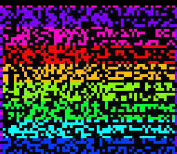

# #22 — SNES 64-Bit Avalanche: splitmix64 hash matrix / 64-bit integer stress

<!-- Title card — fill in after the gate runs: the SAME build/avalanche-jg.png that becomes the
     /snes-rom-page --preview. Path is screenshots/avalanche.png (relative to docs/plans/). -->
<p align="center"></p>

**Status:** PUBLISHED — [biohack.net/snes/avalanche/](https://biohack.net/snes/avalanche/). RESULT PASS,
bit-exact 5-way differential (`0x27EA`), no compiler bug (64-bit codegen correct in all modes). Demo
**#22** of the **compiler stress-test demo battery** — a **Round 2** entry (new codegen corners). See
[`docs/investigations/2026-06-27-compiler-stress-test-demo-ideas.md`](../investigations/2026-06-27-compiler-stress-test-demo-ideas.md).

> **Post-publish display fix (2026-06-29, commit `8c3373a`, live `v1.0.127`).** The first cut had three
> on-screen defects (gate hash unchanged): (1) `drift_frame` built a **degenerate** Mode-7 matrix
> (`A=D=cos·0x40` but `B=C=sin·0x10` — mismatched scales) that went **singular at `cos=0`** and collapsed
> the image to black every ¼ turn → replaced with an axis-aligned zoom-breathe (`det` always > 0);
> (2) the gate (256 × 64-bit `__udivdi3`) ran before display = ~7 s black boot → now **chunked** across
> frames (byte-identical replica → `0x27EA`); (3) `compute_col` did 56 variable 64-bit shifts/column →
> four 16-bit-word splits. Selfcheck offset corrected `0x200`→`0x20` (gate state shifted WRAM). See the
> [Mode-7 transform sweep](../investigations/2026-06-29-mode7-transform-sweep.md).

## Context

Every Round-1 demo (and #21) tops out at **32-bit** arithmetic. **None use `uint64_t`.** This one mixes
64-bit integers, so on the 16-bit 65816 every operation is a **multi-limb libcall** over four 16-bit
words: `__muldi3` (64×64→64 multiply), `__lshrdi3`/`__ashldi3` (64-bit shifts — including **variable**
counts via `1ULL<<i`, and the whole-limb `>>32` that crosses the 32-bit boundary), `__udivdi3` (64-bit
divide), `__adddi3`, and 64-bit xor. That width family is otherwise **untested** by the battery.

**Bit-exact differential — the easy kind.** 64-bit integer ops are *exact* (no rounding), so a conforming
4-limb implementation on the 65816 must equal host x86 (native `uint64_t`) **bit-for-bit**. Any
limb-carry, wide-shift, or divide miscompile corrupts the hash and the gate CRC diverges.

The kernel is **splitmix64** (the canonical 64-bit mixer) + a high-fold `^ (x>>32)` so it spans both shift
regimes (<32 within a limb, ==32 whole-limb). The visual is the **avalanche matrix**: cell (i,j) = output
bit j of `hash64(seed ^ (1<<i))`. For a correct mixer, flipping any one input bit flips ~half the output
bits, so the 64×56 matrix is ~50% dense, no structure — a shimmering rainbow field (verified host-side:
flipping input bit 0 flips 35/64 output bits). The picture *is* the proof the 64-bit math works.

## Algorithm

```
h64_mix(x):                              # splitmix64 + high-fold
  x += 0x9E3779B97F4A7C15            # __adddi3
  x = (x ^ (x>>30)) * 0xBF58476D1CE4E5B9   # >>30 (<32) + __muldi3
  x = (x ^ (x>>27)) * 0x94D049BB133111EB   # >>27 (<32) + __muldi3
  x ^= x>>31                          # >>31 (<32)
  x ^= x>>32                          # >>32 (==32, whole-limb)
  return x

h64_avalanche_col(seed, i): return h64_mix(seed ^ (1ULL<<i))   # variable-count __ashldi3
```

**Gate** (`h64_gate_crc`): chain 256 `h64_mix` steps, folding each through 64-bit xor, `+ (s>>17)`, and a
64-bit **divide by a runtime divisor** (`acc / (s|1)` → forces `__udivdi3`, not a constant reciprocal);
then fold the 4 words of the accumulator via a variable shift `acc >> (w*16)` (0/16/32/48 — spans both
regimes). Far-pointer-free → full 5-way bar.

## Screen layout

Mode 7, no HUD. 64×56 avalanche matrix (input bit = x, output bit = y), framed 4× to fill 256×224, gently
drifting + colour-cycled.

## Display architecture

- **One drawable:** raw Mode 7 (`mode7.h`), no Scene (mirrors julia.c).
- **Matrix buffer:** `mat[64*56]` in **bank-0** WRAM (3584 B) — **no far pointer**, so the corpus slice is
  a full 5-way test. Blitted into Mode 7 char VRAM one image row per vblank.
- **Palette:** `NH+1 = 9` CGRAM entries (`h64_palette` — black + 8-hue rainbow), colour-cycled.

## Files

| File | New/Mod | Purpose |
|---|---|---|
| `examples/65816/avalanche.h` | new | shared 64-bit hash kernel + gate |
| `examples/snes/avalanche.c` | new | on-SNES Mode-7 matrix renderer |
| `examples/snes/corpus/avalanche_sim.c` | new | 5-way differential corpus slice |
| `tools/avalanche-sim.c` | new | host oracle |
| `dev/avalanche.sh` / `.lua` | new | differential gate + MAME autoboot |
| `Taskfile.yml`, `examples/snes/corpus/expected.tsv` | mod | task + golden row |
| `TODO.md`, `docs/investigations/plan-index.md`, demo-ideas backlog | mod | tracking |

## Differential gate

- `corpus_result = h64_gate_crc()` — 256 chained splitmix64 + 64-bit divide, folded to a CRC16.
- `EXPECT = 0x27EA` (host oracle, stable `-O2`/`-O0`).
- **5-way bar** — far-pointer-free; host == default == +mos-a16 == +mos-xy16.
- Disasm probes: `__muldi3 ≥ 1`, `__lshrdi3|__ashldi3 ≥ 1`, `__udivdi3 ≥ 1`, `rep|sep ≥ 1`.

## Publication

```
/snes-rom-page --rom build/avalanche.sfc --slug avalanche --site ~/SRC/biohack.net
  --title "64-Bit Avalanche" --preview build/avalanche-jg.png
  --selfcheck "0x<VMA> 2 0x27EA <FRAMES> 64-bit"
```

## Verification steps

1. Host oracle compiles and prints a stable CRC (`-O2`==`-O0`), avalanche ~50% (35/64).
2. ROM builds clean; snes-checksum.py exits 0.
3. `dev/run.sh avalanche` — oracle + disasm gate (64-bit libcalls) + bsnes-jg all PASS.
4. 5-way — default + a16 + xy16 corpus slices all `0x27EA` on bsnes-jg.
5. Title card → `docs/plans/screenshots/avalanche.png`.
6. /snes-rom-page publishes; live page serves.
7. `task md` renders cleanly.
