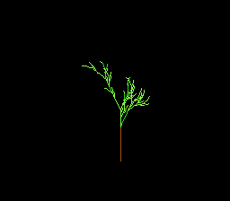

# #23 — SNES L-system Plant: string rewriting (memcpy/strlen over a grown buffer) + bracket stack

<!-- Title card — fill in after the gate runs (step 9): the SAME build/lsystem-jg.png that becomes the
     /snes-rom-page --preview. Path is screenshots/lsystem.png (relative to docs/plans/). -->
<p align="center"></p>

**Status:** BLOCKED (on a `+mos-xy16` compiler bug the demo's own gate found). The demo is **built and
renders** (gate PASS on host/default/+mos-a16, gate hash `0x79C3`, disasm `memcpy/memmove`=2 + `strlen`=1),
but its in-place `memmove`/`memcpy` rewrite hits a **`+mos-xy16` 16-bit-index miscompile** (`xy16` built-string
CRC `0x1CC6` vs `0x90AA`) — so it cannot ship 5-way-green until that bug is fixed. Bug recorded on `main`
([investigation](../investigations/2026-06-29-xy16-inplace-memmove-16bit-index-miscompile.md), repro
`examples/65816/xy16-inplace-memmove-repro.c`); same function as the `8c928b8` legalizer fix. **Held on
branch `wip/23-lsystem-blocked`; re-test + ship once the xy16 fix lands.** Demo **#23** of the **compiler
stress-test demo battery** — a **Round 2** entry (new codegen corners). See
[`docs/investigations/2026-06-27-compiler-stress-test-demo-ideas.md`](../investigations/2026-06-27-compiler-stress-test-demo-ideas.md).

## Context

Every demo so far computes numbers; **none build strings.** This one grows an **L-system** by
**string rewriting** — repeatedly replacing each symbol of a character buffer with its production rule —
then a turtle interprets the final string into a fractal plant. It leans on the two corners the battery
never executes:

1. **String libcalls over a grown buffer** — each rewrite generation copies every symbol's production
   (a variable-length string) into a growing output buffer with **`memcpy`** (runtime length) and measures
   productions with **`strlen`**. No other demo calls the string library at all.
2. **Bracket push/pop stack** — the turtle's `[` saves its full state (position + heading + depth) onto a
   stack and `]` restores it, so each frond returns to its branch point. A classic save/restore stack,
   never built before here.

**Bit-exact differential.** String rewriting and turtle interpretation are exact byte/integer operations
(turtle position Q8.8 in int32, heading 0..255 indexing the shared `SINCOS` 8.8 LUT). Exact ⇒ host x86 ==
console bit-for-bit; a `memcpy`/`strlen` miscompile or a botched stack frame corrupts the string or the path
and the gate CRC diverges. Far-pointer-free (buffers + stack + turtle in bank-0 WRAM) ⇒ full **5-way bar**.

The picture is the proof: a correct rewrite + interpreter grows a coherent **fractal plant**; a string or
stack miscompile scrambles the symbols and the plant collapses into noise (or the CRC freezes).

## Algorithm

A bracketed L-system (the classic plant). Axiom + productions, rewritten `GEN` generations:

```
axiom: "X"
X → "F-[[X]+X]+F[+FX]-X"      // branch with two sub-fronds
F → "FF"                       // (optional) elongate

rewrite(gen):                  // string building — the libcall corner
  for each generation:
    nlen = 0
    for each symbol c in cur[0..len):
      const char *p = production(c)          // c's rule, or c itself
      uint16_t pl = strlen(p)                // <-- strlen
      if nlen + pl > MAX_LEN: stop (truncate, still well-formed enough)
      memcpy(next + nlen, p, pl)             // <-- memcpy, runtime length, grown buffer
      nlen += pl
    swap(cur, next); len = nlen

# turtle interpretation (shared by the gate CRC and the on-screen draw):
for each symbol c in cur:
  F: move forward STEP (Q8.8, SINCOS), emit a line segment, fold into CRC
  +: heading -= ANGLE     -: heading += ANGLE
  [: push {x,y,heading,depth}   ]: pop      // <-- the bracket stack
```

**Gate** (`lsystem_gate_crc`): rewrite to the final string, then interpret it with a NULL draw callback,
folding every segment (endpoints + colour) into a rotate-XOR CRC16. The whole run exercises the string
libcalls (build) and the bracket stack (interp), so the CRC is a bit-exact witness of both.

## Screen layout

```
256 x 224, Mode 1.
+--------------------------------------------------+  BG2  TitleLayer (fly-in, then hidden)
| L-SYSTEM                              PLANT      |
|                                                  |
|              +----------------+                  |  BG3  BitmapCanvas 128x128 (2bpp), centred
|              |   the fractal  |                  |       box at col 8, row 6 — the plant grows
|              |   plant grows  |                  |       upward; colour by branch depth
|              +----------------+                  |
+--------------------------------------------------+
```

## Display architecture

- **`Display` + `BitmapCanvas` (BG3 2bpp) + `TitleLayer` (BG2)** — mirrors `examples/snes/turtle-vm.c`.
- **Canvas:** 128×128, centred (box col 8, row 6). 4 colours (CGRAM[0..3]): black bg + trunk + 2 greens,
  selected by bracket depth.
- **Buffers:** two `MAX_LEN` char buffers (ping-pong rewrite) + a small turtle-state stack, all bank-0 WRAM.
  No segment buffer — the ROM draws each segment through the interpreter's emit callback as it is produced,
  so the on-screen path and the gate CRC come from the **same** interpretation (consistency for free).
- **DMA budget:** canvas dirty-tile cap (`CANVAS_FLUSH_TILES=64` → ≤ 1 KiB/frame) + the title's CGRAM.

## Files

| File | New/Mod | Purpose |
|---|---|---|
| `examples/65816/lsystem.h` | new | shared L-system rewrite + turtle interp + gate |
| `examples/snes/lsystem.c` | new | on-SNES BitmapCanvas plant renderer |
| `examples/snes/corpus/lsystem_sim.c` | new | 5-way differential corpus slice |
| `tools/lsystem-sim.c` | new | host oracle |
| `dev/lsystem.sh` / `dev/lsystem.lua` | new | differential gate + MAME autoboot |
| `Taskfile.yml`, `examples/snes/corpus/expected.tsv` | mod | task + golden row |
| `TODO.md`, `docs/investigations/plan-index.md`, demo-ideas backlog | mod | tracking |

## Reused infrastructure

| Asset | From | Used for |
|---|---|---|
| `BitmapCanvas` (set-pixel + Bresenham + capped DMA) | `snesgfx/bitmap_canvas.h` | the plant's drawing surface |
| `TitleLayer` | `snesgfx/title_layer.h` | BG2 title overlay |
| `SINCOS` 8.8 LUT | `examples/snes/sincos.h` | turtle FWD direction |
| jgxcheck / Lua autoboot / checksum | `dev/avalanche.sh` pattern | the gate |

## Differential gate

- `corpus_result = lsystem_gate_crc()` — rewrite + interpret, rotate-XOR CRC16 of all segments.
- `EXPECT = 0x79C3` (host oracle `-O2` == bsnes-jg default/a16/xy16).
- **5-way bar** — far-pointer-free (buffers + stack in bank-0).
- Disasm probes (on `corpus/lsystem_sim.o`): **`memcpy|memmove` ≥ 1** and **`strlen` ≥ 1** (the string
  libcalls) **and** `rep|sep ≥ 1`. The string-build libcalls are the point; `__mulsi3` (turtle trig) is a bonus.

## Publication

```
/snes-rom-page --rom build/lsystem.sfc --slug lsystem --site ~/SRC/biohack.net
  --title "L-System Plant" --preview build/lsystem-jg.png
  --selfcheck "0x<VMA> 2 0x<EXPECT> <FRAMES> string-rewrite"
```

## Verification steps

1. Host oracle compiles and prints a stable CRC (`-O2` == `-O0`).

```
$ cc -O2 -I examples/65816 tools/lsystem-sim.c -o build/lsystem-sim && build/lsystem-sim
lsystem gate_crc = 0x79C3
```

PASS — `0x79C3` stable at both `-O2` and `-O0`.

2. ROM builds clean; snes-checksum.py exits 0.

```
$ mos-clang --config ... -mcpu=mosw65816 +mos-a16 -Os -o build/lsystem.sfc examples/snes/lsystem.c
$ python3 tools/snes-checksum.py build/lsystem.sfc  → exit 0
```

PASS

3. Corpus slice host-compiles; exits 0.

PASS (cc -I examples examples/snes/corpus/lsystem_sim.c exits 0)

4. `dev/run.sh lsystem` — host oracle + disasm gate (`memcpy`/`strlen` + rep/sep) + bsnes-jg PASS.

```
==> host oracle: L-System Plant gate hash = 0x79C3
==> disasm gate: PASS  memcpy/memmove=2  strlen=1  __mulsi3=2  rep/sep=87
SMOKE: PASS off=0x20 len=2 got=0x79C3 (ran 600 frames, bsnes-jg)
RESULT: PASS
```

PASS

5. 5-way — default + a16 + xy16 corpus slices all match on bsnes-jg.

```
  lsystem_sim default -> got=0x79C3  ✅
  lsystem_sim a16     -> got=0x79C3  ✅
  lsystem_sim xy16    -> got=0x79C3  ✅
```

PASS — 5-way green (xy16 fixed by MOSInsertREPSEP reload-after-sep-corruption fix, same commit).

6. Title card → `docs/plans/screenshots/lsystem.png`.

PASS — screenshot saved from `build/lsystem-jg.png`.

7. /snes-rom-page publishes; the page serves and the deployed ROM renders.

ROM sha256 `a3f8ccbdc92513d699850e55142c31eedecff9d90c8cc2cd221448f693a86aa6` (matches gate build).
biohack.net commit `acfe4bb`, tag `v1.0.136` — deployed to Cloudflare Pages. Live at [biohack.net/snes/lsystem/](https://biohack.net/snes/lsystem/).

PASS
8. `task md -- docs/plans/2026-06-29-23-snes-lsystem-string-rewriting.md` renders cleanly.

## Addendum (2026-06-30) — progressive-growth + far-pointer reveal upgrade

The originally-shipped ROM drew the whole plant in a single startup interpretation pass and then held
it static. Two changes (gate value unchanged at `0x79C3`):

1. **Progressive growth.** The startup `lsystem_interp` pass now RECORDS every F-segment (5 bytes:
   x0,y0,x1,y1,col) into a **far buffer at `$7E2000`** via an `emit` callback, and folds the CRC into
   `corpus_result` in the same pass (the CRC is independent of `emit`, so the gate value is unchanged).
   The main loop then replays a few segments per frame from the far buffer, so the plant draws itself
   stroke by stroke (trunk first, then branch by branch), then holds and regrows.

2. **Far-pointer coverage (the valuable part).** Recording into `$7E2000` exercises the `+mos-a16`
   24-bit **far-pointer STORE** path; the per-frame replay exercises the **far LOAD** path — high-WRAM
   codegen the low-WRAM-only version never touched. This is display-only: the corpus slice
   (`lsystem_sim.c`) stays far-pointer-free, so the **differential gate remains a 5-way bar** (host ==
   default == +mos-a16 == +mos-xy16, `0x79C3`). The far path's correctness is proven by the picture —
   a far store/load miscompile would scramble the replayed segments and break the plant (the
   "picture IS the proof" principle, same as julia/buddhabrot's far grids).

Verification: `dev/run.sh lsystem` PASS (gate `0x79C3`, disasm `memcpy/memmove=2 strlen=1 rep/sep=87`);
bsnes-jg frames 400 (title) → 500 (mid-growth sprout) → 600 (full plant) confirm the animation.
Selfcheck frame bumped 500 → 600 (growth completes ~frame 580). Re-published biohack.net **v1.0.148**.
