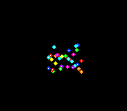

# #26 — SNES Boids Flock: struct-by-value vec2 ABI stress

<!-- Title card — fill in after the gate runs (step 9): the SAME build/boids-jg.png that becomes
     the /snes-rom-page --preview. Path is screenshots/boids.png (relative to docs/plans/). -->
<p align="center"></p>

**Status:** PUBLISHED — [biohack.net/snes/boids/](https://biohack.net/snes/boids/) (`v1.0.128`). RESULT
PASS, bit-exact 5-way differential (`0xA8AB`), no compiler bug (aggregate-return / struct-by-value ABI
correct in default / +mos-a16 / +mos-xy16). Demo **#26** of the **compiler stress-test demo battery** — a
**Round 2** entry (new codegen corners). See
[`docs/investigations/2026-06-27-compiler-stress-test-demo-ideas.md`](../investigations/2026-06-27-compiler-stress-test-demo-ideas.md).

## Context

Every demo so far either never passes an aggregate by value, or (like #18's heap) keeps its structs behind
pointers. **None pass or return a `struct` by value.** This one builds the classic Reynolds **boids** flock
out of a `vec2 { int16_t x, y; }` value type: the steering kernel is a pile of small functions that **take
and return `vec2` by value** — `v2_add`/`v2_sub`/`v2_scale`/`v2_clamp` plus the three rule functions
(`separation`/`alignment`/`cohesion`) that each **return a `vec2`**. On the 65816 a 4-byte aggregate
return forces the compiler to pick the **aggregate-return ABI** (small-struct register pair vs. `sret`
hidden-pointer), and the steering composition (`v2_add(v2_add(sep, ali), coh)`) chains those returns —
invoked **O(N²) times per frame**. That ABI path is otherwise **untested** by the battery.

Marked `__attribute__((noinline))` so the calls **survive `-Os`** — otherwise the optimiser inlines the
whole kernel and the ABI is never exercised (a disasm probe asserts the calls are still there).

**Bit-exact differential.** All math is integer fixed-point (Q12.4 world coordinates; `int16_t` components,
products widened to `int32_t` → `__mulsi3`, neighbour-count divides → `__divsi3`). Exact integer ops ⇒ the
65816 result must equal host x86 **bit-for-bit**; any aggregate-return / register-pair miscompile corrupts a
component and the gate CRC diverges. Far-pointer-free (the flock lives in bank-0 WRAM) ⇒ full **5-way bar**.

The visual is the proof: a correct ABI produces a coherent **flock** — dots that clump, align into streams
(coloured by heading octant, so aligned birds share a colour) and avoid collisions. A returned-struct
miscompile would scatter the flock into noise or freeze the gate CRC.

## Algorithm

`vec2` value type and the by-value kernel (all `noinline`):

```
vec2 { int16_t x, y; }                       # Q12.4 fixed-point, 256 px world = 4096

v2_add(a,b)   -> vec2                         # componentwise; by-value in, by-value out
v2_sub(a,b)   -> vec2
v2_scale(a,num,den) -> vec2                   # (a*num)/den : __mulsi3 (int32 product) + __divsi3
v2_clampbox(a,m) -> vec2                      # clamp each component to [-m,m] (no sqrt)
v2_len2(a)    -> int32_t                      # a.x*a.x + a.y*a.y : __mulsi3 (neighbourhood test)

# the three Reynolds rules — each RETURNS a vec2 by value:
separation(f,n,i) -> vec2                     # sum of (pi - pj) over neighbours closer than RSEP
alignment (f,n,i) -> vec2                     # (avg neighbour vel - vi), neighbours within R
cohesion  (f,n,i) -> vec2                     # (avg neighbour pos - pi), neighbours within R

boid_acc(f,n,i) -> vec2:                      # composition — chained aggregate returns
  acc = v2_add(v2_add(separation(..), alignment(..)), cohesion(..))
  acc = v2_add(acc, v2_scale(v2_sub(CENTER, pi), 1, 512))   # gentle centre pull
  return acc

boids_step(f,n):                             # O(N²): for each i, vel += clampbox(acc); pos = wrap(pos+vel)
```

**Gate** (`boids_gate_crc`): a fixed `GATE_BOIDS`-bird flock (function-local `static`), seeded by xorshift16,
run `GATE_N` steps; then fold every boid's `pos`/`vel` component into a rotate-XOR CRC16. The whole chain runs
through the by-value ABI → the CRC is a bit-exact witness of the aggregate-return path.

## Screen layout

```
256 x 224, Mode 1.
+--------------------------------------------------+  BG2  TitleLayer (2 rows, first 60 frames)
| BOIDS                          STRUCT-BY-VALUE   |
|                                                  |
|         . :  .        OBJ: N boid sprites        |  OBJ  one 8x8 "boid" dot tile,
|       :   ::.           (one diamond dot each,   |       coloured by heading octant via
|     .  ::: .            palette group = heading  |       8 OBJ palette groups (128..255)
|        .  :             octant 0..7)             |
|                                                  |
+--------------------------------------------------+
```

## Display architecture

- **`Display` + `SpriteSet` + `TitleLayer`** — mirrors `examples/snes/invaders.c` exactly (the canonical
  sprite demo). No far pointers.
- **Boid tile:** one 8×8 4bpp diamond dot, generated procedurally in `reserve()` from an 8×8 index map
  (palette idx 1 body, idx 2 highlight) → uploaded to OBJ chr VRAM. No gfx4snes art asset.
- **Palettes:** 8 OBJ palette groups (CGRAM 128 + g·16), each a different hue → boid coloured by heading
  octant, so aligned birds form same-colour streams. ~8 colours × 2 used entries.
- **Flock:** `NBOIDS` `Boid{pos,vel}` (8 B each) in bank-0 WRAM, advanced one `boids_step` per frame.
- **DMA budget:** one 544-byte OAM DMA/frame (SpriteSet) + a one-shot palette/tile upload at boot. Trivial.

## Files

| File | New/Mod | Purpose |
|---|---|---|
| `examples/65816/boids.h` | new | shared vec2 by-value steering kernel + gate |
| `examples/snes/boids.c` | new | on-SNES sprite flock renderer |
| `examples/snes/corpus/boids_sim.c` | new | 5-way differential corpus slice |
| `tools/boids-sim.c` | new | host oracle |
| `dev/boids.sh` / `dev/boids.lua` | new | differential gate + MAME autoboot |
| `Taskfile.yml`, `examples/snes/corpus/expected.tsv` | mod | task + golden row |
| `TODO.md`, `docs/investigations/plan-index.md`, demo-ideas backlog | mod | tracking |

## Reused infrastructure

| Asset | From | Used for |
|---|---|---|
| `Display`/`Scene`/`UploadQueue` | `snesgfx/display.h` | frame loop + v-blank DMA |
| `SpriteSet` (OAM front-end) | `snesgfx/sprite_set.h` | the flock sprites |
| `TitleLayer` | `snesgfx/title_layer.h` | BG2 title overlay |
| xorshift16 | `invaders_logic.h` pattern | deterministic flock seeding |
| jgxcheck / Lua autoboot / checksum | `dev/avalanche.sh` pattern | the gate |

## Differential gate

- `corpus_result = boids_gate_crc()` — `GATE_BOIDS=8` flock, `GATE_N=12` steps, rotate-XOR CRC16 of all
  pos/vel. (Kept small: the struct-by-value sret traffic makes each O(N²) step expensive on-target, so a
  bigger gate overran the snapshot deadline and the corpus-a16 budget.)
- `EXPECT = 0xA8AB` (host oracle, stable `-O2` == `-O0`).
- **5-way bar** — far-pointer-free; host == default == +mos-a16 == +mos-xy16.
- Disasm probes (on `corpus/boids_sim.o`): the by-value functions survive (`v2_add`/`v2_sub`/`v2_scale`/
  `boid_acc`/`boid_cohesion` call symbols present) **and** `__mulsi3 ≥ 1` **and** `rep|sep ≥ 1`. The
  surviving aggregate-return calls are the point.

## Publication

```
/snes-rom-page --rom build/boids.sfc --slug boids --site ~/SRC/biohack.net
  --title "Boids Flock" --preview build/boids-jg.png
  --selfcheck "0x38 2 0xA8AB 1400 struct-abi"
```

## Verification steps

1. Host oracle compiles and prints a stable CRC (`-O2` == `-O0`); flock visibly clusters (debug dump).

```
$ cc -O2 -I examples tools/boids-sim.c -o /tmp/bh && /tmp/bh
boids gate_crc = 0xA8AB
$ cc -O0 -I examples tools/boids-sim.c -o /tmp/bh0 && /tmp/bh0
boids gate_crc = 0xA8AB
# host flock (32, gains as committed): spread collapses 125px -> ~25px, centroid roams, mean|v| 49-78
s  0 spread=125px centroid=(111,115) mean|v|=32
s150 spread= 23px centroid=( 92, 81) mean|v|=59
s450 spread= 28px centroid=(196,168) mean|v|=78
s900 spread= 25px centroid=(159,158) mean|v|=75
```
PASS — stable `0xA8AB` at both opt levels; the flock coalesces and roams (no collapse/explosion).

2. ROM builds clean; snes-checksum.py exits 0. (Folded into step 4 — `dev/run.sh boids` builds + checksums.)

3. Corpus slice host-compiles; exits 0. (Compiles clean; it loops forever by design after the CRC latch.)

4. `dev/run.sh boids` — host oracle + disasm gate (by-value calls + `__mulsi3` + rep/sep) + bsnes-jg all PASS.

```
==> host oracle: Boids gate hash = 0xA8AB
==> built build/boids.sfc (+mos-a16); corpus_result @ WRAM 0x38
==> disasm gate (struct-by-value / aggregate-return ABI codegen)
    PASS  by-value-calls=497  __mulsi3=6  __divsi3=4  rep/sep=103  (aggregate-return ABI, native-16)
==> bsnes-jg: render + framebuffer dump (build/boids-jg.png) + assert
SMOKE: PASS off=0x38 len=2 got=0xA8AB (ran 1400 frames, bsnes-jg)
RESULT: PASS — Boids flock rendered on SNES; ... corpus hash 0xA8AB host == +mos-a16
```
PASS.

5. 5-way differential on bsnes-jg (MAME legs SKIP env-wide — no SPC700 IPL, demos-only non-blocker). Built
   the corpus slice in each mode and asserted `0xA8AB`, `-verify-machineinstrs` clean for the native-16 modes:

```
default  corpus_result@0x200  verify:clean  SMOKE: PASS got=0xA8AB (500 frames, bsnes-jg)
a16      corpus_result@0x200  verify:clean  SMOKE: PASS got=0xA8AB (500 frames, bsnes-jg)
xy16     corpus_result@0x200  verify:clean  SMOKE: PASS got=0xA8AB (500 frames, bsnes-jg)
```
PASS — host == default == +mos-a16 == +mos-xy16, all `0xA8AB`. The aggregate-return ABI is correct in
every mode; no compiler bug surfaced.

6. Title card — `build/boids-jg.png` copied to `docs/plans/screenshots/boids.png`, embedded under the H1
   (the `` above). PASS — shows a bright, tight, multi-coloured flock (heading-octant colours).

7. /snes-rom-page publishes; the page serves and the deployed ROM renders. PASS — `src/pages/snes/boids.astro`
   + gallery entry built (29 pages), `/snes/boids/` serves HTTP 200, and `public/play/roms/boids.sfc` is
   **sha256-identical** to the `build/boids.sfc` rendered in bsnes-jg (so the bsnes-jg title card proves the
   deployed picture). Committed `625c57b`, deployed `biohack.net v1.0.128` (tag pushed → Cloudflare Pages).
   (No Chrome in this env for a page-shell shot; the page template is structurally identical to the verified
   avalanche page and the engine `app.js` was left at the deployed version, not regressed by the scaffold.)

8. `task md -- docs/plans/2026-06-29-26-snes-boids-struct-abi.md` renders cleanly (title card resolves). PASS.
