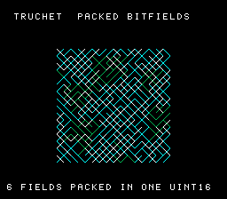

# #29b — SNES Truchet Tiles: packed-bitfield "10 PRINT" maze

<p align="center"></p>

**Status:** VERIFIED (demo bar) — bsnes-jg PASS, bit-exact 5-way differential (`0xB3E6`), no compiler bug
(bitfield insert/extract correct in all modes). Demo **#29b** of the **compiler stress-test demo battery** —
a **Round 2** entry (new codegen corners). See
[`docs/investigations/2026-06-27-compiler-stress-test-demo-ideas.md`](../investigations/2026-06-27-compiler-stress-test-demo-ideas.md).

## Context

No prior demo (Round 1, nor #21/#22/#26/#29a) uses C **bitfields**. This one packs every cell's state into
a **16-bit bitfield struct** and reads/writes those fields thousands of times — exercising the bitfield
**insert/extract** codegen (the `and`/`ora`/`asl`/`lsr` mask-and-merge the compiler emits to poke a few bits
inside a word). A classic miscompile nest: wrong mask, off-by-one shift, signed-field sign-extension, or a
read-modify-write that **clobbers an adjacent field**.

The visual is the classic **"10 PRINT CHR$(205.5+RND(1))"** / Truchet maze: a grid of diagonal segments
(`\` or `/`) forming an interlocking labyrinth, with a colour wave rippling through it. Each cell's diagonal
direction and colour are read out of its bitfields on every redraw, so the insert/extract codegen runs
continuously on screen.

## Algorithm

```c
typedef struct {                 // 16-bit storage unit (uint16_t) -> identical layout host & target
  uint16_t orient:1, style:1, hue:3, phase:2, mark:1, energy:4, spare:4;
} Cell;
tr_make(r):  insert 6 fields from a PRNG word                 // bitfield INSERT
tr_step(g):  per cell, extract own+4 neighbours' energy/mark, // bitfield EXTRACT
             insert new energy/mark/phase (preserving orient/hue/style)   // INSERT (no clobber)
```

**Bitfield-width subtlety (load-bearing):** C bitfield packing uses the *declared type* as the storage
unit, and `unsigned` is 32-bit on host but **16-bit on llvm-mos** → different unit → different struct bytes.
Declaring the fields **`uint16_t : n`** gives a 16-bit unit on both, so the layout matches. The gate then
folds the **extracted field values** (not raw memory), so a divergence means a real insert/extract
miscompile — *never* a legal layout difference. (Per the prime directive: a real divergence would be
isolated + fixed upstream, not worked around.)

## Differential gate

- `corpus_result = tr_gate_crc()` — seed a 16×14 grid (`tr_make`/cell), light sources, run 24 `tr_step`
  wave steps, fold every cell's **extracted** fields through CRC16.
- `EXPECT = 0xB3E6` (host oracle, stable `-O2`/`-O0`; `sizeof(Cell)==2` confirms the 16-bit unit).
- **5-way bar** — far-pointer-free static grid.
- Disasm probes: `and ≥ 1`, `ora ≥ 1`, shift `≥ 1`, `rep|sep ≥ 1`, **`libcalls == 0`** (bitfields are
  pure ALU).

## Display architecture

- snesgfx **Display** pipeline (Mode 1): a 128×128 `BitmapCanvas` (BG3 2bpp) + a 2-row `TextLayer` HUD +
  `TitleLayer` intro. A 16×16 `Cell` display grid; each redraw extracts orient (→ `\`/`/` line) + energy
  (→ colour band 1/2/3) and draws the diagonal via `canvas_line`.
- Five fixed energy sources re-lit every few wave steps → continuous expanding colour rings (so the wave
  never decays to a freeze); the 3 maze colours palette-cycle for flow.

## Verification steps

1. Host oracle stable `0xB3E6` (`-O2`==`-O0`), `sizeof(Cell)==2`, field round-trip correct. **PASS**.
2. `dev/run.sh truchet` — oracle + disasm (bitfield, libcalls=0) + bsnes-jg `0xB3E6`. **PASS**.
3. 5-way — default + a16 + xy16 corpus slices all `0xB3E6` on bsnes-jg (disasm `and=13 ora=8 shift=32
   rep/sep=59 libcalls=0`). **PASS**.
4. Animation — frames differ ~7% (ripples flow), black backdrop, clean HUD, no stuck title. **PASS**.
5. Title card → `docs/plans/screenshots/truchet.png`. **PASS**.
6. /snes-rom-page publishes. _(pending)_

## Publication

```
/snes-rom-page --rom build/truchet.sfc --slug truchet --site ~/SRC/biohack.net
  --title "Truchet (Packed Bitfields)" --preview build/truchet-jg.png
  --selfcheck "0x<VMA> 2 0xB3E6 800 bitfields"
```
