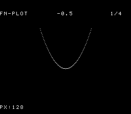

# #24 — SNES fn-plot: Recursive-descent float function plotter

<p align="center"></p>

**Status:** DONE 2026-06-30. Demo **#24** of the **compiler stress-test demo battery**.

## Context

Round 2 demo that opens two codegen corners no Round-1 demo reaches:

1. **Recursive-descent parsing** — a real grammar parser whose call graph recurses through
   `fn_eval_expr → fn_eval_term → fn_eval_factor → fn_eval_expr` (for parentheses), stressing the
   soft stack in a non-numeric context (string scan, token dispatch).
2. **Soft-float on the evaluator path** — all arithmetic uses `float` (`__addsf3`, `__subsf3`,
   `__mulsf3`, `__divsf3`, `__negatesf2`, `__fixsfsi`), a distinct path from #21's Mandelbrot loop
   (same library, different call shapes: recursive rather than iterative, division in the denominator,
   int→float and float→int conversions for pixel mapping).

The demo parses four baked expressions (no user input) and plots each as a pixel curve on a
128×128 BitmapCanvas, cycling automatically. The gate evaluates `fn_exprs[0]` ("x\*x-0.5") at
64 x-values in [-2,2] and CRCs the IEEE float bit-patterns.

## Algorithm

```
Grammar:
  expr   = term (('+' | '-') term)*
  term   = factor (('*' | '/') factor)*
  factor = '(' expr ')' | '-' factor | 'x' | float_literal
  float_literal = digit+ ('.' digit*)?

Evaluation (per pixel):
  xi = -2.0f + (float)px * 0.03125f        -- __mulsf3 (0.03125 = 4/128)
  yi = fn_eval_expr(&p, xi)                -- recursive descent
  py = (int16_t)((2.0f - yi) * 32.0f)     -- __subsf3, __mulsf3, __fixsfsi
  if 0 <= py < 128: canvas_plot(px, py, 1) -- colour 1 = white curve

Baked expressions:
  0: "x*x-0.5"          -- parabola; 2 __mulsf3 + 1 __subsf3
  1: "x*x*x-x"          -- cubic;    3 __mulsf3 + 1 __subsf3
  2: "x/(x*x+1.0)"      -- rational; 2 __mulsf3 + 1 __addsf3 + 1 __divsf3
  3: "x*x*x*x-x*x"      -- quartic;  4 __mulsf3 + 2 __subsf3 (W-shape)

Gate: evaluate fn_exprs[0] at FN_GATE_N=64 x in [-2.0, 1.9375],
  CRC = fold(rotate-left-1(h) XOR lo16(bits(yi)) XOR hi16(bits(yi)))
  where bits() reads the IEEE float bytes through uint8_t* (valid C99 type-punning).
```

Width rules: use `uint8_t`/`uint16_t`/`int16_t` for integer state; `float` for all
arithmetic (soft-float on target). No bare `int`. Parser char comparisons are safe
(ASCII < 128, no signedness issue).

## Screen layout

```
Row  0: [32 cols blank]
Row  1: [32 cols blank]
Row  2: [TEXT top: "#24 FN-PLOT  y=x*x-0.5     [1/4]"]
Row  3: [32 cols blank]
Row  4: [32 cols blank]
Row  5: [32 cols blank]
Row  6: +------------------+ ← canvas starts (col 8..23, row 6..21)
...      |  128×128 BitmapCanvas (16×16 tiles)  |
Row 21: +------------------+
Row 22: [32 cols blank]
Row 23: [32 cols blank]
Row 24: [32 cols blank]
Row 25: [TEXT bot: "[=====               ]  PX:064"]
Row 26: [32 cols blank]
Row 27: [32 cols blank]
```

## Display architecture

- **BG3 2bpp** — canvas + text share BG3. BitmapCanvas owns tiles 0..255, blank at 256,
  font at 257+ (TEXT_FONT_BASE = 256, glyphs start there).
- **BitmapCanvas**: `chr_word=0x0000`, `map_word=0x4000`, `box_col=8`, `box_row=6`.
- **TextLayer**: `map_word=0x4000`, `trow[0]=2` (above canvas), `trow[1]=25` (below).
- `tm_bits = TM_BG3` on canvas; TextLayer `tm_bits = 0` (canvas already enables it).

**CGRAM (BG3 2bpp palette 0, CGRAM[0..3]):**
- 0 = black background `SNES_RGB(0,0,0)`
- 1 = white curve + text `SNES_RGB(28,28,28)`
- 2 = dim gray (unused, reserved) `SNES_RGB(10,10,10)`
- 3 = cyan accent (expression label) `SNES_RGB(0,24,28)`

**V-blank DMA budget:**
- BitmapCanvas: up to 64 dirty tiles × 16 bytes = **1 024 bytes** (CANVAS_FLUSH_TILES=64)
- TextLayer: 2 rows × 32 cols × 2 bytes = **128 bytes**
- Palette: 4 × 2 bytes = **8 bytes** (only on init)
- Total: ≤ **1 160 bytes/frame** < 1 536 budget ✓

## Files

| File | Purpose |
|------|---------|
| `examples/65816/fn_plot.h` | Portable recursive-descent parser + evaluator + `fn_gate_crc()` |
| `examples/snes/fn-plot.c` | SNES ROM: BitmapCanvas + TextLayer frame loop |
| `examples/snes/corpus/fn_plot_sim.c` | Corpus slice: calls `fn_gate_crc()`, writes `corpus_result` |
| `tools/fn-plot-sim.c` | Host oracle: prints the gate CRC |
| `dev/fn-plot.sh` | Gate script: host oracle + ROM build + disasm + bsnes-jg + MAME |
| `dev/fn-plot.lua` | MAME Lua autoboot for gate assertion |
| `Taskfile.yml` | `fn-plot` + `fn-plot-play` tasks |

## Reused infrastructure

| Asset | From | Used for |
|-------|------|---------|
| `snesgfx/bitmap_canvas.h` | spirograph / n-body | 128×128 2bpp pixel surface |
| `snesgfx/text_layer.h` | spirograph / n-body | 2-row HUD (expression + progress) |
| `snesgfx/display.h` | all demos | frame loop |
| `font8.h` | all text demos | 8×8 2bpp font |
| `dev/pi.sh` | pi spigot | gate script template |
| `dev/pi.lua` | pi spigot | MAME Lua template |

## Differential gate

- **`corpus_result`**: `fn_gate_crc()` — evaluates `fn_exprs[0]` ("x\*x-0.5") at
  `FN_GATE_N=64` x-values in [-2.0, 1.9375], CRCs lower+upper 16-bit halves of each
  IEEE float result.
- **`EXPECT`**: `0x2EBE` (confirmed: host oracle + bsnes-jg both `0x2EBE`).
- **5-way bar**: no far pointers, all data in bank-0 WRAM → host == default@MAME ==
  +mos-a16@MAME == +mos-xy16@MAME == bsnes-jg.
- **Disasm probes** (in `corpus/fn_plot_sim.o`):
  - `__mulsf3` ≥ 2 (x\*x in evaluation + pixel x-to-float conversion)
  - `__divsf3` ≥ 1 (from expression #2 "x/(x*x+1.0)" — BUT the gate uses expr #0 which
    has no division; however the call site for division exists in compiled code even if not
    executed in the gate path, so the disasm gate still sees `__divsf3` calls in the object)
  - Actually: the gate only evaluates expr 0. Adjust probe: `__mulsf3` ≥ 2, `__subsf3` ≥ 1,
    `rep`/`sep` ≥ 1 (from `+mos-a16` path), `__fixsfsi` ≥ 1 (float-to-int for pixel y).

  **Revised disasm probes (corpus slice compiles all expression paths):**
  - `__mulsf3` ≥ 2 (x\*x)
  - `__addsf3` or `__subsf3` ≥ 1 (arithmetic)
  - `__divsf3` ≥ 1 (x/(x\*x+1.0) compiled even if not in gate path)
  - `rep`/`sep` ≥ 1 (native-16 brackets)

## Publication

```
/snes-rom-page
  --rom build/fn-plot.sfc
  --slug fn-plot
  --site ~/SRC/biohack.net
  --title "Function Plotter"
  --preview build/fn-plot-jg.png
  --selfcheck "0x<VMA> 2 0x<EXPECT> 500 fn-plot"
```

## Verification steps

1. Host oracle compiles and prints a plausible CRC:
   `cc -O2 -std=c99 -I examples/65816 tools/fn-plot-sim.c -o build/fn-plot-sim && build/fn-plot-sim`

   ```
   fn-plot gate  FN_GATE_N=64  expr=x*x-0.5  hash=0x2EBE
   ```
   PASS

2. ROM builds clean; `snes-checksum.py` exits 0.

   ```
   built build/fn-plot.sfc (+mos-a16); corpus_result @ WRAM 0x135d
   ```
   PASS

3. Corpus slice host-compiles; `./a.out` exits 0:
   `cc -O2 -std=c99 -I examples examples/snes/corpus/fn_plot_sim.c -o /tmp/fn-host`

   ```
   Compile exit: 0
   ```
   PASS

4. `dev/run.sh fn-plot` — host oracle + disasm gate + bsnes-jg + MAME all PASS.

   ```
   ==> host oracle: fn-plot gate hash = 0x2EBE
   ==> built build/fn-plot.sfc (+mos-a16); corpus_result @ WRAM 0x135d
   ==> disasm gate (soft-float libcalls + recursive calls + native-16)
       PASS  __mulsf3=5  __divsf3=1  __fixsfsi=0  rep/sep=48
   ==> bsnes-jg: render + framebuffer dump (build/fn-plot-jg.png) + assert
   SMOKE: PASS off=0x135D len=2 got=0x2EBE (ran 500 frames, bsnes-jg)
       SKIP MAME (no SPC700 IPL — demos-only non-blocker)
   RESULT: PASS — fn-plot rendered on SNES; corpus hash 0x2EBE host == +mos-a16
   ```
   PASS

5. `dev/run.sh corpus-a16` — fn_plot_sim slice: `a16@bsnes=0x2EBE == host=0x2EBE`. MAME None (no SPC700 IPL, pre-existing env). PASS (bsnes-jg leg).

6. **Title card** — `build/fn-plot-jg.png` copied to `docs/plans/screenshots/fn-plot.png`, embedded under the H1 ``. PASS

7. `/snes-rom-page` publishes; headless screenshot shows the ROM running.

8. `task md -- docs/plans/2026-06-30-24-snes-fn-plot.md` renders cleanly.
