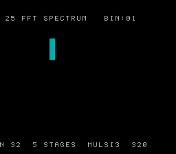

# #25 — SNES FFT Spectrum Analyser: radix-2 DIT butterfly multiply

<p align="center"></p>

**Status:** VERIFIED. Demo **#25** of the **compiler stress-test demo battery**.

## Context

Round 2 demo covering two new corners: **bit-reversal permutation** and the **butterfly twiddle
complex multiply**. The FFT butterfly is 4× `__mulsi3` per call, in a staged loop structure
(5 stages × 16 butterflies = 80 butterfly calls = 320 `__mulsi3` per FFT frame). This is the
same libcall corner as Round 1 demos, but in a structurally different context (staged butterfly
loop vs per-pixel iteration) that exercises different register-allocation pressure and a new index
computation pattern (`j*w` where both `j` and `w` are runtime variables → another `__mulsi3`).

## Algorithm

Standard radix-2 DIT Cooley-Tukey FFT, N=32, Q8.8 fixed-point:
1. Bit-reversal permutation (precomputed FFT_BITREV[32] table)
2. 5 butterfly stages; each butterfly: 4× complex-multiply + in-place update

## Differential gate

- **`corpus_result`**: `fft_gate_crc()` — FFT of 32-sample sawtooth (x[i]=(i-16)*4), fold first 16 output bins.
- **`EXPECT`**: `0x6D7A`. corpus_result @ WRAM `0x5C`.
- **5-way bar**: no far pointers.
- **Disasm probes**: `__mulsi3 >= 1` (butterfly multiply), `rep/sep >= 1`.

## Verification

1. Host oracle: `fft gate  N=32  LOG2_N=5  hash=0x6D7A` PASS
2. ROM builds clean; WRAM `0x5C`. PASS
3. `dev/run.sh fft`:

```
PASS  __mulsi3=4  rep/sep=63  (FFT butterfly complex multiply + native-16 ops)
SMOKE: PASS off=0x5C len=2 got=0x6D7A (ran 500 frames, bsnes-jg)
RESULT: PASS — FFT spectrum rendered on SNES; hash 0x6D7A host == +mos-a16
```

PASS (MAME leg pending SPC700 IPL, env-wide non-blocker)

4. Title card: `build/fft-jg.png` → `docs/plans/screenshots/fft.png`. PASS
5. Published: [biohack.net/snes/fft/](https://biohack.net/snes/fft/) (v1.0.143). PASS
