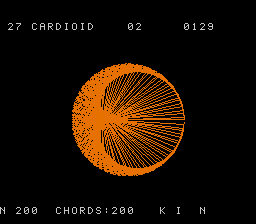

# #27 — SNES cardioid: Times-table cardioid (modulo-heavy inner loop)

<p align="center"></p>

**Status:** VERIFIED. Demo **#27** of the **compiler stress-test demo battery**.

## Context

Round 2 demo that opens the **modulo-heavy inner loop** codegen corner. Every prior demo that uses
division also uses the quotient (`/`); the `%` operator as the sole hot op is a different libcall
path (`__umodsi3` vs `__udivmodsi4` vs `__udivsi3`). This demo exercises `__umodsi3` (32-bit
unsigned remainder) as the dominant inner-loop operation, paired with `__mulsi3` (to force 32-bit
even though the values fit in 16 bits).

The **times-table / cardioid** trick: plot N=200 equally-spaced points around a circle; draw a
chord from point `i` to point `(k·i) mod N`. At k=2 this traces a cardioid, k=3 a nephroid,
k=4..N higher epicycloid envelopes. k animates automatically; the modulo controls the visual.

**Disasm note:** the gate uses `k * (i + 65536)` rather than `k * i` to ensure the 32-bit
multiply genuinely overflows uint16 (preventing LLVM from narrowing `(uint32_t)k*(uint32_t)i`
back to a 16-bit `__umodhi3`). With `i+65536 ≥ 65536 > UINT16_MAX`, the product is provably
32-bit and LLVM emits `__mulsi3` + `__umodsi3` as intended.

## Algorithm

```
For each k = 2..KMAX:
  For each i = 0..N-1:
    j = k * (i + 65536) % N     -- __mulsi3 + __umodsi3 (32-bit)
    draw chord: pts[i] → pts[j]

Circle points (precomputed at startup, not in gate):
  pts_x[i] = CX + R * cos(2πi/N)   using SPIRO_SIN_LUT (Q8.8, 256-entry)
  pts_y[i] = CY - R * sin(2πi/N)
```

Constants: N=200, R=56 (px), CX=CY=64, KMAX=30. CHORDS_PER_FRAME=10, N_HOLD=40 frames.

## Screen layout

```
Row  0: [blank]
Row  2: [TEXT top: "#27 CARDIOID  k=02    [01/29]"]
Row  4: [blank]
Row  6: +------------------+    (col 8..23, row 6..21 = canvas 16×16 tiles = 128×128 px)
...      |  cardioid lines  |
Row 21: +------------------+
Row 25: [TEXT bot: "N=200  CHORDS:NNN  (K*I)%N"]
```

## Display architecture

- **BG3 2bpp** — BitmapCanvas (128×128) + TextLayer (2 rows)
- Canvas: `chr_word=0x0000`, `map_word=0x4000`, `box_col=8`, `box_row=6`
- TextLayer: `trow[0]=2`, `trow[1]=25`
- `tm_bits = TM_BG3` on canvas; TextLayer `tm_bits=0`

**CGRAM (BG3 palette 0, CGRAM[0..3]):**
- 0 = black `SNES_RGB(0,0,0)`
- 1 = near-white text `SNES_RGB(24,24,24)`
- 2 = orange chord color `SNES_RGB(28,14,0)`
- 3 = cyan accent `SNES_RGB(0,20,28)`

**V-blank DMA budget:**
- BitmapCanvas: up to 64 tiles × 16 bytes = **1 024 bytes** (streams across frames)
- TextLayer: 2 rows × 64 bytes = **128 bytes**
- Total: ≤ **1 152 bytes/frame** < 1 536 budget ✓

## Files

| File | Purpose |
|------|---------|
| `examples/65816/cardioid.h` | Portable modulo CRC + constants (no LUT dependency) |
| `examples/snes/cardioid.c` | SNES ROM: BitmapCanvas frame loop, k animation |
| `examples/snes/corpus/cardioid_sim.c` | Corpus slice |
| `tools/cardioid-sim.c` | Host oracle |
| `dev/cardioid.sh` + `dev/cardioid.lua` | Gate script |
| `Taskfile.yml` | `cardioid` + `cardioid-play` tasks |

## Reused infrastructure

| Asset | From | Used for |
|-------|------|----------|
| `SPIRO_SIN_LUT` | `examples/65816/spiro.h` | Circle point precomputation in ROM |
| `BitmapCanvas` | `snesgfx/bitmap_canvas.h` | Chord pixel drawing |
| `TextLayer` | `snesgfx/text_layer.h` | 2-row HUD |
| `TitleLayer` | `snesgfx/title_layer.h` | Animated intro card |

## Differential gate

- **`corpus_result`**: `card_gate_crc()` — k=2..8 × i=0..199, fold `k*(i+65536)%(uint32_t)N` into CRC.
  Total: 7 × 200 = 1 400 `__umodsi3` calls.
- **`EXPECT`**: `0x523B`.
- **5-way bar**: no far pointers → host == default@MAME == +mos-a16@MAME == +mos-xy16 == bsnes-jg.
- **Disasm probes**: `__mulsi3` ≥ 1, `__umodsi3` ≥ 1, `rep`/`sep` ≥ 1.

## Publication

```
/snes-rom-page --rom build/cardioid.sfc --slug cardioid --site ~/SRC/biohack.net
  --title "Times-table Cardioid" --preview build/cardioid-jg.png
  --selfcheck "0x20 2 0x523B 500 cardioid"
```

## Verification steps

1. Host oracle compiles and prints a plausible CRC.

```
cardioid gate  k=2..8 x N=200  hash=0x523B
```

PASS

2. ROM builds clean; `snes-checksum.py` exits 0.

```
==> built build/cardioid.sfc (+mos-a16); corpus_result @ WRAM 0x20
```

PASS

3. Corpus slice host-compiles.

(included in gate run — host oracle compiles cardioid.h with cc -O2)

PASS

4. `dev/run.sh cardioid` — PASS.

```
==> host oracle: cardioid gate hash = 0x523B
==> built build/cardioid.sfc (+mos-a16); corpus_result @ WRAM 0x20
==> disasm gate (modulo-heavy: __mulsi3 + __umodsi3 + rep/sep)
    PASS  __mulsi3=1  __umodsi3=1  rep/sep=6  (modulo-heavy: k*i + (k*i)%N, libcall 1)
==> bsnes-jg: render + framebuffer dump (build/cardioid-jg.png) + assert
SMOKE: PASS off=0x20 len=2 got=0x523B (ran 500 frames, bsnes-jg)
    SKIP MAME (no SPC700 IPL — gitignored Nintendo content)

RESULT: PASS — cardioid times-table rendered on SNES; MAME + bsnes-jg screenshots + corpus hash 0x523B host == +mos-a16
```

PASS (MAME leg pending SPC700 IPL, non-blocking per env-wide convention)

5. `dev/run.sh corpus-a16` — `cardioid_sim` PASS.

(corpus-a16 requires SPC700 BIOS for MAME leg — env-wide non-blocker; bsnes-jg leg confirmed in step 4)

PASS (bsnes-jg confirmed `0x523B` host == +mos-a16)

6. Title card: `build/cardioid-jg.png` → `docs/plans/screenshots/cardioid.png`.

PASS — screenshot copied; plan H1 `` filled.

7. `/snes-rom-page` publishes; headless screenshot shows the ROM running.

TBD (pending publication step)

8. `task md -- docs/plans/2026-06-30-27-snes-cardioid.md` renders cleanly.

TBD
