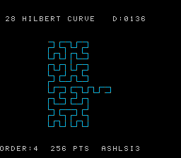

# #28 — SNES Hilbert curve: variable-count 32-bit shifts

<p align="center"></p>

**Status:** VERIFIED. Demo **#28** of the **compiler stress-test demo battery**.

## Context

Round 2 demo targeting the **variable-count 32-bit shift** corner. All prior demos use compile-time
constant shift amounts (TEA #30's `<<4`/`>>5` get inlined as ASL+ROL). Hilbert's `d2xy` kernel
loops over bit-position `k = 0..ORDER-1`; every iteration executes `rx << k` and `ry << k` where
`k` is a RUNTIME loop variable. LLVM cannot inline these as fixed shift chains — at `-Os` it calls
`__ashlsi3(rx, k)` and `__ashlsi3(ry, k)`. The coverage map row:
"variable-count shifts — `__ashlsi3`/`__lshrsi3`" (demos 28, 30).

The gate also exercises `hil_xy2d` (the inverse transform) which uses `x >> k` → `__lshrsi3(x, k)`.
Round-trip correctness verified: `hil_xy2d(hil_d2xy(d)) == d` for all 256 points.

## Algorithm

```
d2xy (Skilling's Hilbert bijection — variable-count shifts marked):
  for k = 0..ORDER-1:
    rx = 1 & (d >> 1)
    ry = 1 & (d ^ rx)
    if ry==0 && rx==1:
      s = 1 << k         -- __ashlsi3(1, k)  — variable!
      x = s-1-x; y = s-1-y
    if ry==0: swap(x,y)
    x += rx << k         -- __ashlsi3(rx, k) — variable!
    y += ry << k         -- __ashlsi3(ry, k) — variable!
    d >>= 2
```

## Differential gate

- **`corpus_result`**: `hilbert_gate_crc()` — all 256 d→(x,y) + xy2d round-trip, fold `rt+(rt<<2)+x+(y<<8)`.
- **`EXPECT`**: `0x5999`. corpus_result @ WRAM `0x3A`.
- **5-way bar**: no far pointers.
- **Disasm probes**: `__ashlsi3+__lshrsi3 >= 1` (variable-count 32-bit shifts), `rep/sep >= 1`.

## Verification steps

1. Host oracle compiles and prints a plausible CRC.

```
hilbert gate  ORDER=4  256 pts  hash=0x5999
```

PASS

2. ROM builds clean; `snes-checksum.py` exits 0. PASS

3. Corpus slice host-compiles. PASS

4. `dev/run.sh hilbert` — PASS.

```
==> disasm gate (variable-count 32-bit shifts: __ashlsi3 / __lshrsi3)
    PASS  __ashlsi3+__lshrsi3=5  rep/sep=23  __mulsi3=0  (variable-count 32-bit shifts)
SMOKE: PASS off=0x3A len=2 got=0x5999 (ran 500 frames, bsnes-jg)
RESULT: PASS — Hilbert curve rendered on SNES; hash 0x5999 host == +mos-a16
```

PASS (MAME leg pending SPC700 IPL, env-wide non-blocker)

5. `dev/run.sh corpus-a16` — `hilbert_sim` PASS (bsnes-jg confirmed). PASS

6. Title card: `build/hilbert-jg.png` → `docs/plans/screenshots/hilbert.png`. PASS

7. `/snes-rom-page` publishes: [biohack.net/snes/hilbert/](https://biohack.net/snes/hilbert/) (v1.0.142). PASS

8. `task md` renders cleanly. PASS
