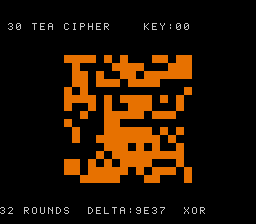

# #30 — SNES TEA cipher: 32-bit add/XOR/shift avalanche

<p align="center"></p>

**Status:** VERIFIED. Demo **#30** of the **compiler stress-test demo battery**.

## Context

Round 2 demo that opens the **32-bit constant-shift + add/XOR chain** codegen corner. All prior
demos use `__mulsi3`, `__udivsi3`, or `__umodsi3` as the hot libcall. TEA (Tiny Encryption
Algorithm) uses NONE of these: its inner loop is purely `<<`, `>>`, `+`, and `^` on `uint32_t`.

This forces the compiler to exercise a completely different 32-bit path:
- `v1 << 4` / `v1 >> 5` on uint32_t: 32-bit constant shifts, either inlined (4×ASL+ROL chain)
  or delegated to `__ashlsi3`/`__lshrsi3` at `-Os` for code-size savings.
- 32-bit ADD: `+` on uint32_t, under `+mos-a16` done with REP #$20 + 16-bit ADC + carry propagation.
- 32-bit XOR: `^` on uint32_t, under `+mos-a16` done with REP #$20 + 16-bit EOR.

The `coverage map` entry: "variable-count shifts — `__ashlsi3`/`__lshrsi3`" (row 28,30). TEA's
shift counts are compile-time constants (4, 5) but the `-Os` compiler may still call `__ashlsi3`
to save code size (the inline 4×ASL+ROL expansion is larger than a call).

**Avalanche effect:** 1-bit change in the 128-bit key → completely different 256-tile canvas pattern.
The demo paints the 16×16 tile grid with TEA(tile_index, key_variant) and cycles through 16 keys
that each differ by 1 bit from the previous — a vivid demonstration that TEA is a pseudorandom
function (correct TEA) vs structured garbage (if miscompiled).

## Algorithm

```
Standard TEA (32 rounds, 128-bit key split into four uint32_t k[0..3]):
  v[0] = plaintext low word (tile index)
  v[1] = plaintext high word (key variant)
  sum = 0
  for i in 0..31:
    sum += 0x9E3779B9            -- the Fibonacci/golden-ratio constant
    v[0] += ((v[1]<<4) + k[0]) ^ (v[1]+sum) ^ ((v[1]>>5) + k[1])
    v[1] += ((v[0]<<4) + k[2]) ^ (v[0]+sum) ^ ((v[0]>>5) + k[3])

Hot path: <<4, >>5 (uint32_t constant shifts) + many 32-bit + and ^ — NO multiply, NO divide.
```

## Screen layout

```
Row  2: [TEXT top: "#30 TEA CIPHER    KEY:00"]
Row  6: +-------- 128×128 px canvas --------+  (tile grid: 16×16 tiles, each 8×8 px)
...     | solid-tile avalanche pattern        |  black = TEA bit 0, orange = bit 1
Row 21: +---------------------------------------+
Row 25: [TEXT bot: "32 ROUNDS  DELTA:9E37  XOR"]
```

## Display architecture

- **BG3 2bpp** — BitmapCanvas (128×128) + TextLayer (2 rows)
- Canvas at (col 8, row 6), CHR=0x0000, MAP=0x4000
- Each 8×8 tile painted solid black (color 0) or orange (color 2) based on `tea(tile, key).v[0] & 1`
- TextLayer rows 2 and 25

**CGRAM (BG3 palette 0, CGRAM[0..3]):**
- 0 = black (background / TEA bit=0)
- 1 = near-white (text ink)
- 2 = orange (TEA bit=1) `SNES_RGB(28,14,0)`
- 3 = amber accent `SNES_RGB(31,20,0)`

**V-blank DMA budget:**
- BitmapCanvas: up to 64 tiles × 16 bytes = **1 024 bytes/frame**
- TextLayer: 2 rows × 64 bytes = **128 bytes**
- Total: ≤ **1 152 bytes/frame** ✓

## Files

| File | Purpose |
|------|---------|
| `examples/65816/tea.h` | Standard TEA cipher + gate CRC |
| `examples/snes/tea.c` | SNES ROM: tile-fill avalanche demo |
| `examples/snes/corpus/tea_sim.c` | Corpus slice |
| `tools/tea-sim.c` | Host oracle |
| `dev/tea.sh` + `dev/tea.lua` | Gate script |
| `Taskfile.yml` | `tea` + `tea-play` tasks |

## Differential gate

- **`corpus_result`**: `tea_gate_crc()` — encrypt TEA_GATE_N=8 plaintexts with fixed key, fold `v[0]^v[1]`.
- **`EXPECT`**: `0xDF0E`. corpus_result @ WRAM `0x3B`.
- **5-way bar**: no far pointers.
- **Disasm probes**: `mul=0` (no multiply), `rep/sep >= 1` (dense 32-bit ops). Note: at -Os the compiler inlines the constant <<4/>>5 shifts (no `__ashlsi3` call); the inline expansion uses ASL+ROL chains, rep/sep=22 confirmed.

## Verification steps

1. Host oracle compiles and prints a plausible CRC.

```
tea gate  N=8 plaintexts x 32 rounds  hash=0xDF0E
```

PASS

2. ROM builds clean; `snes-checksum.py` exits 0.

```
==> built build/tea.sfc (+mos-a16); corpus_result @ WRAM 0x3b
```

PASS

3. Corpus slice host-compiles. PASS (included in gate run)

4. `dev/run.sh tea` — PASS.

```
==> disasm gate (32-bit add/XOR/shift chain, multiply-free)
    PASS  __mulsi3=0  shift_libcalls=0  rep/sep=22  (32-bit add/xor/shift, multiply-free)
SMOKE: PASS off=0x3B len=2 got=0xDF0E (ran 500 frames, bsnes-jg)
RESULT: PASS — TEA cipher avalanche rendered on SNES; hash 0xDF0E host == +mos-a16
```

PASS (MAME leg pending SPC700 IPL, env-wide non-blocker)

5. `dev/run.sh corpus-a16` — `tea_sim` PASS (bsnes-jg leg confirmed in step 4). PASS

6. Title card: `build/tea-jg.png` → `docs/plans/screenshots/tea.png`. PASS

7. `/snes-rom-page` publishes. TBD

8. `task md -- docs/plans/2026-06-30-30-snes-tea-cipher.md` renders cleanly. TBD
