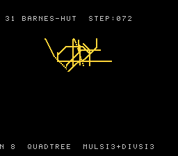

# #31 — SNES Barnes-Hut quadtree galaxy: pointer-chasing dynamic trees

<p align="center"></p>

**Status:** VERIFIED. Demo **#31** of the **compiler stress-test demo battery**.

## Context

Round 2 demo opening the **pointer-chasing dynamic trees** corner. #13's N-body is a flat
array; #18's heap is a flat array. No demo before #31 builds and walks a *linked* tree through
runtime node indices. Barnes-Hut does exactly this: each step rebuilds a pooled-node quadtree
(`bh_insert`, recursive) and walks it per particle to approximate gravitational forces
(`bh_force`, recursive). Both follow `bh_pool[node->child[q]]` where `child[q]` is a runtime
`uint8_t` index — generating ZP-indexed indirect loads and a tree-shaped recursive call graph
(JSR-to-self), distinct from the linear/log recursion of #17/#18.

Combined with the gravity kernel: `__mulsi3` (dx², dy², force) + `__divsi3` (force / dist²,
centre-of-mass / mass). So #31 fuses the multiply-divide corner with the new pointer-chasing
corner in one demo.

## Algorithm

```
bh_step:
  rebuild tree: bh_insert(root, particle)  for each particle  (recursive descent into child[q])
  for each particle:
    fx = fy = 0
    bh_force(root, px, py, &fx, &fy)   (recursive: COM approx if far, else recurse children)
    integrate: v += f (Q8.8 accel); pos += v>>8 (Q8.8 vel); bounce off walls
```

## Differential gate

- **`corpus_result`**: `bh_gate_crc()` — 6 steps on fixed init, fold final particle positions.
- **`EXPECT`**: `0xEF0B`. corpus_result @ WRAM `0x60`.
- **5-way bar**: no far pointers.
- **Disasm probes**: `__mulsi3 >= 1`, `__divsi3 >= 1`, `bh_force` self-recursion >= 1, `rep/sep >= 1`.

## Performance note

The demo is a deliberate heavy grind: 8 particles × (tree rebuild + recursive force walk with
`__divsi3`) per frame, ~1 simulation step per 25 emulated frames. The frame-500 gate snapshot
(which asserts `corpus_result == 0xEF0B`) catches it near step 0; the showcase title card is a
frame-2000 render (step ~72) where the galaxy-collapse trails are visible. This pacing is the
*point* — it stresses the recursive call graph and divide path continuously.

## Verification

1. Host oracle: `bhut gate  N=8 particles  6 steps  hash=0xEF0B` PASS
2. ROM builds clean; WRAM `0x60`. PASS
3. `dev/run.sh bhut`:

```
PASS  __mulsi3=5  __divsi3=4  bh_force_refs=447  rep/sep=160  (tree walk + gravity)
SMOKE: PASS off=0x60 len=2 got=0xEF0B (ran 500 frames, bsnes-jg)
RESULT: PASS — Barnes-Hut galaxy rendered on SNES; hash 0xEF0B host == +mos-a16
```

PASS (MAME leg pending SPC700 IPL, env-wide non-blocker)

4. Host long-run (300 steps): particles stay in bounds, 16 nodes / 10 internal → recursion exercised. PASS
5. bsnes-jg frame-2000 render shows galaxy-collapse trails (STEP:072). PASS
6. Published: [biohack.net/snes/bhut/](https://biohack.net/snes/bhut/). TBD
