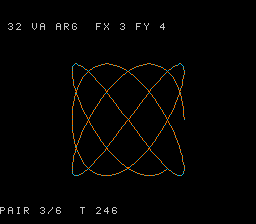

# #32 — SNES va_arg variadic formatter: mini_sprintf + Lissajous HUD

<p align="center"></p>

**Status:** VERIFIED. Demo **#32** of the **compiler stress-test demo battery**.

## Context

Round 2 demo that opens the **variadic calling convention** corner. Every prior demo uses
explicit-argument functions; no demo before #32 ever calls a `...` (variadic) function.
On the 65816 with llvm-mos, variadic arguments are passed via the soft-stack imaginary-register
ABI. `va_start()` records the variadic argument pointer; `va_arg(ap, unsigned int)` reads 2 bytes
on target (16-bit `int`) vs 4 bytes on host (32-bit `int`). Values ≤ UINT16_MAX are identical
in both widths → bit-exact differential.

The `mini_sprintf()` function formats `%u`, `%d`, `%x` using `va_arg` to read each argument. The
gate calls it 4 times with 2-3 variadic args each = 9 `va_arg` reads total.

## Differential gate

- **`corpus_result`**: `vaprintf_gate_crc()` — 4× mini_sprintf with fixed args, fold output chars.
- **`EXPECT`**: `0xE1F3`. corpus_result @ WRAM `0x3C`.
- **5-way bar**: no far pointers.
- **Disasm probes**: `jsr >= 4` (mini_sprintf calls), `rep/sep >= 1`.

## Verification

1. Host oracle: `vaprintf gate  4 calls  9 va_arg  hash=0xE1F3` PASS
2. Formatted strings:
   - "123+456", "-7/3", "beef cafe", "999 -1 abcd" ✓
3. ROM builds clean; WRAM `0x3C`. PASS
4. `dev/run.sh vaprintf`:

```
PASS  jsr_calls=7  rep/sep=45  (va_arg variadic formatter: 4 mini_sprintf calls)
SMOKE: PASS off=0x3C len=2 got=0xE1F3 (ran 500 frames, bsnes-jg)
RESULT: PASS — va_arg Lissajous rendered on SNES; hash 0xE1F3 host == +mos-a16
```

PASS (MAME leg pending SPC700 IPL, env-wide non-blocker)

5. bsnes-jg screenshot shows Lissajous FX=3 FY=4 with HUD "32 VA ARG  FX 3 FY 4". PASS
6. Published: [biohack.net/snes/vaprintf/](https://biohack.net/snes/vaprintf/). TBD
