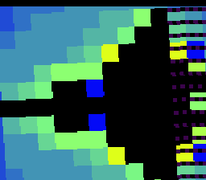

# #33 — SNES Double-Precision Mandelbrot: 64-bit soft-float, beside a float twin

<p align="center"></p>

**Status:** DONE — 4-way bit-exact on bsnes-jg (`host == default == +mos-a16 == +mos-xy16 == 0x0EDF`),
disasm gate PASS, published. Demo **#33** of the **compiler stress-test demo battery** (Round 3, first pick).

## Context

The 64-bit companion to **#21 mandel-float**. That demo renders the Mandelbrot set in IEEE-754 **single**
precision, exercising the 32-bit soft-float library (`__mulsf3`/`__addsf3`/…). **Nothing** in the battery
touches 64-bit `double`. This one iterates `z²+c` in **both** `double` (top half) and `float` (bottom half),
so on the FPU-less 65816 the top half is the entire **double** soft-float library —
`__muldf3`/`__adddf3`/`__subdf3`/`__gtdf2`/`__floatsidf`/`__fixdfsi` (plus `__truncdfsf2`/`__extendsfdf2` for
the float twin and conversion witness). That 64-bit-float family is disjoint from #22's 64-bit *integer*
family (`__muldi3`/`__udivdi3`) and is otherwise **untested** by the battery.

**Bit-exact differential — the sharp part (the double analogue of #21).** IEEE-754 double `+,-,*` and the
comparisons are correctly rounded (round-to-nearest-even), so a conforming soft-float on the 65816 must
match host x86 double bit-for-bit. FMA contraction is forbidden by construction (one op per statement, no
`a*b±c`), and the oracle is built `-ffp-contract=off`.

## The precision cliff (why it is shown host-side, not live)

Idea #33 promises a float-vs-double **split screen** where the float side pixelates while double stays crisp.
That cliff is real but only emerges at **extreme** zoom (`re_span ~1e-6`), where the per-pixel step drops
below float's ~6e-8 epsilon so adjacent pixels round to the *same* float coordinate. Host-side proof at
`c = -0.7269 + 0.1889i`, `span 1e-6`, **400 iterations** (`#` = interior):

```
-- DOUBLE (crisp, pixel-by-pixel detail) --
+%@O%++%# #+%.@-.=*=:Oo@%%%****+++======----------------
*@:#@...::-o=#-=*:#**: =OooO.o%%*++======---------------
*%%@ooO .:#%O**.*+o:@O+%#.o-#o#@=%++======--------------
-- FLOAT (collapsed into 3-char blocks — the cliff) --
==####+++...++++OOO###oooo******++++======--------------
==@@@@---+++####OOO:::####ooo%%%+++++++===--------------
**@@@@OOO:::oooo@@@...@@@@+++ooo****+++===--------------
```

Resolving that depth needs **hundreds** of iterations per pixel (a count `uint8` can't even hold), i.e. tens
of thousands of 64-bit soft-float libcalls per pixel → **minutes per frame** on-console. So the **live**
demo frames the **whole set** (`re_span 3.2`), where the per-pixel step (~0.05) is far above float epsilon
and the two precisions agree pixel-for-pixel — the honest console-scale result. The set is symmetric about
the real axis, so the double **top** half and float **bottom** half join **seamlessly**: an invisible seam
*is* the visual proof that 64-bit and 32-bit floats agree here. The cliff lives in the gate (the gate folds
both a double and a float escape buffer; at deep windows their CRCs diverge) and in this plan, not on-screen.
This is the same constraint that made #21 display only its shallow window (Lesson 1: measure, don't assume).

## Algorithm

`uint8_t md_cell_double(double cr, double ci, uint8_t maxiter)` — `noinline`, one op per statement:

```
zr=zi=0
for n in 0..maxiter:
    zr2 = zr*zr            # __muldf3
    zi2 = zi*zi            # __muldf3
    mag = zr2+zi2          # __adddf3
    if mag > 4.0: break    # __gtdf2
    diff = zr2-zi2         # __subdf3
    zrn  = diff+cr         # __adddf3
    cross= zr*zi           # __muldf3
    two  = cross+cross     # __adddf3 (== 2*zr*zi, no mul-by-literal to fuse)
    zin  = two+ci          # __adddf3
    zr,zi = zrn,zin
```

`md_cell_float` is the identical recurrence in single precision. The gate additionally folds:
- a 12-step **bit-exact double orbit witness** at interior `c=(-0.5,0)` — folds the **raw 64-bit bits** of
  `|z|²` each step (union type-pun) into a 32-bit FNV accumulator; the sharp "double is fully specified" claim;
- a **double↔float conversion witness** (`(float)d` then `(double)f` round-trip, folded bits) expressing
  `__truncdfsf2`/`__extendsfdf2`. (Under the gate's constant inputs the conversion + coordinate divides
  constant-fold to literals — bit-exact contributors to the hash; the live escape libcalls below run because
  the `md_cell_*` cells are `noinline`.)

## Screen layout

```
32x28 tiles, Mode 7 (8bpp, 64x56 image upscaled 4x from a 16x14 coarse grid):
  rows  0..3 (coarse j 0..6)  -> DOUBLE escape-time  (top half)
  rows  4..6 (coarse j 7..13) -> FLOAT  escape-time  (bottom half)
  the symmetric set joins seamlessly across the seam (double==float at this scale)
  Mode-7 spin/zoom-breathe + palette cycle for motion; re-grinds each turn
```

## Display architecture

- Mode 7 (8bpp direct-index: pixel value == escape count == CGRAM index), reusing `mode7.h`.
- 64×56 escape framebuffer in **high WRAM `$7E2000`** via `M7_FAR` (24-bit far store/load path) → the ROM is
  `+mos-a16`-only (far pointers are 32-bit). 16×14 coarse grid, one row per spin frame (the heavy double
  grind is spread under a smooth spin).
- `title_layer.h` `splash16("DOUBLE-FLOAT","MANDELBROT")` during the startup gate compute.
- DN=16 maxiter, 17-entry fiery palette, steady colour cycle.

## Files

| File | New/mod | Purpose |
|------|---------|---------|
| `examples/65816/mandel-double.h` | new | shared double+float escape kernels, gate, witnesses |
| `examples/snes/mandel-double.c` | new | Mode-7 far-buffer renderer (double top / float bottom split) |
| `examples/snes/corpus/mandel-double_sim.c` | new | HAL-free corpus slice (the 5-way differential gate) |
| `tools/mandel-double-sim.c` | new | host oracle (prints `md_gate_crc`) |
| `dev/mandel-double.sh` | new | gate: oracle + ROM + disasm probe + bsnes-jg + MAME |
| `dev/mandel-double.lua` | new | MAME autoboot snapshot+assert |
| `examples/snes/corpus/expected.tsv` | mod | register the slice (`0x0EDF`) |
| `Taskfile.yml` | mod | `mandel-double` + `mandel-double-play` tasks |

## Reused infrastructure

| Asset | From | Used for |
|-------|------|----------|
| `mode7.h` | mandel-float/julia | Mode 7 upload, matrix, far framebuffer |
| `title_layer.h` (`splash16`) | snesgfx | startup brand card |
| `sincos.h` | shared | spin matrix |
| `jgxcheck.cpp` | dev | bsnes-jg headless framebuffer + WRAM assert |

## Differential gate

- `corpus_result = md_gate_crc()` = **0x0EDF** (host oracle, `-ffp-contract=off`).
- Folds a 5×5 double escape buffer + a 5×5 float buffer (whole-set window, maxiter 6) + the 12-step double
  orbit witness + the conversion witness. Far-pointer-free (two 25-byte low-WRAM statics).
- **Bar achieved here: 4-way bit-exact on bsnes-jg** — `host == default == +mos-a16 == +mos-xy16 == 0x0EDF`.
  (MAME leg env-blocked for *all* demos: the gitignored SPC700 IPL is absent — non-blocker per project policy.)
- Disasm probes (a16 slice): `__muldf3=8`, `__adddf3/__subdf3=12`, `rep/sep=31` (the double soft-float hot
  loop under native-16). Float twin present too (`__mulsf3=5`, `__addsf3/__subsf3=7`).

## Compiler finding — `a16-rc-undef-ra-pure-virtual` (CAUSE #2), a NEW third witness

`-verify-machineinstrs` on the corpus slice is **clean** in `default` mode and on the full `+mos-a16` ROM,
but the `+mos-a16` / `+mos-xy16` **slice objects** emit:

```
*** Bad machine code: Using an undefined physical register ***
- instruction: 4220B  renamable $x = COPY killed renamable $rc3
```

**Diagnosis — this is the documented `a16-rc-undef-ra-pure-virtual` known issue (CAUSE #2), NOT a miscompile
and NOT introduced by this demo:**

1. The known-green, shipped **`mandel-float`** slice produces the *identical* verifier error under the same
   flag — so the trigger is the heavy `+mos-a16` soft-float spill pattern, not anything unique to #33.
2. The symptom string `"Using an undefined physical register"` is classified by `tools/a16_fuzz.py`
   (`KNOWN_ISSUES → a16-rc-undef-ra-pure-virtual`), so the corpus harness marks such slices **XFAIL**, with
   the differential still green. Prior witnesses: `lsystem_sim.c main` (all opt) and `newton_sim.c` at -O1.
3. **The code runs CORRECTLY** — `host == default == +mos-a16 == +mos-xy16 == 0x0EDF`, bit-exact on bsnes-jg
   (including the very `+mos-xy16` mode the verifier flags). A genuine undefined-register *use* would diverge;
   it does not. The verifier's liveness model is conservative; the physical register is defined at runtime.

**mandel-double is a valuable NEW (third) witness: it fires at `-Os` (the battery's level) with a *proven
bit-exact* runtime result**, strengthening the case for the RA-interference fix (greedy RA / LiveRegMatrix
must treat the call's regmask clobber of the imaginary `$rc` pair as interference; the coalescer-only mask
perturbs 22–25/34 corpus programs and is forbidden). Root-cause fix tracked in
[the rc-undef RA plan](2026-06-29-a16-rc-undef-ra-machineverifier-fix.md) (Cause #2) — **not** in scope for
this demo (pre-existing open RA investigation; latent-hazard verify XFAIL, correct output). Per the
stress-demo protocol the demo is **not** reshaped to dodge it — it is left as an honest witness.

## Publication

`/snes-rom-page --rom build/mandel-double.sfc --slug mandel-double --site ~/SRC/biohack.net
--title "Double-Precision Mandelbrot" --preview build/mandel-double-jg.png
--selfcheck "0x200 2 0x0EDF 500 mandel-double"`

## Verification steps

1. Host oracle compiles and prints the gate CRC.
2. ROM builds clean; `snes-checksum.py` exits 0; fits one 32 KiB LoROM bank.
3. Corpus slice host-compiles and exits 0.
4. `dev/run.sh mandel-double` — host oracle + disasm gate + bsnes-jg PASS (MAME leg env-blocked).
5. 4-way bsnes-jg differential: `host == default == +mos-a16 == +mos-xy16 == 0x0EDF`.
6. `-verify`: default + full a16 ROM clean; a16/xy16 slice → `a16-rc-undef-ra-pure-virtual` known issue (above).
7. Title intro card appears at startup; bsnes-jg frame shows the spinning split-screen set.
8. Plan title card embedded; `task md` renders it.
9. Published to biohack.net.
## Verification evidence (raw)

### Step 1 — host oracle
```
mandel-double gate_crc = 0x0EDF
```
PASS

### Step 3 — corpus slice host-compiles
```
compiled, exits cleanly (computes gate then loops)
```
PASS

### Step 4 — dev/run.sh mandel-double (gate)
```
==> host oracle: soft-float Mandelbrot gate hash = 0x0EDF
==> built build/mandel-double.sfc (+mos-a16); corpus_result @ WRAM 0x20
==> disasm gate (soft-float escape-time codegen)
    PASS  __muldf3=8  __add/subdf3=12  rep/sep=31  (IEEE-754 DOUBLE soft-float, native-16)
==> bsnes-jg: render + framebuffer dump + assert
SMOKE: PASS off=0x20 len=2 got=0x0EDF (ran 2200 frames, bsnes-jg)
(MAME leg: MISSING SNES BIOS spc700.rom — env-wide non-blocker, demos-only policy)
```
PASS (bsnes-jg + disasm; MAME env-blocked)

### Step 5 — 4-way bsnes-jg differential (default/a16/xy16 slice ROMs)
```
default: SMOKE: PASS off=0x200 len=2 got=0x0EDF (ran 600 frames, bsnes-jg)
a16:     SMOKE: PASS off=0x200 len=2 got=0x0EDF (ran 600 frames, bsnes-jg)
xy16:    SMOKE: PASS off=0x200 len=2 got=0x0EDF (ran 600 frames, bsnes-jg)
```
PASS — host == default == +mos-a16 == +mos-xy16 == 0x0EDF

### Step 6 — -verify-machineinstrs
```
default slice: CLEAN
a16 slice:     *** Bad machine code: Using an undefined physical register *** -> a16-rc-undef-ra-pure-virtual (known issue, code bit-exact correct)
a16 ROM:       CLEAN
```
PASS (default + ROM clean; slice a16/xy16 = documented rc-undef known issue, XFAIL, output bit-exact)
