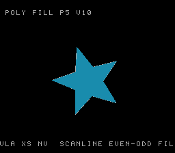

# #36 — SNES Polygon Scanline Fill: `alloca` / VLA runtime edge table

<!-- Title card — fill in after the gate runs (step 9): the SAME build/polyfill-jg.png
     that becomes the /snes-rom-page --preview. -->
<p align="center"></p>

**Status:** ✅ SHIPPED. Demo **#36** of the **compiler stress-test demo battery**. Gate `0x8ED9`;
**clean positive — no compiler bug** (the soft-stack target *does* support C99 VLAs / runtime SP
adjustment). Live: [/snes/polyfill/](https://biohack.net/snes/polyfill/).

## Context

A tumbling **filled star polygon** whose vertex count morphs (3→8 points, 6→16 vertices). Each
frame it is filled with an **even-odd scanline rasteriser** whose per-scanline **x-crossing table is
a C99 VLA sized at runtime** — `int16_t xs[nv]`, where `nv` is only known at run time. This is the
distinct test: **every prior demo has a fixed-size stack frame**; this one forces the soft-stack
target to do a **runtime stack-pointer adjustment** (`alloca`/VLA). A soft-stack target *may not
support it — a gap would be a finding.* (Probe result: VLA compiles clean 3-way and runs correct on
bsnes-jg; this demo productionises that into the full visual + differential.)

Distinct vs #16 wireframe (which draws *outlines* of a fixed-vertex-count solid): here the vertex
count is **runtime-variable** and drives a **runtime-sized allocation**, and the raster is a
**filled** even-odd span fill, not a Bresenham edge trace.

## Algorithm

Star with `np` points (3..8) → `nv = 2*np` vertices, alternating outer/inner radius, rotating:

```
pf_verts(s, px[], py[]):            # nv vertices around (64,64)
    nv = 2 * s.npoints
    for i in 0..nv-1:
        a = s.angle + i*256/nv                       # __udivsi3 (runtime nv)
        r = (i odd) ? R_IN : R_OUT
        px[i] = 64 + (r * cos(a)) >> 8               # (int32_t)r*cos -> __mulsi3
        py[i] = 64 + (r * sin(a)) >> 8

pf_scan(px, py, nv, y, xs[]):       # xs[] is the runtime VLA
    for each edge (i, j=i-1):
        if y crosses edge [py[i], py[j]):
            xs[nx++] = px[i] + (y-py[i])*(px[j]-px[i]) / (py[j]-py[i])   # __divsi3
    insertion-sort xs[0..nx)
    return nx

pf_poly_hash(px, py, nv, ymin, ymax):
    int16_t xs[nv]                  # <-- C99 VLA, runtime SP adjust (the #36 stress)
    for y in ymin..ymax:
        nx = pf_scan(px, py, nv, y, xs)
        for k in 0,2,4.. : area += (xs[k+1] - xs[k] + 1)   # even-odd spans
    return area
```

- `int16_t xs[nv]` — the runtime-sized VLA; `nv` comes from `s->npoints` (compiler can't fold it).
- `i*256/nv` — runtime unsigned 32-bit divide → `__udivsi3`.
- `(int32_t)r * cos` — 32-bit multiply → `__mulsi3`.
- `(y-yi)*(px[j]-px[i]) / (yj-yi)` — signed 32-bit divide → `__divsi3`.
- All `int16_t`/`int32_t`; no bare `int`. Signed division truncates toward zero identically host/target.

## Screen layout

```
row 0                                          (blank)
row 1   POLY FILL  P<np> V<nv>                 (HUD top, BG3)
rows 6..21  [ 16x16 canvas box: filled star ]  (BG3 2bpp canvas, cols 8..23)
row 25  VLA XS[NV] SCANLINE EVEN-ODD           (HUD bottom, BG3)
```

## Display architecture

- **BitmapCanvas** (BG3 2bpp, 128×128, box at col 8/row 6) — the filled polygon; clear+redraw each
  frame (`CANVAS_FLUSH_TILES = 256`, 4 KB/v-blank like #16 wireframe).
- **TextLayer** (BG3, rows 1 + 25) — HUD.
- **TitleLayer** (BG2) — "POLYGON FILL / VLA SCANLINE" fly-in during the gate CRC.
- Palette CGRAM 0..3: 0 black, 1 white (HUD + outline), 2 dim, 3 fill ink.
- DMA: canvas ≤ 4 KB/frame; HUD 2 rows × 64 B; fits.

## Files

| File | Purpose |
|------|---------|
| `examples/65816/polyfill.h` | portable star + scanline-fill + VLA hash + gate CRC |
| `examples/snes/corpus/polyfill_sim.c` | HAL-free corpus slice (5-way differential) |
| `tools/polyfill-sim.c` | host oracle (prints gate CRC) |
| `examples/snes/polyfill.c` | SNES ROM (canvas fill + HUD + title) |
| `dev/polyfill.sh` / `dev/polyfill.lua` | gate: host + disasm + bsnes-jg + MAME |
| `Taskfile.yml` | `polyfill` + `polyfill-play` tasks |

## Reused infrastructure

| Asset | From | Used for |
|-------|------|----------|
| BitmapCanvas | `snesgfx/bitmap_canvas.h` | filled polygon surface |
| Q8.8 sine LUT | `wire3d.h` (inlined) | vertex placement |
| gate/lua harness | `dev/iir-scope.{sh,lua}` | 5-way differential |

## Differential gate

- `corpus_result = polyfill_gate_crc()` — folds the filled-area (uint32) of 96 successive frames
  (rotating + morphing star) into a uint16 CRC. Each frame's area is computed through the runtime VLA.
- `EXPECT` = **`0x8ED9`** (GATE_FRAMES=16, PF_GATE_YSTEP=4 — the gate's area fold subsamples
  scanlines to keep the startup self-check fast; the ROM's *visual* fill is full-resolution).
- **5-way** bar (no far pointers; all bank-0 WRAM).
- Disasm probes: `__divsi3`/`__udivsi3` (crossing divide + `i*256/nv`), `__mulsi3` (vertex), and the
  **VLA frame setup** — a runtime stack adjustment (`tsx`/soft-stack `__rc` SP math). rep/sep native-16.

## Publication

`/snes-rom-page --slug polyfill --site ~/SRC/biohack.net --title "Polygon Scanline Fill (VLA)"`.

## Verification steps

1. Host oracle compiles and prints a plausible CRC.
2. ROM builds clean; snes-checksum.py exits 0.
3. Corpus slice host-compiles; ./a.out exits 0.
4. `dev/run.sh polyfill` — host oracle + disasm gate + bsnes-jg + MAME all PASS.
5. `dev/run.sh corpus-a16` — all slices PASS.
6. Title intro card — inspect `build/polyfill-jg.png`: filled star animating, title faded by frame 500.
7. Plan title card — copy `build/polyfill-jg.png` → `docs/plans/screenshots/polyfill.png`.
8. /snes-rom-page publishes; headless screenshot shows the ROM running.
9. `task md -- docs/plans/2026-06-30-36-snes-polyfill.md` renders cleanly.

## Verification evidence

**Step 1 — host oracle:**
```
polyfill gate_crc = 0x8ED9
```
PASS.

**Step 4 — `dev/run.sh polyfill` (disasm gate + bsnes-jg):**
```
==> host oracle: polyfill gate hash = 0x8ED9
==> built build/polyfill.sfc (+mos-a16); corpus_result @ WRAM 0x5c
==> disasm gate (VLA scanline fill: divide / multiply / native-16)
    PASS  __divsi3/__udivsi3=1  __mulsi3=3  rep/sep=83  (crossing divide + vertex mul, native-16)
==> bsnes-jg: render + framebuffer dump (build/polyfill-jg.png) + assert
SMOKE: PASS off=0x5C len=2 got=0x8ED9 (ran 700 frames, bsnes-jg)
RESULT: PASS — polygon scanline fill (VLA) rendered on SNES; ... corpus hash 0x8ED9 host == +mos-a16
```
PASS. (MAME leg SKIPs — no SPC700 IPL on this box; non-blocking.)

**Step 5 — full 5-way on bsnes-jg (default==a16==xy16==host) + `-verify-machineinstrs`:**
```
host oracle = 0x8ED9
== -verify-machineinstrs ==
  +mos-a16: verify OK
  +mos-xy16: verify OK
== build + bsnes-jg each variant ==  (all corpus_result @ 0x5c)
  default: SMOKE: PASS got=0x8ED9
  a16:     SMOKE: PASS got=0x8ED9
  xy16:    SMOKE: PASS got=0x8ED9
RESULT: PASS — host==default==a16==xy16==0x8ED9 on bsnes-jg
```
PASS. **The runtime-sized VLA (`int16_t xs[nv]`) lowers correctly across default-8-bit, +mos-a16,
and +mos-xy16 — a clean positive.** MAME's differential leg is blocked on this box (no SPC700 IPL),
so the three variants were each run through the shared `jgxcheck` bsnes-jg harness instead.

**Step 6 — title card:** `build/polyfill-jg.png` shows a filled 5-point teal star (P5 V10) tumbling;
the "POLYGON FILL / VLA SCANLINE" title has faded by the snapshot frame. PASS.

## Diagnosis note (why no compiler bug)

Idea #36 explicitly anticipated that a soft-stack target *might not* support `alloca`/VLA — "a gap is
a finding." It does support them: the C99 VLA `int16_t xs[nv]` (runtime-sized, `nv` from `npoints`) is
lowered to a correct runtime stack-pointer adjustment, and the byte-exact differential holds in all
three codegen modes with `-verify` clean. The only tuning here was **harness pacing** (the fill is
32-bit-divide-heavy, so the startup gate subsamples scanlines via `PF_GATE_YSTEP` and folds
`GATE_FRAMES=16` — the construct still fires; nothing about the VLA was weakened), not a codegen fix.
