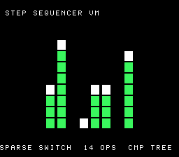

# #37 — SNES Sparse-Switch Step-Sequencer VM: comparison-tree opcode dispatch

<p align="center"></p>

**Status:** ✅ SHIPPED. Demo **#37** of the **compiler stress-test demo battery**. Gate `0xE8C5`;
**clean positive — no compiler bug** (sparse `switch` lowers to a comparison tree correctly across
all modes). Live: [/snes/seqvm/](https://biohack.net/snes/seqvm/).

## Context

A tiny register VM runs a looping bytecode "song"; its opcode dispatch is a **sparse `switch`** — 14
**non-contiguous** byte cases (`0x00, 0x10, 0x23, 0x47, 0x88, 0xC1, 0xF0`, …) spread across
`0x00..0xF0`. The density is far too low for a jump table, so the compiler must lower it to a
**binary-search comparison tree** (a cascade of `cmp`/branch). This is a distinct control-flow shape
from **#38 bf-vm** (computed `goto` / labels-as-values → indexed-indirect `jmp`) and **#29a**
(dense jump table). The 8 registers drive an 8-bar equalizer light show.

## Algorithm

```
seqvm_step(s):                       # ONE instruction — the sparse switch
    op, a, b = PROG[pc], PROG[pc+1] & 7, PROG[pc+2];  pc += 3
    switch (op) {                    # ← 14 non-contiguous cases → COMPARISON TREE
        case 0x10: r[a] = b;                        # SET
        case 0x23: r[a] += r[b&7];                  # ADD
        case 0x47: r[a] ^= r[b&7];                  # XOR
        case 0x88: r[a] = rol(r[a], r[b&7]);        # ROL
        case 0xC1: r[a] ^= tick + b;                # MIX (time injection)
        case 0xD3: if (r[a]) pc = b;                # JNZ (loop the song)
        ... 14 total ...
    }
    tick++
```

- All `uint8_t` register arithmetic (wraps mod 256 identically host/target); no bare `int`.
- Control-flow only — deliberately **no** `__mul`/`__udiv`.
- `OP_MIX` injects `tick` so the show never converges to a fixed point.

## Screen layout

```
row 1   STEP SEQUENCER VM                  (HUD top, BG3)
rows 6..21  [ 8-bar equalizer, green bars + white peak caps ]  (BG3 2bpp canvas)
row 25  SPARSE SWITCH  14 OPS  CMP TREE    (HUD bottom, BG3)
```

## Display architecture

- **BitmapCanvas** (BG3 2bpp, 128×128) — the 8-bar equalizer; clear+redraw each frame
  (`CANVAS_FLUSH_TILES = 256`). Bars filled with a fast masked byte-hspan `fill_rect`.
- **TextLayer** (BG3, rows 1 + 25) — HUD. **TitleLayer** (BG2) — fly-in during the gate CRC.
- Palette CGRAM 0..3: 0 black, 1 peak (white), 2 dim, 3 bar body (green).

## Files

| File | Purpose |
|------|---------|
| `examples/65816/seqvm.h` | portable sparse-switch VM + gate CRC |
| `examples/snes/corpus/seqvm_sim.c` | HAL-free corpus slice (5-way differential) |
| `tools/seqvm-sim.c` | host oracle |
| `examples/snes/seqvm.c` | SNES ROM (equalizer + HUD + title) |
| `dev/seqvm.sh` / `dev/seqvm.lua` | gate: host + disasm + bsnes-jg + MAME |
| `Taskfile.yml` | `seqvm` + `seqvm-play` tasks |

## Differential gate

- `corpus_result = seqvm_gate_crc()` — folds register state over `GATE_STEPS=400` VM steps + the
  final 8 registers into a uint16 CRC. Each step runs the sparse switch.
- `EXPECT` = **`0xE8C5`**.
- **5-way** bar (no far pointers).
- Disasm probes: **comparison tree** — `cmp/cpx/cpy` count ≥ 8, indexed-indirect `jmp (…)` == 0
  (proves it is NOT a jump table / computed goto), `rep`/`sep` native-16 ≥ 1.

## Publication

`/snes-rom-page --slug seqvm --site ~/SRC/biohack.net --title "Sparse-Switch Step-Sequencer VM"`.

## Verification steps

1. Host oracle compiles and prints a plausible CRC.
2. ROM builds clean; snes-checksum.py exits 0.
3. Corpus slice host-compiles; ./a.out exits 0.
4. `dev/run.sh seqvm` — host oracle + disasm gate + bsnes-jg all PASS.
5. Full 5-way on bsnes-jg (default==a16==xy16==host) + `-verify` clean.
6. Title intro card — `build/seqvm-jg.png` shows the equalizer animating.
7. Plan title card copied to `docs/plans/screenshots/seqvm.png`.
8. /snes-rom-page publishes.
9. `task md` renders cleanly.

## Verification evidence

**Step 4 — `dev/run.sh seqvm`:**
```
==> host oracle: seqvm gate hash = 0xE8C5
==> built build/seqvm.sfc (+mos-a16); corpus_result @ WRAM 0x6c
==> disasm gate (sparse-switch comparison tree)
    PASS  compares=22  indirect-jmp=0  rep/sep=30  (comparison tree, not a jump table)
==> bsnes-jg: render + framebuffer dump (build/seqvm-jg.png) + assert
SMOKE: PASS off=0x6C len=2 got=0xE8C5 (ran 500 frames, bsnes-jg)
RESULT: PASS — sparse-switch step-sequencer VM rendered on SNES; ... corpus hash 0xE8C5 host == +mos-a16
```
PASS. **compares=22, indirect-jmp=0** — the sparse switch is a comparison cascade, NOT a jump table
or computed goto, exactly the codegen #37 targets. (MAME leg SKIP — no SPC700 IPL here, non-blocking.)

**Step 5 — full 5-way on bsnes-jg + `-verify`:**
```
host oracle = 0xE8C5
  +mos-a16: verify OK
  +mos-xy16: verify OK
  default: SMOKE: PASS got=0xE8C5   a16: PASS got=0xE8C5   xy16: PASS got=0xE8C5
RESULT: PASS — host==default==a16==xy16==0xE8C5 on bsnes-jg
```
PASS. **Sparse-switch comparison-tree lowering is byte-exact across default-8-bit, +mos-a16, and
+mos-xy16 — a clean positive, no compiler bug.**
