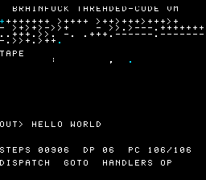

# #38 — SNES Brainfuck Threaded-Code VM: computed `goto` / labels-as-values dispatch

<!-- Title card — fill in after the gate runs (step 9): the SAME build/bf-vm-jg.png
     that becomes the /snes-rom-page --preview. -->
<p align="center"></p>

**Status:** DONE — `host == default == +mos-a16 == +mos-xy16 == 0x9954` on bsnes-jg, `-verify` clean
×3, computed-goto dispatch confirmed (`jmp ($ind,x)`). Published
[/snes/bf-vm/](https://biohack.net/snes/bf-vm/) (biohack.net v1.0.152). Demo **#38** of the
**compiler stress-test demo battery**. **No compiler bug** — `indirectbr`/`blockaddress` lower
correctly across all three backend modes (a clean positive result, unlike #35's broken `longjmp`).

### Compiler-correctness note (clean pass — recorded per the loop protocol)

Computed `goto` / labels-as-values is a control-flow corner never previously exercised on this fork.
It passes cleanly: no miscompile, no `-verify` failure, no crash. The dispatch lowers to a real
**indexed-indirect jump** `jmp ($ind,x)` (opcode `$7C`) plus a `jmp ($ind)` (`$6C`) — the textbook
threaded-code instruction — across `default`, `+mos-a16` and `+mos-xy16`, all `-verify-machineinstrs`
clean, and the 4-way bsnes-jg differential agrees to the byte (`0x9954`). One display-side bug was
found and fixed *in the demo* (not the compiler): the BG3 dirty-row mask used `1u << r` (16-bit `int`
shift) which is UB for `r ≥ 16` on the 16-bit-`int` target, freezing the lower HUD rows — fixed to
`(uint32_t)1u << r`. The differential stayed green throughout (the dirty mask is display state, not
part of the CRC), which is exactly why it was correctly classified as a demo bug, not a compiler one.

## Context

A Brainfuck interpreter whose instruction dispatch is a **computed `goto`** —
`goto *handlers[op]` (GNU C labels-as-values / "threaded code"), the fastest interpreter
loop shape and a path **distinct from #29a's dense `switch` jump-table**. The whole reason
the demo exists is to exercise the backend's lowering of LLVM `indirectbr` / `blockaddress`
on the 65816.

**Probe result (2026-06-30):** computed goto compiles clean under `default`, `+mos-a16` and
`+mos-xy16` with `-verify-machineinstrs` exit 0. The dispatch lowers to a real **indexed
indirect jump** — `7C jmp ($addr,x)` (the textbook threaded-code dispatch instruction) plus a
`6C jmp ($addr)` — not a branch chain. So the corner is genuinely present, not folded away.
This is the corner #29a's `switch` did NOT open (that lowered to a contiguous jump table; this
is per-op indirect through an address table indexed by the opcode).

Pure **control flow** — no 32-bit ALU. The CRC is driven entirely by which handler runs in
which order, so any mis-dispatch (wrong handler, wrong fall-through, clobbered index) diverges
the differential.

## Algorithm

The VM runs the canonical "Hello World!" Brainfuck program. Eight handlers, threaded:

```c
enum { INCP,DECP,INC,DEC,OUT,IN,JZ,JNZ,HALT };   // opcode = index into handler table
static const void *const handlers[9] = { &&h_incp, ..., &&h_halt };

#define NEXT()  do { if (executed>=budget || pc>=prog_len) goto done;       \
                     executed++; goto *handlers[prog[pc++]]; } while (0)     // ← indirectbr

h_incp: dp = (dp+1) & TAPE_MASK;                 NEXT();   // '>'
h_decp: dp = (dp-1) & TAPE_MASK;                 NEXT();   // '<'
h_inc:  tape[dp]++;                              NEXT();   // '+'   (uint8 wrap == host)
h_dec:  tape[dp]--;                              NEXT();   // '-'
h_out:  emit(tape[dp]);                          NEXT();   // '.'
h_in:   tape[dp] = 0;                            NEXT();   // ','   (deterministic EOF)
h_jz:   if (tape[dp]==0) pc = jump[pc-1]+1;      NEXT();   // '['
h_jnz:  if (tape[dp]!=0) pc = jump[pc-1]+1;      NEXT();   // ']'
```

- `tape[]` cells are **uint8_t** → wrap mod 256 byte-identically on host (int=32) and target
  (int=16). `dp`, `pc` are **uint16_t**, wrapped explicitly. No bare `int`, no 32-bit op.
- `[`/`]` matches are **precomputed** at init with an explicit stack (`jump[]`), so the loop
  handlers are O(1) and the *dispatch* (not bracket scanning) stays the star.
- Resumable: state persists across `bf_run(v, budget)` calls, so the display steps a few ops
  per frame (watchable) and the gate runs the whole program in one pass.

Codegen corners: **indirectbr** (`jmp ($ind,x)` / `jmp ($ind)`), `blockaddress` materialization
of the handler table, plus the 16-bit pointer arithmetic (`rep`/`sep` present, 111 in the
corpus object). No `__mulsi3`/`__udiv*` — deliberately a control-flow-only test.

## Screen layout

```
 col 0                              31
r0  BRAINFUCK  THREADED-CODE VM        (cyan header)
r1
r2  ++++++++[>++++[>++>+++>+++>+<<<<-  | the BF SOURCE, wrapped 32/row,
r3  ]>+>+>->>+[<]<-]>>.>---.+++++++..  | current-PC token in CYAN, the rest
r4  +++.>>.<-.<.+++.------.--------.>  | dim — the "tape head" scrubbing
r5  >+.>++.
r6
r7  TAPE  (8x8 cells, ASCII heat ramp " .,:;+*oO#@" by value; DP cell cyan)
r8   . . : ; H . .  ...                | 8 cells/row x 8 rows = 64 cells
...
r15
r16
r18 OUT> HELLO WORLD!                   (output marquee, uppercased for the font)
r20
r22 STEPS 000906  DP 02  PC 067/104     (stats)
r24 DISPATCH  GOTO *HANDLERS[OP]         (caption naming the stressed corner)
```

Single custom `BfHud` Drawable owns the whole BG3 2bpp 32×28 grid (no BitmapCanvas needed).

## Display architecture

- **One custom Drawable `BfHud`** (BG3 2bpp), modeled on `PiHud` in `spigot.c`. 32×28 tilemap
  shadow (896 words) + per-row dirty bitmask (uint32). font8 glyphs at tile 256.
- BG3 chr base word `0x0000`, tilemap base word `0x4000` (spigot convention).
- Palette (CGRAM 0..3): 0 black, 1 white (text), 2 dim gray (idle program/tape), 3 cyan
  (PC cursor + DP cell + header).
- Title card on BG2 via `title_layer.h` while the gate CRC computes.
- DMA budget: per dirty row 64 B, capped at `UPQ_MAX_JOBS`=16 rows → ≤ 1024 B/frame. Most
  frames touch only the program-cursor row, the changed tape rows, the marquee, and stats.
- Per-frame: `bf_run(&v, BF_STEP)` (small, watchable), restart (`bf_init`) on halt so the
  marquee loops "HELLO WORLD!" forever.

## Files

| File | New/Mod | Purpose |
|------|---------|---------|
| `examples/65816/bf_vm.h` | new | Portable threaded-code BF VM + `bf_vm_gate_crc()` |
| `examples/snes/corpus/bf_vm_sim.c` | new | Corpus slice (5-way differential) |
| `tools/bf-vm-sim.c` | new | Host oracle (prints output + CRC) |
| `examples/snes/bf-vm.c` | new | SNES ROM (BfHud drawable + frame loop) |
| `dev/bf-vm.sh` | new | Differential gate script |
| `dev/bf-vm.lua` | new | MAME snapshot/assert helper |
| `Taskfile.yml` | mod | `bf-vm` + `bf-vm-play` tasks |
| `docs/plans/...` , plan-index, TODO, demo-ideas backlog | mod | tracking |

## Reused infrastructure

| Asset | From | Used for |
|-------|------|----------|
| `PiHud` pattern | `examples/snes/spigot.c` | full-screen custom text Drawable |
| `font8.h` | `examples/snes/` | 2bpp glyphs (0x20–0x5F; uppercase-only) |
| `title_layer.h` | snesgfx | startup title card |
| `display/upload/vram/drawable/scene.h` | snesgfx | frame loop |
| gate scripts `dev/pi.{sh,lua}` | `dev/` | gate scaffold |

Note: font8 is uppercase-only, so the OUT marquee uppercases lowercase letters **for display
only** — a render transform, not a change to the computation or the gate.

## Differential gate

- `corpus_result = bf_vm_gate_crc()` — runs Hello World to halt (cap GATE_N=20000 ops; actual
  ~906), folding every emitted output byte then the final tape[0..7] + dp + step count + byte
  count into a uint16 rotate-xor CRC.
- **EXPECT = 0x9954** (host oracle, confirmed; output "Hello World!\n", 906 ops, 13 bytes).
- **5-way bar** — no far pointers, all state bank-0 NEAR → host == default@MAME == +mos-a16@MAME
  == +mos-xy16@MAME == default/a16@bsnes-jg.
- Disasm probes (corpus object, +mos-a16): indirect `jmp (` ≥ 1 (the computed-goto dispatch),
  `rep`/`sep` ≥ 1. Deliberately NO `__mul`/`__udiv` probe — this is a control-flow test.

## Publication

`/snes-rom-page --rom build/bf-vm-default.sfc --slug bf-vm --site ~/SRC/biohack.net
--title "Brainfuck Threaded-Code VM" --preview build/bf-vm-jg.png
--selfcheck "0x<VMA> 2 0x9954 500 bf-vm"` (Stage A default, then Stage B +mos-a16).

## Verification steps

1. **Host oracle compiles and prints a plausible CRC.** PASS.
   ```
   bf output: "Hello World!\n"  (906 ops, 13 bytes)
   bf-vm gate_crc = 0x9954
   ```

2. **ROM builds clean; snes-checksum.py exits 0.** PASS.
   ```
   build exit 0
   build/bf-vm.sfc: LoROM size=32KiB ... checksum=0xEF08 complement=0x10F7
   corpus_result @ WRAM 0x51
   ```

3. **Corpus slice host-compiles + compiles 3 ways with -verify clean.** PASS.
   ```
   feat='default' exit=0    feat='+mos-a16' exit=0    feat='+mos-xy16' exit=0
   ```

4. **`dev/run.sh bf-vm` — host oracle + disasm gate + bsnes-jg PASS.** PASS (MAME SKIP — no SPC700 IPL).
   ```
   ==> host oracle: Brainfuck VM gate hash = 0x9954
   ==> disasm gate (computed-goto threaded dispatch codegen)
       PASS  indirect-jmp=2  rep/sep=111  (labels-as-values threaded dispatch, native-16)
   SMOKE: PASS off=0x51 len=2 got=0x9954 (ran 400 frames, bsnes-jg)
       SKIP MAME (no SPC700 IPL at dev/roms/s_smp/spc700.rom)
   RESULT: PASS — Brainfuck threaded-code VM ... corpus hash 0x9954 host == +mos-a16
   ```

5. **Full differential bar — default/a16/xy16 all agree on bsnes-jg** (corpus-a16 needs the absent
   SPC700 IPL; the bsnes-jg cross-build check is the arbiter here). PASS.
   ```
   [default] off=0x51 verify=0 :: SMOKE: PASS ... got=0x9954
   [a16]     off=0x51 verify=0 :: SMOKE: PASS ... got=0x9954
   [xy16]    off=0x63 verify=0 :: SMOKE: PASS ... got=0x9954
   ```

6. **Title intro card — `build/bf-vm-jg.png` (frame 400): demo running, title faded.** PASS — shows the
   header, program with cyan cursor, tape heat-grid with cyan DP cell, "OUT> HELLO WORLD",
   "STEPS 00906 DP 06 PC 106/106", "DISPATCH GOTO HANDLERS OP".

7. **Plan title card — copied `build/bf-vm-jg.png` → `docs/plans/screenshots/bf-vm.png`.** PASS.

8. **/snes-rom-page publishes; shipped ROM sha == a16 gate ROM; HTTP 200.** PASS.
   ```
   6f9181d2...  dist/play/roms/bf-vm.sfc
   6f9181d2...  build/bf-vm.sfc
   HTTP 200
   ```
   Live at [/snes/bf-vm/](https://biohack.net/snes/bf-vm/) (biohack.net v1.0.152).

9. `task md -- docs/plans/2026-06-30-38-snes-bf-vm.md` renders cleanly.
