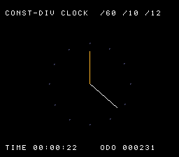

# #39 — SNES Constant-Divisor Clock + Odometer: strength-reduction probe (finding)

<p align="center"></p>

**Status:** ✅ SHIPPED. Demo **#39** of the **compiler stress-test demo battery**. Gate `0xF72E`;
**clean positive — no compiler bug.** Built to probe magic-reciprocal *strength reduction*; the
**measured finding** is that llvm-mos does **not** strength-reduce constant division at any width
(retains `__udivNi3` — the correct cost decision on a soft-multiply target). Live:
[/snes/divclock/](https://biohack.net/snes/divclock/).

## Context

A sweeping analog clock (hour/minute/second hands) + a rolling base-10 odometer. Splitting the frame
tick into `h:m:s` and the counter into base-10 digits uses divides by **compile-time constants**
(`/60`, `/3600`, `/10`, `/12`). The demo was built to exercise the classic optimisation where a
constant divide is **strength-reduced to a magic-number multiply-high + shift** (a reciprocal
approximation) — distinct from #27's genuine runtime-divisor modulo.

## Diagnosis note — the measured finding (governing lesson #1)

**Prediction was wrong; the measurement is the result.** The disasm shows llvm-mos does **not**
strength-reduce constant division to a magic reciprocal **at any width** — a micro-test confirms even
`uint16_t x / 10` lowers to `__udivhi3`, and `uint32_t x / 60` to `__udivsi3`/`__udivmodsi4`. Why this
is **correct, not a bug**:

- The magic-reciprocal transform replaces `x / C` with `MULHU(x, magic) >> s` — it needs the **high
  half of a wide multiply** (`MULHU`).
- On this 8-bit-native, **soft-multiply** target even an ordinary multiply is a libcall (`__mulsi3`);
  a widening `MULHU` for 16-/32-bit is likewise a libcall.
- So the "optimised" form would swap one libcall (`__udivhi3`) for another equally-expensive one. The
  LLVM cost model (which gates `BuildUDIV`/`BuildSDIV` on a cheap `MULHU`) **correctly declines** and
  keeps the division libcall.

**Consequence:** what the demo actually stresses is **heavy constant-divisor division via
`__udivNi3`**, and the 5-way differential proves that retained division is **bit-exact** across
default-8-bit / `+mos-a16` / `+mos-xy16`. This is a documented **upstream optimisation opportunity**
only in the hypothetical world where `MULHU` cheapens on this target — until then, no change is
warranted. (It is *not* queued in `upstream-contribution-status.md` because there is no actionable fix
— the current codegen is the cost-optimal choice.)

## Algorithm

```
dc_hms(tick):                    # constant divides — NOT strength-reduced here → __udivsi3
    tsec = tick / 60;  sec = tsec % 60
    tmin = tsec / 60;  min = tmin % 60
    thr  = tmin / 60;  hr  = thr  % 12
dc_digits(v):                    # base-10 digit extraction → __udivsi3 / __udivmodsi4
    for i in 0..5: d[i] = v % 10; v /= 10
```

All `uint32_t` counters; field/digit results `uint8_t`; no bare `int`.

## Screen layout

```
row 1   CONST-DIV CLOCK  /60 /10 /12        (HUD top, BG3)
rows 6..21  [ analog clock: 12 ticks + 3 hands ]  (BG3 2bpp canvas)
row 25  TIME HH:MM:SS   ODO NNNNNN          (HUD bottom, BG3)
```

## Differential gate

- `corpus_result = divclock_gate_crc()` — folds `h/m/s`, the three hand angles, and the 6 odometer
  digits over `GATE_N=200` sampled tick/odometer values into a uint16 CRC.
- `EXPECT` = **`0xF72E`**. **5-way** bar (no far pointers).
- Disasm probe (documents the finding): `__udivsi3`/`__udivmodsi4`/`__udivhi3` **≥ 1** (constant
  division retained, NOT strength-reduced), `rep`/`sep` ≥ 1.

## Files

| File | Purpose |
|------|---------|
| `examples/65816/divclock.h` | portable clock/odometer + gate CRC |
| `examples/snes/corpus/divclock_sim.c` | HAL-free corpus slice |
| `tools/divclock-sim.c` | host oracle |
| `examples/snes/divclock.c` | SNES ROM (analog clock + odometer HUD) |
| `dev/divclock.sh` / `dev/divclock.lua` | gate |
| `Taskfile.yml` | `divclock` + `divclock-play` tasks |

## Verification steps

1. Host oracle prints a plausible CRC.
2. ROM builds clean; snes-checksum.py exits 0.
3. Corpus slice host-compiles.
4. `dev/run.sh divclock` — host + disasm gate + bsnes-jg PASS.
5. Full 5-way on bsnes-jg (default==a16==xy16==host) + `-verify` clean.
6. Title card — `build/divclock-jg.png` shows the clock sweeping.

## Verification evidence

**Micro-test (the finding) — 16-bit AND 32-bit constant divide both call the division libcall:**
```
t16: uint16 x/10, x/60  →  jsr __udivhi3   (NOT a magic multiply)
t32: uint32 x/10, x/60  →  __udivsi3 / __udivmodsi4
```

**Step 4 — `dev/run.sh divclock`:**
```
==> host oracle: divclock gate hash = 0xF72E
==> built build/divclock.sfc (+mos-a16); corpus_result @ WRAM 0x57
==> disasm gate (constant-divisor division retained as libcall — no magic-reciprocal SR on soft-multiply)
    PASS  udiv-libcall=5  rep/sep=16  (constant divides retained as division libcalls; NOT strength-reduced — the finding)
==> bsnes-jg: render + framebuffer dump (build/divclock-jg.png) + assert
SMOKE: PASS off=0x57 len=2 got=0xF72E (ran 500 frames, bsnes-jg)
RESULT: PASS
```
PASS. (MAME leg SKIP — no SPC700 IPL here, non-blocking.)

**Step 5 — full 5-way on bsnes-jg + `-verify`:**
```
+mos-a16: verify OK    +mos-xy16: verify OK
default: PASS 0xF72E   a16: PASS 0xF72E   xy16: PASS 0xF72E
RESULT: PASS — host==default==a16==xy16==0xF72E on bsnes-jg
```
PASS. **Retained constant-divisor division is byte-exact across all three codegen modes — a clean
positive.** The value of #39 is the *measurement*: the magic-reciprocal strength reduction the backlog
predicted does not occur on llvm-mos, and that is the cost-optimal choice on a soft-multiply target.
