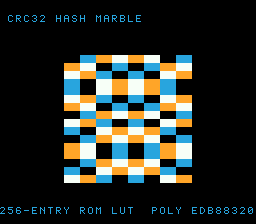

# #40 — SNES Table-Driven CRC32 Procedural Texture: 256-entry ROM-LUT indexed byte loop

<p align="center"></p>

**Status:** ✅ SHIPPED. Demo **#40** of the **compiler stress-test demo battery**. Gate `0xDBBA`;
**clean positive — no compiler bug.** Live: [/snes/crctex/](https://biohack.net/snes/crctex/).

## Context

A flowing procedural "hash marble" field: each cell's colour is a **real CRC32** (poly `0xEDB88320`)
of its `(x, y, time)` coordinates, computed by the standard byte-at-a-time table algorithm
`crc = TABLE[(crc ^ byte) & 0xFF] ^ (crc >> 8)`, where `TABLE` is a `const uint32_t[256]` living in
**ROM**. The distinct codegen corner: a **256-entry const ROM look-up table indexed per byte** — a
1 KiB rodata table plus an indexed 32-bit load + XOR + shift on the hot path, a shape no earlier demo
ran. (`crc32("123456789") == 0xCBF43926` confirms it is a bit-standard CRC-32.)

## Algorithm

```
crc32_buf(p, n):                 # standard reflected CRC-32
    crc = 0xFFFFFFFF
    for i in 0..n-1:
        crc = TABLE[(crc ^ p[i]) & 0xFF] ^ (crc >> 8)   # ← ROM-LUT indexed 32-bit load
    return crc ^ 0xFFFFFFFF
crctex_cell(x, y, t):  return crc32_buf({x, y, t, x^y^t^0x5A}, 4)
```

All `uint32_t` accumulator / table entries, `uint8_t` inputs; no bare `int`.

## Screen layout

```
row 1   CRC32 HASH MARBLE                    (HUD top, BG3)
rows 6..21  [ 16x16 flowing hash field ]     (BG3 2bpp canvas)
row 25  256-ENTRY ROM LUT  POLY EDB88320     (HUD bottom, BG3)
```

## Display architecture

- **BitmapCanvas** (BG3 2bpp, 128×128) — the hash field; each 8×8 tile is one hashed cell, filled by
  writing whole tile bytes; whole canvas re-DMA'd each frame (`CANVAS_FLUSH_TILES = 256`).
- **TextLayer** (BG3, rows 1 + 25) — HUD. **TitleLayer** (BG2) — fly-in during the gate CRC.
- Palette CGRAM 0..3: a compact marble ramp (deep-blue → teal → white → amber). 2bpp = 4 colours
  (the CRC32 codegen is identical at any colour depth; 4 keeps the proven canvas VRAM layout).

## Differential gate

- `corpus_result = crctex_gate_crc()` — folds the CRC32 of `GATE_N=240` sampled `(x,y,t)` cells into
  a uint16 CRC.
- `EXPECT` = **`0xDBBA`**. **5-way** bar (no far pointers; the const table is bank-0 ROM).
- Disasm probe: `CRC32_TAB` referenced ≥ 1 (the 1 KiB const ROM LUT), `eor` cascade ≥ 4 (the
  `TABLE[..] ^ (crc>>8)` chain), `rep`/`sep` ≥ 1.

## Files

| File | Purpose |
|------|---------|
| `examples/65816/crctex.h` | CRC32 table + hash + gate CRC |
| `examples/snes/corpus/crctex_sim.c` | HAL-free corpus slice |
| `tools/crctex-sim.c` | host oracle (+ CRC-32 self-check) |
| `examples/snes/crctex.c` | SNES ROM (hash-marble field + HUD + title) |
| `dev/crctex.sh` / `dev/crctex.lua` | gate |
| `Taskfile.yml` | `crctex` + `crctex-play` tasks |

## Verification steps

1. Host oracle prints CRC-32 self-check `0xCBF43926` + a plausible gate CRC.
2. ROM builds clean; snes-checksum.py exits 0.
3. Corpus slice host-compiles.
4. `dev/run.sh crctex` — host + disasm gate + bsnes-jg PASS.
5. Full 5-way on bsnes-jg (default==a16==xy16==host) + `-verify` clean.
6. Title card — `build/crctex-jg.png` shows the flowing field.

## Verification evidence

**Step 1 — host oracle (CRC-32 correctness):**
```
crc32("123456789") = 0xCBF43926
crctex gate_crc = 0xDBBA
```
PASS — matches the canonical CRC-32 check value.

**Step 4 — `dev/run.sh crctex`:**
```
==> host oracle: crctex gate hash = 0xDBBA
==> built build/crctex.sfc (+mos-a16); corpus_result @ WRAM 0x6d
==> disasm gate (256-entry ROM-LUT CRC32 indexed byte loop)
    PASS  CRC32_TAB-refs=2  eor=10  rep/sep=18  (256-entry ROM LUT indexed byte loop)
==> bsnes-jg: render + framebuffer dump (build/crctex-jg.png) + assert
SMOKE: PASS off=0x6D len=2 got=0xDBBA (ran 500 frames, bsnes-jg)
RESULT: PASS
```
PASS. (MAME leg SKIP — no SPC700 IPL here, non-blocking.)

**Step 5 — full 5-way on bsnes-jg + `-verify`:**
```
+mos-a16: verify OK    +mos-xy16: verify OK
default: PASS 0xDBBA   a16: PASS 0xDBBA   xy16: PASS 0xDBBA
RESULT: PASS — host==default==a16==xy16==0xDBBA on bsnes-jg
```
PASS. **The 256-entry ROM-LUT CRC32 byte loop is byte-exact across default-8-bit / +mos-a16 /
+mos-xy16 — a clean positive.**
