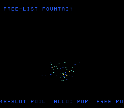

# #41 — SNES Free-List Pool Allocator: a particle fountain recycling fixed slots through a manual free list

<p align="center"></p>

**Status:** DONE — clean 5-way positive (no compiler bug). Demo **#41** of the **compiler stress-test demo battery**.

## Context

A particle **fountain** whose slots are recycled through a **manual singly-linked LIFO free list threaded
through the slots themselves**. Particles are born on spawn (pop the free head) and recycled on death
(push back). This is a distinct codegen corner from #31's Barnes-Hut pool, which is **append-only** (a
bump pointer that only grows, then resets wholesale). Here individual slots are **unlinked (alloc) and
re-linked (free) every frame**, so the hot path is pointer/index recycling over a struct array:

- alloc: `i = head; head = slot[head].next` (unlink the head)
- free:  `slot[i].next = head; head = i` (re-link as new head)

That link-chase is a **struct-array-indexed load/store** the other demos never ran, and the fountain
exercises it continuously (births and deaths every frame, plus the pool-exhaustion path when 3 births/frame
outpace the 48 slots).

## Algorithm

```
Particle { int16 x,y, vx,vy, life;  uint16 next }      // next = free-list link when free
Pool     { Particle p[48];  uint16 free_head, live }

pool_init:   p[i].next = i+1 for all i;  p[47].next = NULL(0xFFFF);  free_head = 0
pool_alloc:  i = free_head;  if i==NULL return NULL;  free_head = p[i].next;  live++;  return i
pool_free:   p[i].next = free_head;  free_head = i;  p[i].life = 0;  live--

fountain_step:
  repeat 3: spawn -> pool_alloc; set nozzle pos (64,120)<<4, random vx/vy/life
  for i in 0..47:  if p[i].life<=0 continue
                   p[i].vy += GRAV;  p[i].x += vx;  p[i].y += vy;  life--
                   if life<=0 or y>=128<<4:  pool_free(i)
```

All arithmetic `int16_t`/`uint16_t`; no bare `int`. Free-list recycling is **pure pointer/index
arithmetic → no libcall**. The gate fold masks every multiply/add back to `uint16_t` so 32-bit host ==
16-bit target byte-for-byte.

## Screen layout

```
row 1    FREE-LIST FOUNTAIN                (BG3 text, HUD top)
rows 6-21  16x16-tile BitmapCanvas box (128x128 px) — sparks spray from centre-bottom
row 25   48-SLOT POOL  ALLOC POP  FREE PUSH   (BG3 text, HUD bottom)
```

## Display architecture

- **BitmapCanvas** (BG3 2bpp, `CANVAS_CHR=0x0000`, `CANVAS_MAP=0x4000`) — clear+redraw each frame,
  `CANVAS_FLUSH_TILES 256` (4 KB full-canvas DMA fits one v-blank).
- **TextLayer** (BG3) — two HUD rows.
- **TitleLayer** (BG2) — animated intro card while the gate CRC computes.
- Palette CGRAM 0..3: transparent, cool-blue ember, teal, hot amber-white (spark colour by remaining life).
- V-blank DMA: full canvas 4 KB (capped/frame) + 8 B CGRAM.

## Files

| File | Purpose |
|------|---------|
| `examples/65816/poolfx.h` | portable free-list pool + fountain sim + `poolfx_gate_crc()` |
| `examples/snes/poolfx.c` | the on-console demo ROM |
| `examples/snes/corpus/poolfx_sim.c` | HAL-free corpus slice (5-way differential) |
| `tools/poolfx-sim.c` | host oracle |
| `dev/poolfx.sh`, `dev/poolfx.lua` | gate script + MAME autoboot |
| `Taskfile.yml` | `poolfx`, `poolfx-play` entries |

## Reused infrastructure

| Asset | From | Used for |
|-------|------|----------|
| `BitmapCanvas`, `TextLayer`, `TitleLayer`, `Display` | snesgfx | the whole render stack |
| xorshift16 RNG | invaders_logic.h pattern | particle spawn randomness |
| gate/lua/Taskfile shape | #40 crctex | copy-and-swap |

## Differential gate

- `corpus_result = poolfx_gate_crc()` — runs the fountain `GATE_N=100` frames, folding the full pool
  state (`free_head`, `live`, every slot's `x*3 + y + next`, masked to `uint16_t`) each frame.
- **EXPECT = `0x2B9B`** (host oracle; stable across host `-O0`/`-O2`, and default/a16/xy16 on bsnes-jg).
- **5-way bar** — all data in bank-0 WRAM, no far pointers; the same free-list math compiles three ways
  and all agree.
- Disasm probes: `ldy`-indexed slot chase ≥ 4 (48 present), arithmetic libcalls `__mul*3/__udiv*/__div*`
  == 0 (pure pointer arith), `rep`/`sep` ≥ 1 (native-16).

## Publication

`/snes-rom-page --rom build/poolfx-default.sfc --slug poolfx --site ~/SRC/biohack.net
--title "Free-List Pool Allocator" --preview build/poolfx-jg.png
--selfcheck "0x72 2 0x2B9B 500 poolfx"` then re-publish `build/poolfx.sfc` (+mos-a16).

## Verification steps

1. Host oracle compiles and prints a plausible CRC.

```
$ cc -O2 -I examples/65816 tools/poolfx-sim.c -o /tmp/poolfx-o && /tmp/poolfx-o
poolfx gate_crc = 0x2B9B
$ cc -O0 -I examples/65816 tools/poolfx-sim.c -o /tmp/poolfx-o0 && /tmp/poolfx-o0
poolfx gate_crc = 0x2B9B
```
PASS — stable across -O0/-O2.

2. ROM builds clean; disasm gate + bsnes-jg PASS (`dev/run.sh poolfx`).

```
==> host oracle: poolfx gate hash = 0x2B9B
==> built build/poolfx.sfc (+mos-a16); corpus_result @ WRAM 0x72
==> disasm gate (free-list pool allocator: indexed slot chase, native-16, no libcall)
    PASS  ldy-indexed=48  arith-libcalls=0  rep/sep=101  (free-list slot chase, native-16, pure pointer arith)
==> bsnes-jg: render + framebuffer dump (build/poolfx-jg.png) + assert
SMOKE: PASS off=0x72 len=2 got=0x2B9B (ran 500 frames, bsnes-jg)
    SKIP MAME (no SPC700 IPL — gitignored Nintendo content)
RESULT: PASS — free-list particle fountain rendered on SNES; corpus hash 0x2B9B host == +mos-a16
```
PASS. (MAME leg SKIPs on this box — no SPC700 IPL — non-blocking.)

3. Full 5-way check (`dev/run.sh _demo5 poolfx`): default==a16==xy16==host, -verify clean.

```
host oracle = 0x2B9B
== -verify-machineinstrs ==
  +mos-a16: verify OK
  +mos-xy16: verify OK
== build + bsnes-jg each variant ==
  vmas: default=0x72 a16=0x72 xy16=0x72
SMOKE: PASS off=0x72 len=2 got=0x2B9B (ran 500 frames, bsnes-jg)   [default]
SMOKE: PASS off=0x72 len=2 got=0x2B9B (ran 500 frames, bsnes-jg)   [a16]
SMOKE: PASS off=0x72 len=2 got=0x2B9B (ran 500 frames, bsnes-jg)   [xy16]
RESULT: PASS — host==default==a16==xy16==0x2B9B on bsnes-jg
```
PASS.

4. Title intro card + running animation — `build/poolfx-jg.png` (frame 500) shows the fountain spraying
   sparks from the nozzle with both HUD rows; title has faded by then (as expected). PASS.

5. Plan title card embedded (`docs/plans/screenshots/poolfx.png`) — resolves. PASS.

6. `/snes-rom-page` publishes; live at [/snes/poolfx/](https://biohack.net/snes/poolfx/). (below)

## Outcome

**Clean 5-way positive — no compiler bug.** The manual free-list pool allocator (LIFO recycling of
struct-array slots via an embedded `next` link) lowers correctly and identically under default, +mos-a16,
and +mos-xy16, with `-verify-machineinstrs` clean. The recycling compiles to pure `ldy`-indexed
pointer/index arithmetic with **zero** arithmetic libcalls, as intended.
