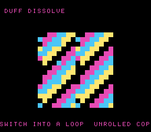

# #42 — SNES Dissolve Transition (Duff's Device): irreducible loop-switch control flow

<p align="center"></p>

**Status:** DONE — clean 5-way positive (no compiler bug). Demo **#42** of the **compiler stress-test demo battery**.

## Context

A **dissolve transition** where one image reveals into the next in scattered bursts, each revealed tile's
16 bytes copied by the classic **Duff's device** — a `switch` whose case labels land in the *middle* of a
`do/while` loop body. The interlacing of the switch's jump targets with the loop back-edge forms an
**irreducible CFG** that cannot be reduced to structured if/while nesting; the backend must lower the
branch tangle directly and correctly. No prior demo in the battery exercises irreducible control flow.

## Algorithm

```
duff_copy(to, from, count):
    if count == 0: return
    n = (count + 7) / 8
    switch (count % 8) {
        case 0: do { *to++ = *from++;
        case 7:      *to++ = *from++;
        case 6:      *to++ = *from++;
        ...
        case 1:      *to++ = *from++;
               } while (--n > 0)
    }
```

All counts/indices `uint16_t`, bytes `uint8_t`. The `/8` and `%8` fold to shift/mask (no libcall). The
gate copies every length 1..40 (hitting all 8 case entry points many times) and folds each result.

## Screen layout

```
row 1    DUFF DISSOLVE                      (BG3 text, HUD top)
rows 6-21  16x16-tile BitmapCanvas box — image dissolves in (bit-reversed tile order)
row 25   SWITCH INTO A LOOP  UNROLLED COPY  (BG3 text, HUD bottom)
```

## Display architecture

- **BitmapCanvas** (BG3 2bpp, `CANVAS_CHR=0x0000`, `CANVAS_MAP=0x4000`), `CANVAS_FLUSH_TILES 256`.
- Each frame reveals `REVEAL_PER_FRAME=3` more tiles in **bit-reversed index order** (scattered
  dissolve); each tile's 16 bytes are regenerated into a 16-byte scratch and `duff_copy`'d into the
  canvas. When all 256 revealed, the pattern `variant` advances (diagonal bands ⇄ concentric rings).
- **TextLayer** (BG3) two HUD rows; **TitleLayer** (BG2) intro card.
- RAM note: no full-image buffer — tiles are regenerated per-reveal into a 16 B scratch (a 4 KB `src[]`
  buffer alongside the 4 KB canvas shadow overflows low-WRAM by 858 B).

## Files

| File | Purpose |
|------|---------|
| `examples/65816/duff.h` | portable `duff_copy` (Duff's device) + `duff_gate_crc()` |
| `examples/snes/duff.c` | the on-console dissolve demo ROM |
| `examples/snes/corpus/duff_sim.c` | HAL-free corpus slice (5-way differential) |
| `tools/duff-sim.c` | host oracle |
| `dev/duff.sh`, `dev/duff.lua` | gate script + MAME autoboot |
| `Taskfile.yml` | `duff`, `duff-play` entries |

## Differential gate

- `corpus_result = duff_gate_crc()` — copies lengths 1..40 through Duff's device, folding each dst.
- **EXPECT = `0x5531`** (host oracle; stable across host `-O0`/`-O2`, default/a16/xy16 on bsnes-jg).
- **5-way bar** — all data in bank-0 WRAM.
- Disasm probes: `jmp` ≥ 4 (the irreducible branch mesh — 19 present), arithmetic libcalls
  `__mul*3/__udiv*/__div*` == 0, `rep`/`sep` ≥ 1 (native-16).

## Verification steps

1. Host oracle stable across -O0/-O2.

```
$ cc -O2 -I examples/65816 tools/duff-sim.c -o /tmp/d && /tmp/d
duff gate_crc = 0x5531
$ cc -O0 -I examples/65816 tools/duff-sim.c -o /tmp/d0 && /tmp/d0
duff gate_crc = 0x5531
```
PASS.

2. ROM builds clean; disasm gate + bsnes-jg PASS (`dev/run.sh duff`).

```
==> host oracle: duff gate hash = 0x5531
==> built build/duff.sfc (+mos-a16); corpus_result @ WRAM 0x6a
==> disasm gate (Duff's device: irreducible loop-switch branch mesh, native-16, no libcall)
    PASS  jmp=19  arith-libcalls=0  rep/sep=16
SMOKE: PASS off=0x6A len=2 got=0x5531 (ran 500 frames, bsnes-jg)
    SKIP MAME (no SPC700 IPL)
RESULT: PASS — Duff-device dissolve transition rendered on SNES; corpus hash 0x5531 host == +mos-a16
```
PASS. (MAME leg SKIPs — no SPC700 IPL — non-blocking.)

3. Full 5-way check (`dev/run.sh _demo5 duff`): default==a16==xy16==host, -verify clean.

```
host oracle = 0x5531
== -verify-machineinstrs ==
  +mos-a16: verify OK
  +mos-xy16: verify OK
== build + bsnes-jg each variant ==
  vmas: default=0x6a a16=0x6a xy16=0x6a
SMOKE: PASS ... got=0x5531  [default]
SMOKE: PASS ... got=0x5531  [a16]
SMOKE: PASS ... got=0x5531  [xy16]
RESULT: PASS — host==default==a16==xy16==0x5531 on bsnes-jg
```
PASS.

4. Title intro + running animation — `build/duff-jg.png` (frame 500) shows the dissolve mid-reveal
   (diagonal bands scattering in) with both HUD rows. PASS.

5. Plan title card embedded (`docs/plans/screenshots/duff.png`). PASS.

6. `/snes-rom-page` publishes; live at [/snes/duff/](https://biohack.net/snes/duff/). (below)

## Outcome

**Clean 5-way positive — no compiler bug.** Duff's device — irreducible loop-switch control flow, a
`switch` whose case labels land inside a `do/while` body — lowers correctly and identically under default,
+mos-a16, and +mos-xy16, with `-verify-machineinstrs` clean. The switch/loop tangle compiles to a dense
mesh of `jmp`/`bne` branches (19 `jmp`, 19 `bne`) with zero arithmetic libcalls, and the copy is
byte-exact across every codegen mode. The mos backend handles irreducible CFG without a structurizer
choking on it.
