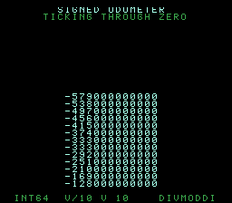

# #43 — SNES Signed 64-bit Odometer: sign-corrected `__divmoddi4`

<p align="center"></p>

**Status:** DONE — clean 5-way positive (no compiler bug). Demo **#43** of the **compiler stress-test demo battery**.

## Context

A vast **signed** odometer ticks through zero (negative → positive). Each value is decomposed into 18
decimal digits by the classic `v % 10` / `v /= 10` loop, which on a **negative** operand exercises the
**sign-corrected 64-bit divide+modulo** libcall — distinct from #22's *unsigned* `__udivdi3`. A scrolling
tape of the odometer's values rolls upward. This is the first *signed* 64-bit division path in the battery.

## Measured finding (not a bug)

clang **merges the adjacent `v/10` and `v%10`** (both used on the same value in the loop) into the
combined *signed* libcall **`__divmoddi4`** rather than emitting separate `__divdi3` + `__moddi3`. That is
the sign-correcting 64-bit divide+modulo entry point; the disasm gate accepts any of the signed forms
(`__divmoddi4`/`__divdi3`/`__moddi3`) and asserts the *unsigned* forms (`__udivdi3`/`__udivmoddi4`) are
absent — proving it is the signed path. (Governing lesson #1: measure what actually fires.)

## Algorithm

```
odo_digits(v, dig, sign):
    sign = (v<0)? -1 : (v>0)? 1 : 0
    for i in 0..17:
        d = v % 10          // signed modulo (negative for v<0) -> __divmoddi4
        dig[i] = |d|
        v = v / 10          // signed divide (truncates toward zero)
gate: sweep v = BASE + i*STEP (BASE<0, crosses zero), fold digits+sign each frame
```

Odometer + steps are `int64_t` (identical host/target); digits `uint8_t`; fold masked to `uint16_t`.

## Screen layout

```
row 0   SIGNED ODOMETER            (cyan)
row 1   TICKING THROUGH ZERO
rows 3-24  scrolling tape of signed values (newest at row 24, cyan)
row 26  INT64  V/10 V%10  __DIVMODDI4
```

## Display architecture

- Custom **OdoTape** Drawable (modeled on factorial.c's FactDisplay / spigot's PiHud): full-screen
  32×28 BG3 tilemap of font8 glyphs, per-row dirty bitmask (`(uint32_t)1u << r` — the
  [demo-display-dirty-mask width trap] guard), ≤ 16 rows DMA'd per v-blank.
- Ticks every 3 frames; scrolls the tape up one row and formats the new value at the bottom.
- TitleLayer (BG2) intro card. Two BG3 palettes: dim-green tape, bright-cyan newest.

## Files

| File | Purpose |
|------|---------|
| `examples/65816/sodo.h` | portable `odo_digits` + `sodo_gate_crc()` |
| `examples/snes/sodo.c` | the on-console scrolling-odometer ROM |
| `examples/snes/corpus/sodo_sim.c` | HAL-free corpus slice (5-way differential) |
| `tools/sodo-sim.c` | host oracle |
| `dev/sodo.sh`, `dev/sodo.lua` | gate script + MAME autoboot |
| `Taskfile.yml` | `sodo`, `sodo-play` entries |

## Differential gate

- `corpus_result = sodo_gate_crc()` — sweeps `GATE_N=60` values through zero, folding each frame's
  digits + sign.
- **EXPECT = `0xD2A2`** (host oracle; stable across host `-O0`/`-O2`, default/a16/xy16 on bsnes-jg).
- **5-way bar** — all data in bank-0 WRAM.
- Disasm probes: signed-64 divmod (`__divmoddi4`/`__divdi3`/`__moddi3`) ≥ 1, unsigned-64 == 0,
  `rep`/`sep` ≥ 1.

## Verification steps

1. Host oracle stable across -O0/-O2.

```
$ cc -O2 -I examples/65816 tools/sodo-sim.c -o /tmp/s && /tmp/s
sodo gate_crc = 0xD2A2
$ cc -O0 -I examples/65816 tools/sodo-sim.c -o /tmp/s0 && /tmp/s0
sodo gate_crc = 0xD2A2
```
PASS.

2. ROM builds clean; disasm gate + bsnes-jg PASS (`dev/run.sh sodo`).

```
==> host oracle: sodo gate hash = 0xD2A2
==> built build/sodo.sfc (+mos-a16); corpus_result @ WRAM 0x3a
==> disasm gate (signed 64-bit divmod: __divmoddi4, native-16)
    PASS  signed-64-divmod=1 (__divmoddi4/__divdi3/__moddi3)  unsigned-64=0  rep/sep=16
SMOKE: PASS off=0x3A len=2 got=0xD2A2 (ran 500 frames, bsnes-jg)
    SKIP MAME (no SPC700 IPL)
RESULT: PASS — signed-64 odometer rendered on SNES; corpus hash 0xD2A2 host == +mos-a16
```
PASS. (MAME leg SKIPs — no SPC700 IPL — non-blocking.)

3. Full 5-way check (`dev/run.sh _demo5 sodo`): default==a16==xy16==host, -verify clean.

```
host oracle = 0xD2A2
== -verify-machineinstrs ==
  +mos-a16: verify OK
  +mos-xy16: verify OK
  vmas: default=0x3a a16=0x3a xy16=0x3a
SMOKE: PASS ... got=0xD2A2  [default]
SMOKE: PASS ... got=0xD2A2  [a16]
SMOKE: PASS ... got=0xD2A2  [xy16]
RESULT: PASS — host==default==a16==xy16==0xD2A2 on bsnes-jg
```
PASS.

4. Title intro + running animation — `build/sodo-jg.png` (frame 500) shows the scrolling tape of signed
   values ticking upward through zero with headers and HUD. PASS.

5. Plan title card embedded (`docs/plans/screenshots/sodo.png`). PASS.

6. `/snes-rom-page` publishes; live at [/snes/sodo/](https://biohack.net/snes/sodo/). (below)

## Outcome

**Clean 5-way positive — no compiler bug.** Signed 64-bit divide+modulo — the sign-corrected
`__divmoddi4` (clang's merge of the adjacent `v/10`/`v%10`) — lowers correctly and identically under
default, +mos-a16, and +mos-xy16, with `-verify-machineinstrs` clean. The odometer's digit decomposition
of both negative and positive 64-bit values is byte-exact across every codegen mode.
