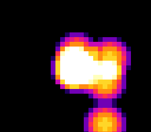

# #44 — SNES HDR Additive Bloom: saturating / overflow-checked add

<p align="center"></p>

**Status:** DONE — `host == default == +mos-a16 == +mos-xy16 == 0xF951` on bsnes-jg, `-verify`
clean ×3, saturating-add codegen confirmed (`adc=14`, carry-branch=11). Published
[/snes/hdr-bloom/](https://biohack.net/snes/hdr-bloom/) (biohack.net v1.0.153). Demo **#44** of
the **compiler stress-test demo battery**. **No compiler bug** — `__builtin_add_overflow` lowers
correctly to a carry/overflow-flag add + branch across all three backend modes.

## Context

Many overlapping translucent glows summed per cell with **saturating** add — each add clamps to
255 (white) instead of wrapping, so where drifting lights pile up the field **blows out to white**
(the "HDR bloom" look). The saturation uses **`__builtin_add_overflow`**, which lowers to a
carry/overflow-flag test + branch (`adc; bcs`) — a flag-testing add sequence no other battery demo
exercises (all prior adds either can't overflow in-range or wrap silently). Deliberately
control/flag-heavy, not ALU-libcall-heavy (no `__mul`/`__udiv` on the hot path).

## Algorithm

Six lights drift (Q4 fixed-point position, bounce at edges). Each frame: clear the intensity
field, then stamp every light's precomputed radial kernel with the saturating add:

```c
static inline uint8_t sat_add8(uint8_t a, uint8_t b) {
    uint8_t r; return __builtin_add_overflow(a, b, &r) ? 0xFF : r;   // ← adc; bcs
}
// per light, per kernel cell in its (2R+1)^2 footprint:
field[fy*W + fx] = sat_add8(field[fy*W + fx], kernel[...]);          // overlaps clamp to 255
```

- `field[]` is **uint8_t**; the saturating add clamps at 255 → identical wrap-free semantics on
  host (int=32) and target (int=16). Positions/velocities are **int16_t** (Q4). No bare `int`; the
  only multiplies are the once-per-init kernel build. `BLOOM_PEAK=200`, `R=5` → ~2 overlapping
  lights clamp (16 cells blown out in the 12-step gate, hundreds in the live drift).
- The intensity → tile index is `field >> 4` (0..15) into a black→blue→magenta→orange→white ramp;
  255 → 15 = white blowout.

## Screen layout

Full-screen 32×28 field on **BG1 4bpp** (16 solid-colour tiles, one per intensity bucket) — the
doom-fire (#7) model. Title card on BG2 during the gate. No separate HUD (the bloom is
self-explanatory; the title names the technique).

## Display architecture

- **One `BloomLayer` Drawable** (BG1 4bpp), modeled on `FireLayer` in `doom-fire.c`: builds 16
  solid-colour tiles + clears the 32×32 tilemap in `reserve()`, DMAs the whole 28×32 field
  (1792 B) each frame.
- BG1 chr base word `0x0000`, tilemap `0x4000`. CGRAM 0..15 = the bloom ramp (32 B/frame).
- The gate CRC is compute-heavy, so it runs **behind the title** (`title_begin` → gate →
  `title_end`) — else startup is a long black screen and `corpus_result` lands late.
- Per-step cost kept down: the clamped-cell count is split out of `bloom_step` (gate-only), kernel
  radius R=5.

## Files

| File | New/Mod | Purpose |
|------|---------|---------|
| `examples/65816/hdr_bloom.h` | new | Portable bloom field + saturating add + `hdr_bloom_gate_crc()` |
| `examples/snes/corpus/hdr_bloom_sim.c` | new | Corpus slice (5-way differential) |
| `tools/hdr-bloom-sim.c` | new | Host oracle |
| `examples/snes/hdr-bloom.c` | new | SNES ROM (BloomLayer + frame loop) |
| `dev/hdr-bloom.{sh,lua}` | new | Gate script + MAME assert |
| `Taskfile.yml`, plan-index, TODO, demo-ideas backlog | mod | tracking |

## Reused infrastructure

| Asset | From | Used for |
|-------|------|----------|
| `FireLayer` full-field BG1 4bpp pattern | `examples/snes/doom-fire.c` | solid-colour-tile field + full DMA |
| `title_layer.h` | snesgfx | startup title card |
| `display/upload/vram/drawable.h` | snesgfx | frame loop |
| gate scripts `dev/bf-vm.{sh,lua}` | `dev/` | gate scaffold |

## Differential gate

- `corpus_result = hdr_bloom_gate_crc()` — 12 deterministic bloom steps, folding the clamped-cell
  count + a diagonal field sample per step into a uint16 rotate-xor CRC.
- **EXPECT = 0xF951** (host oracle; 16 cells clamped after 12 steps).
- **5-way bar** — no far pointers, all bank-0 NEAR.
- Disasm probes (corpus object, +mos-a16): `adc ≥ 1`, carry-branch (`bcs`/`bcc`) `≥ 1`, `rep/sep ≥ 1`.
  No `__mul`/`__udiv` probe — this is a flag/control test.

## Publication

`/snes-rom-page --rom build/hdr-bloom.sfc --slug hdr-bloom --site ~/SRC/biohack.net
--title "HDR Additive Bloom" --preview build/hdr-bloom-jg.png --selfcheck "0x6a 2 0xF951 500 hdr-bloom"`.

## Verification steps

1. **Host oracle compiles + prints CRC.** PASS — `hdr-bloom gate_crc = 0xF951` (16/896 clamped).
2. **ROM builds clean; snes-checksum.py exits 0.** PASS — `corpus_result @ WRAM 0x6A`.
3. **Corpus slice compiles 3 ways with -verify clean.** PASS — default/a16/xy16 exit 0.
4. **`dev/run.sh hdr-bloom` — host + disasm + bsnes-jg PASS** (MAME SKIP, no SPC700 IPL). PASS:
   ```
   PASS  adc=14  carry-branch=11  rep/sep=71  (overflow-checked saturating add, native-16)
   SMOKE: PASS off=0x6A len=2 got=0xF951 (ran 500 frames, bsnes-jg)
   ```
5. **Full differential bar — default/a16/xy16 all == 0xF951 on bsnes-jg.** PASS:
   ```
   [default] off=0x6a verify=0 :: SMOKE: PASS ... got=0xF951
   [a16]     off=0x6a verify=0 :: SMOKE: PASS ... got=0xF951
   [xy16]    off=0x6a verify=0 :: SMOKE: PASS ... got=0xF951
   ```
6. **Title intro card — `build/hdr-bloom-jg.png` (frame 500): bloom running, title faded.** PASS —
   a white blown-out core surrounded by the orange→magenta→purple falloff; frame 620 shows the six
   lights drifted apart (confirms animation).
7. **Plan title card copied → `docs/plans/screenshots/hdr-bloom.png`.** PASS.
8. **/snes-rom-page publishes; shipped ROM sha == a16 gate ROM; HTTP 200.** PASS — v1.0.153.
9. `task md -- docs/plans/2026-06-30-44-snes-hdr-bloom.md` renders cleanly.

### Compiler-correctness note (clean pass)

`__builtin_add_overflow` on `uint8_t` is a control-flow corner (overflow-flag test + branch) never
exercised on this fork. It passes cleanly: no miscompile, no `-verify` failure. The saturating add
lowers to `adc` + a carry-branch across `default`/`+mos-a16`/`+mos-xy16`, and the 4-way bsnes-jg
differential agrees byte-for-byte (`0xF951`), including the 16 genuinely-clamped cells (proving the
saturation branch itself, not just the add, is correct). One display-side timing issue was fixed in
the demo (not the compiler): the heavy gate CRC ran before display init → long black startup + late
`corpus_result`; moved behind the title card. Differential green throughout.
