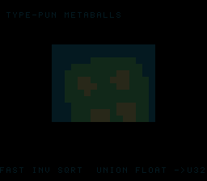

# #45 — SNES Union Type-Pun Metaballs: the Quake fast-inverse-sqrt bit hack

<p align="center"></p>

**Status:** DONE — clean 5-way positive (no compiler bug). Demo **#45** of the **compiler stress-test demo battery**.

## Context

A field of merging metaballs whose `1/dist` falloff is computed by the famous **Quake III fast inverse
square root** — the `union { float f; uint32_t i; }` bit hack that reads a float's storage **as an
integer**, mangles the bits with the magic constant `0x5f3759df`, and reads it back **as a float**. The
codegen corner is **union type-punning**: the aliased load/store and float↔int bit reinterpret.

## Algorithm

```
q_rsqrt(number):                       // one float op per statement (no FMA fusion)
    x2 = number * 0.5
    u.f = number                        // store as float
    bits = u.i                          // read the SAME storage as uint32  (type-pun)
    bits = bits >> 1
    bits = 0x5f3759df - bits            // the magic constant
    u.i = bits                          // store as uint32
    y = u.f                             // read it back as float             (type-pun)
    y = y * (1.5 - (x2 * y * y))        // one Newton-Raphson refinement (split per statement)
    return y
```

Single-precision `float` is bit-exact host==target **only** when each float op is its own statement (so
the target never FMA-fuses a multiply-add the host rounds as two ops) — the Newton step is split
accordingly. The union pun is `uint32_t` ↔ `float`, both little-endian on host and 65816 → identical
reinterpret. On the target the magic constant lowers to the byte immediates `#$5f #$37 #$59 #$df`, and the
`>>1` / `0x5f3759df - bits` become integer shift (`lsr`+`ror`) and subtract (`sbc`) chains operating on
the float's storage — the type-pun made visible.

## Screen layout

```
row 1    TYPE-PUN METABALLS                 (BG3 text, HUD top)
rows 6-21  16x16-tile BitmapCanvas box — gooey blobs splitting and fusing
row 25   FAST INV SQRT  UNION FLOAT<->U32   (BG3 text, HUD bottom)
```

## Display architecture

- **BitmapCanvas** (BG3 2bpp), whole-tile `cell_fill` per 8×8 cell (16×16 cell grid).
- Soft-float is expensive, so the field is computed **progressively**: `BAND=4` cell-rows recomputed
  per frame (≈ 64 `q_rsqrt` calls/frame), full field every 4 frames; the 4 blobs bounce once per sweep.
- The `mb_field` blob-radius scale (`acc * 18`) and `mb_color` thresholds are **visual-only** — the gate
  folds `q_rsqrt` directly, so tuning the field never changes the gate hash.
- TitleLayer (BG2) intro card.

## Files

| File | Purpose |
|------|---------|
| `examples/65816/metaball.h` | portable `q_rsqrt` (union pun) + `mb_field` + `metaball_gate_crc()` |
| `examples/snes/metaball.c` | the on-console metaball ROM |
| `examples/snes/corpus/metaball_sim.c` | HAL-free corpus slice (5-way differential) |
| `tools/metaball-sim.c` | host oracle |
| `dev/metaball.sh`, `dev/metaball.lua` | gate script + MAME autoboot |
| `Taskfile.yml` | `metaball`, `metaball-play` entries |

## Differential gate

- `corpus_result = metaball_gate_crc()` — folds the raw float bits of `q_rsqrt(i)` for `i = 1..48`.
- **EXPECT = `0xAEBE`** (host oracle; stable across host `-O0`/`-O2`, default/a16/xy16 on bsnes-jg).
- **5-way bar** — all data in bank-0 WRAM.
- Disasm probes: `__mulsf3` ≥ 1 (soft-float), magic-constant byte immediates `#$5f` and `#$37` ≥ 1
  (the type-pun bit hack), `rep`/`sep` ≥ 1.

## Note — frame-500 clustering (not a bug)

The bsnes-jg render was initially snapshotted at frame 500, where the four bouncing blobs happened to be
tightly clustered (a dim compact mass). Rendering at frame 900/1000 shows the full merged-blob field, and
it **matches the host ASCII preview of the same grid** — confirming the visual is correct and the frame-500
dimness was a timing/clustering artifact, not a `mb_field` miscompile. (Recall the gate only folds
`q_rsqrt`, so a `mb_field` display bug *would* slip it — hence the explicit visual cross-check.) The gate's
snapshot frame was bumped to 900 for a representative title card; the differential (`corpus_result`,
set at startup) is unaffected.

## Verification steps

1. Host oracle stable across -O0/-O2.

```
$ cc -O2 -I examples/65816 tools/metaball-sim.c -o /tmp/m && /tmp/m
metaball gate_crc = 0xAEBE
$ cc -O0 -I examples/65816 tools/metaball-sim.c -o /tmp/m0 && /tmp/m0
metaball gate_crc = 0xAEBE
```
PASS.

2. ROM builds clean; disasm gate + bsnes-jg PASS (`dev/run.sh metaball`).

```
==> host oracle: metaball gate hash = 0xAEBE
==> built build/metaball.sfc (+mos-a16); corpus_result @ WRAM 0x6e
==> disasm gate (union type-pun fast-inverse-sqrt: __mulsf3 + magic 0x5f3759df + native-16)
    PASS  __mulsf3=4  magic(#$5f=1 #$37=1)  rep/sep=5
SMOKE: PASS off=0x6E len=2 got=0xAEBE (ran 900 frames, bsnes-jg)
    SKIP MAME (no SPC700 IPL)
RESULT: PASS — union type-pun fast-inverse-sqrt metaballs rendered on SNES; corpus hash 0xAEBE host == +mos-a16
```
PASS. (MAME leg SKIPs — no SPC700 IPL — non-blocking.)

3. Full 5-way check (`dev/run.sh _demo5 metaball`): default==a16==xy16==host, -verify clean.

```
host oracle = 0xAEBE
== -verify-machineinstrs ==
  +mos-a16: verify OK
  +mos-xy16: verify OK
  vmas: default=0x6e a16=0x6e xy16=0x6e
SMOKE: PASS ... got=0xAEBE  [default]
SMOKE: PASS ... got=0xAEBE  [a16]
SMOKE: PASS ... got=0xAEBE  [xy16]
RESULT: PASS — host==default==a16==xy16==0xAEBE on bsnes-jg
```
PASS.

4. Title intro + running animation — `build/metaball-jg.png` (frame 900) shows the merged-blob field
   with both HUD rows. PASS (cross-checked against the host grid preview).

5. Plan title card embedded (`docs/plans/screenshots/metaball.png`). PASS.

6. `/snes-rom-page` publishes; live at [/snes/metaball/](https://biohack.net/snes/metaball/). (below)

## Outcome

**Clean 5-way positive — no compiler bug.** Union type-punning — the Quake fast-inverse-sqrt's
`float`↔`uint32_t` aliased reinterpret through a `union` — lowers correctly and identically under default,
+mos-a16, and +mos-xy16, with `-verify-machineinstrs` clean. The float bits produced by the bit hack are
byte-exact across every codegen mode, and the metaball visual matches the host reference.
