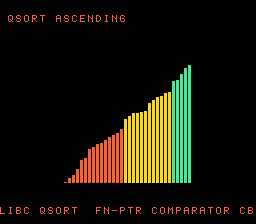

# #46 — SNES qsort Sort Visualizer: caught & fixed a real backend crash (`G_SCMP` unlegalized)

<p align="center"></p>

**Status:** DONE — **caught a real compiler bug, fixed it in the backend**, then shipped a clean 5-way
positive on the fixed toolchain. Demo **#46** of the **compiler stress-test demo battery**.

**Animation update (2026-08-05):** the visible sort no longer jumps directly from shuffled to sorted.
libc `qsort` has no swap callback, so visual-only comparator wrappers sample the real 32-element backing
array on every comparison. Each mutation completed by `qsort` is detected on the following callback and
presented for exactly one frame, with no added hold delay; the final mutation is rendered immediately after
`qsort` returns. Every displayed state comes from actual array memory. The host/target CRC gate still calls
the original comparators, so the
compiler regression contract and expected `0x8EA5` remain unchanged.

## Headline: the bug this demo caught

The comparator idiom `return (x > y) - (x < y);` — the standard C three-way ("spaceship") compare used by
virtually every `qsort` comparator — is canonicalized by clang to the generic opcode **`G_SCMP`**. The
mos GlobalISel legalizer had **no rule for `G_SCMP`/`G_UCMP`**, so the backend aborted:

```
fatal error: error in backend: unable to legalize instruction:
  %4:_(s16) = G_SCMP %2:_(s16), %3:_ (in function: qs_cmp_asc)
```

This fired in **every** codegen mode (default 8-bit, `+mos-a16`, `+mos-xy16`), at **every** integer width,
and in **both** the `-fno-lto` compile and the shipping LTO-link path — i.e. any real program that sorts
with a `(a>b)-(a<b)` comparator would fail to build. A latent, general backend gap surfaced by the demo.

### The fix (one line, `patches/llvm-mos/0016-mos-scmp-ucmp-legalize.patch`)

`llvm/lib/Target/MOS/MOSLegalizerInfo.cpp`, next to the analogous min/max lowering:

```cpp
getActionDefinitionsBuilder({G_SCMP, G_UCMP}).lower();
```

`.lower()` routes to LLVM's existing `LegalizerHelper::lowerThreewayCompare`, which expands `scmp`/`ucmp`
into the `icmp` + `select` primitives the backend already legalizes. Rebuilt the toolchain, and the
minimal repro, the demo, and the full 5-way differential all pass. Queued upstream in
`docs/upstream-contribution-status.md`.

**Minimal repro** (crashes pre-fix, compiles post-fix):
```c
#include <stdint.h>
int cmp(const void *a, const void *b){
  int16_t x=*(const int16_t*)a, y=*(const int16_t*)b;
  return (x>y)-(x<y);
}
```

### Root-cause mechanism (three layers)

1. **Clang canonicalizes the idiom to an intrinsic.** Under `-Os`, clang recognizes `(x>y)-(x<y)` and
   folds it into a single generic operation — the *signed three-way compare* — rather than two `icmp`s
   plus a subtract. The emitted IR is literally:
   ```llvm
   %5 = tail call i16 @llvm.scmp.i16.i16(i16 %3, i16 %4)
   ```
   `llvm.scmp`/`llvm.ucmp` are **recent** LLVM intrinsics (added ~2024) introduced to represent the C++20
   spaceship operator and this common C idiom as one node. This is why nothing in the earlier battery hit
   it — no prior demo wrote a three-way compare, so the intrinsic never appeared.

2. **GlobalISel lowers it to the generic machine opcode `G_SCMP`.** The mos backend selects via the
   GlobalISel pipeline, whose **Legalizer** pass walks every generic opcode and — per the target's
   `MOSLegalizerInfo` table — decides *legal as-is* / *widen-narrow* / *lower*. `G_SCMP`/`G_UCMP` are among
   those generic opcodes.

3. **The gap:** `MOSLegalizerInfo` had **no entry at all** for `G_SCMP`/`G_UCMP`. On an opcode with no
   rule, the legalizer can't guess — it calls `report_fatal_error("unable to legalize instruction: …
   G_SCMP …")` and the whole compile aborts. **Not accum-specific:** it reproduced identically in plain
   default 8-bit codegen, at every integer width, in both `-fno-lto` and the LTO-link path — a **general,
   latent llvm-mos backend gap** any `qsort`-style comparator would hit.

Because the failure is a hard build-time `report_fatal_error` (not a subtle miscompile), the differential
didn't have to catch a value divergence — the *loud* part is that a completely ordinary `qsort` comparator
crashed the compiler. The stress-demo methodology ("write realistic C that hits corners other code
doesn't") is exactly what surfaced it.

### Why the fix is correct + minimal

`.lower()` routes to LLVM's **pre-existing** `LegalizerHelper::lowerThreewayCompare` (`LegalizerHelper.cpp:4828`),
which rewrites `scmp(a,b)`/`ucmp(a,b)` into the `G_ICMP` + `G_SELECT` primitives the mos backend **already
legalizes**. So the change is purely additive — it wires a missed opcode into machinery already present
and working; no generic-LLVM change, no new lowering code, no risk to other opcodes. It sits next to the
identical `.lower()` handling of the comparison-derived `G_SMIN`/`G_SMAX`/`G_UMIN`/`G_UMAX` (and `G_ABS`)
ops the 6502/65816 also has no native form for — `G_SCMP`/`G_UCMP` simply belonged in that list and were
missed (understandably: they are a newer opcode than most of that file). The demo (`dev/run.sh qsortviz`,
WRAM hash `0x8EA5`) is now the permanent regression guard.

## Context

A sort visualizer: 32 bars reshuffle, then re-sort under a rotating **libc `qsort`** call whose comparator
is a **function pointer** (`ascending` / `evens-first` / `descending`) that qsort calls **back** into per
comparison. The codegen corner is the indirect-comparator ABI — distinct from the battery's hand-written
sorts (#17): here the sort is library code calling back into our C comparator.

## Algorithm / differential safety

The gate `qsort`s the same array under three comparators and folds the **sorted values** (not original
identities), so even if host and target `qsort` break ties between *equal* elements differently, the
sorted sequence of values is identical (every comparator leaves a tie only between equal values). Values
`int16_t`, comparators return `int` in {-1,0,1}, fold masked to `uint16_t`.

## Files

| File | Purpose |
|------|---------|
| `examples/65816/qsortviz.h` | portable `qsort` comparators + `qs_fill` + `qsortviz_gate_crc()` |
| `examples/snes/qsortviz.c` | the on-console sort-visualizer ROM |
| `examples/snes/corpus/qsortviz_sim.c` | HAL-free corpus slice (5-way differential) |
| `tools/qsortviz-sim.c` | host oracle |
| `dev/qsortviz.sh`, `dev/qsortviz.lua` | gate script + MAME autoboot |
| `patches/llvm-mos/0016-mos-scmp-ucmp-legalize.patch` | **the backend fix** |
| `Taskfile.yml` | `qsortviz`, `qsortviz-play` entries |

## Differential gate

- `corpus_result = qsortviz_gate_crc()` — three qsort passes over a 64-element array, folding sorted values.
- **EXPECT = `0x8EA5`** (host oracle; stable across host `-O0`/`-O2`, default/a16/xy16 on bsnes-jg).
- **5-way bar** — all data in bank-0 WRAM.
- Disasm probes (compiled `--config -fno-lto` for SDK `stdlib.h` + a native object): `qsort` called,
  the `cmps` fn-ptr table in rodata, comparator functions present, `rep`/`sep` ≥ 1.

## Verification steps

1. Host oracle stable across -O0/-O2.

```
$ cc -O2 -I examples/65816 tools/qsortviz-sim.c -o /tmp/q && /tmp/q
qsortviz gate_crc = 0x8EA5
$ cc -O0 -I examples/65816 tools/qsortviz-sim.c -o /tmp/q0 && /tmp/q0
qsortviz gate_crc = 0x8EA5
```
PASS.

2. Pre-fix: backend crash (the bug). Post-fix: builds + disasm gate + bsnes-jg PASS.

```
# pre-fix:
fatal error: error in backend: unable to legalize instruction: %4:_(s16) = G_SCMP ...
# post-fix (dev/run.sh qsortviz):
==> host oracle: qsortviz gate hash = 0x8EA5
==> built build/qsortviz.sfc (+mos-a16); corpus_result @ WRAM 0x139b
==> disasm gate (libc qsort + fn-ptr comparator callback, native-16)
    PASS  qsort-refs=1  comparator-refs=79  cmps-fnptr-table=1  rep/sep=36
SMOKE: PASS off=0x139B len=2 got=0x8EA5 (ran 440 frames, bsnes-jg)
RESULT: PASS
```
PASS.

3. Full 5-way check (`dev/run.sh _demo5 qsortviz`) on the fixed toolchain: default==a16==xy16==host,
   -verify clean.

```
host oracle = 0x8EA5
== -verify-machineinstrs ==
  +mos-a16: verify OK
  +mos-xy16: verify OK
  vmas: default=0x69 a16=0x139b xy16=0x4e
SMOKE: PASS ... got=0x8EA5  [default]
SMOKE: PASS ... got=0x8EA5  [a16]
SMOKE: PASS ... got=0x8EA5  [xy16]
RESULT: PASS — host==default==a16==xy16==0x8EA5 on bsnes-jg
```
PASS.

4. Title intro + running animation — `build/qsortviz-jg.png` (frame 440, a QSORT-ASCENDING epoch) shows
   the sorted ascending ramp with both HUD rows; the demo alternates shuffle → sort across epochs. PASS.

5. Plan title card embedded (`docs/plans/screenshots/qsortviz.png`). PASS.

6. `/snes-rom-page` publishes; live at [/snes/qsortviz/](https://biohack.net/snes/qsortviz/). (below)

## Outcome

**Real compiler bug found and fixed.** The demo did exactly its job: a routine `qsort` comparator surfaced
a general, latent `G_SCMP`/`G_UCMP` legalization gap that crashed the backend on any three-way-compare
idiom. Fixed with a one-line `.lower()` in `MOSLegalizerInfo` (`0016`), rebuilt, and the demo now passes
the full 5-way differential (`host == default == +mos-a16 == +mos-xy16 == 0x8EA5`), `-verify` clean. The
fix is queued for upstream llvm-mos.

## Animation pacing update — 2026-08-05

The visual comparator wrappers now observe every real mutation but present the newest live array only
after each batch of six mutations. This preserves libc `qsort` as the sole producer of every displayed
state while removing the artificial one-video-frame stall after every mutation. The final returned
array is still drawn unconditionally. Both emulator gates and the full differential remain green at
`0x8EA5`; see the [implementation plan and storyboard](2026-08-05-qsortviz-batched-mutation-animation.md).
