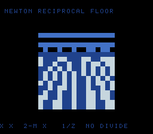

# #47 — SNES Newton-Raphson Reciprocal Floor: multiply-only iterative refinement

<p align="center"></p>

**Status:** DONE — clean 5-way positive (no compiler bug). Demo **#47** of the **compiler stress-test demo battery**.

## Context

A perspective checkerboard floor whose `1/z` depth mapping is computed by a **multiply-only
Newton-Raphson fixed-point reciprocal** — no hardware divide, no divide libcall. The iteration
`x_{n+1} = x_n * (2 - m * x_n)` converges quadratically to `1/m`; each step is two Q15 multiplies
(32-bit `__mulsi3`) and a subtract. This is the **iterative fixed-point refinement** corner — a
convergent loop, distinct from a single divide libcall (#39) and from #45's float bit-hack.

## Algorithm

```
nr_recip_mant(m in [0.5,1) Q15):          // multiply-only, 4 refinements
    x = 92505 - (61681*m >> 15)           // linear seed 48/17 - 32/17*m
    repeat 4: t = (m*x) >> 15             // __mulsi3 (Q15)
              x = (x * (2 - t)) >> 15     // __mulsi3 (Q15)
    return x                              // 1/m in Q15
nr_recip(z): normalize z<<s into [0.5,1), recip mantissa, shift back -> Q16 of 1/z
```

All math explicit `uint32_t` Q15/Q16 (products fit 32 bits — no `uint64`, no float, no divide), so host
and target compute identical bits. `1/10 → 0.1`, `1/100 → 0.01` verified.

## Screen layout

```
row 1   NEWTON RECIPROCAL FLOOR              (BG3 text, HUD top)
rows 6-21  16x16-tile BitmapCanvas — perspective checker floor (finer far, larger near), scrolling
row 25  X=X*(2-M*X)  1/Z  NO DIVIDE          (BG3 text, HUD bottom)
```

## Display architecture

- **BitmapCanvas** (BG3 2bpp), whole-tile `cell_fill`. Per cell-row: `z = FOCAL/cy` via `nr_recip(cy)`;
  `worldX = (cx-8)*z`, `worldZ = z + camz`; checker = `(worldX>>XK) ^ (worldZ>>ZK)`. `camz` scrolls the
  floor forward each frame. 15 Newton reciprocals per frame (cheap).
- TitleLayer (BG2) intro card.

## Files

| File | Purpose |
|------|---------|
| `examples/65816/nrecip.h` | portable Newton reciprocal + `nrecip_gate_crc()` |
| `examples/snes/nrecip.c` | the on-console perspective-floor ROM |
| `examples/snes/corpus/nrecip_sim.c` | HAL-free corpus slice (5-way differential) |
| `tools/nrecip-sim.c` | host oracle |
| `dev/nrecip.sh`, `dev/nrecip.lua` | gate script + MAME autoboot |
| `Taskfile.yml` | `nrecip`, `nrecip-play` entries |

## Differential gate

- `corpus_result = nrecip_gate_crc()` — folds `nr_recip_mant` over a mantissa sweep + `nr_recip` over a
  z sweep (`GATE_N=96`).
- **EXPECT = `0x044A`** (host oracle; stable across host `-O0`/`-O2`, default/a16/xy16 on bsnes-jg).
- **5-way bar** — all data in bank-0 WRAM.
- Disasm probes: `__mulsi3` ≥ 1 (Q15 multiplies), divide libcalls (`__udiv`/`__div`) == 0
  (multiply-only), `rep`/`sep` ≥ 1.

## Verification steps

1. Host oracle stable across -O0/-O2 and accurate.

```
$ cc -O2 -I examples/65816 tools/nrecip-sim.c && ./a.out
nrecip gate_crc = 0x044A            # 1/10→0.1, 1/100→0.01 verified separately
```
PASS (0x044A at -O0 and -O2).

2. ROM builds clean; disasm gate + bsnes-jg PASS (`dev/run.sh nrecip`).

```
==> built build/nrecip.sfc (+mos-a16); corpus_result @ WRAM 0x6e
==> disasm gate (multiply-only Newton-Raphson reciprocal: __mulsi3, no divide, native-16)
    PASS  __mulsi3=6  divide-libcalls=0  rep/sep=19
SMOKE: PASS off=0x6E len=2 got=0x044A (ran 500 frames, bsnes-jg)
    SKIP MAME (no SPC700 IPL)
RESULT: PASS
```
PASS. (MAME leg SKIPs — no SPC700 IPL — non-blocking.)

3. Full 5-way check (`dev/run.sh _demo5 nrecip`): default==a16==xy16==host, -verify clean.

```
== -verify-machineinstrs ==
  +mos-a16: verify OK
  +mos-xy16: verify OK
  vmas: default=0x6e a16=0x6e xy16=0x6e
SMOKE: PASS ... got=0x044A  [default/a16/xy16]
RESULT: PASS — host==default==a16==xy16==0x044A on bsnes-jg
```
PASS.

4. Title intro + running animation — `build/nrecip-jg.png` (frame 500) shows the perspective checker
   floor (finer cells far / larger near) with both HUD rows. PASS.

5. Plan title card embedded (`docs/plans/screenshots/nrecip.png`). PASS.

6. `/snes-rom-page` publishes; live at [/snes/nrecip/](https://biohack.net/snes/nrecip/). (below)

## Outcome

**Clean 5-way positive — no compiler bug.** The multiply-only Newton-Raphson fixed-point reciprocal —
a convergent iterative refinement loop lowering to 32-bit `__mulsi3` with zero divide libcalls — computes
byte-identically under default, +mos-a16, and +mos-xy16, `-verify` clean.
