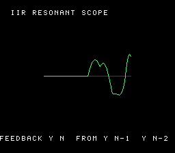

# #48 — SNES IIR Resonant-Filter Scope: recursive feedback dependency chain

<p align="center"></p>

**Status:** DONE — `host == default == +mos-a16 == +mos-xy16 == 0x49BD` on bsnes-jg, `-verify`
clean ×3, feedback multiply confirmed (`__mulsi3=2`). Published
[/snes/iir-scope/](https://biohack.net/snes/iir-scope/) (biohack.net v1.0.154). Demo **#48** of
the **compiler stress-test demo battery**. **No compiler bug** — the non-reorderable recursive
chain lowers correctly across all three backend modes.

## Context

A bank of four 2-pole IIR resonators, arpeggiated by impulse "plucks", drawn as a live
oscilloscope. The codegen corner is a **recursive feedback dependency chain**:

```
y[n] = (a1·y[n-1] + a2·y[n-2]) >> Q + x[n]
```

Each output sample depends on the two *previous* outputs, so the loop **cannot be reordered or
vectorized** the way #25's feed-forward FFT can — every iteration waits on the last. A miscompile
that reordered the state updates, or dropped the dependency, would diverge the differential CRC;
the gate (host == target on the exact recursion) is the real test of the corner.

## Algorithm

Per sample, per resonator:
```c
int32_t a1 = iir_a1_base[k] + iir_vib[(vib + k*4) & 15];   // runtime coeff (LUT load)
int32_t y  = (a1 * y1[k] + a2 * y2[k]) >> 12;              // ← THE FEEDBACK: __mulsi3
if (k == pluck_k) y += IMPULSE;                            // pluck = impulse excitation
y2[k] = y1[k]; y1[k] = y;                                  // shift the state
sum += y;
```

- State `y1`/`y2` and the products are **int32_t** (the `a1*y` term needs 32 bits); the `>> Q` on
  a possibly-negative int32 is an arithmetic shift on both host and target. Coefficients Q12.
- A small **runtime vibrato** is added to `a1` each sample — real filters tune their coefficients,
  and this keeps the feedback multiply a genuine runtime `__mulsi3` (a constant coefficient would
  strength-reduce to shift-adds). The vibrato advances every 8 samples (well *below* the resonator
  frequencies) so it wobbles the pitch without **parametrically pumping** the filter unstable.
- Plucks are arpeggiated across the 4 resonators every `IIR_PLUCK=18` samples; each rings and
  decays (r=0.99). The summed output scrolls through a 128-sample ring = the scope trace.

## Screen layout

128×128 BitmapCanvas (BG3 2bpp) centred as the scope; a 2-row TextLayer HUD (top
"IIR RESONANT SCOPE", bottom "FEEDBACK Y[N] FROM Y[N-1] Y[N-2]"). Title card on BG2 during the gate.

## Display architecture

- `BitmapCanvas` (128×128, BG3) for the trace + `TextLayer` HUD (the spirograph #11 model).
- The scope **clears + redraws the whole canvas every frame**, so `CANVAS_FLUSH_TILES` is overridden
  to 256 (the default 64-tile cap only refreshes the top 4 tile-rows → the centre trace never
  reaches VRAM). 4096 B/frame flushed under `display_frame`'s force-blank; the demo does little else.
- Palette: 0 black, 1 white (HUD), 2 dim (zero axis), 3 green (trace).

## Files

| File | New/Mod | Purpose |
|------|---------|---------|
| `examples/65816/iir_scope.h` | new | Portable IIR resonator bank + `iir_scope_gate_crc()` |
| `examples/snes/corpus/iir_scope_sim.c` | new | Corpus slice (5-way differential) |
| `tools/iir-scope-sim.c` | new | Host oracle |
| `examples/snes/iir-scope.c` | new | SNES ROM (scope + HUD + frame loop) |
| `dev/iir-scope.{sh,lua}` | new | Gate script + MAME assert |
| `Taskfile.yml`, plan-index, TODO, demo-ideas backlog | mod | tracking |

## Reused infrastructure

| Asset | From | Used for |
|-------|------|----------|
| `BitmapCanvas` + `TextLayer` + title | `examples/snes/spirograph.c` | scope canvas + HUD |
| gate scripts `dev/bf-vm.{sh,lua}` | `dev/` | gate scaffold |

## Differential gate

- `corpus_result = iir_scope_gate_crc()` — 400 deterministic samples (fixed pluck schedule),
  folding each summed output sample into a uint16 rotate-xor CRC.
- **EXPECT = 0x49BD** (host oracle; peak |y| = 16574 over 400 samples, no clipping).
- **5-way bar** — no far pointers, all bank-0 NEAR.
- Disasm probes (corpus object, +mos-a16): `__mulsi3 ≥ 1` (the feedback multiply), `rep/sep ≥ 1`.

## Publication

`/snes-rom-page --rom build/iir-scope.sfc --slug iir-scope --site ~/SRC/biohack.net
--title "IIR Resonant-Filter Scope" --preview build/iir-scope-jg.png --selfcheck "0xbe 2 0x49BD 700 iir-scope"`.

## Verification steps

1. **Host oracle compiles + prints CRC.** PASS — `iir-scope gate_crc = 0x49BD` (peak |y|=16574).
2. **ROM builds clean; snes-checksum.py exits 0.** PASS — `corpus_result @ WRAM 0xBE`.
3. **Corpus slice compiles 3 ways with -verify clean.** PASS — default/a16/xy16 exit 0.
4. **`dev/run.sh iir-scope` — host + disasm + bsnes-jg PASS** (MAME SKIP, no SPC700 IPL). PASS:
   ```
   PASS  __mulsi3=2  rep/sep=14  (recursive feedback 32-bit multiply, native-16)
   SMOKE: PASS off=0xBE len=2 got=0x49BD (ran 700 frames, bsnes-jg)
   ```
5. **Full differential bar — default/a16/xy16 all == 0x49BD on bsnes-jg.** PASS:
   ```
   [default] off=0xbe verify=0 :: SMOKE: PASS ... got=0x49BD
   [a16]     off=0xbe verify=0 :: SMOKE: PASS ... got=0x49BD
   [xy16]    off=0xbe verify=0 :: SMOKE: PASS ... got=0x49BD
   ```
6. **Title intro card — `build/iir-scope-jg.png` (frame 700): scope trace running.** PASS — a rich
   damped-oscillation ring across the canvas with the HUD labels; the trace scrolls (animates).
7. **Plan title card copied → `docs/plans/screenshots/iir-scope.png`.** PASS.
8. **/snes-rom-page publishes; shipped ROM sha == a16 gate ROM; HTTP 200.** PASS — v1.0.154.
9. `task md -- docs/plans/2026-06-30-48-snes-iir-scope.md` renders cleanly.

### Compiler-correctness + demo notes (clean pass)

The recursive feedback chain lowers correctly: no miscompile, no `-verify` failure, and the 4-way
bsnes-jg differential agrees byte-for-byte (`0x49BD`). Two things surfaced during bring-up, both
demo-side (differential green throughout): (1) constant coefficients strength-reduced the feedback
multiply away → made the coefficient runtime (vibrato) to keep a genuine `__mulsi3` *and* enrich the
visual; (2) an unstable **parametric-amplification** blow-up when the vibrato ran near 2× the
resonator frequency → slowed the vibrato well below them. Also a display bug: the canvas's 64-tile
DMA cap starved the centre-screen trace → raised `CANVAS_FLUSH_TILES` for this full-redraw scope.
