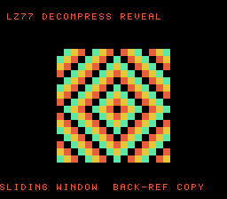

# #49 — SNES LZ77 Image-Decompress Reveal: back-references from the decoder's own output

<p align="center"></p>

**Status:** DONE — clean 5-way positive (no compiler bug). Demo **#49** of the **compiler stress-test demo battery**.

## Context

A compressed picture decoded by an **LZ77/LZSS byte-stream decoder that copies back-references from its
OWN output** (the sliding window), then progressively revealed cell-by-cell ("image loading in"). The
codegen corner is a **decode state machine + output-relative back-reference pointer arithmetic** — the
copy loop reads bytes the loop itself just wrote (overlapping copies RLE-expand). No prior demo runs a
self-referential decoder.

## Algorithm

```
lz_decode(src, dst):
    while input:
        flags = next byte
        for bit b in flags (LSB first):
            if b == 0:  dst[dp++] = src[sp++]                      // literal
            else:       read 2 bytes -> offset(12b), length(4b)+3
                        from = dp - offset
                        repeat length:  dst[dp++] = dst[from++]     // back-ref from OWN output
```

All offsets/indices `uint16_t`, bytes `uint8_t`; deterministic → host and target produce identical
output. The stream (`LZ_STREAM`, 56 bytes) is generated by `tools/lzgen.py` from a 16×16 diamond image
(256 cells) and roundtrip-verified; the decoder reproduces it byte-for-byte.

## Screen layout

```
row 1   LZ77 DECOMPRESS REVEAL              (BG3 text, HUD top)
rows 6-21  16x16-tile BitmapCanvas — the decoded diamond image, revealed cell-by-cell
row 25  SLIDING WINDOW  BACK-REF COPY       (BG3 text, HUD bottom)
```

## Display architecture

- **BitmapCanvas** (BG3 2bpp), whole-tile `cell_fill`. `lz_decode` fills a 256-cell buffer; the reveal
  cursor exposes `REVEAL_PER_FRAME=5` cells/frame; after a hold it clears and **re-decodes** (the LZ
  decoder runs in the live loop, not just the gate).
- TitleLayer (BG2) intro card. 4-colour palette (diamond distance 0..3).

## Files

| File | Purpose |
|------|---------|
| `examples/65816/lzdec.h` | portable `lz_decode` + embedded `LZ_STREAM` + `lzdec_gate_crc()` |
| `examples/snes/lzdec.c` | the on-console image-reveal ROM |
| `examples/snes/corpus/lzdec_sim.c` | HAL-free corpus slice (5-way differential) |
| `tools/lzdec-sim.c` | host oracle |
| `tools/lzgen.py` | the LZSS encoder that generated `LZ_STREAM` (roundtrip-verified) |
| `dev/lzdec.sh`, `dev/lzdec.lua` | gate script + MAME autoboot |
| `Taskfile.yml` | `lzdec`, `lzdec-play` entries |

## Differential gate

- `corpus_result = lzdec_gate_crc()` — decodes `LZ_STREAM` and folds the 256-byte output (+ length).
- **EXPECT = `0x0100`** (host oracle; stable across host `-O0`/`-O2`, default/a16/xy16 on bsnes-jg).
- **5-way bar** — all data in bank-0 WRAM.
- Disasm probes: `LZ_STREAM` referenced ≥ 1, output writes `sta` ≥ 4, arithmetic libcalls
  (`__udiv`/`__div`/`__mul`) == 0 (pure byte pointer arith), `rep`/`sep` ≥ 1.

## Verification steps

1. Host oracle stable across -O0/-O2; decoder roundtrips (`tools/lzgen.py`: roundtrip OK).

```
$ cc -O2 -I examples/65816 tools/lzdec-sim.c && ./a.out
lzdec gate_crc = 0x0100     # 0x0100 at -O0 too
```
PASS.

2. ROM builds clean; disasm gate + bsnes-jg PASS (`dev/run.sh lzdec`).

```
==> built build/lzdec.sfc (+mos-a16); corpus_result @ WRAM 0x6f
==> disasm gate (LZ77 back-reference byte-stream decoder, native-16, no libcall)
    PASS  LZ_STREAM-refs=6  sta=27  arith-libcalls=0  rep/sep=52
SMOKE: PASS off=0x6F len=2 got=0x0100 (ran 500 frames, bsnes-jg)
    SKIP MAME (no SPC700 IPL)
RESULT: PASS
```
PASS. (MAME leg SKIPs — no SPC700 IPL — non-blocking.)

3. Full 5-way check (`dev/run.sh _demo5 lzdec`): default==a16==xy16==host, -verify clean.

```
== -verify-machineinstrs ==
  +mos-a16: verify OK
  +mos-xy16: verify OK
  vmas: default=0x6f a16=0x6f xy16=0xa7
SMOKE: PASS ... got=0x0100  [default/a16/xy16]
RESULT: PASS — host==default==a16==xy16==0x0100 on bsnes-jg
```
PASS.

4. Title intro + running animation — `build/lzdec-jg.png` (frame 500) shows the decoded concentric
   diamond image with both HUD rows. PASS.

5. Plan title card embedded (`docs/plans/screenshots/lzdec.png`). PASS.

6. `/snes-rom-page` publishes; live at [/snes/lzdec/](https://biohack.net/snes/lzdec/). (below)

## Outcome

**Clean 5-way positive — no compiler bug.** The self-referential LZ77 decoder — a byte-stream state
machine copying overlapping back-references from its own output buffer — decodes byte-identically under
default, +mos-a16, and +mos-xy16, `-verify` clean. The back-ref copy lowers to indirect `lda ($zp)`
pointer loads/stores with zero arithmetic libcalls.
